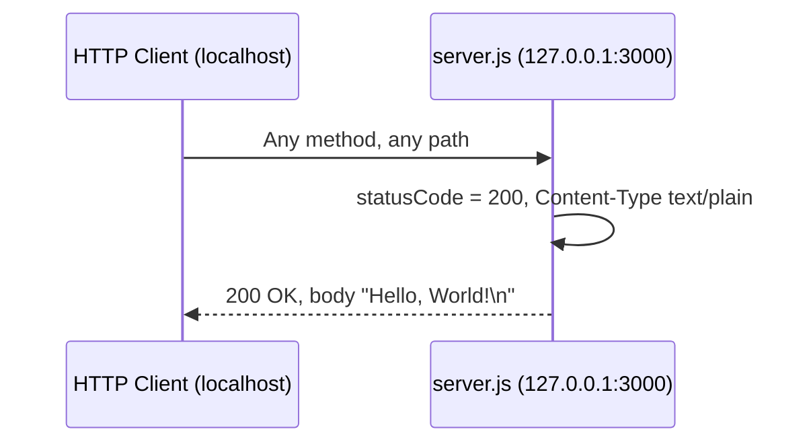
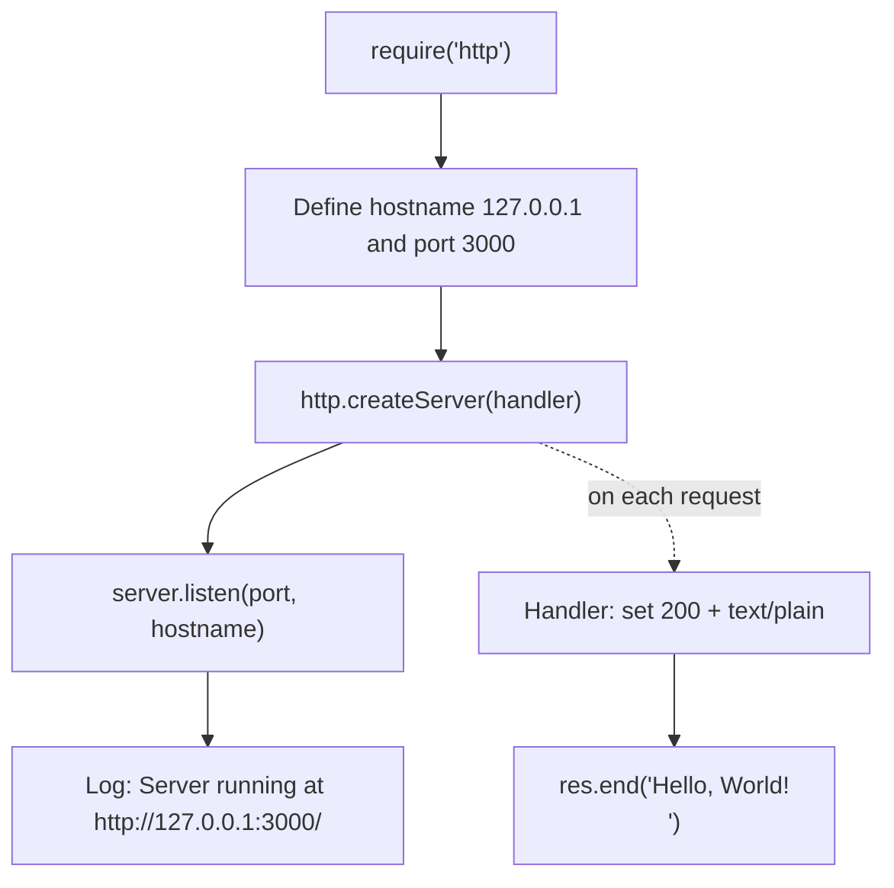

# hao-backprop-test

A minimal, single-file **Node.js HTTP server** built entirely on the Node.js
built-in [`http`](https://nodejs.org/api/http.html) module, with **zero
third-party dependencies**. Every request — regardless of HTTP method or URL
path — receives the same fixed plain-text response: `Hello, World!`.
_Source: server.js:L1-L77._

> **A note on naming.** This repository is titled **`hao-backprop-test`**, while
> the npm package declared in `package.json` is named **`hello_world`**. The two
> names differ; both refer to the same single-file server documented here.
> _Source: README.md:L1, package.json:L2._

## Overview

`server.js` starts an HTTP server bound to the loopback interface `127.0.0.1`
on port `3000` and answers **every** request with an identical response. There
is no routing, no middleware, no environment-variable configuration, and no
persistence layer — the entire application is the one file `server.js`.
_Source: server.js:L1-L77._

The **response contract is identical for all requests**:

- **Status:**  `200 OK`
- **Header:**  `Content-Type: text/plain`
- **Body:**    `Hello, World!\n`

_Source: server.js:L63-L65._

## Table of Contents

- [Overview](#overview)
- [Prerequisites](#prerequisites)
- [Installation](#installation)
- [Usage](#usage)
- [API Documentation](#api-documentation)
- [Code Explanation](#code-explanation)
- [Deployment Guide](#deployment-guide)
- [Project Notes](#project-notes)
- [License](#license)

## Prerequisites

- **Node.js** — **24 LTS is recommended**; **22.x is also supported**. Any
  maintained Node.js LTS release works, because `server.js` relies only on the
  long-stable core `http` API. (Note: Node.js 20 reached end-of-life on
  2026-04-30.) `npm` ships bundled with Node.js. _Source: Node.js release schedule (https://nodejs.org/en/about/previous-releases); server.js:L27._
- **Git** — optional, needed only to clone the repository.
- **No other dependencies** — the project declares zero third-party packages.
  _Source: package-lock.json:L6-L12._

## Installation

Clone the repository and install dependencies:

```bash
git clone <repository-url>
cd hao-backprop-test
npm install
```

`npm install` **installs nothing**: the project declares zero third-party
dependencies, so the command completes as an effective no-op and creates no
`node_modules` beyond npm's own bookkeeping. _Source: package-lock.json:L6-L12._

## Usage

Start the server directly with Node.js — the runnable entry point is
`server.js`:

```bash
node server.js
```

On successful startup the process prints the following line and then keeps
running in the foreground:

```text
Server running at http://127.0.0.1:3000/
```

_Source: server.js:L75._

In another terminal, send a request to confirm it is serving:

```bash
curl http://127.0.0.1:3000/
```

which prints:

```text
Hello, World!
```

Stop the server with **`Ctrl+C`** in the terminal where it is running.

## API Documentation

The server exposes exactly **one de-facto endpoint**. There is no routing or
method dispatch: **any standard (parser-accepted) HTTP method** sent to **any
path** yields the same response, because the request handler never inspects the
request. Node.js's built-in HTTP parser accepts the standard method tokens
(`GET`, `POST`, `PUT`, `DELETE`, `PATCH`, `OPTIONS`, `HEAD`, `TRACE`, and other
registered methods) and rejects unknown/non-standard method tokens with a
`400 Bad Request` before the handler runs. _Source: server.js:L52-L66._

The **response contract is identical for all requests**:

- **Status:**  `200 OK`
- **Header:**  `Content-Type: text/plain`
- **Body:**    `Hello, World!\n`

_Source: server.js:L63-L65._

| Property        | Value                              |
|-----------------|------------------------------------|
| Methods         | Any standard/parser-accepted method (`GET`, `POST`, `PUT`, `DELETE`, `PATCH`, `OPTIONS`, `HEAD`, …) |
| Path            | Any (`/`, `/anything`, …)          |
| Status          | `200 OK`                           |
| `Content-Type`  | `text/plain`                       |
| Response body   | `Hello, World!\n`                  |

_Source: server.js:L52-L66._

### Example request and response

Use `curl -i` to inspect the full status line and headers:

```bash
curl -i http://127.0.0.1:3000/
```

```text
HTTP/1.1 200 OK
Content-Type: text/plain
Date: <date>
Connection: keep-alive
Keep-Alive: timeout=5
Content-Length: 14

Hello, World!
```

The `Content-Length` is `14` bytes — the 13 characters of `Hello, World!`
plus the trailing newline (`\n`). _Source: server.js:L65._

The `Date`, `Connection`, and `Keep-Alive` headers are added automatically by
Node.js's built-in HTTP layer — `server.js` itself sets only `Content-Type`
(via `res.setHeader`). Their exact values (the `Date` timestamp and the
`Keep-Alive: timeout=5` keep-alive window) are transport details that can vary
by Node.js version. _Source: server.js:L63-L65 (only `Content-Type` is set)._

> **`HEAD` is a header-only exception.** Per the HTTP specification, a response
> to a `HEAD` request carries headers but no body. Because `server.js` writes
> the body with `res.end('Hello, World!\n')` and never sets `Content-Length`
> explicitly, a `HEAD` request returns `200 OK` with `Content-Type: text/plain`
> but **without** a `Content-Length` header, whereas body-bearing methods
> (`GET`, `POST`, …) include `Content-Length: 14`. _Source: server.js:L62-L66._

### Request/response flow



## Code Explanation

The entire application lives in `server.js`. Below is an annotated walkthrough
of the four logical steps. _Source: server.js:L1-L77._

**1. Import the `http` module**

```javascript
const http = require('http');
```

Loads Node.js's built-in HTTP server library. No third-party package is
involved. _Source: server.js:L27._

**2. Configuration constants**

```javascript
const hostname = '127.0.0.1';
const port = 3000;
```

The host and port are hard-coded to the loopback interface `127.0.0.1` and
port `3000`. No environment variables are consulted, so changing these values
requires editing the source file. _Source: server.js:L36-L44._

**3. Create the server and request handler**

```javascript
const server = http.createServer((req, res) => {
  res.statusCode = 200;
  res.setHeader('Content-Type', 'text/plain');
  res.end('Hello, World!\n');
});
```

`http.createServer` registers a single request handler that runs for every
inbound request. The handler sets `statusCode = 200`, sets the
`Content-Type: text/plain` header, and ends the response with the body
`Hello, World!\n`. The `req` object is never inspected — method, path, headers,
and body are all ignored. _Source: server.js:L52-L66._

**4. Start listening**

```javascript
server.listen(port, hostname, () => {
  console.log(`Server running at http://${hostname}:${port}/`);
});
```

`server.listen` binds to `127.0.0.1:3000` and begins accepting connections.
Once listening, the startup callback logs
`Server running at http://127.0.0.1:3000/`. _Source: server.js:L69-L77._

### Startup and request-handling flow



## Deployment Guide

> **⚠️ Loopback-binding caveat (read this first).** The server binds to the
> loopback interface `127.0.0.1`, so it is reachable **only from the local
> machine**. It is **not** accessible from other hosts, nor from outside a
> container. Making it externally reachable would require either changing the
> bind address in `server.js` (out of scope for this documentation) or placing a
> **same-host reverse proxy** in front of it. _Source: server.js:L36._

### Local

Run the server directly in the foreground:

```bash
node server.js
```

### Process manager (pm2)

Use [pm2](https://pm2.keymetrics.io/) to run the server as a managed,
long-lived process (auto-restart, log management, startup persistence):

```bash
npm install -g pm2
pm2 start server.js --name hao-backprop-test
pm2 logs hao-backprop-test
pm2 save
```

### Container (Docker)

Build a container image with a minimal Node.js base image:

```dockerfile
FROM node:24-alpine
WORKDIR /app
COPY . .
RUN npm install
EXPOSE 3000
CMD ["node", "server.js"]
```

> **Note.** Because the application binds to `127.0.0.1` **inside** the
> container, publishing a port (e.g. `-p 3000:3000`) will **not** make it
> reachable from the host without first changing the bind address to `0.0.0.0`
> in the source. This is a documented limitation, not a change to make here.
> _Source: server.js:L36._

### Reverse proxy (nginx, same host)

Front the server with nginx running on the **same host**, which can reach the
loopback address and forward external traffic to it:

```nginx
server {
    listen 80;
    server_name example.com;
    location / {
        proxy_pass http://127.0.0.1:3000;
        proxy_set_header Host $host;
    }
}
```

This works because nginx runs on the same host as the server and can therefore
reach the loopback address `127.0.0.1:3000`. _Source: server.js:L36._

## Project Notes

The following are factual observations about the repository as it currently
stands. They are surfaced here for transparency and are **not** changed by this
documentation:

- **`main` points to a non-existent file.** `package.json` declares
  `"main": "index.js"`, but there is no `index.js` in the repository; the
  runnable entry point is `server.js`. _Source: package.json:L5._
- **No `start` script.** The only npm script is a placeholder `test` that exits
  with an error (`echo "Error: no test specified" && exit 1`); there is **no**
  `start` script defined. Run the server with `node server.js` directly rather
  than an npm lifecycle start command (there is none to invoke).
  _Source: package.json:L6-L8._
- **Host and port are hard-coded.** The server always binds to
  `127.0.0.1:3000`; no environment variables are read, so changing the host or
  port requires editing `server.js`. _Source: server.js:L36-L44._
- **Repository title vs. package name.** The repository title
  (`hao-backprop-test`) differs from the npm package name (`hello_world`).
  _Source: README.md:L1, package.json:L2._
- **Package version.** The npm package `hello_world` is at version `1.0.0`.
  _Source: package.json:L3._

## License

This project is licensed under the **MIT License**. _Source: package.json:L10._
