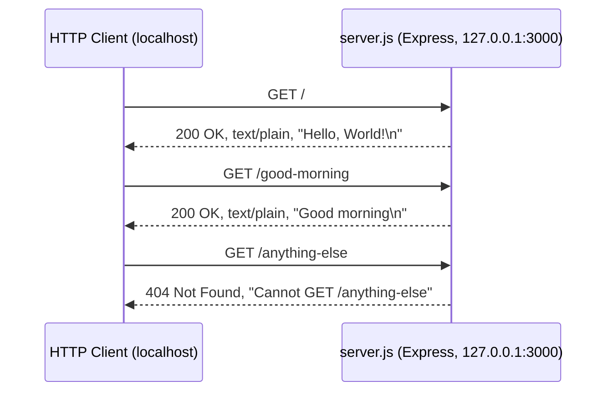
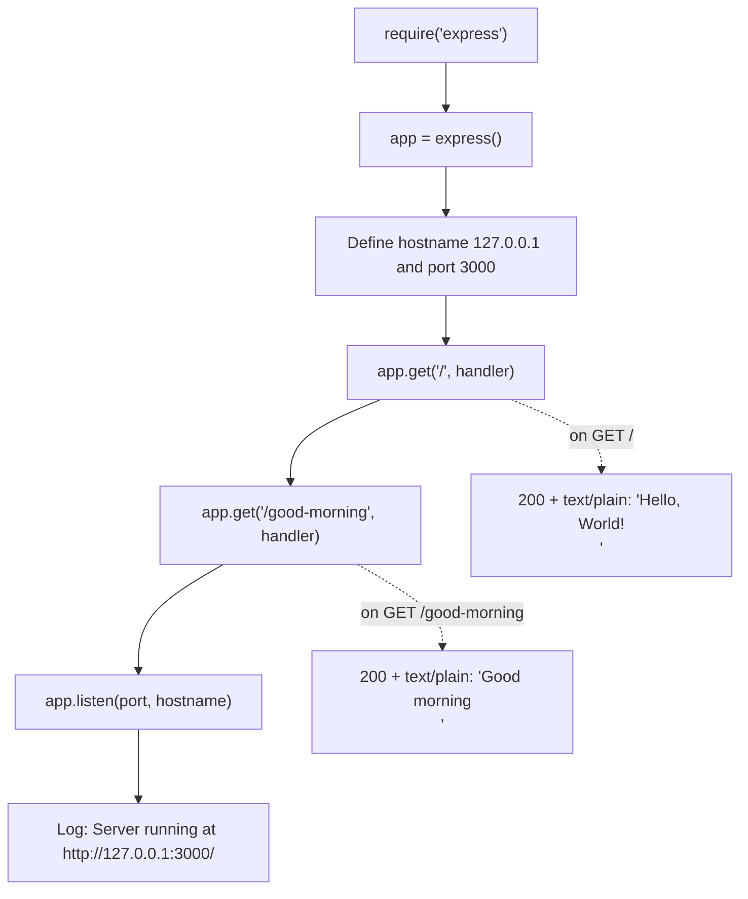

# hao-backprop-test

A minimal, single-file **Node.js HTTP server** built with the
[**Express**](https://expressjs.com/) web framework. It listens on the loopback
interface `127.0.0.1` at port `3000` and exposes **two GET endpoints**: the root
endpoint returns the plain-text greeting `Hello, World!`, and `/good-morning`
returns `Good morning`. Express is the project's single third-party dependency.
_Source: server.js:L1-L91._

> **A note on naming.** This repository is titled **`hao-backprop-test`**, while
> the npm package declared in `package.json` is named **`hello_world`**. The two
> names differ; both refer to the same single-file server documented here.
> _Source: README.md:L1, package.json:L2._

## Overview

`server.js` creates an Express application, registers two routes, and binds the
server to the loopback interface `127.0.0.1` on port `3000`. There is no
environment-variable configuration and no persistence layer -- the entire
application is the one file `server.js`, backed by the `express` dependency.
_Source: server.js:L28-L91._

The server exposes the following two endpoints:

| Method | Path             | Status   | Content-Type                | Response body     |
|--------|------------------|----------|-----------------------------|-------------------|
| `GET`  | `/`              | `200 OK` | `text/plain; charset=utf-8` | `Hello, World!\n` |
| `GET`  | `/good-morning`  | `200 OK` | `text/plain; charset=utf-8` | `Good morning\n`  |

Any request that does not match one of these routes (an unregistered path, or a
non-`GET` method on a registered path) falls through to Express's built-in
`404 Not Found` handler. _Source: server.js:L65-L80._

## Table of Contents

- [Overview](#overview)
- [Prerequisites](#prerequisites)
- [Installation](#installation)
- [Usage](#usage)
- [API Documentation](#api-documentation)
- [Code Explanation](#code-explanation)
- [Deployment Guide](#deployment-guide)
- [Project Notes](#project-notes)
- [License](#license)

## Prerequisites

- **Node.js** -- **18 or newer is required**, because the bundled Express 5
  release declares `"engines": { "node": ">= 18" }`. Any actively maintained
  Node.js LTS line (20.x, 22.x, or 24.x) works well; **24 LTS is recommended**
  for new work. (This project was validated on Node.js 20.20.2.) `npm` ships
  bundled with Node.js. _Source: node_modules/express/package.json (engines);
  Node.js release schedule (https://nodejs.org/en/about/previous-releases)._
- **Git** -- optional, needed only to clone the repository.
- **One dependency** -- the project declares a single third-party dependency,
  **Express `^5.2.1`**, installed by `npm install`.
  _Source: package.json:L12-L14._

## Installation

Clone the repository and install dependencies:

```bash
git clone <repository-url>
cd hao-backprop-test
npm install
```

`npm install` reads the `express` dependency from `package.json` and downloads
Express together with its transitive dependencies into `node_modules/` (a total
of 67 packages at the time of writing). Unlike earlier versions of this project,
`npm install` is **no longer a no-op**. _Source: package.json:L12-L14;
package-lock.json._

## Usage

Start the server with the npm `start` script, or by invoking Node.js directly on
the entry point `server.js`:

```bash
npm start
# equivalent to:
node server.js
```

On successful startup the process prints the following line and then keeps
running in the foreground:

```text
Server running at http://127.0.0.1:3000/
```

_Source: server.js:L89-L91._

In another terminal, send requests to confirm it is serving both endpoints:

```bash
curl http://127.0.0.1:3000/
curl http://127.0.0.1:3000/good-morning
```

which print, respectively:

```text
Hello, World!
```

```text
Good morning
```

Stop the server with **`Ctrl+C`** in the terminal where it is running.

## API Documentation

The server exposes **two routes**, both handling the `GET` method. Express also
answers `HEAD` requests for a registered `GET` route automatically (returning the
same headers with no body). _Source: server.js:L65-L80._

### `GET /`

Returns the original tutorial greeting.

| Property        | Value                         |
|-----------------|-------------------------------|
| Method          | `GET` (and `HEAD`)            |
| Path            | `/`                           |
| Status          | `200 OK`                      |
| `Content-Type`  | `text/plain; charset=utf-8`   |
| Response body   | `Hello, World!\n`             |

_Source: server.js:L65-L67._

### `GET /good-morning`

Returns a plain-text morning greeting.

| Property        | Value                         |
|-----------------|-------------------------------|
| Method          | `GET` (and `HEAD`)            |
| Path            | `/good-morning`               |
| Status          | `200 OK`                      |
| `Content-Type`  | `text/plain; charset=utf-8`   |
| Response body   | `Good morning\n`              |

_Source: server.js:L78-L80._

### Unmatched routes

Any other path, or a non-`GET`/`HEAD` method on a registered path, is handled by
Express's default `404` handler, which returns an HTML body such as
`Cannot GET /nonexistent`. _Source: server.js:L65-L80 (only these two routes are
registered)._

### Example request and response

Use `curl -i` to inspect the full status line and headers:

```bash
curl -i http://127.0.0.1:3000/
```

```text
HTTP/1.1 200 OK
X-Powered-By: Express
Content-Type: text/plain; charset=utf-8
Content-Length: 14
ETag: W/"e-YP3pwjELDUytTauNEmsEOH77ook"
Date: <date>
Connection: keep-alive
Keep-Alive: timeout=5

Hello, World!
```

The `Content-Length` for `/` is `14` bytes -- the 13 characters of
`Hello, World!` plus the trailing newline (`\n`); for `/good-morning` it is `13`
bytes (`Good morning` plus `\n`). _Source: server.js:L66, L79._

The `X-Powered-By: Express` and `ETag` headers are added by Express; the `Date`,
`Connection`, and `Keep-Alive` headers are added automatically by Node.js's
built-in HTTP layer. `server.js` itself sets only the status code and the
`Content-Type` (via `res.status(...).type('text/plain')`). Their exact values
are transport details that can vary by Node.js/Express version.
_Source: server.js:L66, L79 (only status and Content-Type are set explicitly)._

### Request/response flow



## Code Explanation

The entire application lives in `server.js`. Below is an annotated walkthrough of
the five logical steps. _Source: server.js:L1-L91._

**1. Import Express**

```javascript
const express = require('express');
```

Loads the Express framework -- the project's single third-party dependency,
declared in `package.json` and installed into `node_modules/`.
_Source: server.js:L28._

**2. Create the application instance**

```javascript
const app = express();
```

`express()` returns an application object on which routes are registered and
which is ultimately bound to a network interface. _Source: server.js:L36._

**3. Configuration constants**

```javascript
const hostname = '127.0.0.1';
const port = 3000;
```

The host and port are hard-coded to the loopback interface `127.0.0.1` and port
`3000`. No environment variables are consulted, so changing these values requires
editing the source file. _Source: server.js:L45, L53._

**4. Register the two routes**

```javascript
app.get('/', (req, res) => {
  res.status(200).type('text/plain').send('Hello, World!\n');
});

app.get('/good-morning', (req, res) => {
  res.status(200).type('text/plain').send('Good morning\n');
});
```

`app.get(path, handler)` registers a handler for `GET` requests to the given
path. Each handler sets status `200`, sets the `Content-Type` to `text/plain`
(Express appends `; charset=utf-8`), and sends the response body. The `req`
object is not inspected. _Source: server.js:L65-L80._

**5. Start listening**

```javascript
app.listen(port, hostname, () => {
  console.log(`Server running at http://${hostname}:${port}/`);
});
```

`app.listen` binds to `127.0.0.1:3000` and begins accepting connections. Once
listening, the startup callback logs
`Server running at http://127.0.0.1:3000/`. _Source: server.js:L89-L91._

### Startup and request-handling flow



## Deployment Guide

> **Loopback-binding caveat (read this first).** The server binds to the loopback
> interface `127.0.0.1`, so it is reachable **only from the local machine**. It
> is **not** accessible from other hosts, nor from outside a container. Making it
> externally reachable would require either changing the bind address in
> `server.js` (out of scope for this documentation) or placing a **same-host
> reverse proxy** in front of it. _Source: server.js:L45, L89._

### Local

Run the server directly in the foreground:

```bash
npm start
# or: node server.js
```

### Process manager (pm2)

Use [pm2](https://pm2.keymetrics.io/) to run the server as a managed, long-lived
process (auto-restart, log management, startup persistence):

```bash
npm install -g pm2
pm2 start server.js --name hao-backprop-test
pm2 logs hao-backprop-test
pm2 save
```

### Container (Docker)

Build a container image with a minimal Node.js base image. Because the app
depends on Express, `npm install` must run during the image build:

```dockerfile
FROM node:24-alpine
WORKDIR /app
COPY package*.json ./
RUN npm install
COPY . .
EXPOSE 3000
CMD ["node", "server.js"]
```

> **Note.** Because the application binds to `127.0.0.1` **inside** the
> container, publishing a port (e.g. `-p 3000:3000`) will **not** make it
> reachable from the host without first changing the bind address to `0.0.0.0`
> in the source. This is a documented limitation, not a change to make here.
> _Source: server.js:L45._

### Reverse proxy (nginx, same host)

Front the server with nginx running on the **same host**, which can reach the
loopback address and forward external traffic to it:

```nginx
server {
    listen 80;
    server_name example.com;
    location / {
        proxy_pass http://127.0.0.1:3000;
        proxy_set_header Host $host;
    }
}
```

This works because nginx runs on the same host as the server and can therefore
reach the loopback address `127.0.0.1:3000`. _Source: server.js:L45._

## Project Notes

The following are factual observations about the repository as it currently
stands, surfaced here for transparency:

- **`main` points to a non-existent file.** `package.json` declares
  `"main": "index.js"`, but there is no `index.js` in the repository; the
  runnable entry point is `server.js`. Prefer `npm start` (or `node server.js`)
  to launch the server. _Source: package.json:L5._
- **`start` script.** `package.json` defines `"start": "node server.js"`, so the
  server can be launched with `npm start`. The `test` script is still a
  placeholder that exits with an error (`echo "Error: no test specified" &&
  exit 1`). _Source: package.json:L6-L9._
- **Host and port are hard-coded.** The server always binds to `127.0.0.1:3000`;
  no environment variables are read, so changing the host or port requires
  editing `server.js`. _Source: server.js:L45, L53._
- **Unmatched routes return 404.** Only `/` and `/good-morning` are registered;
  every other path (and non-`GET` methods) returns Express's default
  `404 Not Found`. _Source: server.js:L65-L80._
- **Repository title vs. package name.** The repository title
  (`hao-backprop-test`) differs from the npm package name (`hello_world`).
  _Source: README.md:L1, package.json:L2._
- **Package version.** The npm package `hello_world` is at version `1.0.0`.
  _Source: package.json:L3._

## License

This project is licensed under the **MIT License**. _Source: package.json:L11._
