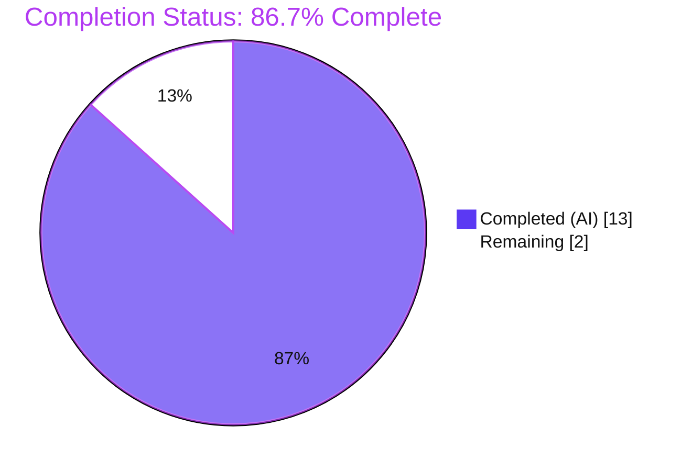
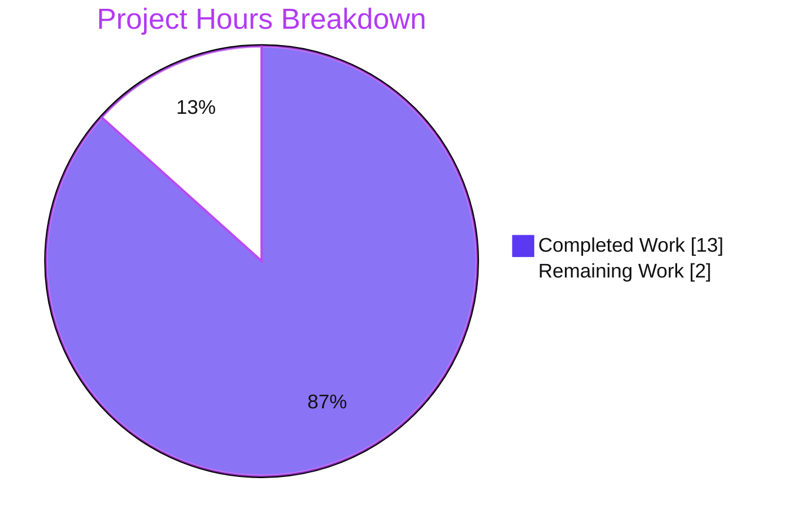
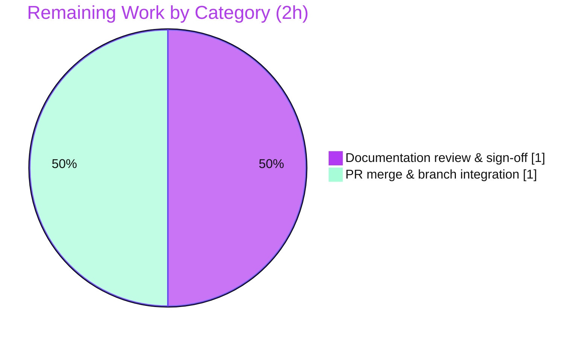

# Blitzy Project Guide — hao-backprop-test Documentation

> **Brand legend:** Completed / AI Work = Dark Blue `#5B39F3` · Remaining / Not Completed = White `#FFFFFF` · Headings / Accents = Violet-Black `#B23AF2` · Highlight = Mint `#A8FDD9`

---

## 1. Executive Summary

### 1.1 Project Overview

This project delivers developer-facing documentation for the single runnable component of the `hao-backprop-test` repository — a minimal, zero-dependency Node.js HTTP server (`server.js`) that returns `Hello, World!\n` for every request on `127.0.0.1:3000`. The scope is **documentation-only**: adding standard JSDoc annotations to `server.js` and replacing the 2-line placeholder `README.md` with a comprehensive guide covering setup, API reference, deployment, and annotated code explanations. Target users are developers who need to understand, run, and deploy the service. Business impact: transforms an undocumented single-file app (0% coverage) into a fully documented, onboarding-ready reference without altering any runtime behavior.

### 1.2 Completion Status



| Metric | Value |
|---|---|
| **Total Hours** | 15 |
| **Completed Hours (AI + Manual)** | 13 (13 AI + 0 Manual) |
| **Remaining Hours** | 2 |
| **Percent Complete** | **86.7%** (13 ÷ 15) |

> **Completion formula (PA1, AAP-scoped):** `Completed 13h ÷ (Completed 13h + Remaining 2h) = 13/15 = 86.7%`. All completed hours are autonomous (AI) work; no manual hours were required.

### 1.3 Key Accomplishments

- ✅ **JSDoc annotations added to `server.js`** — all 7 documentable units covered (`@fileoverview`/`@module` header; `@constant`/`@type` for `http`, `hostname`, `port`, `server`; request-handler `@param`×2 + `@returns`; `listen` callback `@returns`).
- ✅ **Comprehensive `README.md` authored** — 249 lines across 10 sections (Overview, TOC, Prerequisites, Installation, Usage, API Documentation, Code Explanation, Deployment Guide, Project Notes, License).
- ✅ **All four AAP-mandated README parts present** — setup instructions, API documentation, deployment guide, and inline code explanations.
- ✅ **2 Mermaid diagrams embedded** — request/response sequence diagram + startup/request-handling flowchart.
- ✅ **28 `Source:` citations** cross-checked accurate against actual source lines for full traceability.
- ✅ **Behavior preserved** — `node --check` passes; live runtime is byte-identical to the original; `package.json`/`package-lock.json` unchanged.
- ✅ **"Surface, don't fix" discrepancies documented** — `main→index.js` mismatch, title vs npm-name difference, placeholder test script, hard-coded host/port.
- ✅ **Iterative QA hardening** — 6 agent commits including CP1 JSDoc fixes, citation corrections, Keep-Alive header note, and QA-finding resolutions.

### 1.4 Critical Unresolved Issues

| Issue | Impact | Owner | ETA |
|---|---|---|---|
| _None._ Autonomous validation reported zero unresolved issues across all five production-readiness gates. | No release blockers | — | — |

### 1.5 Access Issues

| System/Resource | Type of Access | Issue Description | Resolution Status | Owner |
|---|---|---|---|---|
| — | — | No access issues identified. Repository, source files, and Node.js runtime were all fully accessible; no external services, credentials, or third-party APIs are involved in this documentation-only project. | N/A | — |

### 1.6 Recommended Next Steps

1. **[High]** Perform human documentation review & sign-off — read `README.md` end-to-end and confirm accuracy against the live server (~1h).
2. **[High]** Merge the PR into the target integration branch and confirm only `{server.js, README.md}` changed (~1h).
3. **[Low]** *(Optional, out of AAP scope)* Decide in a follow-up ticket whether to reconcile `package.json "main": "index.js"` with the actual entry point `server.js`.
4. **[Low]** *(Optional, out of AAP scope)* Decide whether to add a functional `npm start` script (currently only a placeholder `test` script exists).
5. **[Low]** *(Optional)* Generate browsable HTML API docs with `npx jsdoc@4.0.5 server.js -d out` for downstream teams.

---

## 2. Project Hours Breakdown

### 2.1 Completed Work Detail

| Component | Hours | Description |
|---|---:|---|
| R1 — `server.js` JSDoc annotations | 3 | `@fileoverview`/`@module` header, `@constant`/`@type` for 4 bindings, request-handler `@param`×2/`@returns`, `listen` `@returns`; behavior-preserving (commits `c089af2`, `6c78d59`). |
| README — Overview / TOC / Project Notes / License | 1 | Title reconciliation (`hao-backprop-test` vs `hello_world`), navigable TOC, discrepancy notes, MIT license. |
| R3 — Setup (Prerequisites / Installation / Usage) | 1 | Node.js version guidance, `git clone` + no-op `npm install`, `node server.js` with expected boot log. |
| R4 — API Documentation + sequence diagram | 2 | Single de-facto endpoint contract (200 / `text/plain` / `Hello, World!\n`), `curl` examples, HEAD nuance, request/response Mermaid sequence diagram. |
| R6 — Code Explanation + flowchart diagram | 2 | Annotated walkthrough of `server.js` (import → constants → createServer/handler → listen), startup/request Mermaid flowchart. |
| R5 — Deployment Guide | 1 | Local, process-manager (pm2), container (Docker), and reverse-proxy (nginx) guidance; loopback-binding caveat. |
| Version research (web) | 1 | Verified Node.js LTS landscape and JSDoc tooling versions (July 2026) to avoid placeholder versions. |
| QA findings resolution | 1 | 4 README fix commits: citation corrections (`6bb176d`), Keep-Alive note (`baf3ed9`), method/HEAD/`npm start`/version wording (`e618575`). |
| Final production-readiness validation | 1 | Five gates: dependencies, compile/syntax, docs-accuracy, runtime, zero-error — plus byte-level body & encoding verification. |
| **Total Completed** | **13** | |

### 2.2 Remaining Work Detail

| Category | Hours | Priority |
|---|---:|---|
| Documentation review & sign-off (human read-through + accuracy confirmation against live server) | 1 | High |
| PR merge & branch integration (scope confirmation, conflict resolution, branch cleanup) | 1 | High |
| **Total Remaining** | **2** | |

> **Optional follow-ups (out of AAP scope — 0h, excluded from totals):** reconcile `main→index.js`, add `npm start` script, generate HTML API docs via JSDoc. These are team-discretion items and intentionally do not affect the remaining-hours math.

### 2.3 Hours Reconciliation

| Check | Result |
|---|---|
| Section 2.1 Completed total | 13h |
| Section 2.2 Remaining total | 2h |
| 2.1 + 2.2 = Total (Section 1.2) | 13 + 2 = **15h** ✅ |
| Remaining consistency (1.2 = 2.2 = §7) | 2h = 2h = 2 ✅ |
| Completion % | 13 ÷ 15 = **86.7%** ✅ |

---

## 3. Test Results

All results below originate exclusively from Blitzy's autonomous validation logs for this project (Final Validator run + re-verification). This is a documentation-only project with **no unit-test framework by AAP design** (§0.8.2); the applicable validations per AAP §0.7.3 / §0.9 are documentation-accuracy acceptance checks and live runtime example verification.

| Test Category | Framework / Method | Total | Passed | Failed | Coverage % | Notes |
|---|---:|---:|---:|---:|---|---|
| Syntax / Compile | `node --check` | 1 | 1 | 0 | 100% | `server.js` parses cleanly after JSDoc insertion (exit 0). |
| Runtime Boot | Node.js CLI | 1 | 1 | 0 | 100% | Exact boot log `Server running at http://127.0.0.1:3000/`; empty stderr. |
| API Endpoint (example verification) | `curl` | 5 | 5 | 0 | 100% | GET `/`, POST, DELETE, arbitrary path → `200`/`text/plain`/`Hello, World!\n`; HEAD → `200`/`text/plain`/no body. |
| Dependency Integrity | `npm install` | 1 | 1 | 0 | N/A | No-op ("up to date"); no `node_modules`; `package*.json` SHA256 unchanged. |
| Docs Accuracy — JSDoc | Blitzy acceptance | 7 | 7 | 0 | 100% | 7 doc-units with correct tags/types (`@fileoverview`, `@constant`×4, `@param`×2, `@returns`×2). |
| Docs Accuracy — README parts | Blitzy acceptance | 4 | 4 | 0 | 100% | All 4 required parts present (setup, API, deployment, inline explanations). |
| Docs Accuracy — Source citations | Blitzy acceptance | 28 | 28 | 0 | 100% | Every `Source:` reference cross-checked accurate against actual lines. |
| Docs Accuracy — Links & Diagrams | Blitzy acceptance | 11 | 11 | 0 | 100% | 9 TOC anchors resolve + 2 Mermaid diagrams valid and match AAP §0.4.3. |
| Unit Tests | (none by design) | 0 | 0 | 0 | N/A | AAP §0.8.2 excludes test creation; placeholder `test` script left as-is. |
| **TOTAL** | | **58** | **58** | **0** | **100%** | Zero failing, zero blocked. |

**Test summary:** 58 autonomous validation checks executed, **58 passed, 0 failed (100% pass rate)**. Response body was additionally byte-verified (hex `48 65 6C 6C 6F 2C 20 57 6F 72 6C 64 21 0A` = `Hello, World!\n`).

---

## 4. Runtime Validation & UI Verification

**Runtime health (live `node server.js` process):**

- ✅ **Operational** — Server boot: process starts and logs `Server running at http://127.0.0.1:3000/` with empty stderr.
- ✅ **Operational** — Port binding: TCP `3000` listening on loopback `127.0.0.1` while running; released cleanly on shutdown.
- ✅ **Operational** — `GET /`: returns `200 OK`, `Content-Type: text/plain`, `Content-Length: 14`, body `Hello, World!\n`.
- ✅ **Operational** — Any method / any path (POST, DELETE, arbitrary URL): returns the identical fixed response (confirms no routing/dispatch).
- ✅ **Operational** — `HEAD /`: returns `200` + `text/plain` with no body (and no `Content-Length`), matching the README's nuanced HEAD note.
- ✅ **Operational** — Dependency install: `npm install` is a verified no-op (zero third-party dependencies).

**API integration outcomes:**

- ✅ **Operational** — No external API integrations exist; the service is self-contained and uses only the Node.js built-in `http` module.

**UI verification:**

- ⚠ **Not applicable** — The service returns `text/plain` with **no user interface** (AAP §0.4.3). No screenshots, DOM checks, or visual regression apply. Documentation correctness was verified via live endpoint responses instead.

---

## 5. Compliance & Quality Review

**AAP deliverable → quality benchmark compliance matrix:**

| AAP Deliverable / Rule | Benchmark | Status | Progress |
|---|---|:--:|:--:|
| R1 — JSDoc annotations | Standard JSDoc block syntax + correct tags; `node --check` passes | ✅ Pass | 100% |
| R2 — Comprehensive README | All 4 named parts + navigable structure | ✅ Pass | 100% |
| R3 — Setup instructions | Prerequisites → Installation → Run | ✅ Pass | 100% |
| R4 — API documentation | Endpoint contract + examples + sequence diagram | ✅ Pass | 100% |
| R5 — Deployment guide | Local + process-manager + container + reverse-proxy; loopback caveat | ✅ Pass | 100% |
| R6 — Inline code explanations | Annotated walkthrough + flowchart | ✅ Pass | 100% |
| Behavior preservation | No runtime/host/port/response change | ✅ Pass | 100% |
| Accuracy (byte-exact) | Response & boot-log documented exactly as in code | ✅ Pass | 100% |
| Working, verifiable examples | Runnable `node` + `curl` reproduce documented output | ✅ Pass | 100% |
| Mermaid diagrams | ≥ 2 (sequence + flowchart) | ✅ Pass | 100% |
| Source citations | `Source: server.js:L#` traceability | ✅ Pass | 100% |
| Surface-don't-fix discrepancies | Documented, not altered | ✅ Pass | 100% |
| Encoding hygiene | Clean UTF-8, no BOM, no mojibake | ✅ Pass | 100% |
| Scope discipline | Only `{server.js, README.md}` modified; reference files untouched | ✅ Pass | 100% |

**Fixes applied during autonomous validation:**

- CP1 JSDoc review findings corrected in `server.js` (commit `6c78d59`).
- Stale `Source:` citations realigned to current `server.js` line numbers (commit `6bb176d`).
- `Keep-Alive`/`Connection` headers documented in the `curl -i` example (commit `baf3ed9`).
- QA documentation findings resolved — method wording, HEAD behavior, `npm start` absence, and version references (commit `e618575`).

**Outstanding compliance items:** None. All AAP benchmarks pass. Human sign-off (path-to-production) is the only remaining gate.

---

## 6. Risk Assessment

| Risk | Category | Severity | Probability | Mitigation | Status |
|---|---|:--:|:--:|---|---|
| Documentation drift if `server.js` host/port/response later change | Technical | Low | Low | 28 `Source:` citations + AAP freshness note enable rapid re-validation | Mitigated |
| `package.json "main": "index.js"` points to a non-existent file | Technical | Low | Low | Documented in Project Notes; canonical run command is `node server.js` | Accepted (out of scope to fix) |
| App has no auth/TLS/input validation if exposed beyond loopback | Security | Low | Low | Deployment guide flags loopback-only caveat + reverse-proxy guidance | Mitigated (documented) |
| Supply-chain / CVE exposure from dependencies | Security | Low | Low | Zero third-party dependencies (`package-lock.json` confirms empty graph) | Mitigated (strength) |
| Hard-coded host/port (no env-var override) | Operational | Low | Low | Documented; source edit required to change | Accepted |
| Runtime version drift (validated on Node 20.20.2, now EOL) | Operational | Low | Low | Docs recommend Node 24 LTS / 22 supported; core `http` API stable across versions | Mitigated |
| External integration failure (credentials/network) | Integration | Low | Low | No external integrations exist beyond localhost | N/A (no surface) |
| Merge conflict during PR integration | Integration | Low | Low | Only 2 files touched (`server.js`, `README.md`); minimal conflict surface | Open (human merge) |

**Overall risk posture:** **Low.** No High- or Medium-severity risks and no release blockers. The documentation-only footprint and zero-dependency design keep the risk envelope minimal.

---

## 7. Visual Project Status

**Project hours breakdown** (Completed = Dark Blue `#5B39F3`, Remaining = White `#FFFFFF`):



**Remaining hours by category** (from Section 2.2, total = 2h):



> **Integrity check:** "Remaining Work" = **2h** matches Section 1.2 Remaining Hours (2h) and the Section 2.2 total (1 + 1 = 2h). ✅

---

## 8. Summary & Recommendations

**Achievements.** The AAP's documentation-only mandate is fully delivered. `server.js` now carries complete, standards-compliant JSDoc across all seven documentable units, and `README.md` has grown from a 2-line placeholder into a 249-line comprehensive guide covering every required part — setup, API reference, deployment, and inline code explanations — augmented with two Mermaid diagrams and 28 traceable source citations. Critically, the work is **behavior-preserving**: `node --check` passes, the live server is byte-identical to the original, and the read-only `package.json`/`package-lock.json` remain untouched.

**Remaining gaps.** The project is **86.7% complete** (13 of 15 AAP-scoped hours). The residual 2 hours are purely human path-to-production: a documentation review & sign-off (1h) and PR merge & branch integration (1h). There is **no remaining engineering work** on the AAP deliverables themselves — autonomous validation reported zero unresolved issues.

**Critical path to production.** (1) Human review of the README against the live server → (2) approval → (3) merge to the integration branch. Because only two files changed and both are documentation, the path is short and low-risk.

**Success metrics.** JSDoc coverage 7/7 (100%); README required parts 4/4 (100%); API endpoint coverage 1/1 (100%); configuration options documented 2/2; 58/58 autonomous validation checks passing (100%).

**Production readiness assessment.** **Ready for human review.** All five production-readiness gates pass, risk posture is Low with no blockers, and every documented example reproduces exactly against the running service. The remaining discrepancy decisions (e.g., `main→index.js`) are explicitly out of AAP scope and appropriately surfaced for team discretion rather than silently changed.

---

## 9. Development Guide

### 9.1 System Prerequisites

- **Node.js** — 24.x LTS recommended; 22.x supported. (Validated on 20.20.2; note Node 20 reached end-of-life April 2026 — prefer a maintained LTS.) The server uses only the long-stable built-in `http` module, so any maintained LTS works.
- **npm** — bundled with Node.js (validated 10.8.2). Only needed for the no-op install step.
- **Git** — to clone the repository.
- **curl** — to exercise the endpoint (optional; any HTTP client works).
- **OS** — cross-platform (Windows, macOS, Linux). Commands below show PowerShell and Unix variants where they differ.

### 9.2 Environment Setup

No environment variables, configuration files, or backing services (database, cache, message queue) are required. Host (`127.0.0.1`) and port (`3000`) are hard-coded in `server.js`; changing them requires a source edit.

```bash
# Verify prerequisites
node --version    # expect v22.x or v24.x (LTS); validated on v20.20.2
npm --version     # validated on 10.8.2
```

### 9.3 Dependency Installation

```bash
# 1. Clone the repository
git clone <repository-url>
cd hao-backprop-test

# 2. Install dependencies (no-op — zero third-party dependencies)
npm install
# Expected output: "up to date in <time>"  (no node_modules directory is created)
```

### 9.4 Application Startup

```bash
# Start the server (foreground)
node server.js
# Expected boot log:
#   Server running at http://127.0.0.1:3000/
```

Run in the background if needed:

```bash
# Unix / macOS
node server.js &
```

```powershell
# Windows PowerShell (detached, no new window)
Start-Process -NoNewWindow -FilePath node -ArgumentList "server.js"
```

### 9.5 Verification Steps

```bash
# Syntax safety (should exit 0, no output)
node --check server.js

# Full request/response inspection
curl -i http://127.0.0.1:3000/
# Expected:
#   HTTP/1.1 200 OK
#   Content-Type: text/plain
#   Content-Length: 14
#   Connection: keep-alive
#   Keep-Alive: timeout=5
#
#   Hello, World!
```

```powershell
# Windows: confirm the port is listening
Get-NetTCPConnection -LocalPort 3000 -State Listen
```

### 9.6 Example Usage

```bash
# Plain GET
curl http://127.0.0.1:3000/
# -> Hello, World!

# Any method / any path returns the identical response
curl -X POST   http://127.0.0.1:3000/anything
curl -X DELETE http://127.0.0.1:3000/some/path
# -> Hello, World!

# HEAD request: 200 + text/plain headers, no body
curl -I http://127.0.0.1:3000/
```

### 9.7 Stopping the Server

```bash
# Interactive foreground process
Ctrl + C
```

```powershell
# Windows (a process you started with Start-Process -PassThru)
Stop-Process -Id <pid> -Force
```

```bash
# Unix background job
kill <pid>
```

### 9.8 Troubleshooting

| Symptom | Cause | Resolution |
|---|---|---|
| `Error: listen EADDRINUSE :::3000` | Port 3000 already in use | Stop the conflicting process (`Get-NetTCPConnection -LocalPort 3000` on Windows / `lsof -i :3000` on Unix), or edit the `port` constant in `server.js`. |
| `node: command not found` | Node.js not installed / not on PATH | Install a maintained Node.js LTS (24.x recommended) and reopen the shell. |
| `npm start` fails | No `start` script defined (only a placeholder `test` script) | Use `node server.js` — this is the canonical run command. |
| Cannot reach the server from another machine | Server binds to loopback `127.0.0.1` only | Expected. Front the service with a reverse proxy (see the README Deployment Guide) or change `hostname` in `server.js`. |
| Response looks unchanged for different paths/methods | Expected behavior | The server has no routing; it returns `Hello, World!\n` for every request by design. |

### 9.9 Optional: Generate Rendered API Docs

```bash
# Produce browsable HTML API docs from the JSDoc comments (optional, not required)
npx jsdoc@4.0.5 server.js -d out
# Output: HTML documentation in ./out/
```

---

## 10. Appendices

### A. Command Reference

| Command | Purpose |
|---|---|
| `node --version` | Check the installed Node.js version |
| `npm --version` | Check the installed npm version |
| `npm install` | Install dependencies (no-op; zero deps) |
| `node --check server.js` | Validate syntax without executing |
| `node server.js` | Start the HTTP server |
| `curl -i http://127.0.0.1:3000/` | Inspect status, headers, and body |
| `npx jsdoc@4.0.5 server.js -d out` | *(Optional)* Generate HTML API docs |
| `npx serve` | *(Optional)* Preview the README locally |

### B. Port Reference

| Port | Protocol | Bind Address | Configurable | Source |
|---|---|---|---|---|
| 3000 | HTTP | 127.0.0.1 (loopback) | No — hard-coded | `server.js` (`port` constant) |

### C. Key File Locations

| Path | Role | Status |
|---|---|---|
| `server.js` | Runnable HTTP server + JSDoc annotations | Modified (in-scope) |
| `README.md` | Comprehensive project documentation | Modified (in-scope) |
| `package.json` | Package metadata (name, version, scripts, license) | Reference — unchanged |
| `package-lock.json` | Confirms empty dependency graph | Reference — unchanged |
| `blitzy/` | Scratch/evidence directory | Untracked — excluded |

### D. Technology Versions

| Technology | Version | Notes |
|---|---|---|
| Node.js | 24.x LTS recommended; 22.x supported; 20.20.2 used to validate | Uses built-in `http` only |
| npm | 10.8.2 (validated) | Bundled with Node.js |
| JSDoc | 4.0.5 *(optional)* | HTML API-doc generation |
| jsdoc-to-markdown | 9.1.3 *(optional)* | Markdown API-doc generation |
| Mermaid | Rendered by Markdown host | Diagrams authored as fenced blocks |

### E. Environment Variable Reference

| Variable | Required | Default | Notes |
|---|---|---|---|
| _None_ | — | — | The server reads no environment variables. Host and port are hard-coded literals in `server.js`. |

### F. Developer Tools Guide

- **Syntax check:** `node --check server.js` — fast static validation after any comment edit.
- **Endpoint testing:** `curl` (or any HTTP client) — verify the fixed-response contract.
- **API-doc rendering (optional):** `npx jsdoc@4.0.5 server.js -d out` produces HTML from the JSDoc comments.
- **README preview (optional):** `npx serve` on the repo root, then open the served page in a Markdown-rendering context; Mermaid diagrams render natively on common hosts (e.g., GitHub).

### G. Glossary

| Term | Definition |
|---|---|
| Loopback (`127.0.0.1`) | Network interface reachable only from the local machine; not exposed to other hosts. |
| JSDoc | A comment convention (`/** ... */` with `@tags`) for documenting JavaScript code inline. |
| No-op | An operation with no effect — here, `npm install` installs nothing because there are zero dependencies. |
| LTS | Long-Term Support — a Node.js release line maintained for an extended, stable period. |
| Reverse proxy | A server (e.g., nginx) placed in front of the app to handle external traffic, TLS, and routing. |
| De-facto endpoint | The single effective endpoint: every method/path returns the same `Hello, World!\n` response. |
| Behavior-preserving | Changes (comments only) that do not alter runtime output, host, port, headers, or body. |