# Technical Specification

# 1. Introduction

## 1.1 Executive Summary

#### Project Overview

The `hao-backprop-test` repository is a small, mixed-language **test/sandbox repository** rather than a production application, product, or cohesive service. Its identity and intent are declared directly in `README.md`, which titles the project "hao-backprop-test" and describes it as a "test project for backprop integration" accompanied by an explicit "Do not touch!" warning. The repository is tracked in Git as a single `Add files via upload` commit and holds eighteen files at one flat level — there are no subdirectories, no build pipeline, no application framework, and no third-party dependencies.

Functionally, the repository is a collection of largely independent artifacts. The only runnable application logic is `server.js`, a canonical Node.js "Hello World" HTTP server that binds to `127.0.0.1:3000` and returns a fixed `Hello, World!` response using only the Node.js core `http` module. Every other file is supporting metadata, static data, an incomplete stub, an empty placeholder, or a binary sample document. Notably, nearly every meaningful file is duplicated as a byte-for-byte identical `" - Copy"` variant.

| Artifact Group | Files | Role in the Repository |
| --- | --- | --- |
| Runnable service | `server.js`, `server - Copy.js` | Node.js HTTP server returning a static "Hello, World!" response on `127.0.0.1:3000` |
| Package metadata | `package.json`, `package-lock.json` | npm manifest/lockfile for package `hello_world` v1.0.0 (MIT, zero dependencies) |
| Static data | `industry.csv`, `industry - Copy.csv` | Single-column "Industry" taxonomy of 43 values (unused by any code) |
| Incomplete stub | `LoginTest.java`, `LoginTest - Copy.java` | `com.blitzyTest.LoginTest` class whose `main` body is a bare token and does not compile |
| Placeholders | `test.py.txt`, `test.py - Copy.txt`, `test.txt.txt` | Empty (0-byte) text files |
| Binary samples | `100Pages.pdf`, `demo.jpg`, `sample.doc` (+ their copies) | Sample document assets: a PDF, a 4K JPEG image, and a legacy Word document |

#### Core Business Problem Being Solved

The repository does not encode a conventional business problem, domain model, or end-user workflow. Based on the evidence available, it implements no persistence, authentication, routing, data processing, or business rules. Its stated reason for existing, per `README.md`, is to act as a **controlled test fixture for "backprop integration."** In practical terms, the "problem" it addresses is the need for a small, deterministic, multi-format sample repository against which an external integration or ingestion process can be exercised. No formal problem statement, business case, or requirements document exists in the repository beyond that single README line.

#### Key Stakeholders and Users

The repository defines **no user roles, personas, authentication, or customer-facing functionality**. The only individual identified anywhere in the codebase is the package author `hxu`, declared in `package.json`; the Java stub additionally declares the namespace `com.blitzyTest`. Because the running server serves a single fixed response and binds only to the loopback interface, there is no notion of an authenticated or segmented user base. In practice, the effective audience is limited to developers or automated tooling that clone, run, or ingest the repository during integration testing — not business end users.

#### Expected Business Impact and Value Proposition

Consistent with its declared nature as a test project, the repository provides **instrumental rather than direct business value**. It delivers no revenue-generating feature, external service, or customer outcome. Its value proposition is confined to serving as a lightweight, self-contained, low-risk fixture: a mixed-language, multi-format corpus (JavaScript, Java, CSV, PDF, JPEG, DOC) that can validate how external tooling handles a heterogeneous but trivially small repository. The `Do not touch!` warning in `README.md` reinforces that the artifacts are intended to remain stable as a reference fixture rather than to evolve as a maintained product.

## 1.2 System Overview

This section describes the observed context, capabilities, components, and success signals of the `hao-backprop-test` repository. Because the repository is an explicitly declared test fixture, several conventional enterprise concepts (market positioning, replaced legacy systems, formal KPIs) are not present; where that is the case, it is stated plainly and grounded in the actual files rather than inferred.

### 1.2.1 Project Context

**Business Context and Market Positioning.** The repository has no business or market-facing context. `README.md` declares it a "test project for backprop integration" with a "Do not touch!" warning, and the codebase contains no product features, pricing, licensing tiers, marketing material, or customer-facing services. The npm manifest describes the package generically as `hello_world` with the description "Hello world in Node.js" (`package.json`). There is therefore no market segment, competitive positioning, or commercial objective evidenced anywhere in the repository.

**Current System Limitations.** The repository does not replace or upgrade a prior system; there is no migration code, versioned API, or legacy compatibility layer. What can be documented instead is the current, as-checked-in state of the artifacts, several of which are intentionally minimal, incomplete, or inconsistent:

| Artifact | Observed Current-State Constraint | Evidence |
| --- | --- | --- |
| `server.js` | Serves one fixed response for all requests; no routing, parsing, or middleware; binds to loopback only | `require('http')`, `res.end('Hello, World!\n')`, host `127.0.0.1` |
| `package.json` | `main` points to `index.js`, but no `index.js` exists; `test` script deliberately exits with an error | `"main": "index.js"`, `"test": "echo \"Error: no test specified\" && exit 1"` |
| `LoginTest.java` | Does not compile — the `main` method body is the single bare token `Web` | `com.blitzyTest.LoginTest` |
| `industry.csv` | Static data not read, imported, or referenced by any code in the repository | 43-value single-column taxonomy |
| `test.py.txt`, `test.py - Copy.txt`, `test.txt.txt` | Empty (0-byte) placeholder files | Verified file sizes |
| `" - Copy"` duplicates | Six artifacts are duplicated as byte-for-byte identical copies (redundant content) | Matching MD5 checksums |

**Integration with the Existing Enterprise Landscape.** The repository's only stated integration intent is the "backprop integration" named in `README.md`, but no integration is actually implemented: there are no API clients, SDKs, webhooks, environment configuration, credentials, or network egress in the code. The single service (`server.js`) binds to `127.0.0.1:3000`, so it is reachable only from the local host and is not exposed to an external network. With zero third-party dependencies declared in `package.json`/`package-lock.json`, the repository is fully self-contained and does not connect to databases, message queues, identity providers, or any external enterprise systems.

### 1.2.2 High-Level Description

**Primary System Capabilities.** The repository provides a small set of independent capabilities, only one of which is executable:

- **Static HTTP response service** — `server.js` starts an HTTP server on `127.0.0.1:3000` and returns HTTP `200` with `Content-Type: text/plain` and the body `Hello, World!` for every request.
- **Static reference dataset** — `industry.csv` supplies an "Industry" taxonomy of 43 category values (suitable for dropdown population, validation, or categorization) but is not consumed by any code.
- **Sample document corpus** — three binary sample files (`100Pages.pdf`, `demo.jpg`, `sample.doc`) provide multi-format content assets.
- **Package metadata** — `package.json` and `package-lock.json` declare the `hello_world` npm package (v1.0.0, MIT, no dependencies).
- **Non-functional Java stub** — `LoginTest.java` declares a `com.blitzyTest.LoginTest` class that does not compile.

**Major System Components.**

| Component | Technology | Responsibility | State |
| --- | --- | --- | --- |
| HTTP server | Node.js core `http` (CommonJS) | Return a fixed "Hello, World!" response on port 3000 | Runnable |
| Package manifest/lockfile | npm | Declare package identity and (empty) dependency set | Complete, minimal |
| Industry taxonomy | CSV | Provide 43-value industry category list | Static data, unwired |
| Binary sample assets | PDF 1.7 / JPEG / OLE2 `.doc` | Provide multi-format sample documents | Static data, unwired |
| Java login stub | Java (`com.blitzyTest`) | Intended entry point (`main`) | Incomplete, non-compiling |

**Core Technical Approach.** The runnable component follows the canonical Node.js "Hello World" pattern: it uses only the built-in `http` module (no Express or other framework), the CommonJS module system, and a hard-coded host and port. There is no configuration layer, no environment-variable usage, no logging framework beyond a single `console.log`, and no test or build tooling in effect. The overall repository is deliberately heterogeneous — combining JavaScript, Java, CSV, and binary document formats — but the pieces are not integrated with one another; each stands alone.

```javascript
const server = http.createServer((req, res) => {
  res.statusCode = 200;
  res.end('Hello, World!\n');
});
```

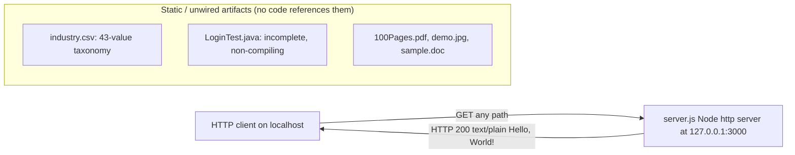
```mermaid
flowchart LR
    Client["HTTP client on localhost"] -->|"GET any path"| Server["server.js Node http server at 127.0.0.1:3000"]
    Server -->|"HTTP 200 text/plain Hello, World!"| Client
    subgraph Unwired["Static / unwired artifacts (no code references them)"]
        CSV["industry.csv: 43-value taxonomy"]
        JavaStub["LoginTest.java: incomplete, non-compiling"]
        BinDocs["100Pages.pdf, demo.jpg, sample.doc"]
    end
```

### 1.2.3 Success Criteria

The repository defines **no formal success criteria**. There is no requirements document, acceptance test, benchmark, monitoring, or service-level definition anywhere in the codebase, and the only npm test script fails by design (`echo "Error: no test specified" && exit 1`). Consequently, measurable objectives, critical success factors, and key performance indicators cannot be reported as facts — they are absent.

The only observable, verifiable success signals derive from the behavior of `server.js` when it is run manually:

| Category | Status in Repository | Only Observable Signal |
| --- | --- | --- |
| Measurable Objectives | Not defined | Server process starts and logs `Server running at http://127.0.0.1:3000/` |
| Critical Success Factors | Not defined | Every request returns HTTP `200` with body `Hello, World!` |
| Key Performance Indicators (KPIs) | Not defined (no metrics, SLAs, or monitoring exist) | None instrumented |

Any KPI, SLA, latency target, or uptime objective is therefore explicitly out of evidence for this repository and must not be assumed.

## 1.3 Scope

This section defines what the `hao-backprop-test` repository actually contains and does (in-scope) versus what it deliberately or effectively does not provide (out-of-scope). All entries are grounded in the observed files; because the repository is a minimal test fixture, the in-scope surface is intentionally narrow and the out-of-scope list is correspondingly broad.

### 1.3.1 In-Scope

**Core Features and Functionalities.** The only executable capability is the static HTTP server; the remaining in-scope items are static assets and metadata that are present in the repository.

| Capability Area | In-Scope Element | Evidence |
| --- | --- | --- |
| Must-have capability | HTTP server returning a fixed `200 / text/plain / Hello, World!` response | `server.js` |
| Primary workflow | Start the server (`node server.js`) and issue an HTTP request to `127.0.0.1:3000` | `server.js`, `package.json` |
| Reference data | 43-value single-column "Industry" taxonomy available as a static file | `industry.csv` |
| Sample content | Multi-format binary document assets (PDF, JPEG, DOC) | `100Pages.pdf`, `demo.jpg`, `sample.doc` |
| Package metadata | npm package identity for `hello_world` v1.0.0 (MIT, zero dependencies) | `package.json`, `package-lock.json` |

**Key Technical Requirements (as evidenced).** A Node.js runtime is required to execute `server.js`; the server depends only on the Node core `http` module and requires TCP port `3000` on the loopback interface `127.0.0.1`. No external packages, environment variables, or build steps are needed to run it.

**Essential Integrations.** None are implemented in code. The single service uses only Node's built-in `http` module and declares no third-party dependencies, external endpoints, or credentials.

**Implementation Boundaries.**

| Boundary Dimension | Coverage in This Repository |
| --- | --- |
| System boundary | A single-process, single-response local HTTP server plus a set of standalone static/binary files; no database, cache, queue, or external service |
| User groups covered | None defined — no authentication, roles, or personas; effective audience is developers/tooling running or ingesting the repository |
| Geographic / market coverage | None — the server binds to `127.0.0.1` only and is not deployed or externally reachable |
| Data domains included | Industry taxonomy (`industry.csv`), sample document assets (PDF/JPEG/DOC), and npm package metadata |

### 1.3.2 Out-of-Scope

**Explicitly Excluded Features and Capabilities.** The repository contains no code for the following, so they are out of scope:

| Area | Excluded from This Repository |
| --- | --- |
| Web application features | Request routing, path handling, query/body parsing, middleware, dynamic content, or multiple endpoints (the server ignores request details and always returns the same response) |
| Security | Authentication, authorization, TLS/HTTPS, input validation, or session management |
| Data & persistence | Databases, ORMs, file parsing/processing; `industry.csv` is never read and the binary documents are never opened by any code |
| Java functionality | Compilation or execution of `LoginTest.java`, which is an incomplete, non-compiling stub |
| Quality & delivery | Automated tests (the `test` script fails intentionally), CI/CD pipelines, containerization, configuration management, logging/monitoring, or deployment tooling |

**Future Phase Considerations.** None are documented. The repository contains no roadmap, backlog, `TODO`s, feature flags, or versioned plans beyond the static `1.0.0` package version, and `README.md` frames the artifacts as fixed ("Do not touch!") rather than evolving.

**Integration Points Not Covered.** Although `README.md` names "backprop integration" as the project's purpose, no such integration is present: there is no `backprop` client, API contract, authentication, network configuration, or data exchange logic anywhere in the codebase. The integration is therefore a stated intent only, not an implemented capability.

**Unsupported Use Cases.** Production deployment, external/remote access, multi-user or concurrent-load scenarios, horizontal scaling, and any form of data processing over the CSV or binary documents are unsupported. The repository is suitable only as a small, local, read-only test fixture.

## 1.4 References

The following repository artifacts were inspected directly and cited as evidence for this Introduction. All paths are relative to the repository root; no external web sources were required.

**Files examined**

- `README.md` — Established the repository's identity ("hao-backprop-test"), its declared purpose ("test project for backprop integration"), and the "Do not touch!" warning.
- `package.json` — Confirmed the npm package identity (`hello_world`, v1.0.0, MIT), the generic description, the `main: index.js` reference (with no `index.js` present), the intentionally failing `test` script, the author `hxu`, and the absence of dependencies.
- `package-lock.json` — Confirmed `lockfileVersion` 3 and the absence of any third-party (locked) dependencies.
- `server.js` — Established the only runnable logic: a Node.js core `http` server bound to `127.0.0.1:3000` returning HTTP `200`, `Content-Type: text/plain`, body `Hello, World!`.
- `server - Copy.js` — Verified as a byte-for-byte identical duplicate of `server.js`.
- `LoginTest.java` — Established the `com.blitzyTest.LoginTest` class whose `main` body is a single bare token, making it non-compiling.
- `LoginTest - Copy.java` — Verified as a byte-for-byte identical duplicate of `LoginTest.java`.
- `industry.csv` — Established the single-column "Industry" taxonomy of 43 values ending in the catch-all "Other".
- `industry - Copy.csv` — Verified as a byte-for-byte identical duplicate of `industry.csv`.
- `test.py.txt`, `test.py - Copy.txt`, `test.txt.txt` — Confirmed to be empty (0-byte) placeholder files.
- `100Pages.pdf`, `100Pages - Copy.pdf` — Confirmed as a PDF 1.7 binary sample document (~9.46 MB), with the copy byte-for-byte identical.
- `demo.jpg`, `demo - Copy.jpg` — Confirmed as a JPEG image sample (3840×2160, ~2.12 MB), with the copy byte-for-byte identical.
- `sample.doc`, `sample - Copy.doc` — Confirmed as a legacy OLE2 Microsoft Word document sample (~98 KB), with the copy byte-for-byte identical.

**Folders examined**

- Repository root (`/`) — Established the flat, file-only structure with no subdirectories; Git tracks 18 files in total (a single `Add files via upload` commit on branch `QA-08-win-VM-branch`, with a `main` branch also present).

# 2. Product Requirements

## 2.1 Feature Catalog

This section decomposes the `hao-backprop-test` repository into discrete, testable features. Because the repository is an explicitly declared **test fixture** (`README.md`: "test project for backprop integration. Do not touch!") rather than a cohesive product, the feature surface is intentionally narrow. Only one feature is executable; the remainder are static data/metadata assets. Every feature below is grounded in an artifact actually present in the repository, and no capability is documented that the code does not demonstrably provide. Items that the repository contains but that are **not** features (an incomplete Java stub, empty placeholders, and byte-identical duplicates) are enumerated in §2.1.6 rather than catalogued as features, consistent with the boundaries drawn in **§1.3 Scope**.

A recurring qualifier used throughout this section is **"unwired"**: a data/asset feature is present in the repository but is never read, imported, parsed, or referenced by any code. As established in **§1.2 System Overview**, the artifacts "are not integrated with one another; each stands alone."

### 2.1.1 Feature Inventory Overview

The repository exposes four catalogued features. F-001 is the sole runtime capability; F-002 through F-004 are static assets/metadata.

| Feature ID | Feature Name | Category | Priority |
| --- | --- | --- | --- |
| F-001 | Static HTTP Response Service | Runtime Web Service | Critical |
| F-002 | NPM Package Definition & Metadata | Build / Packaging Metadata | Medium |
| F-003 | Industry Taxonomy Reference Dataset | Static Reference Data | Low |
| F-004 | Multi-Format Sample Document Corpus | Static Binary Assets | Low |

Feature status and provenance (each source artifact is duplicated as a byte-identical `- Copy` variant except where noted):

| Feature ID | Status | Primary Source Artifact(s) |
| --- | --- | --- |
| F-001 | Completed (runnable) | `server.js` (+ `server - Copy.js`) |
| F-002 | Completed (minimal) | `package.json`, `package-lock.json` (no `- Copy` variants) |
| F-003 | Completed but Unwired | `industry.csv` (+ `industry - Copy.csv`) |
| F-004 | Completed but Unwired | `100Pages.pdf`, `demo.jpg`, `sample.doc` (+ copies) |

Priority reflects each feature's contribution to the repository's only observable behavior: F-001 is **Critical** because it is the single executable capability (§1.3.1 lists it as the sole "must-have capability"); F-002 is **Medium** because it establishes package identity but is not required to run the server; F-003 and F-004 are **Low** because they are inert reference assets not consumed by any code.

### 2.1.2 F-001: Static HTTP Response Service

**Feature Metadata**

| Attribute | Value |
| --- | --- |
| Feature ID | F-001 |
| Feature Name | Static HTTP Response Service |
| Feature Category | Runtime Web Service |
| Priority Level | Critical |
| Status | Completed |

**Description**

- **Overview:** `server.js` creates an HTTP server with the Node.js core `http` module, binds it to host `127.0.0.1` and port `3000`, and returns a fixed HTTP `200` response with `Content-Type: text/plain` and the body `Hello, World!\n` for every incoming request. Request method, path, headers, and body are never inspected; the response is identical for all requests.
- **Business Value:** Instrumental rather than commercial. Per **§1.1**, the repository delivers "instrumental rather than direct business value." F-001 supplies a deterministic, dependency-free, self-contained HTTP endpoint that an external process (the `README.md`-named "backprop integration") can start and probe with predictable results.
- **User Benefits:** The effective audience is developers and automated tooling (no end-user roles exist). They obtain a trivially small HTTP service that starts with a single command and requires no configuration, no environment variables, and no dependency installation.
- **Technical Context:** Canonical Node.js "Hello World" pattern using the CommonJS module system and only built-in modules — no Express or other framework. Host and port are hard-coded; logging consists of a single `console.log`; there is no routing, middleware, request parsing, or error handling.

<pre><code class="language-javascript">const server = http.createServer((req, res) =&gt; {
  res.statusCode = 200;
  res.setHeader('Content-Type', 'text/plain');
  res.end('Hello, World!\n');
});
</code></pre>

**Dependencies**

| Dependency Type | Detail |
| --- | --- |
| Prerequisite Features | None (F-001 runs independently; it does not require F-002/F-003/F-004) |
| System Dependencies | A Node.js runtime and its built-in `http` module; TCP port `3000` free on the `127.0.0.1` loopback interface |
| External Dependencies | None — `package.json`/`package-lock.json` declare zero third-party dependencies |
| Integration Requirements | None implemented — no clients, SDKs, webhooks, or network egress exist (the "backprop integration" is a stated intent only, per §1.3.2) |

### 2.1.3 F-002: NPM Package Definition & Metadata

**Feature Metadata**

| Attribute | Value |
| --- | --- |
| Feature ID | F-002 |
| Feature Name | NPM Package Definition & Metadata |
| Feature Category | Build / Packaging Metadata |
| Priority Level | Medium |
| Status | Completed (minimal) |

**Description**

- **Overview:** `package.json` declares an npm package named `hello_world` at version `1.0.0`, with description `"Hello world in Node.js"`, author `hxu`, and license `MIT`. `package-lock.json` (`lockfileVersion` 3) records the same identity with no third-party dependency tree.
- **Business Value:** Instrumental — establishes a stable package identity and explicit MIT licensing for the Node.js artifact, which allows standard npm tooling to recognize and reason about the project.
- **User Benefits:** Developers get an unambiguous package name/version/license and a deterministic (empty) dependency closure, so `npm ci` would install nothing and behavior is reproducible.
- **Technical Context:** The manifest's `main` field points to `index.js`, but **no `index.js` file exists** in the repository; the runnable entry point is `server.js`, which is not referenced by any npm script. The only script defined is a placeholder `test` that intentionally fails (`echo "Error: no test specified" && exit 1`). There is no `start` script.

**Dependencies**

| Dependency Type | Detail |
| --- | --- |
| Prerequisite Features | None |
| System Dependencies | npm/Node.js tooling to parse the manifest and lockfile |
| External Dependencies | None — zero dependencies are declared or locked |
| Integration Requirements | None — the metadata is self-contained and references no registry-hosted packages |

### 2.1.4 F-003: Industry Taxonomy Reference Dataset

**Feature Metadata**

| Attribute | Value |
| --- | --- |
| Feature ID | F-003 |
| Feature Name | Industry Taxonomy Reference Dataset |
| Feature Category | Static Reference Data |
| Priority Level | Low |
| Status | Completed but Unwired |

**Description**

- **Overview:** `industry.csv` is a single-column CSV whose header is `Industry`, followed by exactly 43 category values (first `Accounting/Finance`, last the catch-all `Other`).
- **Business Value:** Instrumental — provides a ready-made industry categorization list that could support dropdown population, input validation, or record classification. However, it delivers no runtime value in this repository because no code consumes it.
- **User Benefits:** A curated, self-contained taxonomy that a downstream consumer could import as-is; the exact labels and their order are the asset.
- **Technical Context:** Pure static data with no executable logic. The file is **unwired** — no code in the repository reads, imports, or validates it — and it is duplicated as `industry - Copy.csv` (byte-identical).

**Dependencies**

| Dependency Type | Detail |
| --- | --- |
| Prerequisite Features | None |
| System Dependencies | A CSV-capable reader would be required by any consumer; none exists in-repository |
| External Dependencies | None |
| Integration Requirements | None — no code path links this dataset to F-001 or any other feature |

### 2.1.5 F-004: Multi-Format Sample Document Corpus

**Feature Metadata**

| Attribute | Value |
| --- | --- |
| Feature ID | F-004 |
| Feature Name | Multi-Format Sample Document Corpus |
| Feature Category | Static Binary Assets |
| Priority Level | Low |
| Status | Completed but Unwired |

**Description**

- **Overview:** Three binary sample documents in distinct formats: `100Pages.pdf` (a PDF 1.7 document, ~9.46 MB), `demo.jpg` (a JPEG/EXIF image, ~2.12 MB), and `sample.doc` (an OLE2 compound-file legacy Microsoft Word document, 96 KB). Each has a byte-identical `- Copy` twin.
- **Business Value:** Instrumental — supplies a heterogeneous, multi-format corpus against which external ingestion/format-handling tooling can be exercised, consistent with the repository's role as a mixed-format test fixture (§1.1).
- **User Benefits:** Developers/tooling obtain ready-to-use sample files spanning document (PDF), image (JPEG), and legacy office (DOC) formats without needing to source their own test assets.
- **Technical Context:** Pure static binary assets with no executable logic. The files are **unwired** — no code opens, parses, or references them. File formats were confirmed by magic bytes (`%PDF-1.7`; JPEG SOI `FF D8 FF E1`; OLE2 `D0 CF 11 E0`).

**Dependencies**

| Dependency Type | Detail |
| --- | --- |
| Prerequisite Features | None |
| System Dependencies | Format-appropriate readers (PDF/JPEG/DOC) would be required by any consumer; none exists in-repository |
| External Dependencies | None |
| Integration Requirements | None — no code path links these assets to any feature |

### 2.1.6 Excluded Artifacts (Non-Features)

The following repository artifacts are present but are **not** catalogued as features because they provide no capability. Their exclusion is consistent with **§1.3.2 Out-of-Scope**.

| Artifact(s) | Reason Not a Feature | Basis |
| --- | --- | --- |
| `LoginTest.java` (+ `LoginTest - Copy.java`) | Non-compiling stub: the `com.blitzyTest.LoginTest` `main` method body is the single bare token `Web`, which is not valid Java | §1.3.2 explicitly excludes Java compilation/execution |
| `test.py.txt`, `test.py - Copy.txt`, `test.txt.txt` | Empty (0-byte) placeholder files with no content or behavior | Verified file sizes (0 bytes) |
| Six `- Copy` duplicates | Byte-for-byte identical copies of their originals (verified by matching MD5 checksums); they add redundancy, not distinct capability | Duplicate detection across the 18-file inventory |

These artifacts are documented here for completeness so that the feature catalogue is not misread as omitting repository content; they carry no functional requirements in §2.2.

## 2.2 Functional Requirements

This section specifies testable functional requirements for each catalogued feature. The repository contains **no formal requirements document** (confirmed in §1.2.3), so the requirements below are reverse-engineered from directly observed behavior and file content, and each carries an acceptance criterion that can be verified against the repository as-is.

Two facts apply globally and are therefore not repeated as table columns:

- **Performance Criteria — none defined.** As established in **§1.2.3 Success Criteria**, the repository defines no KPIs, SLAs, latency, throughput, or uptime targets. No performance requirement is asserted for any requirement below; the only observable signal is functional correctness. Any incidental runtime characteristics (for example, the Node HTTP defaults `Connection: keep-alive` and `Keep-Alive: timeout=5`) are emergent defaults, not requirements.
- **Security & Compliance — none implemented.** As established in **§1.3.2**, there is no authentication, authorization, TLS/HTTPS, input validation, session management, or regulatory compliance control anywhere in the repository. Security-relevant observations are recorded per requirement where they materially bound risk (for example, loopback-only binding).

Priority uses the Must-Have / Should-Have / Could-Have scale. Complexity is **Low** for every requirement, reflecting the trivial, dependency-free implementations.

### 2.2.1 F-001 — Static HTTP Response Service Requirements

**Requirement Details**

| Requirement ID | Description | Priority | Complexity |
| --- | --- | --- | --- |
| F-001-RQ-001 | On `node server.js`, instantiate an HTTP server via the Node core `http` module and listen on `127.0.0.1:3000`, emitting a startup log line | Must-Have | Low |
| F-001-RQ-002 | For every request, respond with `200`, `Content-Type: text/plain`, and body `Hello, World!\n`, regardless of method, path, headers, or body | Must-Have | Low |
| F-001-RQ-003 | Run using only Node.js built-ins (the `http` module) — no third-party packages and no build step | Should-Have | Low |

**Acceptance Criteria**

| Requirement ID | Acceptance Criteria (verifiable) |
| --- | --- |
| F-001-RQ-001 | Process starts without error; stdout contains exactly `Server running at http://127.0.0.1:3000/`; a TCP listener accepts connections on `127.0.0.1:3000` |
| F-001-RQ-002 | `GET /`, `GET /any/random/path`, `POST /` with a body, and `DELETE /xyz` each return an identical response: status `200`, `Content-Type: text/plain`, body `Hello, World!\n` (`Content-Length: 14`) |
| F-001-RQ-003 | The server starts successfully with no `npm install` performed; `server.js` `require`s only `http`; `package.json`/`package-lock.json` declare zero dependencies |

**Technical Specifications**

| Requirement ID | Input Parameters | Output / Response | Data Requirements |
| --- | --- | --- | --- |
| F-001-RQ-001 | None (no CLI arguments; no environment variables read) | A bound listening socket plus one stdout log line | None |
| F-001-RQ-002 | Any HTTP request; all request fields are ignored (`req` is never read) | HTTP `200`; `Content-Type: text/plain`; body `Hello, World!\n` (14 bytes) | Response string is a hard-coded literal; no data store |
| F-001-RQ-003 | None | Not applicable (implementation constraint) | None |

**Validation Rules**

| Requirement ID | Business Rules | Data Validation | Security Observations |
| --- | --- | --- | --- |
| F-001-RQ-001 | Host and port are fixed constants (`127.0.0.1`, `3000`); not configurable | None (no inputs) | Binds to the loopback interface only, so the service is not externally reachable; no TLS or auth |
| F-001-RQ-002 | Exactly one fixed response; no routing or content negotiation | None (request is never parsed or validated) | No request parsing means no body/query injection surface; also no authorization checks |
| F-001-RQ-003 | No external runtime dependencies permitted | Not applicable | Zero third-party code eliminates dependency supply-chain and CVE exposure |

### 2.2.2 F-002 — NPM Package Definition & Metadata Requirements

**Requirement Details**

| Requirement ID | Description | Priority | Complexity |
| --- | --- | --- | --- |
| F-002-RQ-001 | `package.json` declares package identity: `name` `hello_world`, `version` `1.0.0`, `description`, `author` `hxu`, `license` `MIT` | Must-Have | Low |
| F-002-RQ-002 | `package-lock.json` (`lockfileVersion` 3) records the same identity with a dependency tree containing only the root package (zero third-party deps) | Must-Have | Low |

**Acceptance Criteria**

| Requirement ID | Acceptance Criteria (verifiable) |
| --- | --- |
| F-002-RQ-001 | `package.json` is valid JSON; the five fields resolve to the stated values (e.g., via `npm pkg get name version license author`) |
| F-002-RQ-002 | `package-lock.json` is valid JSON; `lockfileVersion` equals `3`; `packages` contains only the root (`""`) entry; `npm ci` would install zero external packages |

**Technical Specifications**

| Requirement ID | Input Parameters | Output / Response | Data Requirements |
| --- | --- | --- | --- |
| F-002-RQ-001 | Not applicable (declarative manifest) | Parsed manifest object consumed by npm tooling | Well-formed JSON object with the npm-recognized fields |
| F-002-RQ-002 | Not applicable (declarative lockfile) | Deterministic (empty) install closure | Lockfile identity must equal `package.json` (`hello_world` / `1.0.0` / `MIT`) |

**Validation Rules**

| Requirement ID | Business Rules | Data Validation | Compliance Observations |
| --- | --- | --- | --- |
| F-002-RQ-001 | Name/version/license must be present and consistent with the lockfile | JSON must parse; npm schema fields recognized | MIT (permissive) license is explicitly declared; `main` points to `index.js`, which does not exist |
| F-002-RQ-002 | Lockfile and manifest identities must agree | JSON parse; `lockfileVersion` = 3; root-only `packages` | Empty dependency set → no third-party license or supply-chain obligations |

**Known constraint (documented, not a defect fix):** the manifest's `main` target `index.js` is absent, and the only script (`test`) intentionally fails (`echo "Error: no test specified" && exit 1`); there is no `start` script binding `server.js`. These are recorded in §2.5 assumptions and constraints.

### 2.2.3 F-003 — Industry Taxonomy Reference Dataset Requirements

**Requirement Details**

| Requirement ID | Description | Priority | Complexity |
| --- | --- | --- | --- |
| F-003-RQ-001 | `industry.csv` provides a single `Industry` column: a header row followed by 43 category values, terminating in the catch-all `Other` | Should-Have | Low |

**Acceptance Criteria**

| Requirement ID | Acceptance Criteria (verifiable) |
| --- | --- |
| F-003-RQ-001 | File parses as single-column CSV; exactly 1 header (`Industry`) + 43 non-empty data rows; first value `Accounting/Finance`; final value `Other` |

**Technical Specifications**

| Requirement ID | Input Parameters | Output / Response | Data Requirements |
| --- | --- | --- | --- |
| F-003-RQ-001 | Not applicable (static file; unwired) | Not applicable — not served or emitted by any code | UTF-8 text CSV, one value per line, single column (no embedded delimiters requiring quoting) |

**Validation Rules**

| Requirement ID | Business Rules | Data Validation | Security / Compliance Observations |
| --- | --- | --- | --- |
| F-003-RQ-001 | `Other` acts as the terminal catch-all category | No code validates the file (unwired); integrity is by file content only | Contains no sensitive data; never processed, so no data-handling controls apply |

### 2.2.4 F-004 — Multi-Format Sample Document Corpus Requirements

**Requirement Details**

| Requirement ID | Description | Priority | Complexity |
| --- | --- | --- | --- |
| F-004-RQ-001 | Provide one valid file in each of three formats: PDF 1.7 (`100Pages.pdf`), JPEG (`demo.jpg`), and legacy OLE2 Word DOC (`sample.doc`) | Could-Have | Low |

**Acceptance Criteria**

| Requirement ID | Acceptance Criteria (verifiable) |
| --- | --- |
| F-004-RQ-001 | Each file is present and begins with its format's magic bytes (`%PDF-1.7`; JPEG `FF D8 FF`; OLE2 `D0 CF 11 E0`); byte sizes match the inventory (9,456,545 / 2,123,398 / 98,304) |

**Technical Specifications**

| Requirement ID | Input Parameters | Output / Response | Data Requirements |
| --- | --- | --- | --- |
| F-004-RQ-001 | Not applicable (static binaries; unwired) | Not applicable — not opened by any code | Each file must be well-formed for its declared format (PDF / JPEG / DOC) |

**Validation Rules**

| Requirement ID | Business Rules | Data Validation | Security / Compliance Observations |
| --- | --- | --- | --- |
| F-004-RQ-001 | None | No code validates the assets (unwired) | Binaries are neither executed nor parsed in-repo; no scanning/provenance controls are implemented |

Note: `100Pages.pdf` is confirmed to be a PDF 1.7 document by its header; its exact page count is not independently verifiable from the compressed object streams, so no page-count assertion is made here beyond the filename.

## 2.3 Feature Relationships

Feature relationships in this repository are minimal by design. As stated in **§1.2 System Overview**, the artifacts "are not integrated with one another; each stands alone." Only relationships that are demonstrably present in the source are documented below; no integration is inferred.

### 2.3.1 Feature Dependency Map

The map below shows the complete set of relationships. There is exactly **one active dependency** (F-001 on the Node.js core `http` module) and **one nominal but broken relationship** (F-002 declares the package that would contain F-001, but the link is inert). F-003 and F-004 have no edges — they are isolated, unwired assets.

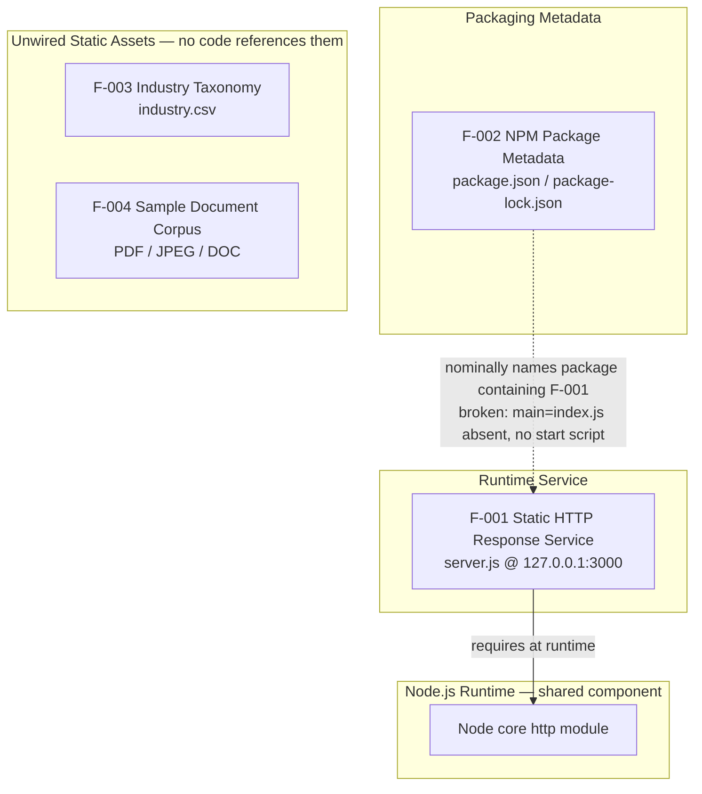
```mermaid
flowchart TB
    subgraph RT["Node.js Runtime — shared component"]
        HTTP["Node core http module"]
    end
    subgraph SVC["Runtime Service"]
        F001["F-001 Static HTTP Response Service<br/>server.js @ 127.0.0.1:3000"]
    end
    subgraph META["Packaging Metadata"]
        F002["F-002 NPM Package Metadata<br/>package.json / package-lock.json"]
    end
    subgraph DATA["Unwired Static Assets — no code references them"]
        F003["F-003 Industry Taxonomy<br/>industry.csv"]
        F004["F-004 Sample Document Corpus<br/>PDF / JPEG / DOC"]
    end
    F001 -->|"requires at runtime"| HTTP
    F002 -.->|"nominally names package containing F-001<br/>broken: main=index.js absent, no start script"| F001
```

The relationship inventory in tabular form:

| From → To | Relationship | Status |
| --- | --- | --- |
| F-001 → Node core `http` | Runtime dependency | Active |
| F-002 ⇢ F-001 | Nominal package membership | Inactive (manifest `main` targets absent `index.js`; no `start` script binds `server.js`) |
| F-003 | None | Isolated / unwired |
| F-004 | None | Isolated / unwired |

### 2.3.2 Integration Points

| Integration Point | Description | Evidence |
| --- | --- | --- |
| F-001 HTTP endpoint | The only invokable interface the system exposes: an HTTP listener on `127.0.0.1:3000`, reachable from the local host only | `server.js` (`server.listen(3000, '127.0.0.1', ...)`) |
| Inter-feature integration | None — no feature invokes, imports, reads, or is composed with another; F-003/F-004 are never read by F-001 or any code | §1.2; absence of any consuming code |
| External / third-party integration | None implemented — no `backprop` client, API contract, database, queue, or credentials exist; the "backprop integration" named in `README.md` is a stated intent only | §1.3.2; zero dependencies in `package.json` |

### 2.3.3 Shared Components

The only component shared by more than a nominal reference is the **Node.js runtime and its built-in `http` module**, and it is consumed exclusively by F-001. No application-level code, library, utility module, or configuration is shared across features — there is no shared source at all, because each artifact is standalone.

| Shared Component | Consumed By | Notes |
| --- | --- | --- |
| Node.js runtime + core `http` module | F-001 only | Built-in; no third-party packages |
| Application source / utilities | None | No cross-feature code exists; the `- Copy` files are independent byte-identical duplicates, not shared modules |

### 2.3.4 Common Services

The repository provides **no common services**. There is no configuration service, persistence layer, cache, message queue, authentication/authorization service, API gateway, or centralized logging. The only logging is a single `console.log` startup line inside F-001; there is no service consumed by multiple features.

For the end-to-end request/response process flow of F-001 and a visualization of the unwired artifacts, see the process flowchart in **§1.2.2 High-Level Description**, which depicts the localhost client → `server.js` → fixed `Hello, World!` response path alongside the standalone static assets.

## 2.4 Implementation Considerations

This section records implementation considerations per feature. Several constraints are repository-wide and apply to all features:

- **Fixture stability:** `README.md` marks the repository "Do not touch!", framing all artifacts as fixed reference content rather than an evolving codebase.
- **Redundant duplication:** six content files each have a byte-identical `- Copy` twin (verified by matching MD5 checksums); any edit to an original must be mirrored to its copy or the two will silently diverge.
- **No test/build/CI safety net:** the only npm script (`test`) fails by design and there is no CI, containerization, or build step (§1.3.2), so regressions are detectable only by manual execution.
- **Single-commit history:** the entire repository is one git commit (`be2be9b "Add files via upload"`), so there is no incremental change history to reason about.
- **No performance targets exist** for any feature (§1.2.3); scalability/performance notes below describe architectural facts, not measured or required thresholds.

### 2.4.1 F-001 — Static HTTP Response Service

| Consideration | Detail |
| --- | --- |
| Technical constraints | Requires a Node.js runtime; CommonJS module system; host/port are hard-coded (`127.0.0.1:3000`) with no environment-variable or CLI override; no error handling — a port conflict (`EADDRINUSE`) would crash the process; logging is a single `console.log` |
| Performance requirements | None defined (§1.2.3). Architecturally: a single Node process on one event loop returning a fixed 14-byte body; no measured latency/throughput target is set or asserted |
| Scalability considerations | Not designed to scale: single process, no clustering/worker threads, and loopback-only binding preclude external or horizontal distribution; §1.3.2 lists concurrent-load and horizontal scaling as unsupported |
| Security implications | No authentication, authorization, TLS, or input validation; the sole risk-limiting control is loopback-only binding (not externally reachable); the request is never parsed, minimizing injection surface; zero dependencies eliminate supply-chain risk |
| Maintenance requirements | Governed by "Do not touch!"; `server.js` is duplicated as byte-identical `server - Copy.js` (edits must be mirrored); version pinned at 1.0.0; no automated tests, so changes require manual verification |

### 2.4.2 F-002 — NPM Package Definition & Metadata

| Consideration | Detail |
| --- | --- |
| Technical constraints | Both files must remain valid JSON; manifest and lockfile identities must agree; `lockfileVersion` 3 ties the lockfile to a modern npm; the `main` field references a non-existent `index.js` |
| Performance requirements | Not applicable (declarative metadata) |
| Scalability considerations | Not applicable; the zero-dependency closure keeps installs trivial and fully deterministic (`npm ci` installs nothing) |
| Security implications | Permissive MIT license declared; the empty dependency set means no third-party CVE or supply-chain exposure; no secrets are present in the manifest |
| Maintenance requirements | Keep the lockfile synchronized with the manifest; version bumps must update both; the `main` → `index.js` mismatch and the intentionally failing `test` script (with no `start` script) are known, documented constraints (§2.5). These two files have no `- Copy` duplicates |

### 2.4.3 F-003 — Industry Taxonomy Reference Dataset

| Consideration | Detail |
| --- | --- |
| Technical constraints | Single-column, UTF-8 CSV with one value per line; any consumer must supply its own parser (none exists in-repository) |
| Performance requirements | None; the file is a trivially small 43-row static asset |
| Scalability considerations | Not applicable; the dataset is fixed and small |
| Security implications | Contains no sensitive data; being unwired, it is not part of any runtime attack surface |
| Maintenance requirements | Duplicated as byte-identical `industry - Copy.csv` (edits must be mirrored); the taxonomy is static, and the terminal `Other` category provides a forward-compatible catch-all for uncategorized values |

### 2.4.4 F-004 — Multi-Format Sample Document Corpus

| Consideration | Detail |
| --- | --- |
| Technical constraints | Three distinct binary formats (PDF 1.7 / JPEG / OLE2 DOC); files are large relative to the repository (`100Pages.pdf` ~9.46 MB, `demo.jpg` ~2.12 MB); consumers require format-specific readers (none in-repository) |
| Performance requirements | None; the files are never processed by any code |
| Scalability considerations | Not applicable; however, the duplication doubles the corpus footprint — the six binary files account for roughly 23 MB, essentially the entire on-disk size of the repository |
| Security implications | Binaries are neither executed nor parsed in-repo, so no scanning/provenance controls are applied; a downstream consumer that ingests them should perform its own validation |
| Maintenance requirements | Each asset is duplicated as a byte-identical `- Copy`; large binaries committed to git inflate clone size; the assets are unversioned beyond the single upload commit |

## 2.5 Requirements Traceability Matrix

This section links every requirement back to its source artifact and its verification method, ties each feature to the relevant boundary in **§1.3 Scope**, and records assumptions, constraints, and version identifiers.

### 2.5.1 Traceability Matrix

Requirement-to-feature-to-source traceability:

| Requirement ID | Parent Feature | Primary Source Artifact(s) | Acceptance Verification |
| --- | --- | --- | --- |
| F-001-RQ-001 | F-001 | `server.js` (+ `server - Copy.js`) | Run `node server.js`; inspect startup log and loopback port |
| F-001-RQ-002 | F-001 | `server.js` | Issue HTTP requests across methods/paths; assert `200` / `text/plain` / `Hello, World!\n` |
| F-001-RQ-003 | F-001 | `server.js`, `package.json`, `package-lock.json` | Static inspection of `require`s; run with no `npm install` |
| F-002-RQ-001 | F-002 | `package.json` | Parse JSON; verify identity fields (`npm pkg get`) |
| F-002-RQ-002 | F-002 | `package-lock.json` | Parse JSON; confirm `lockfileVersion` 3 and root-only `packages` |
| F-003-RQ-001 | F-003 | `industry.csv` (+ `industry - Copy.csv`) | Parse CSV; assert header + 43 values ending in `Other` |
| F-004-RQ-001 | F-004 | `100Pages.pdf`, `demo.jpg`, `sample.doc` (+ copies) | Verify magic bytes and byte sizes per format |

Feature-to-specification linkage (traceability into Section 1):

| Feature | Related Specification Reference | In-Scope Basis (§1.3.1) |
| --- | --- | --- |
| F-001 | §1.2.2 High-Level Description; §1.2.3 Success Criteria | Listed as the sole "must-have capability" (HTTP server) |
| F-002 | §1.1 Executive Summary (artifact groups) | Listed as "Package metadata" |
| F-003 | §1.2.2 High-Level Description | Listed as "Reference data" |
| F-004 | §1.1 Executive Summary; §1.3.1 | Listed as "Sample content" |

### 2.5.2 Assumptions and Constraints

1. **Test-fixture nature.** The repository is an explicitly declared test fixture (`README.md`: "Do not touch!"), not a production system (§1.1). Because no formal requirements document exists (§1.2.3), the requirements in §2.2 are reverse-engineered from directly observed behavior and file content.
2. **No performance envelope.** No SLAs, KPIs, latency, throughput, or uptime targets exist (§1.2.3); none are assumed or asserted.
3. **No security or compliance controls.** No authentication, authorization, TLS/HTTPS, input validation, or regulatory compliance mechanism is implemented (§1.3.2).
4. **Loopback-only exposure.** The single runnable feature (F-001) binds to `127.0.0.1` and is therefore not reachable from outside the local host.
5. **Retained known constraints/defects.** The manifest `main` target `index.js` is absent; the `test` script fails by design and there is no `start` script; `LoginTest.java` does not compile; six files are redundant byte-identical `- Copy` duplicates; three `.txt` files are empty (0 bytes).
6. **Unwired data assets.** F-003 and F-004 are present but never consumed by any code; their requirements are limited to content/format integrity, not runtime behavior.
7. **Integration is intent-only.** The "backprop integration" named in `README.md` has no corresponding client, contract, or configuration in the codebase (§1.3.2).
8. **Runtime assumption.** A Node.js runtime is required to run F-001; the code uses only built-in modules, and `package.json` declares **no `engines` field**, so no minimum Node version is pinned by the repository. Verification was performed on Node.js v22.23.1.

### 2.5.3 Version Tracking

| Item | Version / Identifier | Source |
| --- | --- | --- |
| npm package `hello_world` | 1.0.0 | `package.json`, `package-lock.json` |
| npm lockfile format | `lockfileVersion` 3 | `package-lock.json` |
| Repository snapshot | git commit `be2be9b` ("Add files via upload"), branch `QA-08-win-VM-branch` | Git history |
| This requirements specification | v1.0 (initial baseline) | This document (§2) |
| Verification runtime | Node.js v22.23.1 (no `engines` pin in manifest) | Runtime check |

Requirement identifiers follow the fixed formats **F-XXX** (features) and **F-XXX-RQ-YYY** (requirements) throughout this section; the current baseline defines features F-001 through F-004 and their associated requirements. Any future change to a "Do not touch!" artifact would necessitate a new baseline and a corresponding increment to the specification version above.

## 2.6 References

The following repository artifacts, folders, and technical-specification sections were examined as evidence for the features and requirements documented in Section 2.

**Repository files inspected**

- `server.js` - established F-001: the Node core `http` server binding `127.0.0.1:3000` and returning the fixed `200` / `text/plain` / `Hello, World!\n` response (runtime behavior verified by execution).
- `server - Copy.js` - confirmed as a byte-identical duplicate of `server.js` (matching MD5).
- `package.json` - established F-002 manifest identity (`hello_world` 1.0.0, MIT, author `hxu`), the absent `main` target `index.js`, the failing `test` script, and the absence of dependencies and an `engines` field.
- `package-lock.json` - established the deterministic, zero-dependency closure and `lockfileVersion` 3.
- `README.md` - established the repository identity and the "test project for backprop integration. Do not touch!" fixture framing.
- `industry.csv` - established F-003: single-column `Industry` taxonomy of 43 values ending in `Other`.
- `industry - Copy.csv` - confirmed as a byte-identical duplicate of `industry.csv`.
- `100Pages.pdf`, `demo.jpg`, `sample.doc` - established F-004: PDF 1.7, JPEG/EXIF, and OLE2 (legacy Word) sample assets (formats and sizes verified by magic bytes and byte counts).
- `100Pages - Copy.pdf`, `demo - Copy.jpg`, `sample - Copy.doc` - confirmed as byte-identical duplicates of the F-004 assets.
- `LoginTest.java`, `LoginTest - Copy.java` - established the excluded non-feature: a non-compiling `com.blitzyTest.LoginTest` stub whose `main` body is the bare token `Web`.
- `test.py.txt`, `test.py - Copy.txt`, `test.txt.txt` - established the empty (0-byte) placeholder non-features.

**Repository locations examined**

- Repository root (flat, file-only; 18 tracked files plus a `.git` directory; no application sub-folders) - established the complete artifact inventory and the absence of `index.js`.

**Cross-referenced specification sections**

- §1.1 Executive Summary - confirmed the test-fixture nature, the artifact groupings, and the "instrumental rather than direct business value" framing used in the feature descriptions.
- §1.2 System Overview (incl. §1.2.2 High-Level Description and §1.2.3 Success Criteria) - confirmed the standalone/non-integrated nature of the artifacts, the process flowchart referenced in §2.3, and the absence of any KPIs/SLAs/performance criteria.
- §1.3 Scope (incl. §1.3.1 In-Scope and §1.3.2 Out-of-Scope) - anchored the in-scope feature set (F-001–F-004) and the excluded/non-feature artifacts.

**Verification tooling**

- Git history (`git log`, `git ls-files`) and file inspection (`ls`, `md5sum`, `od`) - confirmed the 18-file inventory, the six byte-identical `- Copy` pairs, binary magic bytes, and the single commit `be2be9b`.
- Node.js v22.23.1 runtime - used to execute `server.js` and empirically verify the method/path-agnostic HTTP response behavior.

# 3. Technology Stack

## 3.1 Programming Languages

The `hao-backprop-test` repository is deliberately mixed-language, but only one language yields runnable logic. Two general-purpose programming languages appear in the tracked source — **JavaScript** (executed on Node.js) and **Java** — alongside declarative data and markup formats (JSON, Markdown, CSV) that carry no executable behavior. Consistent with the repository's stated nature as a "test project for backprop integration" (`README.md`), there is no build toolchain, transpiler, or version-management file for any language: no `engines` field in `package.json`, no `.nvmrc`/`.node-version`, and no Java build descriptor (`pom.xml`/`build.gradle`). Language versions are therefore **not pinned anywhere in the repository**, which is documented explicitly below rather than assumed.

| Language | Platform / Runtime | Component (Feature) | Source Files | Version / Standard Pinned in Repo | Execution Status |
| --- | --- | --- | --- | --- | --- |
| JavaScript | Node.js (server-side), CommonJS modules | Static HTTP Response Service (F-001) | `server.js`, `server - Copy.js` | None (no `engines`, `.nvmrc`, or `.node-version`) | Runnable |
| Java | JVM (none configured) | Login stub (non-feature) | `LoginTest.java`, `LoginTest - Copy.java` | None (no `pom.xml` / `build.gradle` / JDK pin) | Non-compiling stub |

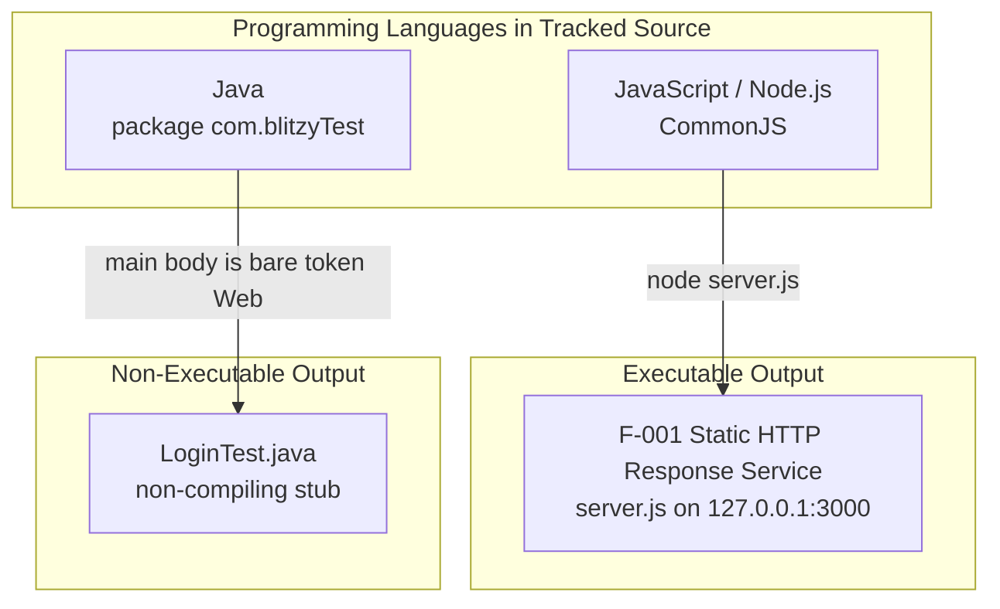
```mermaid
flowchart TD
    subgraph Languages["Programming Languages in Tracked Source"]
        JS["JavaScript / Node.js<br/>CommonJS"]
        JAVA["Java<br/>package com.blitzyTest"]
    end
    subgraph Executable["Executable Output"]
        HTTP["F-001 Static HTTP Response Service<br/>server.js on 127.0.0.1:3000"]
    end
    subgraph NonExecutable["Non-Executable Output"]
        STUB["LoginTest.java<br/>non-compiling stub"]
    end
    JS -->|"node server.js"| HTTP
    JAVA -->|"main body is bare token Web"| STUB
```

### 3.1.1 JavaScript (Node.js)

JavaScript is the **only language that produces runnable behavior** in the repository. `server.js` (and its byte-identical duplicate `server - Copy.js`, MD5 `05576d40…`) is a canonical Node.js "Hello World" HTTP server written in the **CommonJS** module system. It imports a single Node core module and binds a server to a hard-coded loopback host and port:

```javascript
const http = require('http');
const server = http.createServer((req, res) => { /* fixed 200 response */ });
server.listen(3000, '127.0.0.1', /* ... */);
```

**Selection criteria (as evidenced).** The observed characteristics indicate JavaScript-on-Node.js was chosen to keep the runnable component as small and self-contained as possible: it relies exclusively on the Node core `http` module, declares **zero third-party dependencies** (`package.json`, `package-lock.json`), requires **no build or transpile step**, and runs directly via `node server.js`. This yields a deterministic, single-file service that is trivial to clone and execute — well aligned with a lightweight integration test fixture.

**Constraints and dependencies.**
- **Runtime required, version unpinned.** Executing the server requires a Node.js runtime, but the repository pins no version — there is no `engines` field, `.nvmrc`, or `.node-version`. Any reasonably modern Node.js version that provides the core `http` API will run it.
- **Module system.** CommonJS (`require`) is used rather than ECMAScript modules; there is no `"type": "module"` declaration in `package.json`.
- **Hard-coded network binding.** Host `127.0.0.1` and port `3000` are literals in the source with no environment-variable or CLI override, so the service is reachable only from the local host.
- **No error handling.** A port conflict (`EADDRINUSE`) is unhandled and would crash the process (§2.4.1).

**Security implications.** The server never inspects or parses the request (method, path, headers, and body are all ignored), which minimizes the injection surface, and the loopback-only binding prevents external network exposure. Combined with the zero-dependency closure, the JavaScript component carries no third-party supply-chain risk.

### 3.1.2 Java

Java appears only as an **incomplete, non-compiling stub**. `LoginTest.java` (and its byte-identical duplicate `LoginTest - Copy.java`, MD5 `f11f7160…`) declares the package `com.blitzyTest` and a `public class LoginTest` with a `public static void main(String[] args)` entry point, but the method body consists of the single bare token `Web`, which is not valid Java and will not compile.

**Constraints and status.** There is no Java build tooling in the repository — no `pom.xml`, `build.gradle`, or any JDK/version pin — so the file cannot be compiled or executed as part of any pipeline and is not wired to any other artifact. It is documented here for completeness as a language present in source, not as a functional component; §1.3.2 lists compilation/execution of this file as out-of-scope.

**Security implications.** Because the stub does not compile and is never built or run, it introduces no runtime attack surface.

### 3.1.3 Declarative Data & Markup Formats and the Absence of Python

Beyond the two programming languages, the repository contains non-executable declarative formats that support metadata and static data rather than logic:

- **JSON** — `package.json` and `package-lock.json` express npm package metadata and the (empty) dependency lockfile.
- **Markdown** — `README.md` provides the repository's identity and the "Do not touch!" notice.
- **CSV** — `industry.csv` (and its copy) holds a single-column "Industry" taxonomy of 43 values.

**No Python is present.** Despite the filenames `test.py.txt`, `test.py - Copy.txt`, and `test.txt.txt`, all three are empty (0-byte) `.txt` placeholder files — they contain no Python source and are not executable. The `.py` substring appears only inside a `.txt` filename, so Python is **not** part of this repository's technology stack.


## 3.2 Frameworks & Libraries

The defining characteristic of this repository's stack is the **near-total absence of frameworks and libraries**. The single runnable component (`server.js`) is built entirely on a Node.js runtime built-in and declares **no third-party frameworks or supporting libraries**. There is no web application framework (no Express, Koa, Fastify, Hapi, or Nest), no front-end framework (no React, Vue, or Angular), no test framework (no Jest, Mocha, or Vitest), and no Java framework (no Spring or servlet container). This is verified directly by the manifest and lockfile, which contain no `dependencies` or `devDependencies` sections at all (`package.json`, `package-lock.json`).

| Category | Technology | Version | Source of Truth | Notes |
| --- | --- | --- | --- | --- |
| Runtime platform module | Node.js core `http` module | Bundled with the Node.js runtime (no independent version) | `server.js` | Built-in, not a third-party package |
| Module system | CommonJS (`require`) | Node.js built-in | `server.js` | No `"type": "module"` in `package.json` |
| Web / application framework | None | N/A | `package.json` (no dependencies) | Raw core `http` used instead |
| Front-end framework / CSS toolkit | None | N/A | Repository has no front-end code | No React/TypeScript/Tailwind present |
| Test framework | None | N/A | `package.json` `scripts.test` | Placeholder script exits with error by design |
| Java framework | None | N/A | `LoginTest.java` | No build tooling; stub does not compile |

### 3.2.1 Node.js Core `http` Module

The only framework-level dependency is the **Node.js built-in `http` module**, imported via `const http = require('http')` in `server.js`. It provides `http.createServer(...)` and `server.listen(...)`, which the component uses to accept connections on `127.0.0.1:3000` and return a fixed `200 / text/plain / Hello, World!` response for every request.

**Versioning.** The `http` module is not a separately installed package and carries no independent version number; its behavior is defined by whatever Node.js runtime executes the file. Because nothing is pinned in the repository, the "version" of this framework-level surface is simply that of the host Node.js installation.

**Justification (as evidenced).** Using the core `http` module rather than a framework such as Express keeps the service dependency-free and installable with nothing (`npm ci` installs zero packages, per §2.4.2). For a fixed single-response fixture, the additional routing, middleware, and body-parsing machinery of a web framework would add dependencies and attack surface without providing any capability the fixture needs.

### 3.2.2 Absence of Application Frameworks and Supporting Libraries

No supporting libraries are present anywhere in the repository — no logging library (the code uses a single `console.log`), no configuration/`dotenv` library, no validation library, no HTTP client/SDK, and no utility libraries. The Java stub likewise references no framework and imports nothing beyond its own package declaration.

**Compatibility requirements.** Because the only framework-level surface is the Node.js core `http` API — which has been stable across modern Node.js major versions — the runnable component has minimal compatibility constraints: it requires a Node.js runtime exposing the standard `http` API and needs no dependency resolution, transpilation, or polyfills. There are consequently no inter-library version-compatibility matrices to manage.

**Security implications.** A zero-framework, zero-library posture means there are **no framework or library CVEs** to track and no transitive dependency tree to audit. The trade-off is that common framework-provided protections (input validation, security headers, request-size limits, TLS termination) are also absent; the repository mitigates this only by never parsing requests and by binding to the loopback interface (§2.4.1).


## 3.3 Open Source Dependencies

This repository declares **zero open-source runtime or development dependencies**. Both the npm manifest (`package.json`) and its lockfile (`package-lock.json`) describe only the root package itself, with no third-party packages of any kind. The one open-source license present is the project's own declared license (**MIT**). This section documents the dependency surface exactly as it exists — a fully self-contained, empty dependency closure.

| Manifest | Declared `dependencies` | Declared `devDependencies` | `lockfileVersion` | Third-Party Packages Locked |
| --- | --- | --- | --- | --- |
| `package.json` | None (field absent) | None (field absent) | — | — |
| `package-lock.json` | — | — | `3` | 0 (root package `""` only) |

### 3.3.1 Dependency Manifest and Lockfile

`package.json` declares the package identity — name `hello_world`, version `1.0.0`, description "Hello world in Node.js", author `hxu`, and license `MIT` — with a `main` field pointing at `index.js` (a file that does not exist) and a single placeholder `test` script that intentionally exits with an error. It contains **no `dependencies`, `devDependencies`, `peerDependencies`, `optionalDependencies`, or `engines` fields**.

`package-lock.json` mirrors that identity (`name` `hello_world`, `version` `1.0.0`, `license` `MIT`) and records only the root package under the empty-string (`""`) key. Because no packages were ever installed, it contains **no `node_modules/*` entries, no `resolved` URLs, and no `integrity` (Subresource Integrity) hashes**. The manifest and lockfile identities agree, so the dependency closure is deterministic and reproducible: an `npm ci` installs nothing (§2.4.2).

### 3.3.2 Package Registry and Version Resolution

**Registry.** No registry is explicitly configured — there is no `.npmrc` file and no `resolved` fields in the lockfile — so npm's default public registry (`registry.npmjs.org`) would apply if any package were ever added. As checked in, nothing is fetched from any registry.

**Lockfile format and npm compatibility.** The lockfile uses `lockfileVersion: 3`. <cite index="8-5">Version 3 is the lockfile version used by npm v7, without backwards compatibility affordances.</cite> <cite index="6-8">For npm v5 and v6 it is lockfileVersion 1; for npm v7 and v8 it is lockfileVersion 2 (backwards compatible with v1); and for npm v9 it is lockfileVersion 3 (backwards compatible with npm v7).</cite> In practice this ties the lockfile to a modern npm — it is generated by npm v7 or later and is the default produced by npm v9+.

**Version pinning.** The only version numbers present are the package's own `1.0.0` (in both manifest and lockfile) and the `lockfileVersion: 3` format marker. There are no external package versions to resolve or pin.

**Security implications.** An empty third-party dependency set means there is **no known-vulnerability (CVE) exposure and no supply-chain attack surface** from open-source packages: there is nothing to audit, nothing transitive to resolve, and `npm audit` would report no advisories. The permissive MIT license imposes no copyleft obligations on consumers of the package.


## 3.4 Third-Party Services

The repository integrates **no third-party services**. There are no external API clients, SDKs, webhooks, authentication providers, monitoring/telemetry agents, or cloud-platform integrations anywhere in the code, and no environment configuration or credentials that would connect to one. The single runnable service performs no outbound network calls — it only listens on the loopback interface (§1.2.1, §1.3.1). The only external touchpoint of any kind is the Git hosting used to store the repository itself.

| Service Category | Status in Repository | Evidence |
| --- | --- | --- |
| External APIs / integrations | None implemented | No API client, SDK, or `require`/import of any network library beyond core `http` |
| Authentication services | None | No Auth0/OAuth/OIDC/identity code; `server.js` performs no authentication |
| Monitoring / observability | None | No APM/metrics/log-shipping agent; logging is a single `console.log` |
| Cloud services (compute/storage/etc.) | None | No AWS/GCP/Azure SDK, no cloud config, no IaC (`§3.6`) |
| Source-code hosting | GitHub | Git `origin` remote points to a GitHub-hosted repository |

### 3.4.1 Absence of External APIs, Authentication, Monitoring, and Cloud Services

No application-level service dependencies exist. The server declares zero third-party packages, so there is no HTTP client, database driver, message-queue client, or cloud SDK through which an external service could be reached (`package.json`, `package-lock.json`). There is no authentication or authorization layer, no TLS configuration, no session store, and no identity-provider integration — `server.js` returns the same response to every caller without inspecting credentials (§2.4.1). Observability is limited to one `console.log` statement emitted at startup; there is no metrics endpoint, tracing, error reporting, or log aggregation. No cloud provider is referenced anywhere, and there is no infrastructure-as-code to provision cloud resources.

### 3.4.2 Source-Code Hosting (GitHub)

The one external system the repository actually touches is its **Git host**. The local Git configuration defines an `origin` remote on **GitHub**, and the branches `main` and `QA-08-win-VM-branch` exist both locally and as `origin/*` remotes. GitHub therefore serves as the version-control and collaboration platform for the repository, but it is a hosting/DevOps facility rather than a runtime dependency of the application — nothing in the source code calls GitHub APIs.

**Security note.** No secrets, API keys, or credentials appear in any tracked source file. An access token is present only in the local, untracked `.git/config` used to authenticate pushes/pulls; it lives outside the tracked file tree and is intentionally not reproduced in this document. Committed application code remains credential-free.

### 3.4.3 The "backprop" Integration — Stated Intent Only

`README.md` describes the repository as a "test project for backprop integration," but **no such integration is implemented**. There is no `backprop` client, API contract, authentication, network configuration, or data-exchange logic anywhere in the codebase (§1.2.1, §1.3.2). "backprop integration" is therefore a declared purpose for the fixture — a system expected to consume or exercise the repository externally — not a third-party service wired into this code.


## 3.5 Databases & Storage

The repository uses **no database and no external storage service**, and the runnable service holds **no persistent state**. There is no relational or NoSQL database (no MongoDB, PostgreSQL, MySQL, SQLite, etc.), no ORM/ODM, no migration tooling, no caching layer (no Redis or in-memory cache), and no object/blob storage service (no S3 or equivalent). The `server.js` process returns a fixed in-memory literal and never reads from or writes to any datastore (§1.3.2). The only "storage" that exists is a set of **static files committed to the Git repository**, described below.

| Storage Concern | Technology | Status | Evidence |
| --- | --- | --- | --- |
| Primary database | None | Not present | No driver/connection string anywhere |
| Secondary database | None | Not present | No secondary datastore code |
| Caching layer | None | Not present | No cache client; response is a hard-coded literal |
| Object / blob storage service | None | Not present | No cloud storage SDK or config |
| Runtime persistence | None (stateless service) | Not present | `server.js` performs no file/DB I/O per request |
| Static file assets | Git-tracked files (CSV + binary corpus) | Present but unwired | `industry.csv`, `100Pages.pdf`, `demo.jpg`, `sample.doc` |

### 3.5.1 Absence of Databases, ORMs, and Caching

Because the manifest and lockfile declare zero dependencies (`package.json`, `package-lock.json`), there is no database driver, ORM, or cache client available to the runtime. The service is entirely stateless: it computes nothing, stores nothing between requests, and its response body (`Hello, World!`) is a compile-time literal rather than data retrieved from persistence. No connection strings, credentials, schema files, or migrations exist in the repository.

### 3.5.2 File-Based Static Data Assets

The repository's de-facto "storage" is a collection of static, read-only files. None of them is read, parsed, or served by any code in the repository — they are standalone assets (§2.4.3, §2.4.4).

| Asset | Format (verified) | Size | Duplicate | Role |
| --- | --- | --- | --- | --- |
| `industry.csv` | UTF-8 CSV, single `Industry` column, 43 values ending in `Other` | 749 B | `industry - Copy.csv` (byte-identical) | Industry taxonomy reference data (F-003) |
| `100Pages.pdf` | PDF 1.7 (magic `%PDF-1.7`) | ~9.46 MB | `100Pages - Copy.pdf` (byte-identical) | Sample document (F-004) |
| `demo.jpg` | JPEG with EXIF (magic `FF D8 FF E1`), 4K-resolution image | ~2.12 MB | `demo - Copy.jpg` (byte-identical) | Sample image (F-004) |
| `sample.doc` | OLE2 Compound File — legacy Microsoft Word `.doc` (magic `D0 CF 11 E0`) | 96 KB | `sample - Copy.doc` (byte-identical) | Sample document (F-004) |

**Data persistence strategy.** There is no runtime persistence strategy; the strategy is simply "static files versioned in Git." Any consumer that wishes to use `industry.csv` must supply its own parser, and any consumer of the binary corpus must supply format-specific readers — none exist in-repository.

### 3.5.3 Version Control as the Storage Mechanism

Git is the actual storage and persistence mechanism for every artifact. All 18 tracked files, including the large binaries, live in a single commit (`be2be9b "Add files via upload"`). Because the six binary files are each duplicated as byte-identical `- Copy` twins, the corpus footprint is doubled and the binaries dominate the repository's on-disk size (§2.4.4).

**Security implications.** With no database, cache, or storage service, there is **no datastore attack surface, no data-at-rest to encrypt, and no connection secrets to manage**. The static assets are neither executed nor parsed in-repository, so they present no runtime risk here; a downstream consumer that ingests the CSV or binary documents should perform its own validation. The main storage-related drawback is operational rather than security-critical: committing large, duplicated binaries to Git inflates clone size.


## 3.6 Development & Deployment

The repository's development and deployment surface is intentionally minimal. It uses **npm** for package identity and **Git/GitHub** for version control, but has **no build system, no containerization, and no CI/CD pipeline** of any kind (§1.3.2, §2.4). The only "deployment" model is running `node server.js` manually against the local loopback interface. There are no linters, formatters, bundlers, task runners, or configuration files beyond the npm manifest and lockfile.

| Concern | Tooling | Status | Evidence |
| --- | --- | --- | --- |
| Package management | npm (`lockfileVersion 3` → npm v7+) | Present | `package.json`, `package-lock.json` |
| Version control | Git; GitHub remote (`main`, `QA-08-win-VM-branch`) | Present | `.git/`, single commit `be2be9b` |
| Runtime | Node.js (version unpinned) | Required, not pinned | `server.js`; no `engines`/`.nvmrc` |
| Linting / formatting | None | Not present | No ESLint/Prettier/EditorConfig files |
| Build system | None | Not present | No `build` script; no bundler config |
| Containerization | None | Not present | No `Dockerfile`/`docker-compose`/`.dockerignore` |
| CI/CD | None | Not present | No `.github/workflows`, `Jenkinsfile`, or `.gitlab-ci.yml` |
| Infrastructure as Code | None | Not present | No Terraform/CloudFormation |

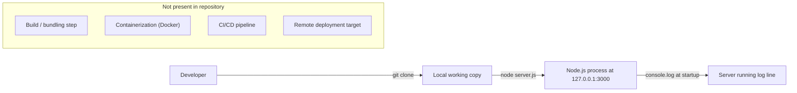
```mermaid
flowchart LR
    Dev["Developer"] -->|"git clone"| Repo["Local working copy"]
    Repo -->|"node server.js"| Run["Node.js process at 127.0.0.1:3000"]
    Run -->|"console.log at startup"| Log["Server running log line"]
    subgraph Absent["Not present in repository"]
        Build["Build / bundling step"]
        Container["Containerization (Docker)"]
        Pipeline["CI/CD pipeline"]
        Deploy["Remote deployment target"]
    end
```

### 3.6.1 Development Tooling

**Package manager — npm.** The presence of `package.json` and `package-lock.json` establishes npm as the package manager. The `lockfileVersion: 3` marker indicates the lockfile is produced by a modern npm (v7 or later; §3.3.2). No packages are installed, so `npm install`/`npm ci` resolve an empty tree.

**Version control — Git / GitHub.** The repository is a real Git repository with a single commit (`be2be9b "Add files via upload"`) and an `origin` remote hosted on GitHub. Two branches exist locally and remotely: `main` and `QA-08-win-VM-branch`. The single-commit history means there is no incremental change history to reason about (§2.4).

**Runtime — Node.js.** Executing the service requires a Node.js runtime to interpret `server.js`. No version is pinned anywhere in the repository (no `engines`, `.nvmrc`, or `.node-version`), so the runtime version is environment-defined rather than a repository constraint.

**Absent developer tooling.** There are no code-quality or editor-configuration tools: no ESLint, Prettier, `.editorconfig`, `tsconfig.json`, or Git hooks. There is no TypeScript in the repository — the JavaScript is plain CommonJS.

### 3.6.2 Build System

There is **no build system**. `package.json` defines a single script — `test` — whose body is `echo "Error: no test specified" && exit 1`, so it fails by design and provides no automated verification. There is **no `start`, `build`, `prepare`, or bundling script**, and no bundler/transpiler (no Webpack, Rollup, Vite, Babel, or `tsc`). The runnable component needs no build: it is executed directly as source with `node server.js`. The Java stub likewise has no build descriptor (no Maven `pom.xml` or Gradle), so it is never compiled.

### 3.6.3 Containerization

There is **no containerization**. The repository contains no `Dockerfile`, no `docker-compose.yml`/`compose.yaml`, and no `.dockerignore`. The service is intended to run directly on a host Node.js runtime, not inside a container image.

### 3.6.4 CI/CD and Deployment

There is **no CI/CD tooling and no deployment automation**. There is no `.github/workflows/` directory (despite the repository being hosted on GitHub), no `Jenkinsfile`, no `.gitlab-ci.yml`, and no other pipeline configuration; there is likewise no Infrastructure-as-Code (no Terraform or CloudFormation). Consequently, regressions are detectable only by manually running the server (§2.4).

**Deployment model.** The effective "deployment" is local execution: start `node server.js` and issue requests to `127.0.0.1:3000`. Because the server binds to the loopback interface with a hard-coded host/port, it is **not exposed to any external network** and is unsuitable for remote or production deployment as written (§1.3.2).

**Security implications.** The lack of CI/CD means there is **no automated dependency scanning, secret scanning, SAST, or gated build** — although the zero-dependency, zero-secret, loopback-only posture limits what such scanning would find. The absence of containerization avoids base-image CVE exposure but also means no runtime isolation or resource limits are applied to the process. The intentionally failing `test` script provides no safety net against regressions, so any change must be verified manually.


## 3.7 References

The following repository artifacts, version-control metadata, cross-referenced specification sections, and external sources were examined as evidence for this Technology Stack section.

### 3.7.1 Repository Files and Folders

- `README.md` — Established the repository identity (`hao-backprop-test`), the "Do not touch!" notice, and the "backprop integration" stated purpose.
- `package.json` — npm manifest: package `hello_world` v1.0.0, MIT license, author `hxu`, `main` → `index.js` (non-existent), placeholder `test` script, and the absence of any `dependencies`/`devDependencies`/`engines` fields.
- `package-lock.json` — Confirmed `lockfileVersion: 3`, root-only (`""`) package entry, and zero third-party locked packages.
- `server.js` — The sole runnable component: CommonJS Node.js `http` server bound to `127.0.0.1:3000` returning a fixed `200 / text/plain / Hello, World!` response using only the Node core `http` module.
- `server - Copy.js` — Byte-identical duplicate of `server.js` (MD5 `05576d40…`).
- `LoginTest.java` — Java stub: package `com.blitzyTest`, class `LoginTest` with a `main` body of the bare token `Web` (non-compiling); confirmed no Java build tooling.
- `LoginTest - Copy.java` — Byte-identical duplicate of `LoginTest.java` (MD5 `f11f7160…`).
- `industry.csv` — Single-column `Industry` taxonomy of 43 values ending in `Other`; established the CSV data format.
- `industry - Copy.csv` — Byte-identical duplicate of `industry.csv` (MD5 `15ce1b4d…`).
- `100Pages.pdf` — Binary sample verified as PDF 1.7 (`%PDF-1.7`), ~9.46 MB; storage/asset evidence.
- `100Pages - Copy.pdf` — Byte-identical duplicate of `100Pages.pdf`.
- `demo.jpg` — Binary sample verified as JPEG with EXIF (`FF D8 FF E1`), 4K-resolution, ~2.12 MB.
- `demo - Copy.jpg` — Byte-identical duplicate of `demo.jpg`.
- `sample.doc` — Binary sample verified as OLE2 Compound File / legacy MS Word `.doc` (`D0 CF 11 E0`), 96 KB.
- `sample - Copy.doc` — Byte-identical duplicate of `sample.doc`.
- `test.py.txt`, `test.py - Copy.txt`, `test.txt.txt` — Empty (0-byte) placeholder files; confirmed the absence of Python source.
- Repository root (flat, no subdirectories) — Established the complete 18-file inventory and the lack of any build/CI/container/IaC/config files.

### 3.7.2 Version Control Metadata

- `.git/` — Confirmed a real Git repository with a single commit (`be2be9b "Add files via upload"`), branches `main` and `QA-08-win-VM-branch`, and an `origin` remote hosted on GitHub. The access token embedded in the untracked local `.git/config` was noted for the security discussion but deliberately not reproduced.

### 3.7.3 Cross-Referenced Specification Sections

- §1.1 Executive Summary — Confirmed the mixed-language test-fixture characterization, 18-file inventory, zero-dependency posture, and binary asset roles.
- §1.2 System Overview — Confirmed component/technology mapping, the Node core `http` approach, and the unwired nature of the static artifacts.
- §1.3 Scope — Confirmed in-scope runtime requirements (Node.js + core `http`, port 3000) and the out-of-scope items (databases, security, CI/CD, containerization, Java compilation).
- §2.4 Implementation Considerations — Confirmed technical constraints, the `lockfileVersion 3`/modern-npm note, the intentionally failing `test` script, and binary format/size details.

### 3.7.4 External Sources

- [web] npm Docs — `package-lock.json` (docs.npmjs.com) — Confirmed that `lockfileVersion: 3` is the format used by npm v7+ without backwards-compatibility affordances.
- [web] npm community references (abrahamberg.com; dev.to) — Confirmed the version mapping: lockfileVersion 1 = npm v5/v6, 2 = npm v7/v8, 3 = default for npm v9+.


# 4. Process Flowchart

## 4.1 System Workflows

The `hao-backprop-test` repository exposes exactly one executable capability — the **Static HTTP Response Service** implemented in `server.js` (feature **F-001**, per §2.1 Feature Catalog). Consequently, the system's process flows reduce to two runtime workflows: a one-time **server bootstrap/bind** sequence, and a repeating **request → response** cycle that returns a fixed payload for every request. All other artifacts — `industry.csv` (F-003), the PDF/JPEG/DOC corpus (F-004), `LoginTest.java`, the empty `.txt` placeholders, and the six `- Copy` duplicates — are inert and participate in no runtime flow, as established in §2.3 Feature Relationships ("the artifacts are not integrated with one another; each stands alone"). There is no multi-step business transaction, no cross-service orchestration, and no end-user business process encoded anywhere in the repository.

The high-level workflow below summarizes the complete runtime picture: an operator boots the process, the server binds to the loopback interface and idles, and a local HTTP client drives the only repeating cycle. The inert artifacts are shown alongside to make explicit that no code path connects them to the running service.

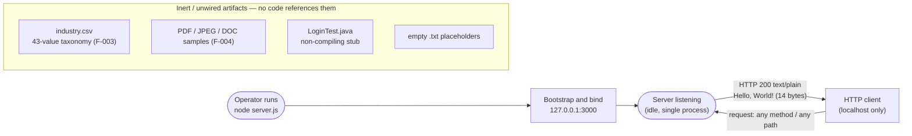
```mermaid
flowchart LR
    Operator(["Operator runs<br/>node server.js"]) --> Bootstrap["Bootstrap and bind<br/>127.0.0.1:3000"]
    Bootstrap --> Serving(["Server listening<br/>(idle, single process)"])
    ClientNode["HTTP client<br/>(localhost only)"] -->|"request: any method / any path"| Serving
    Serving -->|"HTTP 200 text/plain<br/>Hello, World! (14 bytes)"| ClientNode
    subgraph Inert["Inert / unwired artifacts — no code references them"]
        CSV["industry.csv<br/>43-value taxonomy (F-003)"]
        Docs["PDF / JPEG / DOC samples (F-004)"]
        JavaStub["LoginTest.java<br/>non-compiling stub"]
        Empties["empty .txt placeholders"]
    end
```

**Timing and SLA considerations.** No service-level agreements, latency budgets, throughput targets, or uptime objectives exist anywhere in the repository (confirmed in §1.2.3 Success Criteria and §2.2 Functional Requirements). The only observable timing constant is an *emergent* Node.js default surfaced during runtime verification — the response carries `Connection: keep-alive` and `Keep-Alive: timeout=5`, i.e. an idle keep-alive socket timeout of five seconds. This value is not set by the application code (which only assigns `statusCode = 200` and the `Content-Type` header); it is a runtime default and is documented here as an observation, not a requirement.

### 4.1.1 Core Business Processes

**End-to-end user journey.** The only "user" is a developer/operator or an automated tool; no end-user roles exist (per §2.1.2). The journey is: (1) the operator starts the process with `node server.js` — note there is no `npm start` binding and the manifest's `main` target `index.js` is absent, so the server must be launched by naming `server.js` directly (§2.2.2); (2) the server binds to `127.0.0.1:3000` and prints the startup line `Server running at http://127.0.0.1:3000/` (requirement **F-001-RQ-001**); (3) thereafter any local HTTP client issues a request and receives the fixed `Hello, World!` response (requirement **F-001-RQ-002**). The journey has no login, no session, no navigation, and no multi-step form — it is a single request/response exchange.

**System interactions.** The system is single-process and single-tier. `server.js` uses only the Node.js core `http` module (no framework), which sits atop the operating system's TCP stack bound to the loopback interface. There are no downstream databases, caches, message queues, or external services (§2.3.4 Common Services: "no configuration service, persistence layer, cache, message queue, authentication/authorization service, API gateway, or centralized logging"). The complete interaction chain is: HTTP client ↔ OS TCP (127.0.0.1) ↔ Node `http` server ↔ response callback.

**Decision points.** The application request path contains *no conditional branching*: the handler unconditionally sets the status code and content type and ends the response with a hard-coded literal, and the `req` object is never inspected. This was verified empirically — `GET /`, `POST /random/path` (with a body), and `DELETE /xyz` all returned an identical `200` `text/plain` `Hello, World!` response. The only genuine decision in the entire system is made by the runtime during bind: *is TCP `127.0.0.1:3000` available?* — if yes, the server transitions to listening and logs; if no, it fails (see error paths below).

**Error handling paths.** `server.js` contains no `try/catch` and registers no `'error'` event listener. Within the request path, no code can throw (the request is never read and the response body is a static literal), so there is no per-request error branch. The single observable failure mode is a **bind failure**: starting the server when port `3000` is already in use emits an unhandled `'error'` event (`EADDRINUSE: address already in use 127.0.0.1:3000`); because there is no listener, Node re-throws and the process terminates. This behavior was reproduced directly (a second instance crashed on startup) and is detailed further in §4.3.2 Error Handling.

The following swim-lane flowchart shows the full runtime across four actors/boundaries — the operator (CLI), the Node.js runtime, the HTTP server (F-001), and the HTTP client — with the bind decision diamond and both terminal states.

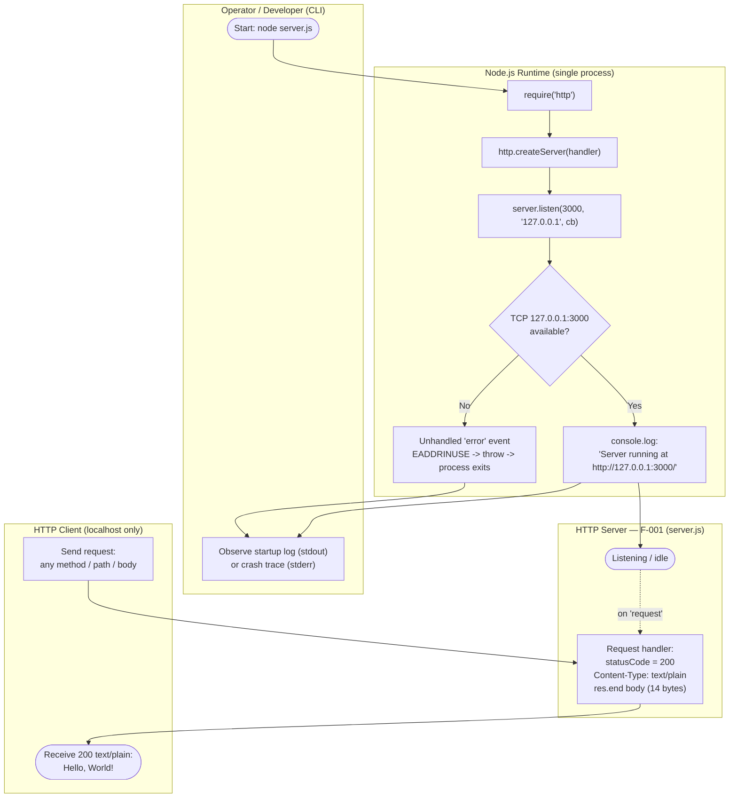
```mermaid
flowchart TB
    subgraph LaneOp["Operator / Developer (CLI)"]
        Start(["Start: node server.js"])
        SeeLog["Observe startup log (stdout)<br/>or crash trace (stderr)"]
    end
    subgraph LaneRT["Node.js Runtime (single process)"]
        ReqHttp["require('http')"]
        Create["http.createServer(handler)"]
        Listen["server.listen(3000, '127.0.0.1', cb)"]
        PortFree{"TCP 127.0.0.1:3000<br/>available?"}
        LogOk["console.log:<br/>'Server running at http://127.0.0.1:3000/'"]
        Crash["Unhandled 'error' event<br/>EADDRINUSE -> throw -> process exits"]
    end
    subgraph LaneSrv["HTTP Server — F-001 (server.js)"]
        Ready(["Listening / idle"])
        Handler["Request handler:<br/>statusCode = 200<br/>Content-Type: text/plain<br/>res.end body (14 bytes)"]
    end
    subgraph LaneClient["HTTP Client (localhost only)"]
        Send["Send request:<br/>any method / path / body"]
        Recv(["Receive 200 text/plain:<br/>Hello, World!"])
    end
    Start --> ReqHttp --> Create --> Listen --> PortFree
    PortFree -->|No| Crash --> SeeLog
    PortFree -->|Yes| LogOk --> SeeLog
    LogOk --> Ready
    Send --> Handler
    Ready -.->|on 'request'| Handler
    Handler --> Recv
```

The sequence diagram below adds message-level detail for both the bootstrap alternatives and the request/response exchange, including the emergent response headers observed at runtime.

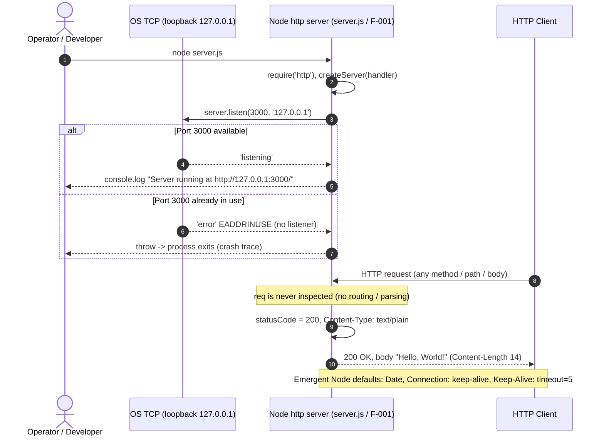
```mermaid
sequenceDiagram
    autonumber
    actor Dev as Operator / Developer
    participant OS as OS TCP (loopback 127.0.0.1)
    participant Node as Node http server (server.js / F-001)
    participant Client as HTTP Client

    Dev->>Node: node server.js
    Node->>Node: require('http'), createServer(handler)
    Node->>OS: server.listen(3000, '127.0.0.1')
    alt Port 3000 available
        OS-->>Node: 'listening'
        Node-->>Dev: console.log "Server running at http://127.0.0.1:3000/"
    else Port 3000 already in use
        OS-->>Node: 'error' EADDRINUSE (no listener)
        Node-->>Dev: throw -> process exits (crash trace)
    end
    Client->>Node: HTTP request (any method / path / body)
    Note over Node: req is never inspected (no routing / parsing)
    Node->>Node: statusCode = 200, Content-Type: text/plain
    Node-->>Client: 200 OK, body "Hello, World!" (Content-Length 14)
    Note over Node,Client: Emergent Node defaults: Date, Connection: keep-alive, Keep-Alive: timeout=5
```

### 4.1.2 Integration Workflows

**Data flow between systems.** There is none across a system boundary. The service is fully self-contained and binds to the loopback interface only, so it is not reachable off-host (§1.2.1, §2.2.1). The only data movement is the local client↔server socket carrying the fixed 14-byte response. The static datasets are never read: `industry.csv` (F-003) and the document corpus (F-004) are "unwired" — no code imports, parses, or serves them (§2.3.2 Integration Points; §2.3.3 Shared Components). There is therefore no ETL, no data pipeline, and no producer/consumer data exchange.

**API interactions.** The system exposes a single inbound HTTP endpoint on `127.0.0.1:3000`, which §2.3.2 identifies as "the only invokable interface the system exposes." It performs no content negotiation and no routing, and — critically — issues *no outbound API calls*. The "backprop integration" named in `README.md` is a stated intent only: there is no API client, SDK, webhook, credential, environment configuration, or network egress in the code (§2.3.2). The endpoint is effectively a passive, deterministic probe target rather than a participant in any request-orchestration chain.

**Event processing flows.** The runtime is event-driven through Node's single-threaded event loop. The `http.Server` instance created in `server.js` is capable of emitting three relevant events, of which the code handles two:

- `'listening'` → handled by the `server.listen(...)` callback, which invokes `console.log` with the startup line.
- `'request'` → handled by the `createServer` callback, which produces the fixed `200 Hello, World!` response.
- `'error'` → **not handled** (no listener registered); an emitted error (e.g. `EADDRINUSE`) is therefore unhandled and terminates the process.

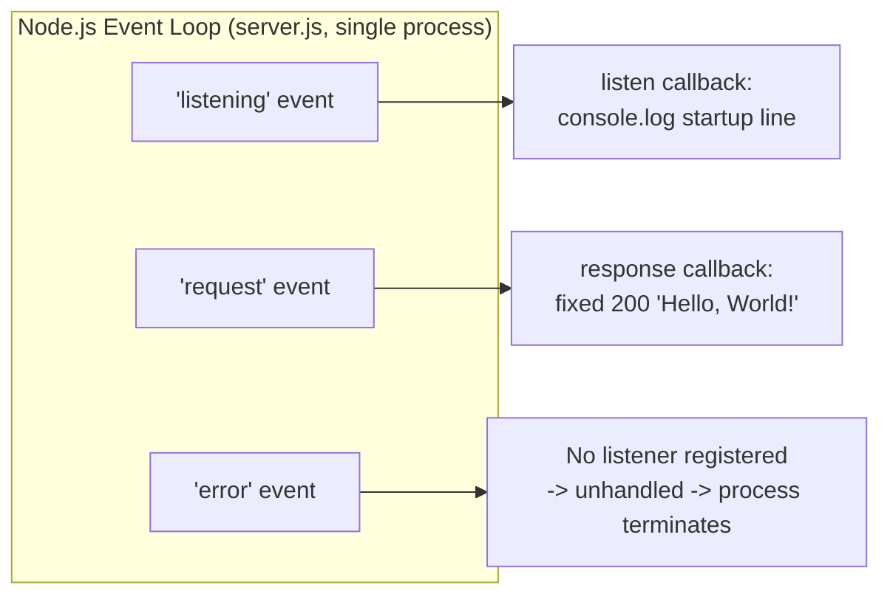
```mermaid
flowchart LR
    subgraph Loop["Node.js Event Loop (server.js, single process)"]
        Listening["'listening' event"]
        Request["'request' event"]
        ErrorEvt["'error' event"]
    end
    Listening --> LogCb["listen callback:<br/>console.log startup line"]
    Request --> RespCb["response callback:<br/>fixed 200 'Hello, World!'"]
    ErrorEvt --> NoListener["No listener registered<br/>-> unhandled -> process terminates"]
```

**Batch processing sequences.** There are none. The repository contains no scheduler, cron entry, queue consumer, background worker, or batch/ETL script. There is no build step, and the only npm script (`test`) is a placeholder that deliberately fails (`echo "Error: no test specified" && exit 1`), per §2.2.2. No recurring or bulk processing sequence exists to document.


## 4.2 Detailed Process Flows and Validation Rules

This sub-section decomposes the system's only feature with a runtime process flow — the Static HTTP Response Service (**F-001**) — into two detailed flows: **server initialization** (§4.2.1) and **HTTP request handling** (§4.2.2). For each flow, start/end points, process steps, decision diamonds, the system boundary, user touchpoints, error states, and timing are documented. §4.2.3 then records the validation rules, authorization checkpoints, and compliance checks that apply at each step — most of which are, by direct observation, absent in this test fixture. Features F-002 (package metadata), F-003 (industry taxonomy) and F-004 (document corpus) have no runtime process flow — F-002 is a declarative manifest and F-003/F-004 are unwired static assets — so no flowcharts are produced for them.

### 4.2.1 Server Initialization (Bootstrap) Flow

This flow realizes requirements **F-001-RQ-001** (instantiate the server and listen on `127.0.0.1:3000`, emitting a startup log) and **F-001-RQ-003** (run using only Node.js built-ins, no third-party packages, no build step). It runs exactly once per process launch.

| Aspect | Detail (observed in `server.js`) |
| --- | --- |
| Start point | Operator executes `node server.js` at the CLI (no `npm start`; no CLI args or env vars read) |
| Process steps | `require('http')` → define `hostname`/`port` constants → `http.createServer(handler)` → `server.listen(port, hostname, cb)` |
| Decision diamond | Does the bind to `127.0.0.1:3000` succeed? |
| System boundary | Node.js process ↔ OS TCP stack on the loopback interface only |
| User touchpoint | Single stdout line: `Server running at http://127.0.0.1:3000/` |
| End states | Success → **LISTENING (idle)**; failure → **PROCESS EXIT (crash)** |
| Error state | Bind failure emits an unhandled `'error'` event (e.g. `EADDRINUSE`) → process terminates |

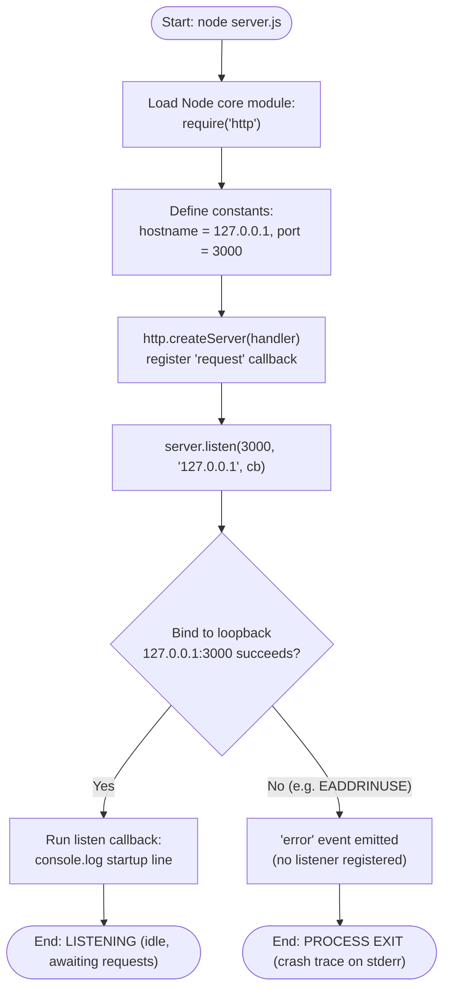
```mermaid
flowchart TD
    A(["Start: node server.js"]) --> B["Load Node core module:<br/>require('http')"]
    B --> C["Define constants:<br/>hostname = 127.0.0.1, port = 3000"]
    C --> D["http.createServer(handler)<br/>register 'request' callback"]
    D --> E["server.listen(3000, '127.0.0.1', cb)"]
    E --> F{"Bind to loopback<br/>127.0.0.1:3000 succeeds?"}
    F -->|Yes| G["Run listen callback:<br/>console.log startup line"]
    G --> H(["End: LISTENING (idle, awaiting requests)"])
    F -->|"No (e.g. EADDRINUSE)"| I["'error' event emitted<br/>(no listener registered)"]
    I --> J(["End: PROCESS EXIT (crash trace on stderr)"])
```

**Recovery path.** No automatic recovery is implemented — there is no retry, no port fallback, and no supervisor/process manager in the repository. Recovery is manual: the operator frees port `3000` (or stops the conflicting process) and re-runs `node server.js`. This is discussed further in §4.3.2.

### 4.2.2 HTTP Request Handling Flow

This flow realizes requirement **F-001-RQ-002**: for every request, respond `200` with `Content-Type: text/plain` and body `Hello, World!\n` (14 bytes), regardless of method, path, headers, or body. It repeats for the life of the process and is fully deterministic.

| Aspect | Detail (observed / verified at runtime) |
| --- | --- |
| Start point | An HTTP request arrives on `127.0.0.1:3000` (user touchpoint: any local HTTP client) |
| Process steps | Node parses the request → invokes the `request` handler → sets `statusCode` and `Content-Type` → `res.end(body)` |
| Decision diamond | Does the handler inspect `req` (method/path/headers/body)? — always **No** |
| System boundary | Loopback socket only; the client must be on the local host |
| Error states | None reachable in the handler (see note below) |
| Timing | No per-request latency/throughput SLA exists; the only timing artifact is the emergent idle `Keep-Alive: timeout=5` (5 s) |
| End point | HTTP `200 text/plain` response `Hello, World!` delivered to the client |

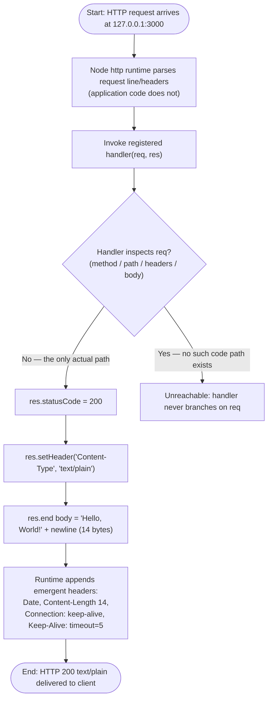
```mermaid
flowchart TD
    A(["Start: HTTP request arrives at 127.0.0.1:3000"]) --> B["Node http runtime parses request line/headers<br/>(application code does not)"]
    B --> C["Invoke registered handler(req, res)"]
    C --> D{"Handler inspects req?<br/>(method / path / headers / body)"}
    D -->|"No — the only actual path"| E["res.statusCode = 200"]
    D -->|"Yes — no such code path exists"| X["Unreachable: handler never branches on req"]
    E --> F["res.setHeader('Content-Type', 'text/plain')"]
    F --> G["res.end body = 'Hello, World!' + newline (14 bytes)"]
    G --> H["Runtime appends emergent headers:<br/>Date, Content-Length 14,<br/>Connection: keep-alive, Keep-Alive: timeout=5"]
    H --> I(["End: HTTP 200 text/plain delivered to client"])
```

**Error states within the request path.** None are reachable. Because the handler never reads `req` and writes a constant literal, there is no parsing, lookup, or I/O that could throw; consequently there is no `4xx`/`5xx` branch, no timeout branch, and no error-response path. Malformed requests are handled by the Node `http` runtime beneath the application (not by repository code). This absence of an application error branch is why §4.2.2 shows a single terminal state.

### 4.2.3 Validation Rules, Authorization, and Compliance Checkpoints

The prompt calls for business rules, data validation, authorization checkpoints, and regulatory-compliance checks at each step. The table below maps every such checkpoint to its actual presence in the code. Two facts apply globally (per §2.2): the repository defines **no performance criteria** and implements **no security/compliance controls**; the entries below record where that manifests in the flows.

| Checkpoint (per step) | Present? | Observed behavior / evidence |
| --- | --- | --- |
| Business rule — host/port are fixed constants | Yes (implicit) | `hostname`/`port` are hard-coded (`127.0.0.1`, `3000`) and not configurable; no env vars (F-001-RQ-001 validation) |
| Business rule — exactly one fixed response | Yes | One response for all requests; no routing or content negotiation (F-001-RQ-002 validation) |
| Data validation — request parsing/validation | No | `req` is never read; "no request parsing means no body/query injection surface" (F-001-RQ-002 validation) |
| Authorization / authentication checkpoint | No | No auth, sessions, tokens, or API keys anywhere (§2.2 global Security note; §1.3.2) |
| Transport security (TLS/HTTPS) | No | Plain HTTP; binds to loopback only, so not externally reachable (F-001-RQ-001 security observation) |
| Regulatory / compliance check | No | No compliance controls, data-handling rules, or audit logging (§1.3.2; §2.2.1) |
| Manifest validation (F-002) | Declarative only | `package.json`/`package-lock.json` must be valid JSON with consistent identity (F-002-RQ-001/RQ-002); enforced by npm tooling, not runtime code |
| Data-asset validation (F-003/F-004) | No | `industry.csv` and the binary corpus are unwired; "no code validates the file" (F-003-RQ-001, F-004-RQ-001 validation) |

The single genuine validation is structural and external: npm can verify that the manifest and lockfile parse and agree (F-002). Within the running service there are **no** authorization checkpoints, input-validation gates, or regulatory checks to depict as decision diamonds — the request path is unconditional, which is why the flowchart in §4.2.2 contains only one real decision (whether `req` is inspected, resolving to "No").

## 4.3 Technical Implementation

This sub-section documents the state-management and error-handling characteristics that underpin the process flows in §4.1 and §4.2. Both are minimal by construction: the Static HTTP Response Service (F-001) is a stateless, dependency-free process, so the discussion focuses on what the code actually does and explicitly records the mechanisms that are absent.

### 4.3.1 State Management

**State transitions.** The system's only stateful entity is the Node process itself, represented by the single long-lived `http.Server` object bound to the `server` constant in `server.js`. Its lifecycle is a simple linear progression: **Not started → Initializing → Listening → Terminated** (with an alternate **Initializing → Terminated** edge on a bind failure). These transitions are depicted formally in §4.4 State Transition Diagrams. There is no per-request state: the request handler is stateless, holds no session, and retains no variables between invocations, so every request is processed identically and independently.

**Data persistence points, caching, and transaction boundaries.** There are none of any kind. The table below records each concern against the observed implementation.

| Concern | Observed implementation (evidence) |
| --- | --- |
| Process/runtime state | One in-memory `http.Server` object; no external state store (`server.js`) |
| Per-request state | None — the handler is stateless; nothing persists between requests |
| Data persistence points | None — no database, no file writes, no session/store; the response body is a hard-coded string literal (§2.3.4: no persistence layer) |
| Caching requirements | None — the application sets no `Cache-Control`/`ETag` headers and maintains no in-memory or external cache (only `Content-Type` is set in code) |
| Transaction boundaries | None — each request is independent, idempotent, and side-effect-free; there is no multi-step commit, rollback, or atomic operation |

Because F-002 is a declarative manifest and F-003/F-004 are unwired static assets, they introduce no runtime state, persistence, caching, or transactions either. The npm lockfile (`package-lock.json`, `lockfileVersion` 3) provides a *deterministic dependency closure* — a form of build-time state — but that closure is empty (zero third-party dependencies), so it has no runtime effect.

### 4.3.2 Error Handling

The repository implements no dedicated error-handling code — there is no `try/catch`, no `'error'` event listener, no logging framework, and no supervisor. The table summarizes each requested facet; the flowchart then traces the one error path that actually exists (a startup bind failure).

| Facet | Status | Evidence / behavior |
| --- | --- | --- |
| Retry mechanism | Absent | No retry loop, backoff, or reconnection logic in `server.js` |
| Fallback process | Absent | No alternate port, degraded mode, or alternative response |
| Error notification flow | Default runtime only | An unhandled `'error'` event prints a stack trace to stderr and exits; no logging framework, metrics, alerting, or external notification exists |
| Recovery procedure | Manual only | Operator frees port `3000` and re-runs `node server.js`; there is no process manager, restart policy, or health check in the repository |
| Request-path errors | Not reachable | The handler never reads `req` and writes a constant literal, so no exception can arise during request handling |

**Error notification flow and recovery — the bind-failure path.** The single observable error path was reproduced directly: launching a second instance while port `3000` was occupied caused the process to crash with `Error: listen EADDRINUSE: address already in use 127.0.0.1:3000`. Because no `'error'` listener is registered on the server, Node applies its default behavior — the event is re-thrown as an uncaught exception, a stack trace is written to stderr, and the process exits with a non-zero code. Recovery is entirely manual.

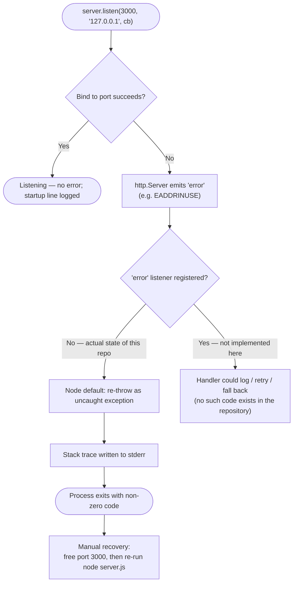
```mermaid
flowchart TD
    A(["server.listen(3000, '127.0.0.1', cb)"]) --> B{"Bind to port succeeds?"}
    B -->|Yes| C(["Listening — no error; startup line logged"])
    B -->|No| D["http.Server emits 'error'<br/>(e.g. EADDRINUSE)"]
    D --> E{"'error' listener registered?"}
    E -->|"No — actual state of this repo"| F["Node default: re-throw as uncaught exception"]
    F --> G["Stack trace written to stderr"]
    G --> H(["Process exits with non-zero code"])
    H --> K["Manual recovery:<br/>free port 3000, then re-run node server.js"]
    E -->|"Yes — not implemented here"| I["Handler could log / retry / fall back<br/>(no such code exists in the repository)"]
```

**Notification and monitoring absence.** Beyond the single startup `console.log` (a success signal, not an error channel), there is no structured logging, no error log, no metrics endpoint, and no integration with any monitoring or alerting service (§2.3.4). An operator learns of a failure only by observing the crash trace on the console where `node server.js` was launched.

## 4.4 State Transition Diagrams

This sub-section formalizes the state transitions summarized in §4.3.1. Two state machines are relevant: the **server process lifecycle** (long-lived, one instance per launch) and the **request/connection lifecycle** (transient, per socket). No other stateful entity exists, because the handler is stateless and no data is persisted.

### 4.4.1 Server Process Lifecycle

The process moves from initialization to a stable `Listening` state, where it remains — handling requests as self-transitions — until it is stopped by the operator or crashes on a bind failure. The `Initializing → Terminated` edge is the observed `EADDRINUSE` crash path from §4.2.1 and §4.3.2.

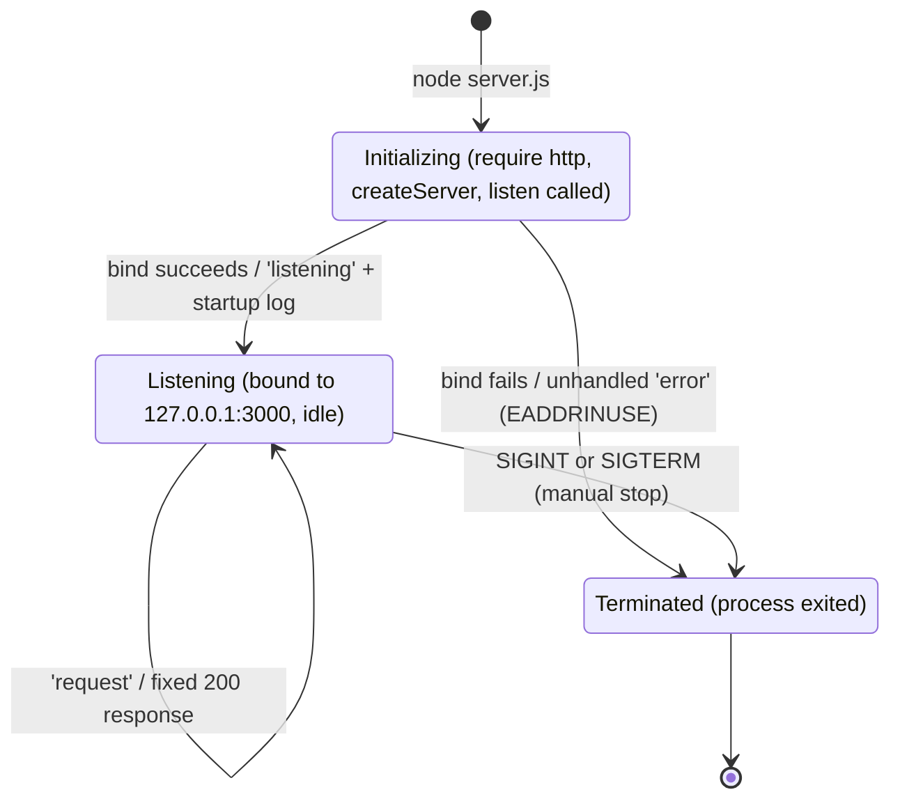
```mermaid
stateDiagram-v2
    [*] --> Initializing: node server.js
    Initializing: Initializing (require http, createServer, listen called)
    Listening: Listening (bound to 127.0.0.1:3000, idle)
    Terminated: Terminated (process exited)
    Initializing --> Listening: bind succeeds / 'listening' + startup log
    Initializing --> Terminated: bind fails / unhandled 'error' (EADDRINUSE)
    Listening --> Listening: 'request' / fixed 200 response
    Listening --> Terminated: SIGINT or SIGTERM (manual stop)
    Terminated --> [*]
```

The `Listening → Listening` self-transition captures the fact that request handling does **not** change process state — the server returns to the same idle `Listening` state after every response. There is no `Paused`, `Draining`, or `Reloading` state, because no such lifecycle handling (graceful shutdown, config reload, connection draining) is implemented.

### 4.4.2 Request / Connection Lifecycle

A single request progresses deterministically from receipt to a sent response. Because the connection uses HTTP keep-alive (an emergent Node default, `Keep-Alive: timeout=5`), the socket can remain open and serve subsequent requests, or close after five seconds of inactivity. This diagram depicts the *transient* per-connection progression; it retains no application state between requests.

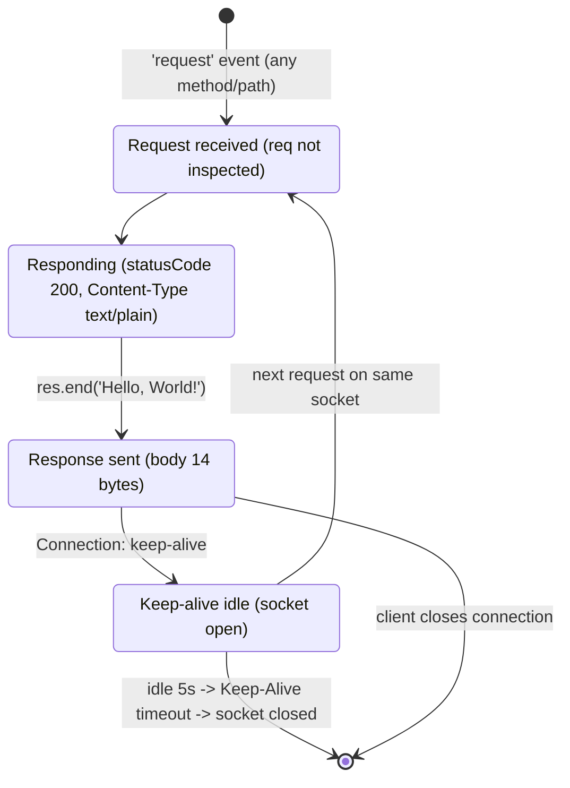
```mermaid
stateDiagram-v2
    [*] --> RequestReceived: 'request' event (any method/path)
    RequestReceived: Request received (req not inspected)
    Responding: Responding (statusCode 200, Content-Type text/plain)
    ResponseSent: Response sent (body 14 bytes)
    KeepAliveIdle: Keep-alive idle (socket open)
    RequestReceived --> Responding
    Responding --> ResponseSent: res.end('Hello, World!')
    ResponseSent --> KeepAliveIdle: Connection: keep-alive
    KeepAliveIdle --> RequestReceived: next request on same socket
    KeepAliveIdle --> [*]: idle 5s -> Keep-Alive timeout -> socket closed
    ResponseSent --> [*]: client closes connection
```

Every request traverses the identical `RequestReceived → Responding → ResponseSent` path with no branches, mirroring the unconditional flow in §4.2.2. There is no `Validating`, `Authorizing`, `Error`, or `Retrying` state, consistent with the absence of validation, authorization, and error branches documented in §4.2.3 and §4.3.2.

## 4.5 References

**Repository files examined for this section**

- `server.js` - The sole runtime implementation (F-001); established the full bootstrap sequence (`require('http')`, `hostname`/`port` constants, `createServer`, `server.listen`) and the unconditional request handler (`statusCode = 200`, `Content-Type: text/plain`, `res.end('Hello, World!\n')`). All flowcharts, the sequence diagram, and both state machines derive from this file.
- `server - Copy.js` - Confirmed byte-identical to `server.js` (verified via `diff`); establishes that the duplicate introduces no additional or divergent flow.
- `package.json` - Established launch semantics: `main` targets a non-existent `index.js`, there is no `start` script, and the only `test` script fails by design — supporting the "launch via `node server.js`" journey in §4.1.1.
- `package-lock.json` - Established `lockfileVersion` 3 with zero third-party dependencies, confirming the empty (build-time) dependency closure noted in §4.3.1.
- `industry.csv` - The unwired F-003 taxonomy (header `Industry` + 43 values ending `Other`); cited as an inert artifact with no data-flow (§4.1.2) and no validation (§4.2.3).
- `LoginTest.java` - Non-compiling `com.blitzyTest.LoginTest` stub; cited as an inert artifact absent from all runtime flows.
- `README.md` - Established project identity (`hao-backprop-test`) and that the "backprop integration" is a stated intent only, not implemented (§4.1.2).
- `test.py.txt`, `test.py - Copy.txt`, `test.txt.txt` - Confirmed 0-byte empty placeholders; cited as inert artifacts.
- `100Pages.pdf`, `demo.jpg`, `sample.doc` (and their `- Copy` twins) - The unwired F-004 binary corpus; cited as inert static assets with no runtime flow.

**Runtime evidence gathered directly**

- Executed `node server.js` (Node.js v22.23.1) and probed it — verified the startup log, the identical `200 text/plain` response to `GET`/`POST`/`DELETE` on arbitrary paths (Content-Length 14; emergent headers `Date`, `Connection: keep-alive`, `Keep-Alive: timeout=5`), and reproduced the `EADDRINUSE` crash on a second concurrent instance. This grounds the timing note (§4.1), the request flow (§4.2.2), and the error path (§4.3.2, §4.4.1).

**Cross-referenced Technical Specification sections**

- `1.2 System Overview` - Confirmed the single-service architecture, loopback-only reach, and absence of formal success criteria/KPIs/SLAs (§1.2.1–§1.2.3).
- `2.1 Feature Catalog` - Source of the feature identifiers F-001–F-004 and the "unwired" characterization of static assets (§2.1.2).
- `2.2 Functional Requirements` - Source of requirement IDs F-001-RQ-001/002/003 and the per-feature Validation Rules mapped in §4.2.3; confirmed no performance criteria and no security/compliance controls.
- `2.3 Feature Relationships` - Confirmed the single inbound HTTP integration point, the absence of inter-feature and external integration, and the absence of common services (persistence, cache, queue, auth, gateway, centralized logging) — §2.3.2–§2.3.4.

# 5. System Architecture

## 5.1 High-Level Architecture

The `hao-backprop-test` repository realizes a deliberately minimal architecture: a single Node.js process that exposes exactly one static HTTP endpoint on the loopback interface, with no third-party dependencies, no persistence, and no external integrations. This section documents that architecture as it is actually implemented — every claim is grounded in the repository source — and states plainly where conventional architectural elements (multiple tiers, data stores, integrations, service-level agreements) are absent. It reuses the feature identifiers established in §2.1 Feature Catalog: **F-001** the Static HTTP Response Service (`server.js`), **F-002** the NPM package metadata, **F-003** the industry taxonomy dataset, and **F-004** the sample document corpus.

### 5.1.1 System Overview

**Overall architecture style and rationale.** The system is a **single-process, single-tier (one-tier) monolith** implemented as a single source file. `server.js` uses only the Node.js core `http` module to create one HTTP server, binds it to host `127.0.0.1` and port `3000`, and responds to every request with a hard-coded HTTP `200` / `text/plain` / `Hello, World!` payload. This is the canonical Node.js "Hello World" pattern with no web framework, no routing, and no request parsing. The rationale is dictated by the repository's declared purpose: `README.md` states it is a "test project for backprop integration. Do not touch!", so it is an explicitly declared **test fixture** rather than a product. A fixture optimizes for deterministic behavior, trivial startup, and zero setup rather than for extensibility or scale; consequently a raw core-`http` server returning a constant response is sufficient, and (per §3.2) adopting a web framework would add a dependency tree and attack surface without providing any capability the fixture needs.

**Key architectural principles and patterns.**

- **Zero-dependency minimalism** — the only building block is the Node.js core `http` module; `package.json`/`package-lock.json` declare no third-party packages, so `npm ci` installs nothing (§3.3).
- **Determinism** — the request object is never inspected, so the same `200 Hello, World!` response is returned for every method, path, and body (verified for `GET`, `POST`, and `DELETE` in §4.1); the request path contains no conditional branching.
- **Statelessness** — there is no per-request or cross-request state; the response body is a compile-time string literal, not data retrieved from any store (§4.3.1).
- **Self-containment** — no configuration files, environment variables, secrets, or outbound network calls exist anywhere in the code.
- **Event-driven reactor pattern** — the service runs on Node's single-threaded event loop and reacts to the server's `'listening'` and `'request'` events; the `'error'` event is deliberately left unhandled (§4.1.2).
- **CommonJS convention** — modules are loaded with `require` (there is no `"type": "module"` in the manifest), and the host and port are hard-coded constants.

**System boundaries and major interfaces.**

- **Runtime / trust boundary — the local host.** Because the server binds to `127.0.0.1`, it is reachable only from the same machine and is never exposed off-host (§1.2.1). The loopback binding is, in effect, the system's only access control.
- **Process boundary — one OS process.** The entire system is a single Node.js process; the runtime interaction chain is `HTTP client ↔ OS TCP (127.0.0.1) ↔ Node http server ↔ response callback` (§4.1.1).
- **Inbound interface — one HTTP endpoint.** The listener at `127.0.0.1:3000` is "the only invokable interface the system exposes" (§2.3.2).
- **Outbound interfaces — none.** There are no API clients, SDKs, database drivers, message-queue clients, or any other egress.
- **DevOps boundary — build-time only.** The Git host (GitHub `origin` remote, §3.4.2) is where the source is stored and cloned from; it is not a runtime dependency, and no code calls GitHub.
- **Assets outside the runtime path.** The static datasets (F-003, F-004) reside in the repository but are unwired — no code reads them, so they sit outside every runtime interface.

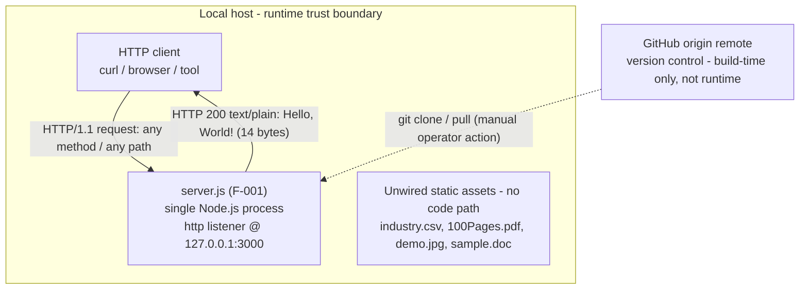
```mermaid
flowchart TB
    subgraph LocalHost["Local host - runtime trust boundary"]
        Client["HTTP client<br/>curl / browser / tool"]
        Server["server.js (F-001)<br/>single Node.js process<br/>http listener @ 127.0.0.1:3000"]
        Assets["Unwired static assets - no code path<br/>industry.csv, 100Pages.pdf, demo.jpg, sample.doc"]
    end
    GH["GitHub origin remote<br/>version control - build-time only, not runtime"]
    Client -->|"HTTP/1.1 request: any method / any path"| Server
    Server -->|"HTTP 200 text/plain: Hello, World! (14 bytes)"| Client
    GH -.->|"git clone / pull (manual operator action)"| Server
```

### 5.1.2 Core Components

The architecture comprises the four catalogued features from §2.1. Only F-001 is executable; F-002 is packaging metadata and F-003/F-004 are static, unwired assets. Because tables are limited to four columns, the component attributes are presented across two paired tables that share the *Component* key.

| Component | Primary Responsibility | Key Dependencies | Integration Points |
| --- | --- | --- | --- |
| HTTP Server Process — F-001 (`server.js`) | Bind the loopback interface and return a fixed HTTP 200 `text/plain` "Hello, World!" for every request | Node.js runtime + core `http` module; free TCP port 3000 on 127.0.0.1 | One inbound HTTP interface at 127.0.0.1:3000; no outbound calls |
| NPM Package Manifest & Lockfile — F-002 (`package.json`, `package-lock.json`) | Declare package identity (`hello_world` v1.0.0, MIT) and an empty, deterministic dependency closure | npm / Node.js tooling | None at runtime; nominal (broken) link to F-001 via `main` |
| Industry Taxonomy Dataset — F-003 (`industry.csv`) | Provide a single-column, 43-value industry category list | None (plain UTF-8 CSV) | None — unwired; not read by any code |
| Sample Document Corpus — F-004 (PDF/JPEG/DOC) | Provide multi-format binary sample assets | None | None — unwired; not read by any code |

| Component | Critical Considerations |
| --- | --- |
| HTTP Server Process — F-001 | Loopback binding makes it unreachable off-host; no routing, request parsing, middleware, or `'error'` listener; must be launched as `node server.js` (no `npm start`; the `main` target `index.js` is absent); `server - Copy.js` is a byte-identical, unwired duplicate |
| NPM Package Manifest & Lockfile — F-002 | `main` points to a non-existent `index.js`; the only script is a `test` placeholder that exits with code 1; zero declared dependencies mean `npm ci` installs nothing |
| Industry Taxonomy Dataset — F-003 | Byte-identical `industry - Copy.csv` duplicate; any consumer must supply its own CSV parser; the labels and their order are the entire asset |
| Sample Document Corpus — F-004 | Large binaries (~9.46 MB PDF 1.7, ~2.12 MB JPEG, 96 KB OLE2 DOC), each duplicated as a `- Copy`, inflating clone size; no in-repository readers |

Two further artifact groups exist in the repository but are **not** architectural components because they contribute no capability (consistent with §2.1.6): the non-compiling Java stub `LoginTest.java` (its `main` body is the bare token `Web`) and three empty, 0-byte `.txt` placeholder files. Six artifacts are additionally present as byte-identical `- Copy` duplicates, which add redundancy rather than distinct components.

### 5.1.3 Data Flow Description

**Primary data flow.** The system has a single runtime data flow: one synchronous HTTP request/response exchange over the loopback interface. A local client opens a TCP connection to `127.0.0.1:3000`; the OS delivers the bytes to the Node `http` server, which emits a `'request'` event; the handler sets the status code and `Content-Type` header and calls `res.end('Hello, World!\n')`, returning a 14-byte body to the client (§4.1.1). No other data movement occurs at runtime.

**Integration patterns and protocols.** The only protocol in effect is **HTTP/1.1 over TCP** on the loopback interface, following a **synchronous request/response** pattern. There is no message queue, publish/subscribe, streaming, batch, or event-sourcing pattern, and there are no outbound protocol clients of any kind (§4.1.2).

**Data transformation points.** There are **none**. The response body is a compile-time string literal; the request is never parsed (no query-string, header, cookie, or body deserialization), and there is no content negotiation, templating, serialization, or encoding step. Data flows through the handler unchanged because, in fact, no request data is read at all.

**Key data stores and caches.** There are **none** in the request path (§3.5, §4.3.1): no database, no in-memory or external cache, no session store, and no per-request file I/O. The only data "at rest" is the set of static, Git-tracked files (`industry.csv` and the PDF/JPEG/DOC corpus). These are outside the request path and are never read by the running service, so they function as repository content rather than as a runtime data store.

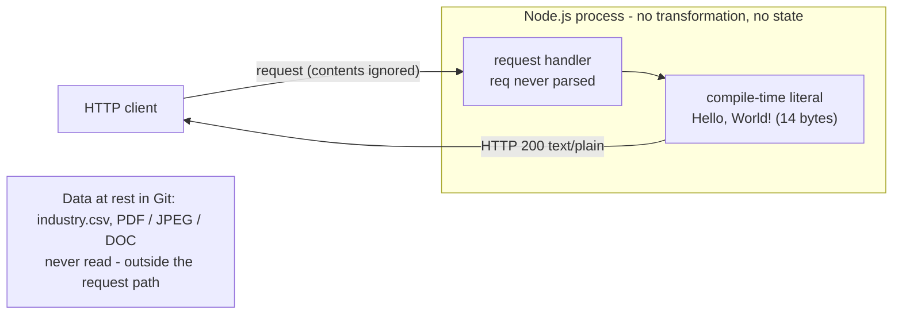
```mermaid
flowchart LR
    Client["HTTP client"] -->|"request (contents ignored)"| Handler
    subgraph Proc["Node.js process - no transformation, no state"]
        Handler["request handler<br/>req never parsed"] --> Literal["compile-time literal<br/>Hello, World! (14 bytes)"]
    end
    Literal -->|"HTTP 200 text/plain"| Client
    Unused["Data at rest in Git: industry.csv, PDF / JPEG / DOC<br/>never read - outside the request path"]
```

### 5.1.4 External Integration Points

The system implements **no external (cross-boundary, outbound) integrations**. The only invokable interface is the inbound HTTP endpoint, and it is reachable from the local host only. The "backprop integration" named in `README.md` is a **stated intent only** — no client, API contract, credential, configuration, or network egress exists to implement it (§2.3.2, §3.4.3). The single genuine external touchpoint is the Git host used to store the repository, which is a build-time/DevOps facility rather than a runtime integration. Because the prompt's five integration attributes exceed the four-column limit, they are split across two paired tables sharing the *Interface / System* key.

| Interface / System | Integration Type | Direction & Exchange Pattern | Protocol / Format |
| --- | --- | --- | --- |
| F-001 HTTP endpoint (127.0.0.1:3000) | Inbound service interface (the only invokable interface) | Synchronous request/response, localhost-only | HTTP/1.1 over TCP; `text/plain` response body |
| "backprop" consumer | Intended external consumer — NOT implemented | None — no client, API contract, credentials, or egress exist | None |
| GitHub `origin` remote | Source-control / DevOps hosting (build-time, not runtime) | Manual `git` push / pull by operators | Git over HTTPS |
| Outbound calls (DB / API / queue / cache) | None | None | None |

| Interface / System | SLA Requirements |
| --- | --- |
| All of the above | None defined anywhere in the repository — no latency, throughput, availability, or uptime targets exist (§1.2.3, §4.1). The only observed timing constant is an emergent Node.js default (`Keep-Alive: timeout=5`, a 5-second idle-socket timeout) applied by the runtime, not by application code or any agreement. |

## 5.2 Component Details

This section details each catalogued component. Only F-001 has runtime behavior, so the required component-interaction, sequence, and state-transition diagrams all describe F-001; F-002 is declarative metadata and F-003/F-004 are static, unwired assets with no interfaces, persistence, or scaling behavior.

### 5.2.1 HTTP Server Component (F-001)

**Purpose and responsibilities.** F-001 (`server.js`) is the only executable component. Its responsibilities are exactly three: create one HTTP server bound to the loopback interface, log a single startup line, and return a fixed `200` / `text/plain` / `Hello, World!\n` response to every incoming request. It performs no routing, no request parsing, no authentication, and no persistence.

**Technologies and frameworks.** JavaScript executed on a Node.js runtime, using **only the Node.js core `http` module** — there is no web framework (no Express/Koa/Fastify) and no third-party library (§3.2). Modules load via CommonJS `require`; the host (`127.0.0.1`) and port (`3000`) are hard-coded constants; the only logging is a single `console.log`. The Node runtime version is not pinned in the repository (no `engines`, `.nvmrc`, or `.node-version`); behavior was verified on Node v22.23.1 (§3.1).

<pre><code class="language-javascript">const server = http.createServer((req, res) =&gt; {
  res.statusCode = 200;
  res.setHeader('Content-Type', 'text/plain');
  res.end('Hello, World!\n');
});
</code></pre>

**Key interfaces and APIs.**

- **Inbound interface** — the HTTP listener at `127.0.0.1:3000`, the only invokable interface the system exposes (§2.3.2). It accepts any HTTP/1.1 request and always returns `200 text/plain`.
- **Node API surface used** — `http.createServer(handler)` and `server.listen(port, hostname, callback)`; inside the handler, `res.statusCode`, `res.setHeader(...)`, and `res.end(...)`. The `req` argument is received but never read.
- **Runtime events** — `'listening'` (handled by the `listen` callback → startup log), `'request'` (handled by the `createServer` callback → fixed response), and `'error'` (**not** handled; an emitted error such as `EADDRINUSE` terminates the process, §4.1.2).
- **Emergent response metadata** — the runtime adds `Date`, `Connection: keep-alive`, `Keep-Alive: timeout=5`, and `Content-Length: 14`; only the status code and `Content-Type` are set by code.

**Data persistence requirements.** None. The component is stateless: the response body is a compile-time string literal, and there is no database, file, session, or cache I/O on any request (§4.3.1, §3.5).

**Scaling considerations.** The component runs as a single Node.js process on the single-threaded event loop; the repository contains no clustering (`cluster`/`worker_threads`), process manager, or load balancer, and no throughput, latency, or concurrency target is defined (§1.2.3). Because the host and port are hard-coded to `127.0.0.1:3000`, a second instance on the same host cannot bind — it crashes with `EADDRINUSE` (§4.3.2) — so horizontal scale-out on one host is impossible without code changes. The handler is stateless and would parallelize cleanly if such infrastructure were introduced, but none exists in the repository.

The component-interaction diagram below shows the internal pieces of the process and their relationship to the OS TCP stack and the client.

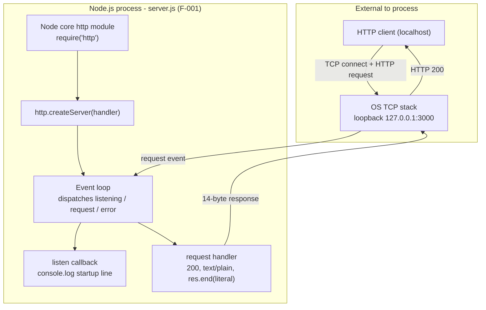
```mermaid
flowchart TB
    subgraph Ext["External to process"]
        Client["HTTP client (localhost)"]
        OS["OS TCP stack<br/>loopback 127.0.0.1:3000"]
    end
    subgraph ProcBox["Node.js process - server.js (F-001)"]
        Core["Node core http module<br/>require('http')"]
        Factory["http.createServer(handler)"]
        Loop["Event loop<br/>dispatches listening / request / error"]
        ListenCb["listen callback<br/>console.log startup line"]
        Handler["request handler<br/>200, text/plain, res.end(literal)"]
    end
    Client -->|"TCP connect + HTTP request"| OS
    OS -->|"request event"| Loop
    Core --> Factory --> Loop
    Loop --> ListenCb
    Loop --> Handler
    Handler -->|"14-byte response"| OS
    OS -->|"HTTP 200"| Client
```

The sequence diagram captures the key runtime flow — startup bind followed by the request/response exchange (see §4.1.1 for the full swim-lane treatment).

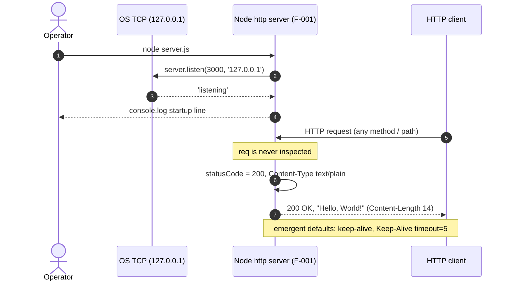
```mermaid
sequenceDiagram
    autonumber
    actor Op as Operator
    participant OS as OS TCP (127.0.0.1)
    participant Srv as Node http server (F-001)
    participant Cli as HTTP client
    Op->>Srv: node server.js
    Srv->>OS: server.listen(3000, '127.0.0.1')
    OS-->>Srv: 'listening'
    Srv-->>Op: console.log startup line
    Cli->>Srv: HTTP request (any method / path)
    Note over Srv: req is never inspected
    Srv->>Srv: statusCode = 200, Content-Type text/plain
    Srv-->>Cli: 200 OK, "Hello, World!" (Content-Length 14)
    Note over Srv,Cli: emergent defaults: keep-alive, Keep-Alive timeout=5
```

The state-transition diagram below summarizes the component's process lifecycle; §4.4 holds the authoritative, detailed pair of state machines (process lifecycle and per-connection lifecycle).

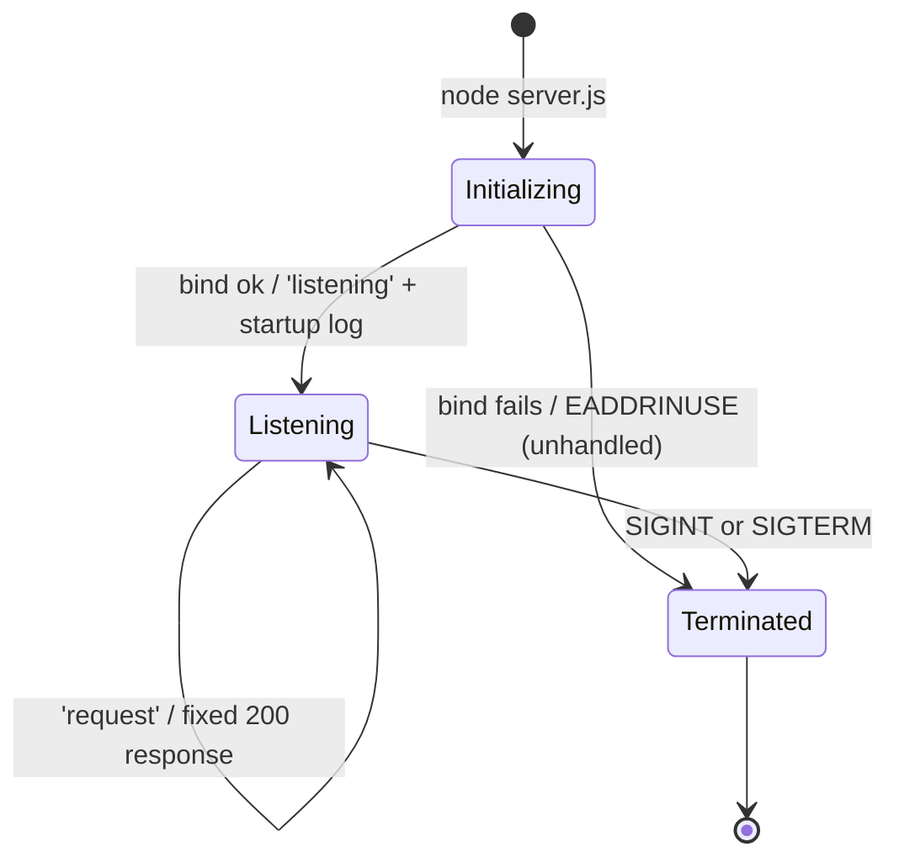
```mermaid
stateDiagram-v2
    [*] --> Initializing: node server.js
    Initializing --> Listening: bind ok / 'listening' + startup log
    Initializing --> Terminated: bind fails / EADDRINUSE (unhandled)
    Listening --> Listening: 'request' / fixed 200 response
    Listening --> Terminated: SIGINT or SIGTERM
    Terminated --> [*]
```

### 5.2.2 NPM Package Manifest & Lockfile (F-002)

**Purpose and responsibilities.** F-002 (`package.json`, `package-lock.json`) declares the package identity `hello_world` v1.0.0 (MIT, author `hxu`) and records a deterministic, empty dependency closure so that npm tooling can recognize and reason about the project.

**Technologies and frameworks.** The npm manifest schema plus a `lockfileVersion` 3 lockfile, both JSON (§3.3, §3.6). No build system consumes them beyond npm itself.

**Key interfaces and APIs.** Consumed by the npm CLI (`npm ci`, `npm install`, `npm test`). The `main` field nominally names `index.js`, which does not exist; the only script is a `test` placeholder that exits with code 1; there is no `start` script. There is no programmatic interface.

**Data persistence requirements.** Declarative files versioned in Git; no runtime state. The lockfile is a build-time dependency-closure record, but because the closure is empty it has no runtime effect (§4.3.1).

**Scaling considerations.** Not applicable — F-002 is metadata, not a runtime component.

### 5.2.3 Static Data Assets — Industry Taxonomy and Document Corpus (F-003, F-004)

**Purpose and responsibilities.** F-003 (`industry.csv`) supplies a reusable 43-value industry taxonomy; F-004 supplies multi-format binary sample documents. Both are reference assets that an external consumer could ingest; neither delivers any behavior in this repository.

**Technologies and formats.** F-003 is a UTF-8 CSV with a single `Industry` column (43 values, ending in the catch-all `Other`). F-004 comprises `100Pages.pdf` (PDF 1.7, ~9.46 MB), `demo.jpg` (JPEG/EXIF, ~2.12 MB), and `sample.doc` (OLE2 legacy Microsoft Word, 96 KB), per §3.5.2.

**Key interfaces and APIs.** None — the assets are **unwired**: no code opens, parses, imports, or serves them (§2.3.2). Any consumer must supply its own CSV parser or format-specific readers.

**Data persistence requirements.** Static, read-only files versioned in Git; each is duplicated as a byte-identical `- Copy`.

**Scaling considerations.** Not applicable at runtime; the only operational implication is that the large, duplicated binaries inflate repository clone size (§3.5.3).

### 5.2.4 Non-Functional and Excluded Artifacts

The following artifacts exist in the repository but are **not** architectural components because they contribute no capability (§2.1.6) — they have no interfaces, persistence, or scaling behavior:

- **Java login stub** — `LoginTest.java` (and its identical `- Copy`) declares a `com.blitzyTest.LoginTest` class whose `main` body is the single bare token `Web`, so it does not compile; there is no Java build tooling (no `pom.xml`/Gradle) and it is never invoked.
- **Empty placeholders** — `test.py.txt`, `test.py - Copy.txt`, and `test.txt.txt` are all 0-byte files with no content or behavior.
- **Byte-identical duplicates** — six `- Copy` twins (`server`, `LoginTest`, `industry`, and the three binaries) add redundancy rather than distinct components.

## 5.3 Technical Decisions

The repository contains no design documents or architecture decision records, so the decisions documented here are **reconstructed from the implementation** and are consistent with the "as-evidenced" rationale already recorded in §3.2 and §3.5. They should be read as explanations of why the code is shaped the way it is for a declared test fixture, not as formally ratified design artifacts.

### 5.3.1 Architecture Style & Framework Selection

The overarching decision is to implement the service as a **single-file, zero-dependency Node.js process built on the core `http` module**, rather than adopting a web framework or a multi-tier architecture. The tradeoffs are summarized below (four-column limit observed).

| Decision Area | Chosen Approach | Alternatives Not Used | Rationale & Tradeoff (as evidenced) |
| --- | --- | --- | --- |
| Application structure | Single-file monolith (`server.js`) | Layered / modular / microservices | The fixture needs one runnable file; layering would add structure with no behavioral benefit. Tradeoff: no separation of concerns — but there is nothing to separate |
| Web layer | Node core `http` | Express / Koa / Fastify | Dependency-free; `npm ci` installs nothing (§3.2). Tradeoff: forgoes framework routing, middleware, and security helpers, none of which the constant-response fixture needs |
| Dependency posture | Zero third-party dependencies | Curated dependency set | No CVEs to track and no transitive tree to audit (§3.3). Tradeoff: all behavior must be hand-rolled |
| Concurrency model | Single process, single-threaded event loop | `cluster` / `worker_threads` / PM2 | Sufficient for a deterministic probe target. Tradeoff: no multi-core use and no same-host scale-out (§5.2.1) |

The decision tree below reconstructs how the minimal architecture follows from the fixture's requirements; each "yes" branch (marked "not this repo") shows the alternative that a more demanding component would have taken.

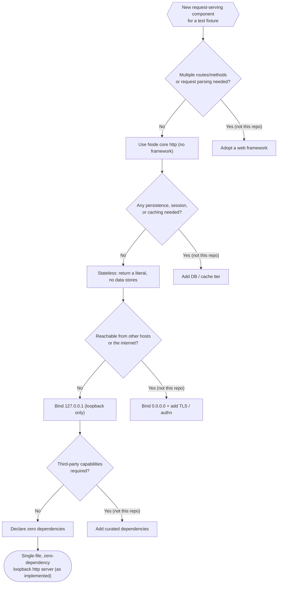
```mermaid
flowchart TD
    Start{{"New request-serving component<br/>for a test fixture"}}
    Q1{"Multiple routes/methods<br/>or request parsing needed?"}
    Q2{"Any persistence, session,<br/>or caching needed?"}
    Q3{"Reachable from other hosts<br/>or the internet?"}
    Q4{"Third-party capabilities<br/>required?"}
    CoreHttp["Use Node core http (no framework)"]
    Stateless["Stateless: return a literal, no data stores"]
    Loopback["Bind 127.0.0.1 (loopback only)"]
    NoDeps["Declare zero dependencies"]
    Outcome(["Single-file, zero-dependency<br/>loopback http server (as implemented)"])
    Framework["Adopt a web framework"]
    DataTier["Add DB / cache tier"]
    Expose["Bind 0.0.0.0 + add TLS / authn"]
    Deps["Add curated dependencies"]
    Start --> Q1
    Q1 -->|No| CoreHttp --> Q2
    Q1 -->|"Yes (not this repo)"| Framework
    Q2 -->|No| Stateless --> Q3
    Q2 -->|"Yes (not this repo)"| DataTier
    Q3 -->|No| Loopback --> Q4
    Q3 -->|"Yes (not this repo)"| Expose
    Q4 -->|No| NoDeps --> Outcome
    Q4 -->|"Yes (not this repo)"| Deps
```

### 5.3.2 Communication, Storage, Caching & Security Decisions

The remaining cross-cutting technical choices are consolidated below. Each is grounded in observed code and the cross-referenced sections; several are decisions to *omit* a mechanism entirely, which is documented honestly rather than presented as a feature.

| Concern | Decision | Rationale (as evidenced) | Consequence / Tradeoff |
| --- | --- | --- | --- |
| Communication pattern | Synchronous HTTP/1.1 request/response over loopback TCP; no outbound calls | Simplest deterministic contract for a probe target (§4.1.2) | No async, eventing, or streaming; not reachable off-host |
| Data storage | No database, ORM, or object store; stateless service; static files versioned in Git | The fixture computes nothing and stores nothing; the body is a literal (§3.5) | No data-at-rest and no connection secrets, but also no durability or query capability |
| Caching strategy | No cache; no `Cache-Control`/`ETag`; the response is a constant literal | A 14-byte constant needs no cache (§4.3.1) | Nothing to invalidate; no client-cache hints emitted |
| Security mechanism | Loopback binding as the sole access control; requests are never parsed | Restricts reachability to localhost and avoids input-driven attacks by never reading `req` (§3.2) | No TLS, authentication/authorization, security headers, or request-size limits; safety depends entirely on network isolation |

**Security mechanism selection — elaboration.** The only implemented security control is **network isolation via loopback binding**; there is no authentication, authorization, TLS, session management, input validation, or security-header handling anywhere in the code (§3.4.1). The protections a web framework would supply are therefore absent (§3.2). This posture is defensible *only* because the service is a localhost-only fixture that never reads request input; exposing it off-host would necessitate adding TLS, an authentication/authorization layer, and request handling.

### 5.3.3 Architecture Decision Records (ADRs)

The following lightweight ADRs formalize the decisions above. Each is marked **Accepted (reconstructed)** because it is inferred from the committed implementation; the repository contains no ADR document of its own.

**ADR-001 — Use the Node.js core `http` module instead of a web framework**
- *Status:* Accepted (reconstructed from the implementation).
- *Context:* The fixture must expose a runnable HTTP endpoint with minimal setup; frameworks add dependencies and machinery.
- *Decision:* Build on the Node core `http` module only (`require('http')`); no Express/Koa/Fastify.
- *Consequences:* Zero install (`npm ci` installs nothing) and no framework CVEs to track; routing, middleware, body parsing, and security helpers must be hand-rolled and are therefore absent (§3.2).

**ADR-002 — Bind to the loopback interface (127.0.0.1) only**
- *Status:* Accepted (reconstructed).
- *Context:* The service is a local test target with no requirement for off-host reachability.
- *Decision:* Bind to `127.0.0.1` on port `3000`.
- *Consequences:* Reachable only from the same host — the sole access control (§1.2.1); cannot serve remote clients; a second same-host instance fails with `EADDRINUSE` (§4.3.2).

**ADR-003 — Return a single fixed response with no routing or request parsing**
- *Status:* Accepted (reconstructed).
- *Context:* The fixture must behave identically for any probe.
- *Decision:* Return a hard-coded `200 text/plain "Hello, World!\n"` for every request; never inspect `req`.
- *Consequences:* Perfectly predictable output regardless of method/path/body (§4.1.1); no content negotiation; no request-path errors are possible (§4.3.2).

**ADR-004 — Operate statelessly with no database, cache, or persistence**
- *Status:* Accepted (reconstructed).
- *Context:* The response is a constant; there is nothing to store or compute.
- *Decision:* Hold no state — no database, cache, session, or file I/O.
- *Consequences:* No data-at-rest, no connection secrets, and no cache to invalidate (§3.5); equally, no durability, query capability, or cross-request memory.

**ADR-005 — Declare zero third-party dependencies**
- *Status:* Accepted (reconstructed).
- *Context:* Minimizing supply-chain surface for a throwaway fixture.
- *Decision:* Declare no dependencies in `package.json`/`package-lock.json`.
- *Consequences:* A deterministic, empty dependency closure with no transitive audit burden (§3.3); all capability is limited to what Node core provides.

The map below shows which ADR governs which part of the architecture.

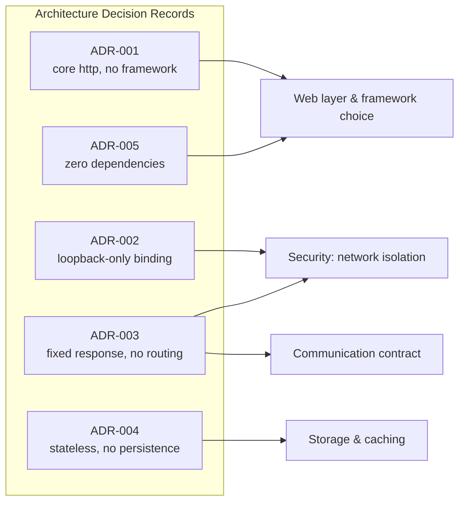
```mermaid
flowchart LR
    subgraph ADRs["Architecture Decision Records"]
        A1["ADR-001<br/>core http, no framework"]
        A2["ADR-002<br/>loopback-only binding"]
        A3["ADR-003<br/>fixed response, no routing"]
        A4["ADR-004<br/>stateless, no persistence"]
        A5["ADR-005<br/>zero dependencies"]
    end
    A1 --> Web["Web layer & framework choice"]
    A5 --> Web
    A2 --> Sec["Security: network isolation"]
    A3 --> Comm["Communication contract"]
    A3 --> Sec
    A4 --> Store["Storage & caching"]
```

## 5.4 Cross-Cutting Concerns

Cross-cutting concerns are minimal by construction. The service is a stateless, dependency-free, loopback-only fixture, so most conventional concerns (monitoring, tracing, authentication, SLAs, disaster recovery) are **not implemented**. Each is documented below against the observed evidence rather than assumed; where a concern is absent, that is stated plainly.

### 5.4.1 Monitoring & Observability

There is no monitoring or observability stack: no metrics endpoint, no health-check route, no dashboards, and no APM or telemetry agent (§3.4.1). Because every path returns the same `200`, even a probe to `/` doubles as an ad-hoc liveness check. The only first-class signals are the startup log line (liveness) and, on failure, a crash trace.

| Observability Capability | Status | Signal / Evidence |
| --- | --- | --- |
| Metrics endpoint / dashboard | Absent | No metrics code or `/metrics` route |
| Health-check endpoint | Absent | No health route; every path returns the same `200` |
| APM / telemetry agent | Absent | No agent or SDK anywhere (§3.4.1) |
| Liveness signal | Startup log only | `console.log` startup line to stdout; endpoint probe returns `200` |
| Failure signal | Crash trace only | Uncaught-exception stack trace to stderr on bind failure |

### 5.4.2 Logging & Tracing

**Logging.** The application emits exactly one log statement — the startup line `Server running at http://127.0.0.1:3000/`, written to stdout via `console.log`. There is no per-request access log, no structured/JSON logging, no log levels, no log files, and no log shipping or aggregation (§3.4.1). On an unhandled error, the Node runtime writes an uncaught-exception stack trace to stderr; this is runtime default output, not application logging.

**Tracing.** There is no distributed tracing, correlation ID, or span instrumentation. Tracing would be meaningless here in any case: the system is a single process with no downstream calls, so there is no cross-service path to trace (§4.1.2).

### 5.4.3 Error Handling

The repository implements **no dedicated error-handling code** — there is no `try/catch`, no `'error'` event listener, no retry/backoff, and no fallback (§4.3.2). Two paths are relevant:

- **Request path — no errors possible.** The handler never reads `req` and writes a constant literal, so no exception can arise during request handling; there is consequently no per-request error branch.
- **Startup path — the one real error path.** If port `3000` is already in use, the server emits an `'error'` event (`EADDRINUSE`); because no listener is registered, Node re-throws it as an uncaught exception, writes a stack trace to stderr, and the process exits with a non-zero code. Recovery is entirely manual: free the port and re-run `node server.js`. §4.3.2 holds the authoritative treatment.

```mermaid
flowchart TD
    Startup["Startup: server.listen(3000, '127.0.0.1')"] --> BindOK{"Port 3000 free?"}
    BindOK -->|Yes| Listen(["Listening; startup line to stdout"])
    BindOK -->|No| Emit["http.Server emits 'error' (EADDRINUSE)"]
    Emit --> HasListener{"'error' listener registered?"}
    HasListener -->|"No (this repo)"| Crash["Node re-throws -> stack trace to stderr"]
    Crash --> Exit(["Process exits non-zero"])
    Exit --> Manual["Manual recovery: free port 3000, re-run node server.js"]
    HasListener -->|"Yes (not implemented)"| Handle["Could log / retry / fall back (no such code)"]
    ReqPath["Request path"] --> NoThrow["req never read; response is a literal"]
    NoThrow --> NoErr(["No per-request error possible"])
```

### 5.4.4 Authentication & Authorization

There is **no authentication or authorization framework**. The code contains no identity-provider integration, no TLS, no session management, and no API keys or tokens; `server.js` returns the same response to every caller without inspecting credentials (§3.4.1). No role-, attribute-, or scope-based access model exists. The **only access control is network isolation**: binding to the loopback interface restricts callers to the local host (§5.3.2, ADR-002). Any real authentication/authorization would have to be added before the service could be exposed beyond localhost.

### 5.4.5 Performance Characteristics & SLAs

No service-level agreements or performance targets exist anywhere in the repository — there are no latency, throughput, availability, or uptime objectives (§1.2.3, §4.1). Only observed characteristics can be reported; specific latency or throughput figures are deliberately **not** asserted because none are measured or documented in the repository.

| Performance Aspect | Status | Observed Behavior |
| --- | --- | --- |
| SLA / latency / throughput / uptime target | Not defined | None anywhere in the repository (§1.2.3, §4.1) |
| Per-request work | Constant (O(1)) | No parsing, computation, or I/O; returns a fixed 14-byte literal |
| Concurrency model | Single-threaded event loop | One process; no clustering or multi-core use (§5.2.1) |
| Idle-connection timeout | Emergent runtime default | `Keep-Alive: timeout=5` (5 s), set by Node, not the application |
| Load testing / benchmarks | Absent | No benchmark or capacity-planning artifacts |

### 5.4.6 Disaster Recovery & Resilience

There are **no disaster-recovery procedures** and no built-in resilience: no backups, failover, replication, health checks, restart policy, or process manager, and no defined RTO/RPO. Two facts bound the topic:

- **Nothing to recover at runtime.** The service is stateless — it stores no data (§4.3.1) — so there is no runtime data to back up or restore. "Recovery" from a crash means an operator re-running `node server.js` after freeing the port (§5.4.3); the process does not self-restart.
- **Source recoverability.** The only "backup" is version control: all 18 files live in a single Git commit (`be2be9b`) on the GitHub `origin` remote (§3.4.2), from which the repository can be re-cloned. This is a DevOps facility, not a runtime resilience mechanism.

## 5.5 References

**Repository files examined for this section**

- `server.js` — the sole runnable component (F-001); established the Node core `http` usage, loopback `127.0.0.1:3000` binding, the fixed `200`/`text/plain`/`Hello, World!\n` response, and the single `console.log` startup line.
- `server - Copy.js` — byte-identical, unwired duplicate of `server.js`.
- `package.json` — established package identity (`hello_world` v1.0.0, MIT, author `hxu`), the absent `index.js` `main` target, the placeholder `test` script, the absence of a `start` script, and zero declared dependencies (F-002).
- `package-lock.json` — established `lockfileVersion` 3 and the empty (zero third-party) dependency closure.
- `industry.csv` — established the single-column, 43-value industry taxonomy (F-003); confirmed unwired.
- `industry - Copy.csv` — byte-identical duplicate of `industry.csv`.
- `README.md` — established repository identity (`hao-backprop-test`), the "test project for backprop integration" purpose, and the "Do not touch!" warning.
- `100Pages.pdf`, `demo.jpg`, `sample.doc` (and their `- Copy` twins) — established the multi-format binary sample corpus (F-004); confirmed unwired and their clone-size impact.
- `LoginTest.java` and `LoginTest - Copy.java` — established the non-compiling `com.blitzyTest.LoginTest` stub (excluded artifact).
- `test.py.txt`, `test.py - Copy.txt`, `test.txt.txt` — established the empty (0-byte) placeholder artifacts.

**Repository structure and version control**

- Repository root (flat, file-only; 18 tracked files, no subfolders) — established the single-tier, single-file architecture and the absence of config, containerization, and CI/CD files (`.env`, `Dockerfile`, `docker-compose.yml`, `.github/` all absent).
- Git history (single commit `be2be9b` "Add files via upload"; `origin` remote on GitHub; branches `main` and `QA-08-win-VM-branch`) — established source recoverability and the DevOps-only external touchpoint.

**Runtime verification**

- Node.js v22.23.1 (container runtime) — used to confirm the startup log, the method/path/body-agnostic `200` response, the emergent `Keep-Alive: timeout=5` and `Content-Length: 14` metadata, and the `EADDRINUSE` bind-failure crash path.

**Cross-referenced Technical Specification sections**

- §1.2 System Overview (§1.2.1 Project Context, §1.2.3 Success Criteria) — system framing and the absence of formal success criteria/KPIs.
- §2.1 Feature Catalog (incl. §2.1.6 Excluded Artifacts) — authoritative feature identifiers F-001–F-004 and non-feature classification.
- §2.2 Functional Requirements — confirmation that excluded artifacts carry no requirements.
- §2.3 Feature Relationships (§2.3.2 Integration Points, §2.3.4 Common Services) — the single invokable interface and the absence of common services.
- §3.1 Programming Languages; §3.2 Frameworks & Libraries; §3.3 Open Source Dependencies — the JavaScript/Node core `http` stack, zero-framework/zero-dependency posture, and its security tradeoffs.
- §3.4 Third-Party Services (§3.4.1–§3.4.3) — absence of external services/auth/monitoring/cloud; GitHub as source host; "backprop" as stated intent only.
- §3.5 Databases & Storage (§3.5.2 File-Based Static Data Assets, §3.5.3 Version Control as Storage) — no database/cache/persistence; static Git files as the only storage.
- §3.6 Development & Deployment — npm tooling and the absence of build/CI/CD.
- §4.1 System Workflows (§4.1.1 Core Business Processes, §4.1.2 Integration Workflows) — the bootstrap and request/response flows and event model.
- §4.3 Technical Implementation (§4.3.1 State Management, §4.3.2 Error Handling) — statelessness and the authoritative error-handling treatment.
- §4.4 State Transition Diagrams — the authoritative process- and connection-lifecycle state machines summarized in §5.2.1.

# 6. SYSTEM COMPONENTS DESIGN

## 6.1 Core Services Architecture

### 6.1.1 Applicability Assessment

**Core Services Architecture is not applicable for this system.**

The `hao-backprop-test` repository does not implement a microservices, distributed, or multi-service architecture. As established in §5.1 High-Level Architecture, the system is a single-process, single-tier ("one-tier") monolith whose only executable component is `server.js` — a Node.js HTTP server that binds the loopback interface `127.0.0.1:3000` and returns a constant `HTTP 200` / `text/plain` / `Hello, World!` response to every request. There is exactly one runnable process, one inbound interface, zero outbound calls, and zero third-party dependencies (`package.json`, `package-lock.json`). Because there are no distinct services to bound, no second component to communicate with, and no orchestration or scaling substrate, the concepts this section is designed to document — service decomposition, inter-service communication, service discovery, load balancing, circuit breaking, auto-scaling, failover, and service degradation — have no corresponding implementation in the codebase.

This section therefore records the determination, the evidence behind it, and an honest assessment of each required service-architecture dimension against the observed repository, rather than fabricating patterns that do not exist. Where a topic is genuinely covered elsewhere at the appropriate (non-distributed) level of detail, it is cross-referenced rather than duplicated: the single runtime workflow is detailed in §4.1, error handling in §5.4.3, performance characteristics in §5.4.5, and disaster-recovery posture in §5.4.6.

#### 6.1.1.1 Determination Criteria

The table below evaluates the defining markers of a core-services (distributed, multi-service) architecture against the repository. No marker is present, which is why the section is classified as not applicable.

| Core-Services Marker | Present? | Evidence / Reference |
| --- | --- | --- |
| Multiple independently deployable services | No | Single `server.js` process; `server - Copy.js` is a byte-identical duplicate, not a distinct service (§5.1.1) |
| Distinct service boundaries / bounded contexts | No | One HTTP handler returning a constant literal; no modules, domains, or layers (`server.js`) |
| Inter-service communication (HTTP client, gRPC, queue) | No | No outbound calls of any kind; the endpoint is the only invokable interface (§5.1.4, §2.3.2) |
| Service discovery / registry | No | Host and port hard-coded to `127.0.0.1:3000`; nothing to register or resolve (`server.js`) |
| Load balancer / reverse proxy | No | Single instance; no proxy or clustering configuration (§3.6, §5.4.5) |
| Message broker / event bus | No | Zero third-party dependencies declared (`package.json`, `package-lock.json`) |
| Containerization / orchestration | No | No Dockerfile, Compose, or Kubernetes manifests (§3.6.3) |
| Per-service data stores | No | No database, cache, or persistence anywhere (§5.1.3, §3.5) |

#### 6.1.1.2 Actual Runtime Topology

The system's complete runtime topology is a single local client exchanging one synchronous request/response with a single Node.js process over the loopback interface. This is the entirety of the system's "service interaction" — there is no second node with which to interact.

*Figure 6.1.1-1 — Actual service interaction: the complete runtime topology of the system.*

```mermaid
flowchart LR
    Client["Local HTTP client<br/>curl / browser / tool"]
    subgraph Host["Local host - loopback trust boundary 127.0.0.1"]
        Proc["server.js F-001<br/>single Node.js process<br/>http listener on port 3000"]
    end
    Client -->|"HTTP/1.1 request - any method or path"| Proc
    Proc -->|"HTTP 200 text/plain Hello, World!"| Client
```

The loopback binding is, in effect, the system's only access control (§5.4.4, ADR-002): the process is reachable solely from the same host and is never exposed to an external network, so even conventional edge components (API gateway, reverse proxy, load balancer) have no role to play.

### 6.1.2 Assessment Against Required Service-Architecture Dimensions

Although the section is not applicable, each dimension the Core Services Architecture template enumerates is assessed individually against the repository so the determination is auditable rather than asserted. Every dimension resolves to **Not applicable**, with the specific basis recorded in the tables below. Statuses and their evidence are consistent with the cross-cutting findings in §5.4 and the deployment findings in §3.6.

#### 6.1.2.1 Service Components

The system has a single executable component (`server.js`, feature F-001) with a single responsibility. There is no service mesh, no second component, and no outbound integration, so none of the service-component patterns apply.

| Service-Component Dimension | Status | Basis in Repository |
| --- | --- | --- |
| Service boundaries & responsibilities | Not applicable | One process with one responsibility — return a fixed `200` response; no decomposition into services (`server.js`; §5.1.2) |
| Inter-service communication patterns | Not applicable | No second service and no outbound protocol client; only one inbound HTTP interface exists (§5.1.4, §2.3.2) |
| Service discovery mechanisms | Not applicable | Host and port are hard-coded to `127.0.0.1:3000`; nothing to register, resolve, or look up (`server.js`) |
| Load balancing strategy | Not applicable | A single single-threaded instance; no clustering, reverse proxy, or load balancer (§5.4.5) |
| Circuit breaker patterns | Not applicable | No downstream dependency to protect; no breaker library among the zero declared dependencies (`package.json`, `package-lock.json`) |
| Retry and fallback mechanisms | Not applicable | No retry/backoff or fallback code; the handler issues no call that could fail (§5.4.3) |

#### 6.1.2.2 Scalability Design

The service runs as one manually started, single-threaded Node.js process with no scaling substrate. It uses no Node `cluster`/`worker_threads`, no orchestrator, and no resource limits, so horizontal/vertical scaling, auto-scaling, and capacity planning are all absent.

| Scalability Dimension | Status | Basis in Repository |
| --- | --- | --- |
| Horizontal / vertical scaling approach | Not applicable | Single-threaded event loop in one process; no clustering, worker threads, or multi-instance deployment (§5.4.5) |
| Auto-scaling triggers and rules | Not applicable | No orchestrator and no metrics source to trigger scaling; no scaling configuration exists (§3.6) |
| Resource allocation strategy | Not applicable | Runs directly on the host with no CPU/memory limits, quotas, or reservations (§3.6.3) |
| Performance optimization techniques | Not applicable | Constant-time (O(1)) handler returning a fixed 14-byte literal; no caching or work to optimize (§5.4.5, §5.1.3) |
| Capacity planning guidelines | Not applicable | No load tests, benchmarks, or capacity artifacts; no throughput/latency/uptime targets (§5.4.5, §1.2.3) |

*Figure 6.1.2-1 — Scalability architecture: the actual single-instance runtime alongside the conventional scaling tier that is absent from the repository.*

```mermaid
flowchart TB
    Operator["Operator"] -->|"node server.js - manual start"| Inst
    subgraph Runtime["Actual runtime - single static instance"]
        Inst["One Node.js process<br/>single-threaded event loop<br/>127.0.0.1:3000"]
    end
    subgraph Absent["Not present in repository"]
        LB["Load balancer / reverse proxy"]
        HPA["Auto-scaler / horizontal autoscaler"]
        Replicas["Additional replicas or cluster workers"]
        Orch["Container orchestrator"]
    end
```

#### 6.1.2.3 Resilience Patterns

The service implements no resilience patterns. It is stateless (nothing to recover), has no error handling beyond Node's runtime defaults, and has no redundant instance to fail over to. The only fault path is a startup bind conflict, which terminates the single process and requires manual recovery.

| Resilience Dimension | Status | Basis in Repository |
| --- | --- | --- |
| Fault tolerance mechanisms | Not applicable | No `try/catch`, no `'error'` listener, no redundancy; a bind failure crashes the single process (§5.4.3) |
| Disaster recovery procedures | Not applicable | No backups, failover, or defined RTO/RPO; the service is stateless, so there is no runtime data to recover (§5.4.6) |
| Data redundancy approach | Not applicable | No datastore or replication; the only redundancy is source-in-version-control (single commit `be2be9b`) (§5.4.6) |
| Failover configurations | Not applicable | Single instance; no standby/replica, restart policy, or process manager (§5.4.6) |
| Service degradation policies | Not applicable | No health checks or load shedding; availability is binary — the process is either running or not (§5.4.1, §5.4.6) |

*Figure 6.1.2-2 — Resilience reality: a single point of failure with manual recovery, no failover, and no self-healing.*

```mermaid
flowchart TD
    Start["Start: server.listen on 127.0.0.1:3000"] --> Q{"Port 3000 free?"}
    Q -->|"Yes"| Up(["Single instance listening<br/>no replica, no health check"])
    Q -->|"No"| Err["http.Server emits 'error' EADDRINUSE"]
    Err --> NoListener{"'error' listener registered?"}
    NoListener -->|"No - this repo"| Crash["Uncaught exception; stderr stack trace"]
    Crash --> Exit(["Process exits non-zero<br/>no auto-restart, no failover"])
    Exit --> Manual["Manual recovery: free port 3000, re-run node server.js"]
```

The request path itself has no failure branch: because `req` is never read and the response is a compile-time literal, no per-request exception can arise (§5.4.3). Consequently there is no degraded-service mode — the system is available when the process is running and unavailable when it is not.

### 6.1.3 References

**Repository files examined and cited as evidence for this section:**

- `server.js` - The sole executable component (feature F-001); binds `127.0.0.1:3000` and returns a constant `200`/`text/plain`/`Hello, World!` response. Established the single-process, single-responsibility topology and the hard-coded host/port (no service discovery).
- `server - Copy.js` - Byte-identical duplicate of `server.js`; confirmed it is a redundant copy, not a distinct second service.
- `package.json` - Declares no `dependencies`/`devDependencies` and no `start`/`build` scripts; confirmed the absence of service frameworks, message brokers, and circuit-breaker/retry libraries.
- `package-lock.json` - `lockfileVersion 3` with an empty dependency closure; corroborated the zero-third-party-component posture.
- `README.md` - Declares the repository a "test project for backprop integration. Do not touch!"; establishes the test-fixture nature underlying the not-applicable determination.

**Web sources:** None. No external facts were required to make this determination.

**Cross-referenced Technical Specification sections:**

- §1.2 System Overview - Single service bound to `127.0.0.1:3000`, self-contained, with no external systems.
- §2.3.2 / §2.3.4 - The HTTP endpoint is the only invokable interface; no common/shared services exist.
- §3.3 / §3.5 / §3.6 - Zero open-source dependencies; no databases or storage; no build system, containerization, CI/CD, or Infrastructure-as-Code.
- §4.1 / §5.4.3 - The single runtime workflow and the startup `EADDRINUSE` error path (uncaught exception, manual recovery).
- §5.1 High-Level Architecture - Characterization as a single-process, single-tier monolith; feature identifiers F-001–F-004.
- §5.4 Cross-Cutting Concerns - Monitoring/observability, performance/SLA, and disaster-recovery/resilience posture; ADR-002 (loopback binding as the sole access control).

## 6.2 Database Design

### 6.2.1 Applicability Assessment

**Database Design is not applicable to this system.**

The `hao-backprop-test` repository implements no database and no persistent storage layer of any kind. As established in §3.5 Databases & Storage and §5.1 High-Level Architecture, the only runnable component is `server.js` (feature F-001), a single-process Node.js HTTP server that is entirely stateless: its response body `Hello, World!` is a compile-time string literal, not data retrieved from or written to any datastore. The manifest and lockfile declare zero dependencies (`package.json`, `package-lock.json`, `lockfileVersion 3`), so there is no database driver, ORM/ODM, or cache client available to the runtime. A scan of all 18 tracked files in the repository finds no relational or NoSQL database, no schema or migration files, no connection strings or credentials, and no caching or object-storage service.

Because there is no schema to model, no engine to configure, no indexes or constraints to declare, and no replication or backup topology to operate, the concepts this section is designed to document — entity relationships, data models, indexing/partitioning strategy, replication configuration, migrations, retention, query optimization, connection pooling, and read/write splitting — have no corresponding implementation in the codebase. This section therefore records the determination, the evidence behind it, and an honest, auditable assessment of each required database-design dimension against the observed repository (§6.2.3), rather than fabricating a schema or topology that does not exist.

The only data-like artifacts in the repository are static, read-only files committed to Git — the `industry.csv` industry taxonomy (feature F-003) and a binary sample corpus (feature F-004). These are documented in §6.2.2 for completeness, but they constitute neither a managed database schema nor a runtime datastore: no code in the repository reads, parses, indexes, or writes them, and Git itself is the only mechanism that persists them (single commit `be2be9b`, §3.5.3).

#### 6.2.1.1 Determination Criteria

The table below evaluates the defining markers of a database-backed system against the repository. No marker is present, which is the basis for the not-applicable determination.

| Database Marker | Present? | Evidence / Reference |
| --- | --- | --- |
| Relational / NoSQL database engine | No | No engine and no data files (`*.db`, `*.sqlite`); no datastore config anywhere (§3.5) |
| Database driver or client library | No | `package.json` / `package-lock.json` declare zero dependencies (`lockfileVersion 3`) |
| ORM / ODM / query builder | No | No `sequelize`, `prisma`, `mongoose`, `typeorm`, or query-builder code or manifest entry |
| Schema / DDL / migration files | No | No `*.sql`, `schema.*`, `migrations/`, or `*.prisma` among the 18 tracked files |
| Connection string / credentials / config | No | No `.env`, `.ini`, `.conf`, `.yml`/`.yaml`, or connection URI in the repository |
| Caching layer (Redis / in-memory) | No | No cache client; the response is a hard-coded literal (§3.5.1, §5.4) |
| Object / blob storage service | No | No cloud-storage SDK or configuration (§3.5) |
| Runtime read / write persistence | No | `server.js` imports only `require('http')`; performs no `fs`/DB I/O per request |

#### 6.2.1.2 Data Flow Without Persistence

The system's complete data flow is a single synchronous request/response in which the response body originates from an in-process string literal. No data is read from or written to any store at startup or per request, and the static files in the repository sit outside the runtime path entirely — no code opens them. The request is method-agnostic and path-agnostic: every request yields the identical `200 text/plain` / `Hello, World!` response (§4.1, §5.4.5), so there is no query, lookup, or datastore round-trip on any path.

*Figure 6.2.1-1 — Data flow with no persistence tier: the response is an in-process literal; the persistence tier is absent and the static Git-tracked files are unwired (no code reads them).*

```mermaid
flowchart LR
    Client["Local HTTP client<br/>curl / browser / tool"]
    subgraph Runtime["server.js (F-001) - single stateless process 127.0.0.1:3000"]
        Handler["HTTP request handler<br/>req never read"]
        Literal["In-process string literal<br/>Hello, World! (14 bytes)"]
        Handler --> Literal
    end
    Client -->|"HTTP/1.1 request - any method or path"| Handler
    Literal -->|"HTTP 200 text/plain"| Client
    subgraph Persistence["Persistence tier - ABSENT"]
        None["No database - No cache<br/>No object storage - No file I/O"]
    end
    subgraph Static["Static Git-tracked files - unwired (no code reads them)"]
        CSV["industry.csv (F-003)<br/>43-value taxonomy"]
        Bins["100Pages.pdf / demo.jpg / sample.doc (F-004)"]
    end
```

The absence of a persistence tier is not an omission in this documentation but a property of the system: with no datastore, cache, or storage service, there is no data-at-rest, no connection secret to manage, and no datastore attack surface (§3.5.3, §5.4.4). The remaining sub-sections document the static data assets that do exist (§6.2.2) and assess each database-design dimension the template requires against this observed reality (§6.2.3).

### 6.2.2 Static Data Assets

Although the system has no database, two of the four feature areas identified in §2.1 consist of static, file-based data assets: the `industry.csv` industry taxonomy (F-003) and a binary sample corpus (F-004). These files are the closest thing the repository has to a "data model," so they are documented here for completeness. None is read, parsed, indexed, or served by any code (§1.2.1, §3.5.2); each exists only as a file versioned in Git, and each is duplicated as a byte-identical `- Copy` twin (verified by matching MD5 checksums, §3.5.3). Because there is no database engine, these assets carry no keys, indexes, or engine-enforced constraints of any kind.

#### 6.2.2.1 Industry Taxonomy Data Structure

`industry.csv` is a single-column, header-plus-values CSV that enumerates an industry taxonomy. Its structure is fully described by the table below.

| Attribute | Value |
| --- | --- |
| File (and duplicate) | `industry.csv` + byte-identical `industry - Copy.csv` (MD5 `15ce1b4d…`) |
| Format | UTF-8 CSV, single column (§3.5.2) |
| Header (row 1) | `Industry` |
| Row count | 44 lines = 1 header + 43 data values |
| First / last value | `Accounting/Finance` … terminal catch-all `Other` |
| File size | 749 bytes |
| Consumed by code? | No — not read, imported, or referenced by any file (§1.2.1) |

Modeled as an entity relationship, this asset is degenerate: it is a single flat structure with one attribute and no relationships, because there is no second entity to relate it to and no engine to enforce a relational model. The ERD below depicts it explicitly as a flat file rather than a managed database table.

*Figure 6.2.2-1 — Degenerate ERD for the only structured data asset: a single flat entity with one attribute, no primary key, no relationships, and no engine-enforced constraints.*

```mermaid
erDiagram
    INDUSTRY_CSV {
        string Industry "43 free-text category values; flat file, NOT a DB table"
    }
```

**Indexes and constraints.** As required by the section template, all indexes and constraints are documented — but there are none to declare, because no database or engine exists to define or enforce them. The table below records this explicitly.

| Object | Type | Status |
| --- | --- | --- |
| Primary key | Constraint | None — flat file; no engine to declare or enforce a key |
| Foreign keys | Constraint | None — single isolated file; nothing to reference |
| Unique / NOT NULL / CHECK | Constraint | None — values are unvalidated free text |
| Indexes | Access structure | None — any lookup would be a full file scan by a consumer |

The taxonomy's only implicit "rules" are conventions of the file itself (one column named `Industry`, one value per line, `Other` as the final catch-all). Any downstream consumer that wishes to use the taxonomy must supply its own parser and enforce its own validation; none exists in-repository (§3.5.2).

#### 6.2.2.2 Binary Sample Corpus

Feature F-004 is a set of three binary sample documents, each duplicated as a byte-identical copy. They are inert assets — not stored in, indexed by, or served from any datastore — and exist solely as Git-tracked files.

| Asset | Format (verified) | Size | Duplicate |
| --- | --- | --- | --- |
| `100Pages.pdf` | PDF 1.7 (`%PDF-1.7`) | ~9.46 MB | `100Pages - Copy.pdf` (byte-identical) |
| `demo.jpg` | JPEG with EXIF | ~2.12 MB | `demo - Copy.jpg` (byte-identical) |
| `sample.doc` | OLE2 legacy MS Word `.doc` | 96 KB | `sample - Copy.doc` (byte-identical) |

Because each binary is committed twice as identical content, the corpus footprint is doubled and these files dominate the repository's on-disk size (§3.5.3). This is an operational characteristic of the Git repository, not a persistence or backup strategy; there is no runtime component that opens, transforms, or persists these files.

### 6.2.3 Assessment Against Required Database-Design Dimensions

Although Database Design is not applicable, each dimension the section template enumerates is assessed individually against the repository so the determination is auditable rather than asserted. Every dimension resolves to **Not applicable**, with the specific basis recorded in the tables below. The statuses are consistent with the storage findings in §3.5, the cross-cutting findings in §5.4, and the not-applicable determination for §6.1 Core Services Architecture.

#### 6.2.3.1 Schema Design

There is no schema: no entities, no data model, no tables or collections, and therefore no indexing, partitioning, replication, or backup design. The only structured asset is a single flat CSV (§6.2.2.1), which is not a managed schema object.

| Schema-Design Dimension | Status | Basis in Repository |
| --- | --- | --- |
| Entity relationships | Not applicable | No entities; the only structured asset is one flat CSV with no relations (§6.2.2.1) |
| Data models & structures | Not applicable | No data model; the response is a string literal and the CSV is an unwired flat file (§6.2.1) |
| Indexing strategy | Not applicable | No engine and no tables to index; no index is defined anywhere (§6.2.2.1) |
| Partitioning approach | Not applicable | No tables or collections to partition or shard; a single 749-byte CSV |
| Replication configuration | Not applicable | No database replication; only Git and byte-identical file copies exist (Figure 6.2.3-1) |
| Backup architecture | Not applicable | No datastore to back up; source is recoverable only via Git commit `be2be9b` (§5.4.6) |

The section template calls for a replication-architecture diagram. Because no database exists, there is no primary/replica topology; the only forms of redundancy present are DevOps facilities — the Git remote and the byte-identical `- Copy` file duplication — neither of which is a runtime data-replication mechanism. The diagram below contrasts what actually exists with the absent database replication tier.

*Figure 6.2.3-1 — Replication architecture: the actual redundancy (version control plus file copies) alongside the conventional database replication tier that is absent from the repository.*

```mermaid
flowchart TB
    subgraph Actual["Actual redundancy - version control and file copies (not a DB mechanism)"]
        Working["Working tree<br/>18 files, single commit be2be9b"]
        Origin["GitHub origin remote<br/>re-clonable source"]
        Copies["Byte-identical ' - Copy' twins<br/>industry.csv, server.js, PDF/JPG/DOC"]
        Working -->|"git push / clone"| Origin
        Working -.->|"manual duplication"| Copies
    end
    subgraph Absent["Database replication tier - ABSENT"]
        Primary["Primary DB node"]
        Replica1["Read replica"]
        Replica2["Standby / failover node"]
        Primary -->|"WAL / oplog stream (none exists)"| Replica1
        Primary -->|"sync replication (none exists)"| Replica2
    end
```

#### 6.2.3.2 Data Management

No data-management processes exist because there is no managed data. There are no migrations, no data-versioning scheme, no archival lifecycle, no storage/retrieval code, and no caching layer.

| Data-Management Dimension | Status | Basis in Repository |
| --- | --- | --- |
| Migration procedures | Not applicable | No schema to migrate; no migration tooling or files (§3.5.1) |
| Versioning strategy | Not applicable | No data versioning; only source versioning via Git (single commit `be2be9b`) |
| Archival policies | Not applicable | No stored data to archive; static files are simply retained in Git |
| Data storage & retrieval | Not applicable | No read/write path; `server.js` performs no I/O and the CSV is read by nothing (§1.2.1) |
| Caching policies | Not applicable | No cache client or layer; no `Cache-Control`/`ETag` is emitted (§3.5.1, §5.4) |

#### 6.2.3.3 Compliance Considerations

Because the service stores and processes no data, the data-centric compliance controls the template enumerates have nothing to govern. The only access control present is network isolation (loopback binding, ADR-002, §5.4.4), and the only "audit" surface is a single startup log line (§5.4.2).

| Compliance Dimension | Status | Basis in Repository |
| --- | --- | --- |
| Data retention rules | Not applicable | No collected or stored data; nothing is subject to a retention rule (§5.4.6) |
| Backup & fault-tolerance policies | Not applicable | Stateless service; no backup, failover, or replication; only Git source recovery (§5.4.6) |
| Privacy controls | Not applicable | No personal or user data stored or processed; the response is a fixed literal |
| Audit mechanisms | Not applicable | No audit log or trail; no per-request logging (only a startup line) (§5.4.2) |
| Access controls | Not applicable | No database/row/role access model; only loopback network isolation (ADR-002, §5.4.4) |

#### 6.2.3.4 Performance Optimization

The database performance levers the template enumerates presuppose a datastore, queries, and connections — none of which exist. The runnable handler is constant-time (O(1)), returning a fixed 14-byte literal with no lookup, join, or I/O to optimize (§5.4.5).

| Performance Dimension | Status | Basis in Repository |
| --- | --- | --- |
| Query optimization patterns | Not applicable | No queries and no datastore to query (§6.2.1) |
| Caching strategy | Not applicable | No cache; the O(1) handler returns a fixed 14-byte literal (§5.4.5) |
| Connection pooling | Not applicable | No database connections to pool; no driver or pool library (§6.2.1.1) |
| Read/write splitting | Not applicable | No primary/replica pair; no reads or writes to route (Figure 6.2.3-1) |
| Batch processing approach | Not applicable | No batch/ETL jobs, schedulers, or bulk data operations anywhere in the repository |

### 6.2.4 References

**Repository files examined and cited as evidence for this section:**

- `server.js` - The sole runnable component (feature F-001); imports only `require('http')`, is fully stateless, and returns a compile-time literal. Established the absence of any runtime read/write persistence path (no `fs`/DB I/O).
- `server - Copy.js` - Byte-identical duplicate of `server.js` (MD5 `05576d40…`); confirmed the file-duplication redundancy pattern, not a distinct datastore.
- `package.json` - Declares no `dependencies`/`devDependencies` and no start script; confirmed that no database driver, ORM/ODM, or cache client is available to the runtime.
- `package-lock.json` - `lockfileVersion 3` with an empty dependency closure; corroborated the zero third-party persistence-library posture.
- `industry.csv` - Single `Industry` column, 44 lines (1 header + 43 values, terminal `Other`), 749 bytes; the only structured data asset (F-003). Established the degenerate flat structure with no keys, indexes, or engine-enforced constraints.
- `industry - Copy.csv` - Byte-identical duplicate (MD5 `15ce1b4d…`); confirmed the `- Copy` duplication.
- `100Pages.pdf`, `demo.jpg`, `sample.doc` (and their `- Copy` twins) - Binary sample corpus (feature F-004); inert, byte-identical Git-tracked assets that are not stored in, indexed by, or served from any datastore.
- `README.md` - Declares the repository a "test project for backprop integration. Do not touch!"; establishes the test-fixture nature underlying the not-applicable determination.

**Web sources:** None. No external facts were required to make this determination.

**Cross-referenced Technical Specification sections:**

- §1.2 System Overview - `industry.csv` is "not read, imported, or referenced by any code"; the service declares zero dependencies and connects to no databases.
- §2.1 Feature Catalog - Feature identifiers F-001 (Static HTTP Response Service), F-003 (Industry Taxonomy Reference Dataset), and F-004 (Multi-Format Sample Document Corpus) referenced throughout.
- §3.5 Databases & Storage - Authoritative statement of "no database and no external storage service"; static-asset inventory and the characterization of Git as the de-facto persistence mechanism (§3.5.1, §3.5.2, §3.5.3).
- §4.1 System Workflows - The single stateless request/response workflow and its method-/path-agnostic response.
- §5.1 High-Level Architecture - Characterization as a single-process, single-tier monolith with no persistence.
- §5.4 Cross-Cutting Concerns - No authentication/authorization (loopback isolation, ADR-002), no monitoring or audit logging, and no disaster-recovery/backups; the service is stateless (§5.4.2, §5.4.4, §5.4.5, §5.4.6).
- §6.1 Core Services Architecture - Sibling not-applicable determination; confirmed no per-service data stores exist.

## 6.3 Integration Architecture

### 6.3.1 Integration Architecture Applicability Assessment

**Integration Architecture is not applicable for this system.**

The `hao-backprop-test` repository implements no integration with any external system or service. Its only executable component, `server.js` (feature F-001), is a single Node.js process that uses only the built-in `http` module, binds the loopback interface `127.0.0.1:3000`, and returns a constant `HTTP 200` / `text/plain` / `Hello, World!` response to every request. It performs zero outbound network calls, declares zero third-party dependencies (`package.json`, `package-lock.json`), and reads no configuration, credentials, or environment variables. There is consequently no API contract, message broker, event bus, streaming pipeline, batch job, identity provider, API gateway, webhook, or third-party/legacy interface to document.

This determination is consistent with the sibling sections of this specification: §1.2.1 records that no integration is actually implemented (no API clients, SDKs, webhooks, environment configuration, credentials, or network egress); §3.4 states the repository "integrates no third-party services"; §5.1.4 finds "no external (cross-boundary, outbound) integrations"; and §6.1 classifies the Core Services Architecture as not applicable. In keeping with the approach used in §6.1 and §6.2, this section records the determination, the evidence behind it, and an honest, per-area assessment against every integration dimension the template enumerates — API design (§6.3.2), message processing (§6.3.3), and external systems (§6.3.4) — rather than fabricating integrations that do not exist.

A single caveat frames the entire section. `README.md` names the repository a "test project for backprop integration," so "integration" is the repository's declared purpose. That purpose is **stated intent only**: no `backprop` client, API contract, authentication, network configuration, or data-exchange logic exists in the code (§3.4.3). The repository is therefore a fixture expected to be exercised by an external "backprop" process, not a system that itself integrates with backprop.

#### 6.3.1.1 Determination Criteria

The markers that would indicate an integration architecture are evaluated below against the repository. No runtime marker is present; the only external touchpoint of any kind is the Git host used to store the source, which is a build-time/DevOps facility rather than a runtime integration.

| Integration Marker | Present? | Evidence |
| --- | --- | --- |
| Outbound API/service client (HTTP client, SDK) | No | `server.js` `require`s only core `http`; zero declared dependencies (`package.json`, `package-lock.json`) |
| Message broker / queue / stream client | No | No AMQP/Kafka/SQS/Redis client; zero dependencies (§6.1.1.1) |
| Authentication / identity-provider integration | No | No OAuth/OIDC/JWT code; the server responds identically to every caller without inspecting credentials (§3.4.1) |
| API gateway / reverse proxy | No | No gateway or proxy configuration; loopback binding is the sole access control (ADR-002, §6.1.1.2) |
| Webhooks / callbacks / event subscriptions | No | No webhook registration, callback URL, or subscription anywhere (§1.2.1) |
| External data store or cache | No | No database driver or cache client; no persistence in the request path (§5.1.3, §3.5) |
| Endpoint / credential configuration | No | No environment variables, config files, or secrets in tracked source (§3.4.1) |
| Publicly reachable inbound endpoint | No | Server binds `127.0.0.1`, reachable only from the local host (`server.js`) |
| Source-control host | Yes — build-time only | GitHub `origin` remote over Git/HTTPS; no code calls GitHub APIs (§3.4.2) |

#### 6.3.1.2 Actual Integration Topology

The complete integration surface is a single local client exchanging one synchronous request/response with one Node.js process over the loopback interface, plus a build-time link to the Git host. Everything else an integration architecture would contain — external services, a message layer, and the named "backprop" consumer — is either absent or unimplemented. Static assets (`industry.csv` and, per §5.1.2, the sample document corpus) reside in the repository but are never read by the running service, so they participate in no data-integration path.

*Figure 6.3.1-1 — Actual integration topology: one loopback request/response and a build-time Git link, alongside the integrations that are declared or conventional but not implemented.*

```mermaid
flowchart LR
    Client["Local HTTP client<br/>same host only"]
    subgraph Host["Local host - loopback trust boundary 127.0.0.1"]
        Server["server.js F-001<br/>Node core http listener<br/>port 3000"]
        Assets["Static assets, unwired<br/>industry.csv, sample docs"]
    end
    GH["GitHub origin remote<br/>build-time / DevOps only"]
    subgraph Absent["Declared or conventional - NOT implemented"]
        Backprop["backprop consumer<br/>stated intent only"]
        Ext["External services<br/>DB, API, queue, IdP, cloud"]
    end
    Client -->|"HTTP/1.1 request, any method or path"| Server
    Server -->|"HTTP 200 text/plain Hello, World!"| Client
    GH -.->|"git clone / pull, manual"| Server
    Server -.->|"no client, contract, or egress"| Backprop
    Server -.->|"zero outbound calls"| Ext
```

Because the process binds the loopback interface, the endpoint is reachable only from the same host and is never exposed to an external network; per ADR-002 this binding is, in effect, the system's only access control (§6.1.1.2). The subsections that follow assess each required integration dimension against this topology.

### 6.3.2 API Design Assessment

The system exposes exactly one inbound HTTP interface — the F-001 listener at `127.0.0.1:3000` — which §2.3.2 identifies as "the only invokable interface the system exposes." Because the handler never inspects the request and returns a compile-time string literal, the endpoint has no resource model, no operations beyond an implicit catch-all, and none of the API-management layers (gateway, authentication, rate limiting, versioning, documentation) that an API-design section normally specifies. The table below specifies the endpoint exactly as implemented and empirically verified; the six required API-design dimensions are then assessed in the child subsections.

| API Attribute | Observed Specification | Evidence |
| --- | --- | --- |
| Bind address / reachability | `127.0.0.1:3000`, loopback only | `server.js` |
| Transport protocol | HTTP/1.1 over TCP; no TLS/HTTPS | §5.1.3, `server.js` |
| Methods & paths | Any method, any path → identical response | §4.1, `server.js` |
| Request processing | `req` never read (no parsing or validation) | `server.js` |
| Response | `200`, `Content-Type: text/plain`, body `Hello, World!` (14 bytes) | `server.js` |
| Authentication / authorization | None | §3.4.1 |
| Rate limiting | None | `server.js` (no middleware) |
| Versioning | None (no version routes) | `server.js`, `package.json` |
| API documentation | None (no OpenAPI/Swagger) | repository root |

*Figure 6.3.2-1 — API architecture: the single implemented listener/handler surface alongside the API-management layers that are absent from the repository.*

```mermaid
flowchart TB
    Caller["Any local caller<br/>curl / browser"]
    subgraph Present["Implemented API surface - server.js"]
        Listener["Node http server<br/>127.0.0.1:3000"]
        Handler["Single handler<br/>ignores req, returns fixed 200"]
        Listener --> Handler
    end
    subgraph NotPresent["Absent API-management layers"]
        GW["API gateway / reverse proxy"]
        Auth["AuthN / AuthZ<br/>OAuth, JWT, API keys"]
        RL["Rate limiter / quota"]
        Ver["Version router<br/>v1, v2"]
        Docs["OpenAPI / Swagger docs"]
    end
    Caller -->|"HTTP/1.1"| Listener
    Handler -->|"text/plain Hello, World!"| Caller
```

#### 6.3.2.1 Protocol Specifications

The only protocol in effect is **HTTP/1.1 over TCP** on the loopback interface, following a **synchronous request/response** pattern (§5.1.3). The handler sets the status line to `200` and a single `Content-Type: text/plain` header, then ends the response with the 14-byte body `Hello, World!` (thirteen characters plus a trailing newline). There is no TLS/HTTPS, no content negotiation, no compression, and no query-string, header, cookie, or body parsing. The remaining response headers (`Date`, `Connection: keep-alive`, `Keep-Alive: timeout=5`, `Content-Length`) are added by the Node.js runtime, not by application code; the only observed connection-timing constant is the runtime default `Keep-Alive: timeout=5` (a 5-second idle-socket timeout), which is emergent rather than an agreed SLA (§5.1.4). The sequence below is the system's single key flow.

*Figure 6.3.2-2 — Key request/response flow: a localhost client and the Node.js process, with no authentication, routing, rate limiting, versioning, or downstream call.*

```mermaid
sequenceDiagram
    participant C as Local client
    participant OS as OS TCP loopback 127.0.0.1
    participant S as server.js Node http
    C->>OS: Open TCP connection to port 3000
    OS->>S: Deliver bytes, emit request event
    Note over S: req never parsed - no auth,<br/>no routing, no rate check, no versioning
    S->>S: set statusCode 200 and Content-Type text/plain
    S-->>C: HTTP 200 body Hello, World! (14 bytes)
    Note over C,S: No downstream or outbound call occurs
```

#### 6.3.2.2 Authentication Methods and Authorization Framework

There is no authentication method and no authorization framework. The server returns the same response to every caller without inspecting credentials, and there is no OAuth/OIDC/JWT code, no API-key check, no TLS/mTLS, and no session store or identity-provider integration (§3.4.1). Access control is achieved solely at the network layer: because the listener binds `127.0.0.1`, the endpoint is reachable only from the local host and is never exposed off-host. Per ADR-002, this loopback binding is, in effect, the system's only access control (§6.1.1.2). No role, scope, permission, or policy model exists anywhere in the codebase.

#### 6.3.2.3 Rate Limiting, Versioning, and Documentation Standards

- **Rate limiting strategy.** None. There is no rate-limiting or throttling middleware, no token-bucket or leaky-bucket logic, and no quota configuration; the handler performs no request accounting, and with zero declared dependencies no rate-limiting library is available (`server.js`, `package.json`).
- **Versioning approach.** None. The endpoint has no versioned routes (for example `/v1`, `/v2`), no `Accept`/version headers, and no version negotiation. The npm manifest declares `version 1.0.0`, but that is package metadata rather than an API version, and its `main` target `index.js` does not exist (`package.json`, §1.2.1).
- **Documentation standards.** None. There is no OpenAPI/Swagger definition, API reference, or schema in the repository; `README.md` contains only the one-line note "test project for backprop integration. Do not touch!" The endpoint's behavior is self-evident from the 14-line `server.js` source rather than from any published contract.

### 6.3.3 Message Processing Assessment

The system contains no message-processing subsystem. It is a synchronous, in-process HTTP request/response service with no message broker, queue, stream, or batch pipeline, and it declares zero third-party dependencies through which any messaging client could be reached (`package.json`, `package-lock.json`). The only "events" in the system are the in-process signals the Node.js runtime emits for the HTTP server; no message ever crosses the process boundary. The message flow below shows the sole in-memory path, contrasted with the messaging infrastructure that is absent.

*Figure 6.3.3-1 — Message flow: a single synchronous, in-process request-to-literal-response path, with no broker, stream, or batch tier.*

```mermaid
flowchart LR
    Client["Local HTTP client"]
    subgraph Proc["Single Node.js process - in-memory reactor"]
        Req["request event handler"]
        Lit["compile-time literal<br/>Hello, World!"]
        Req --> Lit
    end
    subgraph AbsentMsg["Absent messaging infrastructure"]
        Broker["Broker / queue<br/>Kafka, RabbitMQ, SQS"]
        Stream["Stream processor"]
        Batch["Batch / ETL job"]
    end
    Client -->|"HTTP request"| Req
    Lit -->|"HTTP 200 response"| Client
```

#### 6.3.3.1 Event Processing Patterns

The service follows Node's event-driven reactor pattern on a single-threaded event loop, but only at the runtime level. It registers a `'request'` handler on the HTTP server and a `'listening'` callback that emits one startup `console.log`; the server's `'error'` event is deliberately left unhandled (§5.1.1, §4.1.2). These are in-process runtime events, not application-domain events — there is no event bus, no publish/subscribe, no event sourcing, and no event schema. Because the `'request'` handler ignores `req` and returns a literal, the request path contains no conditional branching or per-event dispatch.

#### 6.3.3.2 Message Queue, Stream, and Batch Processing

None of these patterns are present:

- **Message queue architecture.** There is no message broker or queue (Kafka, RabbitMQ, SQS, Redis, etc.) and no queue client; zero third-party dependencies are declared (`package.json`, `package-lock.json`, §6.1.1.1). No producer, consumer, topic, exchange, or dead-letter construct exists.
- **Stream processing design.** Although Node's `req`/`res` objects are technically streams, the code performs no stream processing: `req` is never read, and the response is written in a single `res.end()` call with a compile-time literal. There is no piping, backpressure handling, or streaming transform (`server.js`, §5.1.3).
- **Batch processing flows.** There are no scheduled jobs, cron tasks, ETL flows, or bulk-import routines. The static `industry.csv` dataset is never read by any code, so it participates in no batch pipeline (§5.1.3, §1.2.1).

#### 6.3.3.3 Error Handling Strategy

Because no messages are processed and no request data is read, the request path has no failure branch — the response is a compile-time literal, so no per-request exception can arise (§6.1.2.3, §5.4.3). The single fault path is at startup: if port 3000 is already bound, `http.Server` emits an `'error'` event (`EADDRINUSE`); with no `'error'` listener registered, this becomes an uncaught exception that prints a stack trace and terminates the single process, requiring manual recovery (free the port, then re-run `node server.js`). There is no retry/backoff, dead-letter queue, circuit breaker, compensating transaction, or structured error response — none of which have any object to act upon in this system. The complete startup fault flow is documented in Figure 6.1.2-2 (§6.1.2.3).

| Error Concern | Handling in Repository | Evidence |
| --- | --- | --- |
| Per-request / per-message failure | None possible — `req` never read; response is a literal | `server.js`, §6.1.2.3 |
| Startup bind conflict (`EADDRINUSE`) | Uncaught `'error'` event → process exits; manual restart | §6.1.2.3, §5.4.3 |
| Retry / backoff / dead-letter | Not present (no messages, no downstream) | §6.1.2.2 |
| Circuit breaker / fallback | Not present (no downstream dependency) | §6.1.2.1 |

### 6.3.4 External Systems Assessment

The system integrates with no external application systems. The single runnable service performs no outbound network calls — it only listens on the loopback interface (§3.4). The one genuine external touchpoint is the Git host that stores the source, which is a build-time/DevOps facility rather than a runtime integration (§3.4.2, §5.1.4). Each required external-systems dimension is assessed below, followed by a complete inventory of external dependencies.

#### 6.3.4.1 Third-Party Integration Patterns and External Service Contracts

No third-party integration patterns are implemented — there is no synchronous API call-out, no asynchronous messaging, no file/SFTP exchange, no shared database, and no webhook, in either direction (§3.4). Consequently there are no external service contracts: no client SDKs, no request/response schemas, no service-level agreements, and no API keys or endpoints configured anywhere (§3.4.1, §5.1.4). The repository's named "backprop integration" is a declared intent only, with no client, contract, credentials, or network egress to realize it (§3.4.3). No SLA — latency, throughput, availability, or uptime — is defined for any interface (§5.1.4, §1.2.3).

#### 6.3.4.2 Legacy System Interfaces

There are no legacy system interfaces. The repository does not replace or upgrade a prior system; there is no migration code, versioned API, or legacy compatibility layer (§1.2.1). The Java file `LoginTest.java` (`com.blitzyTest`) might superficially suggest such an interface, but it is a non-compiling stub — its `main` method body is the single bare token `Web` — and it is not built, invoked, or wired to the Node service in any way; it exchanges data with nothing.

#### 6.3.4.3 API Gateway Configuration

There is no API gateway, reverse proxy, or edge-routing tier, and therefore no gateway configuration to document. No gateway product (Kong, NGINX, AWS API Gateway, etc.) is present, and there is no routing, TLS-termination, request-transformation, or gateway-level authentication/rate-limit policy. Because the single process binds the loopback interface directly and is never exposed off-host, conventional edge components (API gateway, reverse proxy, load balancer) have no role to play (§6.1.1.2).

#### 6.3.4.4 External Dependency Inventory

The output format requires that all external dependencies be documented. At the application/runtime layer the repository has **none**; the table below lists every external touchpoint of any kind and its coupling to the running system. Only the Node.js platform is required at runtime, and it is a built-in host runtime rather than a third-party package.

| Dependency | Type | Role | Runtime Coupling |
| --- | --- | --- | --- |
| Node.js runtime + core `http` | Platform (built-in) | Executes `server.js`; provides the HTTP listener | Required to run; not a third-party package |
| npm registry | Build-time ecosystem | Resolves the (empty) dependency set on `npm ci`/install | None — zero packages to fetch (`package-lock.json`) |
| GitHub `origin` remote | Source-control host | Stores/clones source; branches `main`, `QA-08-win-VM-branch` | Build-time/DevOps only; no code calls GitHub (§3.4.2) |
| "backprop" consumer | Intended external consumer | Declared purpose in `README.md` | Not implemented — no client, contract, or egress (§3.4.3) |

No secrets, API keys, or credentials appear in any tracked source file; an access token exists only in the local, untracked Git configuration used to authenticate pushes/pulls and is intentionally not reproduced here (§3.4.2). Should the declared "backprop integration" ever be implemented, this section would need to be revised to document its protocol, authentication, contract, and error-handling — none of which exist in the current codebase.

### 6.3.5 References

**Repository files examined and cited as evidence for this section:**

- `server.js` - The sole executable component (feature F-001); `require`s only Node core `http`, binds `127.0.0.1:3000`, and returns a constant `200`/`text/plain`/`Hello, World!` response with no routing, middleware, authentication, rate limiting, versioning, or outbound calls. Established the entire integration surface, protocol, and absence of API-management layers.
- `server - Copy.js` - Byte-identical duplicate of `server.js`; confirmed it is a redundant copy, not a distinct integration endpoint.
- `package.json` - Declares no `dependencies`/`devDependencies`, only a placeholder `test` script, and `main: index.js` (which does not exist); confirmed the absence of any HTTP client, message-broker client, gateway, or rate-limiting/auth libraries, and that `version 1.0.0` is package metadata rather than an API version.
- `package-lock.json` - `lockfileVersion 3` with an empty dependency closure; corroborated the zero-third-party-dependency posture that precludes any messaging or integration client.
- `README.md` - Declares the repository a "test project for backprop integration. Do not touch!"; established that "backprop integration" is stated intent only, with no implementation.
- `LoginTest.java` - `com.blitzyTest.LoginTest` whose `main` body is the bare token `Web`; established that this non-compiling stub is not a legacy-system interface and is unwired to the service.
- `industry.csv` - Static single-column taxonomy never read by any code; established that it constitutes no data-integration path.

**Cross-referenced Technical Specification sections:**

- §1.2 System Overview - No integration implemented (no API clients, SDKs, webhooks, config, credentials, or egress); localhost-only service; "backprop" as stated intent; feature identifiers F-001–F-004.
- §2.3.2 - The HTTP endpoint at `127.0.0.1:3000` is the only invokable interface the system exposes.
- §3.4 Third-Party Services - "Integrates no third-party services"; GitHub `origin` remote as the only (build-time/DevOps) external touchpoint; access token confined to untracked Git config; backprop as declared purpose only (§3.4.1, §3.4.2, §3.4.3).
- §3.5 Databases & Storage - No database or cache in the request path (supports the absence of an external data store).
- §4.1 System Workflows - Method-/path-agnostic request handling and the event model (`'listening'`, `'request'`, unhandled `'error'`).
- §5.1 High-Level Architecture - Single-process monolith; §5.1.3 protocol (HTTP/1.1 over TCP, synchronous request/response) and §5.1.4 "no external (cross-boundary, outbound) integrations," including the emergent `Keep-Alive: timeout=5` default and the paired-table convention mirrored here.
- §5.4 Cross-Cutting Concerns - Error-handling posture (§5.4.3): no `try/catch` or `'error'` listener; startup `EADDRINUSE` leads to process termination and manual recovery.
- §6.1 Core Services Architecture - Parallel not-applicable determination and template; ADR-002 (loopback binding as the sole access control, §6.1.1.2); the absence of a message broker, API gateway, and downstream dependencies (§6.1.1.1, §6.1.2.1, §6.1.2.2); and the startup fault flow in Figure 6.1.2-2 (§6.1.2.3).

**Web sources:** None. No external facts were required to make this determination.

## 6.4 Security Architecture

### 6.4.1 Security Architecture Applicability Assessment

**Detailed Security Architecture is not applicable for this system.**

The `hao-backprop-test` repository implements no authentication, authorization, or data-protection mechanism of any kind. Its only executable component, `server.js` (feature F-001), is a single Node.js process that `require`s only the built-in `http` module, binds the loopback interface `127.0.0.1:3000`, and returns a constant `HTTP 200` / `text/plain` / `Hello, World!` response to every request without inspecting the request line, headers, cookies, or body. A full-text scan of every tracked source file for security markers (`auth`, `password`, `token`, `jwt`, `oauth`, `session`, `cookie`, `crypto`, `https`, `tls`, `ssl`, `secret`, `bcrypt`, `hash`, `encrypt`, `cipher`, `cert`, `rbac`, `role`, `permission`, `acl`, `login`, `credential`, `apikey`, `helmet`, `cors`, `csrf`) returned zero matches, the sole exception being the substring inside the `"author": "hxu"` field of `package.json`. Because the service collects, stores, and transmits no user or regulated data, declares zero third-party dependencies, and is reachable only from the local host, it does not require specific security considerations beyond the standard baseline practices catalogued in §6.4.1.3.

This determination is consistent with the sibling sections of this specification. §5.4.4 records that there is "no authentication or authorization framework" and that "the only access control is network isolation"; §1.3.2 places authentication, authorization, TLS/HTTPS, input validation, and session management explicitly out of scope; §3.4 states the repository "integrates no third-party services" and contains "no Auth0/OAuth/OIDC/identity code"; and §6.1 and §6.3 classify the Core Services and Integration architectures as not applicable. In keeping with the approach used in §6.1, §6.2, and §6.3, this section records the determination, the evidence behind it, and an honest, per-dimension assessment against every security dimension the template enumerates — the Authentication Framework (§6.4.2), the Authorization System (§6.4.3), and Data Protection (§6.4.4) — followed by a consolidated security control matrix and compliance requirements (§6.4.5). The three required diagrams (authentication flow, authorization flow, and security zones) are included and drawn to reflect the system's *actual* posture rather than a fabricated control set.

One caveat frames the entire section. `README.md` names the repository a "test project for backprop integration. Do not touch!", so the artifact is a fixture, not a deployed product. The absence of a security architecture is therefore appropriate to its scope; however, as §5.4.4 notes, "any real authentication/authorization would have to be added before the service could be exposed beyond localhost." Should the fixture ever be exposed off-host or extended to process real data, the standard controls named in §6.4.1.3 would become mandatory prerequisites and this section would require revision.

#### 6.4.1.1 Determination Criteria

The markers that would indicate a dedicated security architecture are evaluated below against the repository. No security-control marker is present; the only property that functions as a control at all is the loopback network binding, and the only external touchpoint is the build-time Git host.

| Security Marker | Present? | Evidence |
| --- | --- | --- |
| Authentication mechanism (login / IdP / credentials) | No | `server.js` never inspects `req`; no OAuth/OIDC/JWT or login code (§5.4.4) |
| Multi-factor authentication (OTP / TOTP / push) | No | No authentication at all; no MFA library; zero dependencies (`package.json`) |
| Session management (cookies / server-side store) | No | Stateless handler; no `Set-Cookie`, no session store (§6.2) |
| Token handling (bearer / JWT / API key) | No | No token issuance or validation; keyword scan returned zero matches |
| Password policy / credential storage | No | No password or credential handling; `LoginTest.java` is a non-compiling stub |
| Authorization model (RBAC / ABAC / ACL) | No | No role, scope, or permission check; every request is served (§5.4.4) |
| Policy enforcement point / auth middleware | No | No middleware; a single handler returns a literal (`server.js`) |
| Audit / security event logging | No | Only one startup `console.log`; no per-request or access log (§5.4.2) |
| Encryption in transit (TLS / HTTPS) | No | `require('http')` only, not `https`; plaintext HTTP/1.1 (§5.1.3) |
| Encryption at rest | No | No persistence; nothing is stored (§3.5, §6.2) |
| Key management / secrets store | No | No keys/secrets in tracked source; no `.env`/`.pem`/`.key`/cert files |
| Data masking / redaction | No | No user data is read or emitted; response is a fixed literal (`server.js`) |
| Regulated or personal data processed | No | `industry.csv` is a generic business taxonomy — no PII/PHI/cardholder data |
| Network access control | Yes — loopback only | Server binds `127.0.0.1`; reachable only from the local host (ADR-002) |
| Third-party (supply-chain) attack surface | None | Zero declared dependencies (`package.json`, `package-lock.json`) |

#### 6.4.1.2 Trust Boundaries and Security Zones

The system has exactly one trust boundary: the local-host loopback interface. Because `server.js` binds `127.0.0.1`, the listening socket is never bound to an externally routable interface, so no external-network zone can reach it — there is no public zone, DMZ, application zone, or data zone to segment, and no firewall, reverse proxy, or gateway mediating access (§6.3.4.3). The entire runtime is a single Node.js process residing inside the loopback boundary alongside inert static assets (`industry.csv` and the sample document corpus) that no code reads. The only cross-boundary link of any kind is a build-time/DevOps connection to the GitHub `origin` remote used to clone or pull source; it is not a runtime data path (§3.4.2). Figure 6.4.1-1 depicts these zones and the boundaries between them.

*Figure 6.4.1-1 — Security zones and trust boundaries: a single loopback trust zone containing the service, an unreachable external network, and a build-time-only Git link.*

```mermaid
flowchart TB
    subgraph External["Untrusted external network (no route to service)"]
        Remote["Remote clients / Internet<br/>cannot reach 127.0.0.1:3000"]
    end
    subgraph LocalHost["Local host - loopback trust boundary (127.0.0.1)"]
        LocalClient["Local process / curl<br/>same host only"]
        Server["server.js (F-001)<br/>Node core http listener :3000<br/>no TLS, no auth, no authz"]
        Assets["Unwired static assets<br/>industry.csv, sample docs"]
        LocalClient -->|"HTTP/1.1 plaintext"| Server
        Server -->|"200 text/plain Hello, World!"| LocalClient
    end
    subgraph DevOps["Build-time / DevOps only (not a runtime path)"]
        GH["GitHub origin remote<br/>git clone / pull"]
    end
    Remote -.->|"blocked: no external bind"| Server
    GH -.->|"source retrieval only"| Server
```

#### 6.4.1.3 Standard Security Practices in Effect

Because a detailed security architecture is not warranted, the system relies on the standard, baseline security practices that are actually observable in the repository rather than on a dedicated security stack. These are inherent properties of a trivial, loopback-only fixture and are summarized below.

| Baseline Practice | Realization in Repository | Evidence |
| --- | --- | --- |
| Least network exposure | Server binds loopback `127.0.0.1` only; not reachable off-host | `server.js`, ADR-002, §5.4.4 |
| Minimal input attack surface | Handler never reads `req` — no query/body/header/cookie parsing, so no injection or deserialization vector | `server.js`, §6.3.2.1 |
| Minimal supply-chain surface | Zero third-party runtime dependencies; deterministic `lockfileVersion 3` lockfile | `package.json`, `package-lock.json` |
| No secrets in source | No credentials/keys/tokens in any tracked file; token confined to untracked `.git/config` | §3.4.2 |
| Minimal data exposure | No user or personal data is collected, stored, or processed | `industry.csv`, §6.2 |
| Change control / auditability | All source under Git version control (single commit `be2be9b` on GitHub `origin`) | §3.4.2, §5.4.6 |
| Fail-safe response | Constant, non-reflective response leaks no request data or internal state | `server.js` |

These practices are not a substitute for a security architecture; they are the emergent consequence of the fixture's minimal scope. As recorded in §5.4.4 and §1.3.2, if the service were exposed beyond `127.0.0.1` or extended to handle real data, standard controls — TLS/HTTPS, authentication, authorization, input validation, HTTP security headers, secrets management, and audit logging — would be **required** and would have to be designed in before exposure. None of those controls exist in the current codebase.

### 6.4.2 Authentication Framework Assessment

The system has **no authentication framework**. `server.js` never inspects the request, so it establishes no caller identity, requires no credentials, and issues no session or token; every request — authenticated or not — receives the identical `200` / `Hello, World!` response (§5.4.4). The five authentication dimensions the template enumerates (identity management, multi-factor authentication, session management, token handling, and password policies) are each assessed below against the observed code, and Figure 6.4.2-1 traces the actual request path, showing the standard authentication pipeline that is bypassed in its entirety.

*Figure 6.4.2-1 — Authentication flow (actual): a request is served unauthenticated because no identity or credential check exists; the conventional pipeline is present only as absent components.*

```mermaid
flowchart TD
    Start(["Local HTTP client sends request"]) --> Recv["server.js receives request event"]
    Recv --> Check{"Any credential / identity check?"}
    Check -->|"No - req never inspected"| Serve["Set status 200, Content-Type text/plain"]
    Serve --> Resp(["Respond Hello, World! - unauthenticated"])
    subgraph Absent["Standard authentication pipeline - NOT implemented"]
        IdP["Identity resolution<br/>user store / IdP"]
        Cred["Credential verification<br/>password / key"]
        MFA["Second factor<br/>OTP / TOTP / push"]
        Tok["Session / token issuance"]
        IdP --> Cred
        Cred --> MFA
        MFA --> Tok
    end
    Check -.->|"entire pipeline bypassed"| IdP
```

#### 6.4.2.1 Identity Management and Multi-Factor Authentication

No identity management exists. There is no user store, directory, or identity-provider integration (no Auth0/OAuth/OIDC/SAML), no user registration or account-lifecycle logic, and no notion of a principal or subject anywhere in the code; `server.js` treats every caller identically and never establishes or resolves an identity (§3.4.1, §5.4.4). Multi-factor authentication is correspondingly absent: with no first-factor authentication there can be no second factor — there is no OTP/TOTP, push, WebAuthn, or SMS/email challenge, and no dependency that could provide one (zero declared packages in `package.json` / `package-lock.json`). The Java file `LoginTest.java`, despite its name, is a non-compiling stub whose `main` body is the bare token `Web`; it implements no login or identity logic and is unwired to the running service (§6.3.4.2).

#### 6.4.2.2 Session Management and Token Handling

No session management exists. The handler is stateless — it sets no `Set-Cookie` header, maintains no server-side session store, and issues no session identifier; each request is independent, and no state persists between requests (§6.2). Token handling is likewise absent: there is no bearer/JWT/API-key/opaque-token issuance, parsing, or validation, no `Authorization`-header inspection, and no signing key or secret. Because the request object is never read, any `Authorization`, `Cookie`, or custom credential header a client might send is silently ignored rather than validated. The only connection-level construct present is the Node.js runtime default `Keep-Alive: timeout=5` — a TCP idle-socket timeout emitted by the platform, not an application session (§5.1.4).

#### 6.4.2.3 Password Policies

No password policy exists, because no passwords are handled. There is no credential input, storage, hashing (no bcrypt/scrypt/argon2/PBKDF2), salting, rotation, complexity enforcement, expiry, lockout, or reset flow anywhere in the repository, and no user record against which a credential could be checked. Consequently, none of the usual password-policy parameters — minimum length, character-class complexity, password history, maximum age, or failed-attempt lockout — apply to this system. Should authentication ever be introduced, a password (or, preferably, a federated-identity) policy would need to be defined from scratch.

The authentication control matrix consolidates the assessment:

| Authentication Control | Status | Basis |
| --- | --- | --- |
| Identity management / user store | Not implemented | No IdP or directory; caller identity never resolved (§3.4.1) |
| Multi-factor authentication | Not implemented | No first factor exists; no MFA library (zero dependencies) |
| Session management | Not implemented | Stateless handler; no `Set-Cookie` or session store (§6.2) |
| Token handling (JWT / bearer / API key) | Not implemented | No token issuance or validation; `Authorization` header ignored |
| Password policy / credential storage | Not implemented | No credential input, storage, or hashing anywhere |
| Credential transport protection (TLS) | Not implemented | Plaintext HTTP/1.1; no HTTPS (§5.1.3) |

### 6.4.3 Authorization System Assessment

The system has **no authorization system**. Because there is no authentication (§6.4.2), there is no principal to authorize, and `server.js` makes no access decision of any kind — it exposes a single implicit "resource" (the fixed response) and serves it unconditionally to every request regardless of method, path, or caller (§5.4.4, §6.3.2.2). The five authorization dimensions the template enumerates (role-based access control, permission management, resource authorization, policy enforcement points, and audit logging) are assessed below, and Figure 6.4.3-1 traces the actual unconditional-grant path against the standard authorization pipeline that is absent.

*Figure 6.4.3-1 — Authorization flow (actual): access is granted unconditionally because no policy enforcement point exists; the conventional RBAC/PEP/PDP/audit pipeline is present only as absent components.*

```mermaid
flowchart TD
    Req(["Request arrives (any method / path)"]) --> Grant["No policy enforcement point<br/>access implicitly granted"]
    Grant --> Only["Single implicit resource:<br/>fixed Hello, World! literal"]
    Only --> Out(["200 response - unconditional"])
    subgraph AbsentAuthz["Standard authorization pipeline - NOT implemented"]
        PEP["Policy enforcement point<br/>(middleware / guard)"]
        PDP["Policy decision point<br/>role / scope / ABAC eval"]
        Store["Role & permission store"]
        Audit["Audit / decision log"]
        PEP --> PDP
        PDP --> Store
        PDP --> Audit
    end
    Grant -.->|"no PEP in request path"| PEP
```

#### 6.4.3.1 Role-Based Access Control and Permission Management

No RBAC — or ABAC, ACL, or scope-based — model exists. There are no roles, groups, permissions, scopes, entitlements, or policy definitions anywhere in the code, and no assignment of a principal to any such construct (§5.4.4). Because no identity is ever established (§6.4.2.1), there is nothing to which a role or permission could be bound. Permission management — the creation, granting, revocation, or periodic review of permissions — is correspondingly absent: there is no permission store, no administrative surface, and no policy file to manage.

#### 6.4.3.2 Resource Authorization and Policy Enforcement Points

The service exposes exactly one implicit resource: the constant response returned for every method and every path (§4.1, §6.3.2). There is no per-resource or per-operation authorization, no ownership or tenancy check, and no read/write distinction — every request is functionally a read of the same literal. Critically, there is no **policy enforcement point** (PEP): no middleware, guard, filter, or interceptor sits in the request path, and there is no **policy decision point** (PDP) to consult. As recorded in §6.1.1.2 and ADR-002, the loopback network binding is the only mechanism that restricts who can reach the endpoint at all; it is a coarse network-layer control applied once at bind time, not an application-layer authorization decision made per request.

#### 6.4.3.3 Audit Logging

There is no audit logging. The application emits exactly one log line at startup (`Server running at http://127.0.0.1:3000/`) via `console.log` and produces no per-request access log, no authentication/authorization decision log, no structured or JSON security events, no tamper-evident or append-only audit trail, and no log shipping or retention (§5.4.1, §5.4.2). On an unhandled startup error the Node.js runtime writes a crash stack trace to stderr, which is diagnostic output rather than a security audit record. The only audit-like facility associated with the repository is the Git commit history (single commit `be2be9b`), which records source-code changes, not runtime access (§5.4.6).

The authorization control matrix consolidates the assessment:

| Authorization Control | Status | Basis |
| --- | --- | --- |
| Role-based access control (RBAC) | Not implemented | No roles/groups/scopes defined; no principal to bind (§5.4.4) |
| Permission management | Not implemented | No permission store, admin surface, or policy file |
| Resource authorization | Not implemented | One implicit resource served unconditionally (§6.3.2) |
| Policy enforcement point (PEP / PDP) | Not implemented | No middleware/guard/filter in the request path (`server.js`) |
| Network-layer access restriction | Loopback binding only | `127.0.0.1` bind limits reachability, not per-request authz (ADR-002) |
| Audit / decision logging | Not implemented | Startup `console.log` only; no access or decision log (§5.4.2) |

### 6.4.4 Data Protection Assessment

The system implements **no data-protection controls** and, decisively, has **no data to protect**: `server.js` reads no request data and returns a compile-time literal, persists nothing (§3.5, §6.2), and processes no personal or regulated data (§6.4.1.1). The five data-protection dimensions the template enumerates (encryption standards, key management, data masking rules, secure communication, and compliance controls) are each assessed below, and the domain's control matrix follows.

#### 6.4.4.1 Encryption Standards and Secure Communication

No encryption is applied in transit or at rest. **In transit:** `server.js` uses `require('http')`, not `https`; all traffic is plaintext HTTP/1.1 over TCP on the loopback interface, with no TLS/SSL, no server certificate, and no cipher-suite or protocol-version configuration (§5.1.3, §6.3.2.1). Because the endpoint binds `127.0.0.1`, that plaintext traffic never leaves the host and is not exposed on any network segment; nonetheless, no cryptographic confidentiality or integrity protection is applied to the channel itself. **At rest:** there is no data store, file write, or persisted runtime state, so there is neither an at-rest encryption requirement nor an implementation (§3.5, §6.2). The Node.js `crypto` module is never imported. Secure communication in the conventional sense (HTTPS or mutual TLS) is therefore not applicable to the current design; the only confidentiality-adjacent property is that loopback traffic is confined to the local host.

#### 6.4.4.2 Key Management

No key management exists. There are no cryptographic keys, certificates, keystores, HSM/KMS integrations, or key-rotation procedures, because no cryptographic operation is performed anywhere in the code. No secrets of any kind appear in tracked source files; as recorded in §3.4.2, the only credential associated with the repository is a Git access token in the untracked `.git/config`, which is a source-control credential outside the tracked file tree and is deliberately not reproduced in this document. There is consequently nothing for a key-management system to manage.

#### 6.4.4.3 Data Masking Rules

No data masking, redaction, tokenization, or anonymization rules exist, and none are required: the service never reads request data and returns a fixed literal, so no sensitive field can appear in a response, log line, or error message (§6.4.3.3). The single dataset in the repository, `industry.csv`, is a generic 43-value business-sector taxonomy (for example, `Accounting/Finance` … `Other`) that contains no personal, financial, health, or otherwise sensitive values, and it is never read by the running service in any case (§6.2, §1.2). There is therefore no field classified as sensitive to which a masking rule could apply.

#### 6.4.4.4 Compliance Controls

No data-protection compliance controls — data classification, retention or erasure schedules, consent capture, data-subject-access handling, data-protection impact assessment (DPIA), or breach-notification procedures — are implemented, because the system neither collects nor stores personal or regulated data (§6.4.1.1). Data retention is moot: the service is stateless and writes nothing (§5.4.6, §6.2). The framework-level compliance posture (GDPR, HIPAA, PCI-DSS, SOC 2, and similar regimes) is assessed in detail in §6.4.5.2; in summary, no regulatory regime is triggered by the system's current data footprint.

The data-protection control matrix consolidates the assessment:

| Data-Protection Control | Status | Basis |
| --- | --- | --- |
| Encryption in transit (TLS / HTTPS) | Not implemented | `require('http')` only; plaintext HTTP on loopback (§5.1.3) |
| Encryption at rest | Not applicable | No data store or persisted state (§3.5, §6.2) |
| Key management (KMS / HSM / rotation) | Not implemented | No keys or certificates; `crypto` never imported |
| Data masking / redaction / tokenization | Not applicable | No sensitive data is read or emitted (§6.4.3.3) |
| Secure communication (mTLS / cert pinning) | Not implemented | No TLS; loopback confinement only (§6.3.2.2) |
| Data classification & retention | Not applicable | Stateless; no personal or regulated data (§6.4.1.1) |

### 6.4.5 Security Control Matrix and Compliance Requirements

This subsection consolidates the domain-level assessments (§6.4.2–§6.4.4) into a single cross-domain security control matrix and documents the compliance requirements that apply to the system. Consistent with the determination in §6.4.1, no security-control domain is actively implemented; the only properties that function as controls are network-layer (loopback binding, ADR-002) and structural (the handler never parses input and the project declares zero dependencies).

#### 6.4.5.1 Consolidated Security Control Matrix

The matrix rolls the per-domain findings up to a single view. The third column names the compensating factor that partially mitigates the absence of each control in the fixture's loopback-only context; none of these is a substitute for the corresponding control if the service were exposed.

| Security Domain | Status | Compensating Factor / Note |
| --- | --- | --- |
| Authentication (§6.4.2) | Not implemented | No first factor; loopback binding limits who can reach the endpoint |
| Authorization (§6.4.3) | Not implemented | Loopback binding (ADR-002) is the sole, coarse network-layer control |
| Encryption in transit (§6.4.4.1) | Not implemented | Plaintext HTTP; loopback confinement keeps traffic on the host |
| Encryption at rest (§6.4.4.1) | Not applicable | Stateless service; no data store or persisted state (§6.2) |
| Key management (§6.4.4.2) | Not implemented | No cryptographic operations; no secrets in tracked source |
| Data masking (§6.4.4.3) | Not applicable | `req` never read and no sensitive data present |
| Audit logging (§6.4.3.3) | Not implemented | Startup `console.log` only; Git history tracks source changes |
| Input validation / attack surface | Not implemented | `req` never parsed, so no injection or deserialization vector |
| Supply-chain exposure | None to control | Zero third-party dependencies (`package.json`, `package-lock.json`) |
| HTTP security headers (HSTS/CSP/etc.) | Not implemented | Only `Content-Type` is set; no security headers (`server.js`) |

Residual risk is bounded almost entirely by the loopback binding: the endpoint is unreachable from any external network, processes no data, and holds no secrets, so the practical exposure of the running fixture is minimal. That risk profile depends on the binding remaining `127.0.0.1`; changing the bind address, adding request parsing, introducing persistence, or adding dependencies would each invalidate a compensating factor above and would require the corresponding control to be designed and implemented before the change (§5.4.4, §6.4.1.3).

#### 6.4.5.2 Compliance Requirements

The output format calls for compliance requirements to be documented. The system processes no personal, health, financial, or otherwise regulated data (§6.4.1.1, §6.4.4.4), so the common data-privacy and data-security regimes are not triggered by its current data footprint. The only compliance obligation with direct repository evidence is open-source license compliance, arising from the MIT license declared in `package.json`.

| Framework / Obligation | Applicability | Rationale |
| --- | --- | --- |
| GDPR / general data privacy | Not triggered | No personal data collected, stored, or processed (§6.4.4.4) |
| HIPAA | Not triggered | No protected health information handled anywhere |
| PCI-DSS | Not triggered | No cardholder or payment data handled anywhere |
| SOC 2 | Not applicable | Not offered as a hosted service; loopback fixture, no customer data |
| CCPA / consumer privacy | Not triggered | No consumer personal information processed |
| Open-source license (MIT) | Applicable | `package.json` declares `"license": "MIT"` — permissive, no copyleft obligations |

Two clarifications complete the compliance picture. First, the static assets in the repository — `industry.csv` (a generic business-sector taxonomy) and the inert sample document corpus — are never read by the running service (§6.2, §1.2), so they create no runtime data-handling obligation; `industry.csv` in particular contains only industry category labels and no personal data. Second, if the fixture were ever productized to collect or store real user data, the applicable regimes above would need to be re-evaluated and the corresponding controls (consent, retention, data-subject rights, breach notification, encryption, and audit) designed in — none of which exist today.

### 6.4.6 References

**Repository files examined and cited as evidence for this section:**

- `server.js` - The sole executable component (feature F-001); `require`s only Node core `http` (never `https` or `crypto`), binds the loopback interface `127.0.0.1:3000`, and returns a constant `200` / `text/plain` / `Hello, World!` response without inspecting the request. Established the absence of authentication, authorization, session/token handling, TLS, input validation, and HTTP security headers, and the presence of loopback binding as the only access-limiting property.
- `server - Copy.js` - Byte-identical duplicate of `server.js`; confirmed it introduces no distinct security behavior.
- `package.json` - Declares no `dependencies`/`devDependencies`, `"license": "MIT"`, and `"author": "hxu"` (the only substring match in the security keyword scan); established the zero third-party (supply-chain) attack surface and the MIT open-source license compliance obligation.
- `package-lock.json` - `lockfileVersion 3` with an empty dependency closure; corroborated the zero-dependency posture, meaning no security or cryptographic library is available.
- `README.md` - "test project for backprop integration. Do not touch!"; established that the artifact is a fixture rather than a deployed product, framing the not-applicable determination.
- `LoginTest.java` - `com.blitzyTest.LoginTest` whose `main` body is the bare token `Web`; established that this `Login`-named file contains no authentication or identity logic and is a non-compiling, unwired stub.
- `industry.csv` - Static single-column, 43-value business-sector taxonomy never read by the running service; established that no personal or regulated data is present in the repository's data assets.
- Full-text security keyword scan of all tracked text/source files (`auth`, `password`, `token`, `jwt`, `oauth`, `session`, `cookie`, `crypto`, `https`, `tls`, `secret`, `bcrypt`, `hash`, `encrypt`, `cert`, `rbac`, `role`, `permission`, `acl`, `login`, `credential`, `apikey`, `helmet`, `cors`, `csrf`) - Returned zero matches except `"author"` in `package.json`; substantiated the absence of every security mechanism. The inert sample document corpus (`100Pages.pdf`, `demo.jpg`, `sample.doc`) is unwired per §1.2 and §6.2 and creates no runtime data-handling obligation.

**Cross-referenced Technical Specification sections:**

- §1.2 System Overview - Localhost-only service not exposed externally; `industry.csv` unwired; feature identifiers F-001–F-004; "backprop" as stated intent only.
- §1.3 Scope - §1.3.2 places authentication, authorization, TLS/HTTPS, input validation, and session management explicitly out of scope; §1.3.1 records no user groups, roles, or personas and that external/remote access is unsupported.
- §3.4 Third-Party Services - "Integrates no third-party services"; no Auth0/OAuth/OIDC/identity code, no TLS configuration, no session store; the Git access token is confined to the untracked `.git/config` (§3.4.2) and intentionally not reproduced; backprop is a declared purpose only (§3.4.3).
- §3.5 Databases & Storage - No database, cache, or persisted state, hence no encryption-at-rest surface.
- §4.1 System Workflows - Method-/path-agnostic request handling; every request yields the identical response.
- §5.1 High-Level Architecture - §5.1.3 protocol (HTTP/1.1 over TCP, plaintext, synchronous request/response); single-process monolith.
- §5.4 Cross-Cutting Concerns - §5.4.1/§5.4.2 no monitoring or structured/access logging (basis for the audit-logging finding); §5.4.4 "no authentication or authorization framework" and "the only access control is network isolation"; §5.4.6 stateless with Git as the only source "backup."
- §6.1 Core Services Architecture - Not-applicable determination and template; ADR-002 (loopback binding as the sole access control) at §6.1.1.2.
- §6.2 Database Design - Not-applicable determination; stateless service with no persistence, supporting the no-data-at-rest and no-retention findings.
- §6.3 Integration Architecture - Not-applicable determination and mirrored assessment template; §6.3.2.1/§6.3.2.2 (no TLS, no authentication/authorization, no rate limiting), §6.3.4.3 (no API gateway/reverse proxy).

**Architectural decision referenced:**

- ADR-002 - Binding the HTTP listener to the loopback interface `127.0.0.1` as network isolation, functioning as the system's sole (network-layer) access control (per §5.4.4 and §6.1.1.2).

**Web sources:** None. No external facts were required to make this determination; all findings derive from direct repository inspection and cross-referenced specification sections.

## 6.5 Monitoring and Observability

### 6.5.1 Monitoring and Observability Applicability Assessment

**Detailed Monitoring Architecture is not applicable for this system.**

The `hao-backprop-test` repository does not implement a monitoring or observability stack of any kind. Its only executable component, `server.js` (feature F-001), is a single Node.js process that `require`s only the built-in `http` module, binds the loopback interface `127.0.0.1:3000`, and returns a constant `HTTP 200` / `text/plain` / `Hello, World!` response to every request. A full-text scan of every tracked source file for observability markers (`metric`, `prometheus`, `grafana`, `statsd`, `opentelemetry`, `trace`, `jaeger`, `zipkin`, `datadog`, `sentry`, `winston`/`pino`/`bunyan`/`morgan`, `logstash`/`kibana`/`splunk`/`cloudwatch`, `health`/`healthz`, `/metrics`, `alert`, `pagerduty`, `dashboard`, `apm`, `uptime`, `heartbeat`) returned no monitoring matches, with two non-monitoring exceptions: the single `console.log` startup line in `server.js` (and its byte-identical duplicate `server - Copy.js`) and the taxonomy value `Healthcare` inside `industry.csv`. The project declares zero third-party dependencies (`package.json`, `package-lock.json`), so no metrics client, log-shipping agent, tracing SDK, or alerting library is even available to the runtime.

The system's entire observable surface is therefore two runtime-default signals: a single startup log line written to stdout (`Server running at http://127.0.0.1:3000/`), and — only on a startup bind failure — an uncaught-exception stack trace written to stderr. There is no metrics endpoint, no dedicated health-check route, no log aggregation, no distributed tracing, no alerting, and no dashboards. Because it collects no telemetry, exposes no operational metrics, and defines no service-level or capacity objectives, the system does not require a monitoring architecture beyond the basic liveness practices catalogued in §6.5.1.3.

This determination is consistent with the sibling sections of this specification. §5.4.1 records that there is "no monitoring or observability stack: no metrics endpoint, no health-check route, no dashboards, and no APM or telemetry agent"; §5.4.2 records exactly one log statement and "no distributed tracing, correlation ID, or span instrumentation"; §5.4.5 records that "no service-level agreements or performance targets exist anywhere in the repository"; and §6.1 classifies the Core Services Architecture — including its scalability and resilience dimensions — as not applicable. In keeping with the approach used in §6.1, §6.2, §6.3, and §6.4, this section records the determination, the evidence behind it, and an honest, per-dimension assessment against every monitoring, observability, and incident-response topic the template enumerates, followed by consolidated metrics, alert-threshold, and SLA reference tables (§6.5.5). The three required diagrams (monitoring architecture, alert flow, and dashboard layout) are included and drawn to reflect the system's *actual* posture rather than a fabricated toolchain.

One caveat frames the entire section. `README.md` names the repository a "test project for backprop integration. Do not touch!", so the artifact is a fixture, not a deployed product. The absence of a monitoring architecture is therefore appropriate to its scope. Should the fixture ever be exposed off-host, extended to process real traffic, or run as a managed service, the instrumentation, aggregation, alerting, and dashboards described as absent below would become prerequisites and this section would require revision.

#### 6.5.1.1 Determination Criteria

The markers that would indicate a dedicated monitoring and observability capability are evaluated below against the repository. No telemetry or alerting marker is present; the only signals that function as monitoring at all are the startup liveness log and the failure-time crash trace, both of which are Node.js runtime-default console output rather than an instrumentation layer.

| Monitoring / Observability Marker | Present? | Evidence |
| --- | --- | --- |
| Metrics collection / instrumentation library | No | Zero dependencies; no Prometheus/StatsD/OpenTelemetry client (`package.json`, `package-lock.json`) |
| Metrics endpoint (`/metrics`) | No | Every path returns the same `200` literal; no metrics route (`server.js`, §5.4.1) |
| Log aggregation / shipping | No | One `console.log` to stdout; no log files, shipper, or collector (§5.4.2) |
| Structured / leveled logging framework | No | Plain `console.log`; no Winston/Pino/Bunyan, no JSON or log levels (§5.4.2) |
| Distributed tracing / span instrumentation | No | Single process, no downstream calls; no tracer or correlation ID (§5.4.2) |
| Alerting / alert manager | No | No thresholds, rules, or alert routing anywhere in the repository (§5.4.1) |
| Dashboards | No | No dashboard definition or visualization tool (§5.4.1) |
| Dedicated health-check / readiness endpoint | No | No `/health` or `/healthz` route; liveness inferred from any `200` (§5.4.1) |
| APM / telemetry agent | No | No agent or SDK; zero dependencies (§3.4.1, §5.4.1) |
| SLA / performance targets (latency, uptime) | No | No latency, throughput, availability, or uptime objective (§5.4.5, §1.2.3) |
| Capacity / autoscaling metrics | No | Single-threaded process; no metrics source or autoscaler (§6.1.2.2) |
| Startup liveness signal | Yes — stdout log only | `console.log` of `Server running at http://127.0.0.1:3000/` (`server.js` line 13) |
| Failure signal | Yes — stderr crash trace only | Uncaught-exception stack trace on startup `EADDRINUSE` (§5.4.3) |

#### 6.5.1.2 Actual Observability Topology

The complete observability topology of the system consists of a single Node.js process emitting one startup line to stdout, an optional crash trace to stderr on the sole failure path, and an implicit liveness signal available because every HTTP request returns `200`. There is no telemetry pipeline, no collector, and no downstream monitoring node. Figure 6.5.1-1 depicts this actual surface alongside the conventional monitoring stack that is absent from the repository.

*Figure 6.5.1-1 — Monitoring architecture (actual): the system's entire observable surface is stdout/stderr console output plus an ad-hoc HTTP liveness probe; the conventional collection, aggregation, tracing, alerting, and dashboard tiers are absent.*

```mermaid
flowchart TB
    Operator["Operator / launching terminal"]
    subgraph Runtime["Actual observable surface - loopback 127.0.0.1 only"]
        Proc["server.js F-001<br/>single Node.js process on :3000"]
        Stdout["stdout<br/>startup line: Server running at http://127.0.0.1:3000/"]
        Stderr["stderr<br/>crash stack trace on startup EADDRINUSE"]
        Probe["Ad-hoc liveness<br/>HTTP GET / returns 200 Hello, World!"]
        Proc -->|"console.log at startup"| Stdout
        Proc -.->|"uncaught error on bind failure"| Stderr
        Proc -->|"any request returns 200"| Probe
    end
    subgraph Absent["Conventional monitoring stack - NOT present in repository"]
        Metrics["Metrics collector<br/>Prometheus / StatsD"]
        Logs["Log aggregator<br/>ELK / Loki / Splunk"]
        Traces["Tracing backend<br/>Jaeger / Zipkin"]
        Alerts["Alert manager<br/>Alertmanager / PagerDuty"]
        Dash["Dashboards<br/>Grafana"]
    end
    Operator -->|"node server.js"| Proc
    Proc -.->|"no metrics export"| Metrics
    Stdout -.->|"no log shipping"| Logs
    Proc -.->|"no span instrumentation"| Traces
    Metrics -.-> Alerts
    Metrics -.-> Dash
```

The loopback binding (ADR-002) confines even this minimal surface to the local host: the process, its stdout/stderr streams, and the `:3000` endpoint are reachable only from the same machine, so there is no remote scrape target, log drain, or trace exporter (§5.4.4).

#### 6.5.1.3 Baseline Monitoring Practices in Effect

Because a detailed monitoring architecture is not warranted, operational visibility relies on the basic, runtime-default practices that are actually observable in the repository rather than on a dedicated observability stack. These practices — summarized below — are sufficient for a manually started, single-process, loopback-only fixture and constitute the monitoring approach that is followed instead of an instrumented pipeline.

| Baseline Practice | Realization in Repository | Evidence |
| --- | --- | --- |
| Startup liveness confirmation | Successful bind prints `Server running at http://127.0.0.1:3000/` to stdout | `server.js` line 13, §5.4.1 |
| Ad-hoc liveness probe | Any HTTP request (any method/path) returns `200 Hello, World!`, confirming the process is up | §4.1, §5.4.1 |
| Process-level liveness check | Operator observes whether the process is running and port `3000` is listening (OS-level) | §5.4.6, §6.1.2.3 |
| Failure detection | Uncaught-exception stack trace to stderr on startup `EADDRINUSE` | §5.4.3 |
| Manual recovery | Free port `3000` and re-run `node server.js`; no self-restart | §5.4.3, §5.4.6 |
| Change tracking / source audit | Git version control (single commit `be2be9b` on the GitHub `origin` remote) | §5.4.6, §3.4.2 |

These practices are not a substitute for a monitoring architecture; they are the emergent consequence of the fixture's minimal scope. As recorded in §5.4.5 and §5.4.6, the system defines no SLA, emits no metrics, and provides no automated failure notification — an operator watching the launching terminal is effectively the entire "monitoring system."

### 6.5.2 Monitoring Infrastructure Assessment

The system has **no monitoring infrastructure**. There is no metrics-collection client, no log-aggregation pipeline, no distributed-tracing backend, no alert manager, and no dashboard tooling — a direct consequence of the zero-dependency, single-process, loopback-only design established in §6.5.1. Each of the five infrastructure dimensions the template enumerates is assessed individually below against the observed repository; every dimension resolves to **Not implemented**, and the two required infrastructure diagrams (alert flow and dashboard layout) are drawn to reflect the actual, human-in-the-loop reality rather than a fabricated toolchain.

#### 6.5.2.1 Metrics Collection

No metrics are collected. `server.js` exposes no `/metrics` endpoint and imports no instrumentation client (no Prometheus `prom-client`, StatsD, or OpenTelemetry SDK), and because `package.json` / `package-lock.json` declare zero dependencies, none is available to import (§6.5.1.1). No counters, gauges, histograms, or summaries are defined; request counts, response sizes, error counts, and latency distributions are neither measured nor emitted. The only quantitative fact the process ever reports is the presence (or absence) of its single startup log line. Process- and host-level metrics (CPU, memory, event-loop lag, open file descriptors) are likewise not scraped, because no exporter or agent is present (§5.4.1).

#### 6.5.2.2 Log Aggregation

No log aggregation exists. As recorded in §5.4.2, the application emits exactly one log statement — the startup line `Server running at http://127.0.0.1:3000/`, written to stdout via `console.log` — with no per-request access log, no structured/JSON logging, no log levels, no log files, and no shipping or collection to an aggregator (ELK/Loki/Splunk/CloudWatch Logs). On an unhandled startup error the Node.js runtime writes an uncaught-exception stack trace to stderr; this is runtime-default diagnostic output, not managed application logging. Log retention, rotation, indexing, and search are therefore all absent: the effective "log store" is whatever terminal scrollback or shell redirection the operator happens to capture when launching `node server.js`.

#### 6.5.2.3 Distributed Tracing

No distributed tracing exists. There is no trace/span instrumentation, no correlation- or request-ID propagation, and no tracing backend (Jaeger/Zipkin/OTLP collector) (§5.4.2). Tracing would in any case be meaningless for this system: it is a single process that makes no downstream or outbound calls (§6.1.1.1, §5.1.4), so there is no cross-service or multi-hop request path to correlate. Each request is handled synchronously within one process and returns a constant literal, leaving no span boundary to instrument.

#### 6.5.2.4 Alert Management

No alert management exists. There are no alerting rules, no thresholds, no alert manager, and no notification integrations (PagerDuty/Opsgenie/email/SMS) anywhere in the repository (§5.4.1). The system generates no metric that a rule engine could evaluate, so no alert can fire. The only failure signal the system produces is the stderr stack trace emitted on a startup `EADDRINUSE` bind conflict (§5.4.3); "detection" of that condition depends entirely on a human operator watching the launching terminal, and "response" is the manual recovery procedure documented in §6.5.4.3. Figure 6.5.2-1 contrasts this human-in-the-loop path with the automated alerting pipeline that is absent.

*Figure 6.5.2-1 — Alert flow (actual): the sole failure signal is a stderr crash trace observed by a human operator; no automated threshold evaluation, alert manager, routing, or on-call notification exists.*

```mermaid
flowchart TD
    Event["Runtime event"] --> Kind{"Event type?"}
    Kind -->|"Startup bind failure EADDRINUSE"| Trace["stderr: uncaught-exception stack trace"]
    Kind -->|"Normal request"| NoOp["200 response; no signal emitted"]
    Trace --> Human["Operator reading the launching terminal"]
    Human --> Manual["Manual action: free port 3000, re-run node server.js"]
    NoOp --> NoAlert(["No alert generated"])
    subgraph AbsentAlert["Automated alerting pipeline - NOT implemented"]
        Rule["Threshold / rule evaluation"]
        AM["Alert manager"]
        Route["Routing + dedup + silencing"]
        OnCall["On-call notification<br/>PagerDuty / email / SMS"]
        Rule --> AM
        AM --> Route
        Route --> OnCall
    end
    Trace -.->|"no metric, no rule engine"| Rule
```

#### 6.5.2.5 Dashboard Design

No dashboards exist. There is no dashboard definition, visualization tool (Grafana/Kibana), or metrics data source to render, because no metrics are collected (§6.5.2.1). The operator's entire "dashboard" is the single console stream produced by the launching terminal: one startup line on success and a stack trace on failure. Figure 6.5.2-2 depicts this actual single-pane view alongside the conventional dashboard layout (golden-signal and resource/saturation panels) that would be required if the service were instrumented.

*Figure 6.5.2-2 — Dashboard layout (actual vs. conventional): the actual operator view is a single stdout/stderr console stream; the golden-signal and resource panels of a conventional dashboard are not present because no metrics feed them.*

```mermaid
flowchart TB
    Term["ACTUAL dashboard = single console stream<br/>startup line to stdout; crash trace to stderr"]
    subgraph Golden["Absent panel row 1 - Golden signals (NOT present)"]
        direction LR
        P1["Request rate"]
        P2["Error rate"]
        P3["Latency p50 / p95 / p99"]
    end
    subgraph Resource["Absent panel row 2 - Resource/saturation (NOT present)"]
        direction LR
        P4["CPU + memory"]
        P5["Uptime / availability"]
        P6["Active connections"]
    end
    Term -.->|"no metrics feed these panels"| P1
    Term -.-> P4
```

#### 6.5.2.6 Monitoring Infrastructure Summary

The infrastructure assessment is consolidated below. Every component the monitoring-infrastructure template enumerates is **Not implemented**; the only operative capability is manual, human-in-the-loop observation of console output.

| Infrastructure Component | Status | Basis in Repository |
| --- | --- | --- |
| Metrics collection | Not implemented | No `/metrics` route or instrumentation client; zero dependencies (§6.5.2.1) |
| Log aggregation | Not implemented | Single `console.log` to stdout; no shipper, files, or collector (§5.4.2) |
| Distributed tracing | Not implemented | Single process, no downstream calls; no tracer or correlation ID (§5.4.2) |
| Alert management | Not implemented | No rules/thresholds/alert manager; stderr crash trace is the only signal (§5.4.3) |
| Dashboard design | Not implemented | No dashboard tool or metrics source; console stream is the only view (§6.5.2.5) |

### 6.5.3 Observability Patterns Assessment

Beyond the ad-hoc liveness signal described in §6.5.1, the system exhibits none of the conventional observability patterns. Each of the five patterns the template enumerates — health checks, performance metrics, business metrics, SLA monitoring, and capacity tracking — is assessed below against the observed code, with metrics defined and SLA requirements documented in the required tabular form.

#### 6.5.3.1 Health Checks

There is **no dedicated health-check or readiness endpoint** (no `/health`, `/healthz`, or `/readyz` route). Because `server.js` returns the same `200` / `Hello, World!` response for every method and path (§4.1), any HTTP request doubles as an ad-hoc liveness probe: a `200` confirms the process is running and the event loop is responsive, while a connection refusal indicates it is down (§5.4.1). Readiness is binary and instantaneous — the process is either listening or it is not; there is no warm-up phase, dependency check, or degraded/"partially ready" state, because there are no downstream dependencies to verify (§6.1.1.1, §6.1.2.3). The authoritative liveness mechanisms are the startup log line and an operator's OS-level check that the process is alive and port `3000` is listening.

| Health-Check Facet | Status | Actual Signal |
| --- | --- | --- |
| Dedicated liveness endpoint (`/health`) | Not implemented | No health route; any path returns `200` (§5.4.1) |
| Readiness / startup probe | Not implemented | Readiness is binary — process is listening or not (§6.1.2.3) |
| Dependency health check | Not applicable | No downstream dependencies to check (§6.1.1.1) |
| Ad-hoc liveness (any `200`) | Available (implicit) | `HTTP GET /` returns `200 Hello, World!` (§4.1) |
| Startup liveness log | Available | `Server running at http://127.0.0.1:3000/` to stdout (§5.4.1) |
| Process / port liveness (OS) | Available (manual) | Operator checks the process and that `:3000` is listening (§5.4.6) |

#### 6.5.3.2 Performance Metrics

No performance metrics are measured or emitted. There is no timing, counting, or resource instrumentation in `server.js`, and no exporter to scrape host metrics (§6.5.2.1, §5.4.1). The only performance characteristics that can be reported are the *emergent, qualitative* ones recorded in §5.4.5: per-request work is constant (O(1) — a fixed 14-byte literal with no parsing, computation, or I/O), the concurrency model is a single-threaded event loop in one process, and the sole timing constant is the Node.js runtime-default `Keep-Alive: timeout=5`. Consistent with §5.4.5, no numeric latency, throughput, or utilization figures are asserted, because none are measured or documented in the repository. The metrics below are defined for reference; each is marked with its actual status.

| Performance Metric | Definition | Status / Source |
| --- | --- | --- |
| Request rate (throughput) | Requests served per unit time | Not measured; no counter emitted (§6.5.2.1) |
| Error rate | Fraction of responses that are errors | Not measured; handler only ever returns `200` (§4.1) |
| Response latency (p50/p95/p99) | Time from request receipt to response sent | Not measured; no timing instrumentation (§5.4.5) |
| Per-request work | Compute / I/O performed per request | Constant O(1); fixed 14-byte literal, no parsing or I/O (§5.4.5) |
| Concurrency model | How requests are processed in parallel | Single-threaded event loop, one process (§5.4.5) |
| Idle-connection timeout | Keep-alive socket idle timeout | `Keep-Alive: timeout=5` (5 s) — Node.js default, not app-set (§5.4.5) |
| CPU / memory utilization | Host resource consumption | Not scraped; no agent or exporter (§5.4.1) |
| Event-loop lag | Delay per event-loop iteration | Not measured; no instrumentation (§6.5.2.1) |

#### 6.5.3.3 Business Metrics

No business metrics are produced. The only executable feature, F-001, serves a constant literal that carries no business semantics — there are no domain events, transactions, conversions, sign-ups, or key performance indicators, and §1.2.3 confirms that no KPIs are defined for the system. There is no notion of a user, tenant, or account, so no per-entity business metric is even definable (§6.4.2.1). The single dataset in the repository, `industry.csv` (F-003, a 43-value business-sector taxonomy), is never read by the running service (§1.2, §6.2), so it generates no runtime business signal either. Business-metric tracking would first require domain functionality that the fixture does not contain.

#### 6.5.3.4 SLA Monitoring

No SLA monitoring exists, because **no service-level agreements or objectives are defined anywhere in the repository** (§5.4.5, §1.2.3). There are no availability, latency, throughput, or uptime targets; consequently there are no SLOs, no SLIs, and no error budgets to track, and nothing against which compliance could be measured. The only runtime characteristic with a concrete value is the emergent `Keep-Alive: timeout=5` idle-socket timeout, which the Node.js runtime sets by default and which is not a contractual objective. The SLA requirements are documented below for completeness; every dimension resolves to *None defined*.

| SLA Dimension | Target | Basis |
| --- | --- | --- |
| Availability / uptime | None defined | No uptime objective anywhere (§5.4.5, §1.2.3) |
| Response latency | None defined | No latency target; nothing measured (§5.4.5) |
| Throughput | None defined | No throughput target or capacity test (§5.4.5) |
| Error budget / SLO / SLI | None defined | No SLOs/SLIs; no metrics to compute them (§6.5.2.1) |
| Recovery objectives (RTO / RPO) | None defined | No DR objectives; stateless with manual restart (§5.4.6) |
| Idle-connection timeout (emergent) | 5 s (`Keep-Alive: timeout=5`) | Node.js runtime default, not a contractual SLA (§5.4.5) |

#### 6.5.3.5 Capacity Tracking

No capacity tracking exists. No capacity metrics are collected, no load tests or benchmarks have been run, and there is no autoscaler, resource limit, quota, or reservation (§6.1.2.2, §5.4.5). The service runs as one manually started, single-threaded Node.js process, so its capacity is whatever a single event loop on the host provides — a figure that is neither measured nor bounded in the repository. Because no saturation signals (CPU, memory, event-loop lag, connection counts) are gathered, there is no data on which capacity planning could be based; §6.1.2.2 accordingly records capacity-planning guidelines as not applicable. Any future capacity management would depend on first introducing the metrics-collection layer that §6.5.2.1 documents as absent.

### 6.5.4 Incident Response Assessment

There is **no formal incident-response capability**: no automated alerting to route, no on-call rotation to escalate to, no incident-tracking or post-mortem process, and no improvement backlog. This follows directly from the absence of monitoring (§6.5.2) and the fixture nature of the repository (§6.5.1). What *can* be documented — because it is grounded in observed runtime behavior rather than assumed process — is the minimal manual operating procedure (runbook) for the system's one real failure path, a startup port conflict (§5.4.3). Each of the five incident-response dimensions the template enumerates is assessed below; the failure-signal path itself is depicted in Figure 6.5.2-1.

#### 6.5.4.1 Alert Routing

No alert routing exists. Because the system generates no alerts (§6.5.2.4), there is nothing to route: there are no routing rules, notification channels, severity/priority mappings, or deduplication/silencing logic. The only failure signal — the stderr stack trace emitted on a startup `EADDRINUSE` (§5.4.3) — reaches exactly one recipient by construction: whoever is watching the terminal from which `node server.js` was launched. Routing is therefore implicit and singular, with no fan-out to teams, channels, or ticketing systems.

#### 6.5.4.2 Escalation Procedures

No escalation procedures exist. There is no on-call rotation, no tiered support model (L1/L2/L3), no paging schedule, and no severity-based escalation timer. The single implicit responder is the operator who started the process, and there is no defined path to escalate beyond that person. Recovery from the only failure condition is entirely self-service and manual (§5.4.3, §5.4.6); no acknowledgement, hand-off, or time-to-escalate policy is defined anywhere in the repository.

#### 6.5.4.3 Runbooks

No runbook artifact is committed to the repository. However, the complete operating procedure for the one executable feature (F-001) is fully determined by observed runtime behavior (§4.1, §5.4.3, §5.4.6) and is documented below. The request path has no failure branch — because `req` is never read and the response is a compile-time literal, no per-request exception can arise (§5.4.3) — so the runbook covers only process lifecycle and the single startup fault.

| Scenario | Observed Signal | Operator Action |
| --- | --- | --- |
| Start the service | (none until bound) | Run `node server.js`; wait for the stdout startup line (§3.6) |
| Confirm healthy | stdout: `Server running at http://127.0.0.1:3000/` | Probe `curl http://127.0.0.1:3000/`; expect `200` + `Hello, World!` (§4.1) |
| Startup fails on port conflict | stderr: `Error: listen EADDRINUSE ... 127.0.0.1:3000`; process exits non-zero | Free port `3000` (stop the conflicting process) or choose a free port, then re-run `node server.js` (§5.4.3) |
| Service down / not responding | Connection refused on `127.0.0.1:3000` | Re-run `node server.js`; there is no self-restart or process manager (§5.4.6) |
| Stop the service | — | Terminate the foreground process (Ctrl-C) or `kill <pid>` |

This manual procedure is the entirety of the system's operational response capability. No automated remediation, restart policy, or health-driven recovery exists (§6.1.2.3).

#### 6.5.4.4 Post-Mortem Processes

No post-mortem process exists. There is no incident record, root-cause-analysis template, blameless-post-mortem workflow, or incident tracker in the repository (no issues, tickets, or incident logs are present). The only historical record associated with the repository is the Git commit history — a single commit `be2be9b` ("Add files via upload") on the GitHub `origin` remote (§5.4.6) — which documents a source-code snapshot, not runtime incidents. No incident timeline, impact assessment, or corrective-action register is maintained, and the crash stack trace written to stderr (§5.4.3) is transient diagnostic output that is not captured or retained anywhere by the system.

#### 6.5.4.5 Improvement Tracking

No improvement-tracking mechanism exists. There is no issue tracker, backlog, roadmap, or action-item register in the repository, and no continuous-integration feedback loop — the only defined npm script is a placeholder `test` that prints an error and exits `1`, and §3.6 records no CI/CD, build, or automated-test pipeline. The continuous-improvement activities that normally consume incident and monitoring learnings (SLO revision, alert-threshold tuning, capacity re-planning) have no inputs here, because none of those upstream signals are produced (§6.5.2, §6.5.3). Git history is the sole change-tracking facility, and it shows a single upload commit with no iterative revision trail.

### 6.5.5 Metrics Definitions, Alert Thresholds, and SLA Reference

This subsection consolidates the metrics, alert-threshold, and SLA information required by the section's output format into a single reference, rolling up the per-dimension findings of §6.5.2–§6.5.4. Consistent with the determination in §6.5.1, none of the standard metrics is emitted, no alert threshold is configured, and no SLA is defined; each table therefore documents the conventional signal, condition, or objective together with its *actual* status (emitted, absent, or manual) so the reference is complete and auditable rather than fabricated.

#### 6.5.5.1 Metrics Definitions

The catalogue below is the master list of monitoring signals for the system. The `Type` column distinguishes the two signals the process actually emits (plus one implicit signal) from the standard application and resource metrics that are not emitted at all.

| Signal / Metric | Type | Emission Status |
| --- | --- | --- |
| Startup liveness line (`Server running at http://127.0.0.1:3000/`) | Emitted signal (stdout) | Active — one line per successful start (§5.4.1) |
| Crash stack trace | Emitted signal (stderr) | Conditional — only on startup `EADDRINUSE` (§5.4.3) |
| HTTP response status | Implicit signal | Always `200`; usable as ad-hoc liveness (§4.1) |
| Request rate / throughput | Standard metric | Not emitted — no counter (§6.5.2.1) |
| Error rate | Standard metric | Not emitted — only `200` ever returned (§4.1) |
| Response latency (p50/p95/p99) | Standard metric | Not emitted — no timing instrumentation (§5.4.5) |
| CPU / memory / event-loop lag | Resource metric | Not emitted — no exporter or agent (§5.4.1) |
| Active connections / saturation | Resource metric | Not emitted — no capacity metric (§6.5.3.5) |

#### 6.5.5.2 Alert Threshold Matrix

No automated alerting is configured (§6.5.2.4), so no metric-driven threshold exists. The matrix below records the conditions that are relevant to the fixture: the two that are actually detectable (manually, as binary up/down conditions) and the standard threshold-based conditions that are *not configured* because their underlying metric is not collected. This preserves the required alert-threshold matrix format while remaining faithful to the observed system.

| Condition | Threshold | Detection | Response |
| --- | --- | --- | --- |
| Startup port conflict (`EADDRINUSE`) | Any occurrence (binary) | Manual — stderr trace on launch | Free port `3000`, re-run `node server.js` (§5.4.3) |
| Process down / not listening | Binary (up vs. down) | Manual — connection refused / OS check | Re-run `node server.js` (§5.4.6) |
| High response latency | Not configured | None — no latency metric (§5.4.5) | Not applicable — no measurement or alert |
| High error rate | Not configured | None — only `200` returned (§4.1) | Not applicable — no measurement or alert |
| Resource saturation (CPU / memory) | Not configured | None — no exporter (§5.4.1) | Not applicable — no measurement or alert |
| Traffic / capacity threshold | Not configured | None — no capacity metric (§6.5.3.5) | Not applicable — no measurement or alert |

#### 6.5.5.3 SLA Requirements

The consolidated SLA reference is documented below. As established in §5.4.5, §1.2.3, and §6.5.3.4, no service-level objective of any kind is defined for the system; availability is binary and unmonitored (§6.1.2.3), and the only quantitative runtime parameter is an emergent Node.js default rather than a contractual target.

| SLA / Availability Requirement | Defined Target | Status |
| --- | --- | --- |
| Uptime / availability | None | Not defined; availability binary and unmonitored (§5.4.5, §6.1.2.3) |
| Response-latency objective | None | Not defined; no latency measured (§5.4.5) |
| Throughput objective | None | Not defined; no load test or benchmark (§5.4.5) |
| Error budget / SLO / SLI | None | Not defined; no metrics to compute them (§6.5.2.1) |
| Recovery objectives (RTO / RPO) | None | Not defined; stateless with manual restart (§5.4.6) |
| Idle-connection timeout | 5 s (emergent) | `Keep-Alive: timeout=5` — Node.js default, not an SLA (§5.4.5) |

Taken together, the three tables confirm the section's determination: the system emits two console signals and one implicit liveness status, configures no thresholds, and commits to no service-level objective. Any of these would have to be designed and implemented — starting with the metrics-collection layer in §6.5.2.1 — before the fixture could be operated as a monitored service.

### 6.5.6 References

**Repository files examined and cited as evidence for this section:**

- `server.js` - The sole executable component (feature F-001); `require`s only Node core `http`, binds `127.0.0.1:3000`, and returns a constant `200`/`text/plain`/`Hello, World!` response to every request. Established the single startup `console.log` liveness line (line 13) as the only emitted signal and the absence of any `/metrics` route, health-check endpoint, structured/leveled logging, tracing, or alerting code.
- `server - Copy.js` - Byte-identical duplicate of `server.js`; confirmed it introduces no distinct observability behavior (the same single `console.log` line).
- `package.json` - Declares no `dependencies`/`devDependencies` and only a placeholder `test` script (`echo "Error: no test specified" && exit 1`); established that no metrics client, log shipper, tracing SDK, or alerting library is available and that no automated test/CI feedback loop exists.
- `package-lock.json` - `lockfileVersion 3` with an empty dependency closure; corroborated the zero-dependency posture, meaning no observability tooling can be imported at runtime.
- `README.md` - "test project for backprop integration. Do not touch!"; established the fixture nature that frames the not-applicable determination.
- `industry.csv` - Static 43-value business-sector taxonomy (feature F-003) never read by the running service; established that no business metric is produced and confirmed that the `Healthcare` keyword-scan hit is a taxonomy value, not a health check.
- Full-text observability keyword scan of all tracked text/source files (`metric`, `prometheus`, `grafana`, `statsd`, `opentelemetry`, `trace`, `jaeger`, `zipkin`, `datadog`, `sentry`, `winston`/`pino`/`bunyan`/`morgan`, `logstash`/`kibana`/`splunk`/`cloudwatch`, `health`/`healthz`, `/metrics`, `alert`, `pagerduty`, `dashboard`, `apm`, `uptime`, `heartbeat`) - Returned no monitoring matches, the only exceptions being the `console.log` startup line and the `Healthcare` taxonomy value; substantiated the absence of every monitoring, logging-framework, tracing, alerting, and dashboard mechanism.

**Web sources:** None. No external facts were required to make this determination; all findings derive from direct repository inspection and cross-referenced specification sections.

**Cross-referenced Technical Specification sections:**

- §1.2 System Overview - Localhost-only service not exposed externally; no KPIs defined (§1.2.3); `industry.csv` unwired; feature identifiers F-001–F-004.
- §3.4 Third-Party Services - No monitoring/telemetry agents or cloud SDKs; observability limited to one `console.log`; the Git access token is confined to the untracked `.git/config` (§3.4.2) and intentionally not reproduced.
- §3.6 Development & Deployment - No build system, containerization, or CI/CD; the only "deployment" is a manual `node server.js`, and no orchestrator or metrics source exists to drive scaling.
- §4.1 System Workflows - Method-/path-agnostic request handling (every request yields the identical `200`) and the startup `EADDRINUSE` crash path used in the runbook.
- §5.1 High-Level Architecture - Single-process, single-tier monolith with no downstream/outbound calls (basis for the not-applicable tracing finding).
- §5.4 Cross-Cutting Concerns - Primary basis: §5.4.1 (no monitoring/observability stack; startup log and crash trace as the only signals), §5.4.2 (single `console.log`, no structured logging, no tracing), §5.4.3 (no error handling; `EADDRINUSE` → uncaught exception → manual recovery), §5.4.5 (no SLAs/performance targets; `Keep-Alive: timeout=5`), §5.4.6 (no DR/backups/restart policy; stateless; Git as sole source "backup").
- §6.1 Core Services Architecture - Not-applicable determination and template; §6.1.1.1 marker table; §6.1.2.2 (scalability/capacity planning not applicable); §6.1.2.3 (resilience — single point of failure, binary availability, no health checks).
- §6.2 Database Design - Stateless service with no persistence, hence no data to back up and no storage-capacity metric to track.
- §6.4 Security Architecture - Mirrored not-applicable determination, control-matrix style, and References format; audit-logging absence (§6.4.3.3) consistent with the logging findings here.

**Architectural decision referenced:**

- ADR-002 - Binding the HTTP listener to the loopback interface `127.0.0.1` as network isolation; it confines the system's entire observable surface (process, stdout/stderr, `:3000` endpoint) to the local host, so there is no remote scrape target, log drain, or trace exporter (per §5.4.4 and §6.1.1.2).

## 6.6 Testing Strategy

### 6.6.1 Testing Strategy Applicability Assessment

**Detailed Testing Strategy is not applicable for this system.**

The `hao-backprop-test` repository contains no test framework, no test runner, no test suite, and no test-automation configuration of any kind. Its only executable component, `server.js` (feature F-001), is a 14-line Node.js process that `require`s only the built-in `http` module, binds the loopback interface `127.0.0.1:3000`, and returns a constant `HTTP 200` / `text/plain` / `Hello, World!` response to every request without inspecting the request line, headers, or body. The single test-related artifact in the project is the npm `test` script in `package.json`, whose body — `echo "Error: no test specified" && exit 1` — is the npm default placeholder that fails by design and executes no assertions. Because the project declares zero dependencies (`package.json`, `package-lock.json`), no assertion library, mock framework, coverage tool, or test runner is even available to import.

The artifacts whose names contain "test" or "Test" are misnomers rather than tests. `LoginTest.java` is a non-compiling Java stub whose `main` body is the single bare token `Web`, and it is unwired to the running service (§2.1.6); `test.py.txt`, `test.py - Copy.txt`, and `test.txt.txt` are empty (0-byte) placeholder files; and `industry.csv` is a static, unwired reference dataset (§2.1.4), not test data. None of these exercises the service or asserts any behavior.

This determination is consistent with the sibling sections of this specification. §3.2 records that there is "no test framework (no Jest, Mocha, or Vitest)"; §3.6 records "no CI/CD pipeline" and that the `test` script "fails by design and provides no automated verification"; §1.2.3 records that the repository "defines no formal success criteria" with "no requirements document, acceptance test, benchmark"; and §5.4.5 records that no load testing or benchmarks exist. In keeping with the approach used in §6.1 through §6.5, this section records the determination, the evidence behind it, and an honest, per-dimension assessment against every testing topic the template enumerates — the testing approach (§6.6.2), test automation (§6.6.3), quality metrics (§6.6.4), and the test environment, security testing, and resources (§6.6.5). As the section prompt directs for a system that does not warrant comprehensive testing, it also documents the basic unit-testing approach that would be used (§6.6.1.3). The three required diagrams (test execution flow, test environment architecture, and test data flow) are included and drawn to reflect the system's *actual* posture rather than a fabricated toolchain.

One caveat frames the entire section. `README.md` names the repository a "test project for backprop integration. Do not touch!", so the artifact is a fixture, not a deployed product. The absence of a testing strategy is therefore appropriate to its scope. Should the fixture ever be extended with real functionality, exposed off-host, or operated as a service, the unit, integration, and end-to-end testing described as absent below — together with CI automation and coverage gating — would become prerequisites and this section would require revision.

#### 6.6.1.1 Determination Criteria

The markers that would indicate a dedicated testing capability are evaluated below against the repository. No testing marker is present; the only test-adjacent artifact is the placeholder npm `test` script, which is present but non-functional because it fails by design and asserts nothing.

| Testing Capability Marker | Present? | Evidence |
| --- | --- | --- |
| Unit test framework (Jest / Mocha / Vitest / `node:test`) | No | Zero dependencies; no framework declared or imported (§3.2) |
| Test runner / configuration file | No | No `jest.config`, `.mocharc`, or `vitest.config`; flat repo (§3.6) |
| Test files / spec files (`*.test.js`, `*.spec.js`) | No | No test files; "test"-named files are stubs/empties (§2.1.6) |
| Assertion library | No | No `chai`/`expect`/`assert` usage; zero dependencies (§3.2) |
| Mocking / stubbing framework | No | No `sinon`/`jest-mock`; nothing to mock (zero deps, no downstream calls) |
| Code-coverage tooling (`c8` / `nyc` / Istanbul) | No | No coverage tool or config; zero dependencies (§3.6) |
| Integration test harness (`supertest`, etc.) | No | No integration tests; a single constant-response endpoint (§4.1) |
| E2E / UI automation (Playwright / Cypress / Selenium) | No | No E2E tool; no UI or front-end code exists (§3.2) |
| Performance / load testing (k6 / Artillery / JMeter) | No | No benchmark or capacity-planning artifacts (§5.4.5) |
| CI/CD test automation | No | No `.github/workflows`, `Jenkinsfile`, or `.gitlab-ci.yml` (§3.6) |
| Test fixtures / seeded test data | No | No fixtures; `industry.csv` is unwired static data (§2.1.4) |
| npm `test` script | Present, non-functional | `echo "Error: no test specified" && exit 1` — fails by design (§3.6.2) |

#### 6.6.1.2 Current Verification Posture

Because no automated tests exist, the only verification available is manual and human-in-the-loop, grounded in the observable behavior of `server.js`. An operator starts the service with `node server.js`, waits for the stdout startup line `Server running at http://127.0.0.1:3000/`, and confirms behavior by issuing an HTTP request (for example, `curl http://127.0.0.1:3000/`) and observing the `200` status and the `Hello, World!` body. As §3.6.4 records, "regressions are detectable only by manually running the server." There is no compile-time check either: the Java stub `LoginTest.java` has no build descriptor and is never compiled (§3.6.2). The verification practices actually in effect are summarized below.

| Verification Practice | Realization in Repository | Evidence |
| --- | --- | --- |
| Startup verification | stdout line `Server running at http://127.0.0.1:3000/` on successful bind | `server.js` line 13, §5.4.1 |
| Ad-hoc functional check | Any HTTP request returns `200` + `Hello, World!`; manual `curl` | §4.1, §1.2.3 |
| Automated regression check | None — placeholder `npm test` exits `1` without assertions | `package.json`, §3.6.2 |
| Compile / static check (Java) | None — `LoginTest.java` is a non-compiling stub, never built | §2.1.6, §3.6.2 |
| Change tracking | Git version control (single commit `be2be9b` on GitHub `origin`) | §3.6.1, §5.4.6 |

#### 6.6.1.3 Baseline Unit Testing Approach

Although no tests exist today, the section prompt calls for documenting the basic unit-testing approach that would apply to a system of this scope. For a zero-dependency Node.js fixture, the natural approach preserves that posture by using the Node.js built-in test runner (`node:test`) together with the built-in assertion module (`node:assert`), which require no package installation and therefore keep the empty dependency closure intact (§3.2). The single unit under test is the F-001 request handler in `server.js`: a test would start the server on the loopback interface, issue an HTTP request with the built-in `http` client, and assert the status code (`200`), the `Content-Type` header (`text/plain`), and the response body (`Hello, World!\n`). Because the handler ignores the request entirely and can raise no per-request exception (§5.4.3), one representative case — plus a few method and path variations to confirm the response is invariant — fully covers the observable behavior.

An illustrative test pattern (recommended; **not present** in the repository) is:

```javascript
const { test } = require('node:test');
const assert = require('node:assert');
test('returns 200 and Hello, World! for any request', async () => {
  // start server, GET http://127.0.0.1:3000/, then assert status/headers/body
});
```

This baseline would replace the failing placeholder so that `npm test` runs the suite. No further unit-testing scaffolding — mocks, fixtures, or coverage thresholds — is warranted by the current single-literal behavior; the dimensions where each would or would not apply are assessed per testing level in §6.6.2.

### 6.6.2 Testing Approach Assessment

Each of the three conventional testing levels the template enumerates — unit, integration, and end-to-end — is assessed below against the observed repository. None is implemented. For the one runnable unit (F-001, the `server.js` request handler), a baseline approach consistent with the technology stack (§3.2) is described alongside each dimension; every dimension that is genuinely inapplicable — because the corresponding component (a downstream service, a database, a UI) does not exist — is marked as such rather than fabricated.

#### 6.6.2.1 Unit Testing

No unit tests exist. The only unit that can be tested is the F-001 request handler in `server.js`, which sets `statusCode = 200`, sets `Content-Type: text/plain`, and ends the response with the literal `Hello, World!\n`. A baseline unit test would exercise that handler through the built-in `http` client as described in §6.6.1.3. The per-aspect assessment is as follows.

| Unit Testing Aspect | Current Status | Baseline (Recommended) |
| --- | --- | --- |
| Framework & tools | None; zero dependencies (§3.2) | `node:test` runner + `node:assert` (built-in, zero-dependency) |
| Test organization structure | None; flat repo, no `test/` dir | A single `server.test.js` (co-located) or a `test/` folder, run via `npm test` |
| Mocking strategy | None; no mock library | None required — no external deps or downstream calls to mock; test the real handler over loopback HTTP |
| Code coverage requirement | None defined; no coverage tool | Optional `node --test --experimental-test-coverage`; no numeric target defined in repo |
| Test naming convention | None | Behavior-descriptive names, e.g. "returns 200 and Hello, World! for any request" |
| Test data management | None; none required | Response is a constant literal — no fixtures/factories; `industry.csv` is unwired, not test data (§2.1.4) |

The decisive characteristic is that the handler never reads the request and can raise no per-request exception (§5.4.3), so unit testing reduces to asserting one invariant response. Mocking, seeded fixtures, and coverage gating — the machinery that dominates real unit-test suites — add no value here because there is no branching logic, no I/O, and no collaborator to isolate.

#### 6.6.2.2 Integration Testing

No integration tests exist, and most integration concerns are inapplicable because the system integrates with nothing: it is a single Node.js process with no inter-service calls (§5.1), no database or persistence (§6.2, §3.5), and no third-party dependencies or outbound network egress (§3.4). The only integration-style surface is the HTTP request/response boundary of the single endpoint.

| Integration Aspect | Current Status | Applicability / Baseline |
| --- | --- | --- |
| Service integration approach | None | Not applicable — single process, no inter-service or module-to-module calls (§5.1) |
| API testing strategy | None | The only "API" is one HTTP endpoint; an HTTP-level test asserting `200` / `text/plain` / body across methods and paths (overlaps the F-001 unit test) |
| Database integration testing | None | Not applicable — no database, cache, or persisted state (§6.2, §3.5) |
| External service mocking | None | Not applicable — zero third-party dependencies and no outbound calls to stub (§3.4) |
| Test environment management | None | Minimal — a localhost Node.js runtime and a free loopback port; no test DB, broker, or service container to provision |

Because the endpoint returns a constant response regardless of method or path (§4.1), an "API test" and a "unit test" for this system converge on the same assertions; there is no multi-component transaction, contract, or data-exchange path whose integration could fail independently of the handler itself.

#### 6.6.2.3 End-to-End Testing

No end-to-end tests exist. The system's entire end-to-end path is: start `node server.js`, wait for the startup line, issue an HTTP request to `127.0.0.1:3000`, and receive the constant `200` / `Hello, World!` response. There is no user interface, workflow, or multi-step journey to automate.

| End-to-End Aspect | Current Status | Applicability / Baseline |
| --- | --- | --- |
| E2E test scenarios | None | One scenario — start the process, `GET /`, assert `200` + `Hello, World!` (§4.1) |
| UI automation approach | None | Not applicable — no UI or front-end; response is `text/plain`, not HTML (§3.2) |
| Test data setup / teardown | None | Minimal — start and stop the server process; no data seeding or cleanup (stateless, §5.4.6) |
| Performance testing requirements | None | Not defined — no SLA, latency, throughput, or uptime target and no benchmark (§5.4.5) |
| Cross-browser testing strategy | None | Not applicable — no browser-rendered UI to exercise across browsers (§3.2) |

The absence of a UI removes the entire class of E2E tooling (Playwright, Cypress, Selenium) and cross-browser concerns from scope. The single meaningful end-to-end check is functionally identical to the baseline unit/API test, differing only in that it launches the process rather than importing the handler — the test execution flow this implies is depicted in §6.6.3, and performance and quality expectations are consolidated in §6.6.4.

### 6.6.3 Test Automation Assessment

The system has **no test automation**. There is no CI/CD pipeline to run tests, no trigger that invokes them, no test reporting, and no flaky-test handling — a direct consequence of there being no test suite (§6.6.1) and no CI configuration (§3.6.4). The repository is hosted on GitHub but contains no `.github/workflows/` directory, no `Jenkinsfile`, and no `.gitlab-ci.yml`; the only defined npm script is the placeholder `test` that prints an error and exits `1` (§3.6.2). Each of the six automation dimensions the template enumerates is assessed below.

| Test Automation Aspect | Current Status | Basis / Baseline |
| --- | --- | --- |
| CI/CD integration | None | No `.github/workflows`, `Jenkinsfile`, or `.gitlab-ci.yml`; GitHub-hosted but no Actions (§3.6.4) |
| Automated test triggers | None | No CI triggers; `.git/hooks/` holds only `*.sample` defaults — no active pre-commit/pre-push hook |
| Parallel test execution | None | No suite to parallelize; a single baseline test would run serially in well under a second |
| Test reporting requirements | None | No reporter, JUnit/TAP output, or coverage report; `npm test` emits only an error string (§3.6.2) |
| Failed-test handling | Fails by design | `npm test` always exits non-zero regardless of the service; no triage, retry, or notification |
| Flaky-test management | Not applicable | No tests, hence no flakiness; a constant deterministic response would be inherently stable |

**Failed-test handling and CI.** Because the placeholder `test` script fails unconditionally, wiring it into any CI system would produce a permanently red build; there is no logic to distinguish a genuine regression from the built-in failure (§3.6.2). Consequently there is nothing to route, retry, or escalate. If the baseline `node:test` suite of §6.6.1.3 were adopted, the natural automation would be a single GitHub Actions workflow that runs `npm ci` (installing zero packages) followed by `npm test` on push and pull request, with the exit code serving as the pass/fail gate — but none of this exists today. Figure 6.6.3-1 contrasts the manual verification path actually in effect with the automated pipeline that is absent.

*Figure 6.6.3-1 — Test execution flow (actual vs. conventional): the only verification in effect is a manual run-and-probe of the server; the placeholder `npm test` fails without asserting anything, and the automated CI test pipeline is absent.*

```mermaid
flowchart TD
    Dev["Developer / operator"]
    subgraph Actual["Actual verification path - manual, in effect"]
        Run["Run: node server.js"]
        Up["stdout startup line (127.0.0.1:3000)"]
        Probe["Manual curl to 127.0.0.1:3000"]
        Obs["Observe 200 + Hello, World!"]
        NpmTest["Run: npm test"]
        Fail["Prints error, exits 1 - no assertions"]
        Run --> Up --> Probe --> Obs
        NpmTest --> Fail
    end
    subgraph Absent["Automated test pipeline - NOT implemented"]
        Trig["CI trigger on push / PR"]
        Inst["npm ci - installs zero packages"]
        Lint["Lint / static analysis"]
        Unit["Unit tests"]
        Integ["Integration / API tests"]
        E2E["E2E tests"]
        Gate["Coverage + quality gate"]
        Report["Test report / status check"]
        Trig --> Inst --> Lint --> Unit --> Integ --> E2E --> Gate --> Report
    end
    Dev --> Run
    Dev --> NpmTest
    Dev -.->|"no CI configured"| Trig
```

As the diagram shows, the entire "test automation" surface of the repository is a developer manually launching the process and, separately, an `npm test` command that fails without testing anything. The collection, gating, and reporting tiers of a conventional pipeline have no counterpart in the codebase.

### 6.6.4 Quality Metrics Assessment

No quality metrics, targets, or gates are defined for this system. This is consistent with §1.2.3 (the repository "defines no formal success criteria" and no KPIs), §5.4.5 (no SLAs or performance targets), and §3.6 (no CI, no linting, and no gating). The consolidated test strategy matrix below rolls up the per-level findings of §6.6.2–§6.6.3, after which each quality-metric and quality-gate dimension the template enumerates is documented together with its actual status.

**Table 6.6.4-1 — Test Strategy Matrix.** Every test level resolves to *not implemented*; where a baseline is meaningful it is cross-referenced.

| Test Level | Target Scope | Current Status |
| --- | --- | --- |
| Unit | F-001 handler response invariants (status, header, body) | Not implemented; baseline defined (§6.6.2.1) |
| Integration | Single HTTP endpoint contract | Not implemented; converges with the unit test (§6.6.2.2) |
| End-to-end | Start process → `GET /` → `200` + `Hello, World!` | Not implemented (§6.6.2.3) |
| Performance / load | Latency, throughput, concurrency | Not defined; no targets or benchmarks (§5.4.5) |
| Security | Loopback-bind and no-input-parsing invariants | Not automated; posture assessed in §6.4 and §6.6.5 |

**Quality-metric targets.** No numeric target is configured anywhere in the repository; the table records the conventional metric alongside its actual status.

| Quality Metric | Target Defined? | Actual Status / Basis |
| --- | --- | --- |
| Code coverage target | None | No coverage tool or threshold configured (§3.6, §6.6.2.1) |
| Test success rate requirement | None | Only `test` command fails by design → 0% pass; no pass-rate policy (§3.6.2) |
| Performance test threshold | None | No latency/throughput target and no benchmark exists (§5.4.5) |
| Documentation requirement | None | No test plan, test docs, or acceptance criteria in the repository (§1.2.3) |

**Quality gates.** No automated quality gate exists, because there is no CI to enforce one (§3.6.4).

| Quality Gate | Enforced? | Basis |
| --- | --- | --- |
| Lint / format gate | No | No ESLint, Prettier, or EditorConfig present (§3.6.1) |
| Unit-test gate | No | No tests; placeholder `test` fails unconditionally (§6.6.1) |
| Coverage-threshold gate | No | No coverage tooling to measure against a threshold (§6.6.2.1) |
| Security-scan gate (SAST / SCA / secrets) | No | No scanning configured; zero dependencies and no secrets (§3.6.4, §6.4) |
| Build gate | No | No build system; nothing is compiled or bundled (§3.6.2) |

**Documentation requirements and recommendations.** No test documentation is required or present today; the only test-relevant documentation is this specification section. Were the baseline `node:test` suite of §6.6.1.3 adopted, sensible starting targets would be full statement coverage of the single handler — trivially achievable because it has exactly one code path — and a 100% pass requirement enforced by the `npm test` exit code. Performance thresholds cannot be set because nothing is measured (§5.4.5), and a coverage or quality gate cannot be enforced until both a test suite and a CI pipeline (§6.6.3) are introduced. All of these are recommendations for a hypothetical extension, not properties of the current fixture.

### 6.6.5 Test Environment, Security Testing, and Resource Requirements

This subsection documents the test environment the system needs, the data that flows through a test, the security-testing requirements, and the resources required to execute tests. Because there is no test suite (§6.6.1), each is characterized against the minimal, single-host, loopback-only reality of the fixture and, where a baseline suite (§6.6.1.3) would run, described at the smallest footprint the technology stack (§3.2) implies.

#### 6.6.5.1 Test Environment Architecture

The test environment is a single developer or CI host: a Node.js runtime, a working copy of the repository, and a free TCP port on the loopback interface `127.0.0.1`. There are no separate test tiers (dev/staging/QA), no test database, no message broker, no external service dependency, and no containers — matching the deployment model in §3.6.4 (the only "deployment" is `node server.js`) and the loopback isolation of ADR-002. A baseline `node:test` run would execute in the same process space on the same host, starting the server on the loopback interface and tearing it down at the end of the run. Figure 6.6.5-1 depicts this environment against the conventional multi-tier test topology that is absent.

*Figure 6.6.5-1 — Test environment architecture (actual): a single host running the Node.js runtime, the working copy, and the loopback-bound service under test; separate tiers, test databases, and service mocks are not present.*

```mermaid
flowchart TB
    subgraph Host["Single test host - developer or CI runner"]
        Runtime["Node.js runtime (version unpinned)"]
        Repo["Working copy from git clone"]
        subgraph Loopback["Loopback 127.0.0.1 - ADR-002"]
            SUT["server.js F-001 under test on port 3000"]
            Runner["Test runner: node:test (baseline, not present)"]
            Runner -->|"HTTP GET 127.0.0.1:3000"| SUT
            SUT -->|"200 text/plain Hello, World!"| Runner
        end
        Runtime --> SUT
        Repo --> SUT
    end
    subgraph AbsentEnv["Conventional test environments - NOT present"]
        Staging["Staging / QA tier"]
        TestDB["Test database"]
        Mocks["External service mocks / sandboxes"]
        Containers["Containerized test services"]
    end
    SUT -.->|"no separate tiers or services"| Staging
```

#### 6.6.5.2 Test Data Flow

The system has no test data. The service reads no request input and returns a compile-time literal (§5.4.3), so a test's "data flow" is limited to the request the test issues and the constant response it asserts; nothing is seeded, persisted, or torn down (§5.4.6). The unwired `industry.csv` dataset (F-003) is never read by the running service and therefore never enters any test-data path (§2.1.4). Figure 6.6.5-2 depicts the baseline test data flow and the seeding/persistence/teardown lifecycle that does not apply.

*Figure 6.6.5-2 — Test data flow (actual): a test sends a request that the handler ignores and returns a constant response the test asserts; there is no fixture seeding, persisted state, or data teardown.*

```mermaid
flowchart LR
    Test["Test case (baseline node:test)"]
    Req["HTTP request - method/path ignored"]
    Handler["server.js handler (F-001)"]
    Resp["Constant response: 200, text/plain, Hello, World!"]
    Assert["Assertions: status + header + body"]
    Result([Test pass / fail])
    Test --> Req --> Handler --> Resp --> Assert
    Assert --> Result
    subgraph NoData["Data lifecycle - NOT applicable"]
        Seed["Seed / fixtures"]
        Store["Persisted state"]
        Teardown["Data teardown"]
    end
    Handler -.->|"reads no input; industry.csv unwired"| Seed
    Handler -.->|"stateless; nothing persisted"| Store
```

#### 6.6.5.3 Security Testing Requirements

No security testing is implemented. §3.6.4 records that the absence of CI/CD means there is "no automated dependency scanning, secret scanning, SAST, or gated build," and §6.4 establishes the underlying posture: no authentication, authorization, TLS, or HTTP security headers; the loopback binding (ADR-002) is the sole access control; zero third-party dependencies mean no supply-chain surface; no secrets appear in tracked source; and no personal or regulated data is processed. The per-type assessment is below.

| Security Testing Type | Status | Basis / Applicability |
| --- | --- | --- |
| Static analysis (SAST) | Not configured | Low value — 14-line handler with no branching or input handling (§6.4.5.1) |
| Dependency scanning (SCA) | Not configured | Trivially empty — zero third-party dependencies to scan (§3.2, §3.6.4) |
| Secret scanning | Not configured | No secrets in tracked source to detect (§6.4.4.2) |
| DAST / fuzzing | Not configured | Largely inert — `req` never parsed, so no injection/deserialization vector (§6.4.5.1) |
| Security-header / TLS check | Not configured | Would flag gaps — plaintext HTTP, only `Content-Type` set (§6.4.4.1) |
| Authentication / authorization test | Not applicable | No authentication or authorization exists to test (§6.4.2, §6.4.3) |

The one security-relevant invariant worth asserting is structural: the listener must remain bound to `127.0.0.1` (ADR-002) and no request parsing may be introduced — the two properties that bound residual risk per §6.4.5.1. A baseline test could assert the bind address as a guard. As §6.4.5.1 and §5.4.4 record, changing the bind to an externally routable interface, adding request parsing, introducing persistence, or adding dependencies would each invalidate a compensating factor and would require the corresponding security control — and its tests — to be designed in before the change.

#### 6.6.5.4 Resource Requirements

Test-execution resource needs are minimal and are bounded by the single-process, single-threaded nature of the service (§5.4.5). No CI runner fleet, cloud test environment, or provisioned backing service is required; the baseline suite would run on the same commodity host that runs the server, in the same process.

| Resource | Requirement | Basis |
| --- | --- | --- |
| Compute | One CPU core (single-threaded event loop) | Single-threaded process (§5.4.5) |
| Memory | Tens of MB for one Node.js process | Trivial 14-line server (`server.js`) |
| Network | One free TCP port on the `127.0.0.1` loopback | `server.js` binds `127.0.0.1:3000` (ADR-002) |
| Runtime | Node.js 18+ (where built-in `node:test` is available) | Runtime unpinned in repo (§3.6.1) |
| External infrastructure | None — no database, broker, cloud, or containers | §3.6.3, §6.2 |
| Duration | Sub-second for the single-case baseline suite | One code path to exercise (§6.6.2.1) |

Because the runtime version is unpinned (§3.6.1), a Node.js version providing the built-in `node:test` runner would need to be confirmed on the host if the baseline suite of §6.6.1.3 were adopted; no other provisioning is required.

### 6.6.6 References

**Repository files examined and cited as evidence for this section:**

- `server.js` - The sole executable component (feature F-001); `require`s only Node core `http`, binds `127.0.0.1:3000`, and returns a constant `200` / `text/plain` / `Hello, World!` response to every request. Established the single unit under test, the absence of any per-request error branch, and the loopback bind that a baseline security test would guard.
- `server - Copy.js` - Byte-identical duplicate of `server.js`; confirmed it introduces no distinct testable behavior.
- `package.json` - Declares the placeholder `test` script (`echo "Error: no test specified" && exit 1`) and no `dependencies`/`devDependencies`; established the non-functional test command and that no test framework, assertion library, mock framework, or coverage tool is available.
- `package-lock.json` - `lockfileVersion 3` with an empty dependency closure; corroborated the zero-dependency posture underpinning the "no test tooling available" finding.
- `README.md` - "test project for backprop integration. Do not touch!"; established the fixture nature that frames the not-applicable determination.
- `LoginTest.java` - `com.blitzyTest.LoginTest` whose `main` body is the bare token `Web`; established that this `Test`-named Java file is a non-compiling, unwired stub rather than an automated test.
- `industry.csv` - Static single-column, 43-value business taxonomy never read by the running service; established that it is unwired reference data, not test data.
- `test.py.txt`, `test.py - Copy.txt`, `test.txt.txt` - Empty (0-byte) placeholder files; established that the `test`-named text artifacts contain no tests.
- Repository-wide filesystem and semantic verification - Confirmed the absence of any test directory, test/coverage configuration, `.github/workflows`, `Jenkinsfile`, or `.gitlab-ci.yml`, and that `.git/hooks/` contains only the default `*.sample` files (no active pre-commit/pre-push hook); substantiated the absence of a test suite and of any automated test trigger.

**Cross-referenced Technical Specification sections:**

- §1.2 System Overview - Fixture nature; §1.2.3 records no formal success criteria and no KPIs; manual startup/`200` behavior as the only observable success signals.
- §2.1 Feature Catalog - Feature identifiers F-001–F-004; the F-001 handler snippet; the excluded non-features (`LoginTest.java` stub, empty `.txt` placeholders, byte-identical `- Copy` duplicates); `industry.csv` (F-003) as unwired.
- §3.2 Frameworks & Libraries - "No test framework (no Jest, Mocha, or Vitest)"; zero dependencies; Node core `http`; no UI/front-end code (basis for the not-applicable UI-automation and cross-browser findings).
- §3.6 Development & Deployment - No build system, containerization, or CI/CD; the placeholder failing `test` script (§3.6.2); no linters; no automated dependency scanning, secret scanning, or SAST (§3.6.4); regressions detectable only by manually running the server.
- §4.1 System Workflows - Method-/path-agnostic handling (every request yields the identical `200`), basis for the single-scenario test coverage.
- §5.1 High-Level Architecture - Single-process monolith with no downstream/outbound calls (basis for the not-applicable service-integration finding).
- §5.4 Cross-Cutting Concerns - §5.4.3 (no error branch in the request path; `EADDRINUSE` startup path); §5.4.4 (loopback binding as the only access control); §5.4.5 (no SLAs, performance targets, load tests, or benchmarks); §5.4.6 (stateless, manual recovery — basis for the trivial setup/teardown finding).
- §6.2 Database Design - No database or persistence (basis for the not-applicable database-integration-testing finding).
- §6.4 Security Architecture - Security posture behind the security-testing requirements: no SAST/SCA/secret scanning; no authentication, authorization, TLS, or HTTP security headers; `req` never parsed (§6.4.5.1); no regulated data; MIT license.
- §6.5 Monitoring and Observability - Sibling not-applicable determination and documentation pattern; corroborates the placeholder-`test`/no-CI observation.

**Architectural decision referenced:**

- ADR-002 - Binding the HTTP listener to the loopback interface `127.0.0.1`; it is the sole access control (§5.4.4) and the structural invariant a baseline security test would assert (§6.4.5.1).

**Web sources:** None. No external facts were required to make this determination; all findings derive from direct repository inspection and cross-referenced specification sections.

# 7. User Interface Design

## 7.1 User Interface Assessment

**No user interface required.**

The `hao-backprop-test` repository defines no user interface. A full inspection of the repository found no web front-end, no rich or native client, no graphical desktop application, and no interactive command-line interface. The system is a single-tier backend service whose only externally observable behavior is a fixed HTTP response; it contains no presentation layer, no rendered markup, and no design assets.

This finding is consistent with the broader specification, which characterizes the system as a *single-process, single-tier (one-tier) monolith* whose HTTP endpoint is the only invokable interface it exposes (§5.1 High-Level Architecture), and as an explicitly declared test fixture — `README.md` states it is a "test project for backprop integration. Do not touch!" (§1.2 System Overview).

The only runnable component — the Static HTTP Response Service in `server.js` (feature F-001), duplicated byte-for-byte in `server - Copy.js` — replies to every request with a hard-coded `text/plain` string rather than any browser-renderable document:

```text
HTTP/1.1 200 OK
Content-Type: text/plain

Hello, World!
```

Because the response media type is `text/plain` and the body is a compile-time string literal, no HTML, CSS, JavaScript, or templated view is ever generated or served. The handler performs no routing and never inspects the incoming request, so there is no navigational structure, form, or view hierarchy that could constitute a user interface.

### 7.1.1 Basis for Determination

The determination that no UI exists is grounded in the following observations. Each conventional indicator of a user interface was checked against the repository and found absent.

| UI Indicator | Observation in Repository | Conclusion |
| --- | --- | --- |
| Front-end framework (React, Vue, Angular, etc.) | `package.json` and `package-lock.json` declare zero dependencies (`lockfileVersion` 3, root package only) | None present |
| HTML / CSS / template / static assets | No `.html`, `.css`, or template files exist; semantic searches for front-end pages and SPA components returned no results | None present |
| Server-rendered markup | `server.js` sets `Content-Type: text/plain` and returns the literal `Hello, World!` | Not a UI |
| Native or desktop GUI | `LoginTest.java` `main()` body is the single bare token `Web` (non-compiling); no Swing/JavaFX/AWT/SWT imports | None present |
| Interactive CLI / terminal UI | `server.js` emits one `console.log` startup line; no prompts, menus, or `readline` usage | None present |
| Screens, mockups, or screenshots | The repository's only raster image, `demo.jpg` (an unwired sample asset, F-004), is a generic sample document, not an application screen | None to reference |

A note on the `LoginTest.java` artifact: although its file name contains "Login" — a term commonly associated with an authentication screen — the class implements no interface of any kind. Its `main` method body is the incomplete token `Web`, the file does not compile, and it is never invoked, so it contributes no UI (or any) behavior. Sections §2.1 Feature Catalog and §5.1 High-Level Architecture classify it as a non-functional stub rather than a component.

### 7.1.2 Applicability of Required UI Design Topics

Because the system exposes no user interface, the specific design artifacts that this section would normally document are not applicable. Each is recorded below for completeness and auditability, together with the evidence supporting its non-applicability.

| UI Design Topic | Status | Basis (Evidence) |
| --- | --- | --- |
| Core UI technologies | Not applicable | No front-end/GUI technology; zero dependencies in `package.json` / `package-lock.json` |
| UI use cases | Not applicable | No user-facing workflows; `server.js` is a backend-only service (§4.1 System Workflows) |
| UI ↔ backend interaction boundaries | Not applicable | A single backend endpoint at `127.0.0.1:3000`; no client or presentation tier (§5.1) |
| UI schemas | Not applicable | No forms, view models, or component/state schemas exist in the repository |
| Screens required | Not applicable | No screens or views are defined, rendered, or served |
| User interactions | Not applicable | The request is never parsed; every method and path yields the same constant response (§4.1) |
| Visual design considerations | Not applicable | No styling, layout, theming, typography, or design-asset files exist |

Regarding the instruction to reference actual UI screens: none exist in the repository. Its only binary media — `demo.jpg` (a JPEG image), `100Pages.pdf`, and `sample.doc` — are unwired, multi-format sample document assets catalogued as feature F-004 (§2.1 Feature Catalog, §1.2 System Overview) and are not read by any code; none is a screen, wireframe, or mockup of an application interface. Should a user interface be introduced in the future, it would be documented in this section; that is a future-phase consideration and is out of scope for the repository as it currently stands.

## 7.2 References

The determination in this section was derived from direct inspection of the following repository artifacts and from the cross-referenced specification sections listed below.

**Repository files inspected**

- `server.js` - The only runnable component; returns HTTP 200 with `Content-Type: text/plain` and body `Hello, World!` — plain text, no rendered markup, confirming the absence of a presentation layer.
- `server - Copy.js` - Byte-identical duplicate of `server.js`; contributes no additional interface.
- `package.json` - Package manifest (`hello_world` v1.0.0, MIT); declares zero dependencies, confirming no front-end framework or UI library.
- `package-lock.json` - `lockfileVersion` 3 with only the root package; confirms no UI-related packages are installed.
- `LoginTest.java` - Non-compiling Java stub (`main` body is the bare token `Web`); no GUI toolkit imports, establishing it is not a user interface despite its name.
- `LoginTest - Copy.java` - Byte-identical duplicate of `LoginTest.java`.
- `industry.csv` - Static single-column industry taxonomy (43 values); reference data, not a user interface.
- `README.md` - Declares the repository a "test project for backprop integration. Do not touch!", establishing its test-fixture nature.

**Binary assets referenced (via cross-referenced sections; not directly indexed)**

- `demo.jpg`, `100Pages.pdf`, `sample.doc` - Unwired, multi-format sample document assets (feature F-004); referenced to confirm the repository contains no application screens, mockups, or wireframes.

**Cross-referenced specification sections**

- §1.2 System Overview - Characterizes the system as a test fixture and describes the binary files as an unwired sample document corpus.
- §2.1 Feature Catalog - Catalogues F-001 (Static HTTP Response Service) and F-004 (sample document corpus); classifies `LoginTest.java` as a non-functional stub.
- §4.1 System Workflows - Confirms the service is backend-only and that every request yields the same constant response.
- §5.1 High-Level Architecture - Establishes the single-process, single-tier architecture whose HTTP endpoint is the only invokable interface, with no presentation tier.

No external (web) sources were required for this section.

# 8. Infrastructure

## 8.1 Infrastructure Applicability Assessment

**Detailed Infrastructure Architecture is not applicable for this system.**

The `hao-backprop-test` repository is a standalone, local-only application that requires no deployment infrastructure. Its only executable component, `server.js` (feature **F-001**), is a single Node.js process that `require`s only the built-in `http` module, binds the loopback interface `127.0.0.1:3000`, and returns a constant `HTTP 200` / `text/plain` / `Hello, World!` response to every request (§5.1.1). `README.md` declares the repository a "test project for backprop integration. Do not touch!", so the artifact is an explicitly declared **test fixture**, not a deployed product (§1.2.1).

Consequently, none of the infrastructure building blocks a deployable system would normally require — cloud accounts, virtual networks, container images, an orchestrator, load balancers, Infrastructure-as-Code, or a CI/CD pipeline — exist anywhere in the repository (§3.6, §3.4). The system's entire "deployment" is an operator running `node server.js` against the loopback interface on a single host (§3.6.4). Because the process binds to `127.0.0.1` with a hard-coded host and port, it is not reachable off-host and is unsuitable for remote or production deployment as written (§5.1.1, ADR-002).

In keeping with the approach used in §6.1 and §6.5, this section records the determination, the evidence behind it, and an honest, per-area assessment against every infrastructure topic the template enumerates — deployment environment (§8.3), cloud services, containerization, and orchestration (§8.4), CI/CD (§8.5), and infrastructure monitoring (§8.6). It then documents the only infrastructure content that genuinely applies: the minimal **build and distribution requirements** (§8.2), including resource-sizing guidelines (§8.2.3) and cost estimates (§8.2.4). The four required diagrams are drawn to reflect the system's *actual* posture rather than a fabricated toolchain.

One caveat frames the entire section: should the fixture ever be exposed off-host, extended to serve real traffic, or run as a managed service, the deployment, containerization, orchestration, CI/CD, and monitoring capabilities documented as absent below would become prerequisites, and this section would require revision.

| Infrastructure Attribute | Observed Classification |
| --- | --- |
| System type | Standalone local application / declared test fixture (§1.2.1) |
| Deployment model | Manual local execution — `node server.js` (§3.6.4) |
| Target environment | Single developer/host workstation; no remote target (§3.6) |
| Network exposure | Loopback only — `127.0.0.1:3000`, not reachable off-host (ADR-002) |
| Runtime footprint | One single-threaded Node.js process; zero dependencies (§5.1.1) |
| Persistent state | None — stateless service, no data store (§5.4.6, §6.2) |

### 8.1.1 Infrastructure Determination Criteria

The markers that would indicate a dedicated deployment-infrastructure capability are evaluated below against the repository. Every deployment, containerization, orchestration, cloud, and automation marker is absent; the only infrastructure-adjacent facilities present are a local Node.js runtime host and Git/GitHub source hosting, and the latter is a build-time/DevOps facility rather than a runtime dependency (§3.4.2).

| Infrastructure Marker | Present? | Evidence |
| --- | --- | --- |
| Container image (`Dockerfile`, `.dockerignore`) | No | No Docker artifacts in repository (§3.6.3) |
| Orchestration manifests (Kubernetes/Helm/Compose) | No | No `docker-compose.yml`, k8s, or Helm files (§3.6.3) |
| Infrastructure as Code (Terraform/CloudFormation) | No | No IaC files anywhere (§3.6.4) |
| Cloud provider SDK / config (AWS/GCP/Azure) | No | No cloud SDK, config, or credentials (§3.4.1) |
| CI/CD pipeline (`.github/workflows`, `Jenkinsfile`, `.gitlab-ci.yml`) | No | No pipeline config despite GitHub hosting (§3.6.4) |
| Reverse proxy / load balancer / TLS termination | No | Binds `127.0.0.1` directly; no proxy or TLS (§5.4.4, ADR-002) |
| Process manager / service unit (systemd, PM2) | No | Manual foreground `node server.js`; no self-restart (§5.4.6) |
| Environment configuration (`.env`, config files) | No | Host and port are hard-coded constants (§5.1.1) |
| Build / artifact packaging step | No | No `build` script; executed directly as source (§3.6.2) |
| Persistent data store / storage service | No | Stateless; no database or storage service (§6.2, §5.4.6) |
| Network exposure beyond loopback | No | `hostname = '127.0.0.1'` in `server.js` |
| Local Node.js runtime host | Yes | Operator runs `node server.js` on one host (§3.6) |
| Version control / source hosting (Git/GitHub) | Yes — build-time only | `.git/` + `origin` remote; not a runtime dependency (§3.4.2) |

### 8.1.2 Actual Runtime Topology

The complete infrastructure topology of the system is a single Node.js process on one host, launched manually and reachable only over the loopback interface. There is no cloud tier, no container, no orchestrator, no edge/proxy layer, and no automation pipeline. Figure 8.1-1 depicts this actual surface alongside the conventional deployment infrastructure that is absent from the repository.

*Figure 8.1-1 — Infrastructure architecture (actual): the entire runtime is one Node.js process bound to `127.0.0.1:3000` on a single host; GitHub is a build-time source-hosting facility only, and the conventional cloud, container, orchestration, edge, and automation tiers are not present.*

```mermaid
flowchart TB
    Dev["Developer / Operator<br/>local workstation"]
    subgraph Host["Single local host - runtime & trust boundary"]
        Runtime["Node.js runtime<br/>core http module, zero dependencies"]
        Proc["server.js (F-001)<br/>single process, HTTP @ 127.0.0.1:3000"]
        Runtime --> Proc
    end
    GH["GitHub origin remote<br/>source hosting (build-time only, not runtime)"]
    GH -.->|"git clone / pull (manual)"| Dev
    Dev -->|"node server.js (manual launch)"| Proc
    Dev -->|"HTTP GET, loopback only"| Proc
    subgraph Absent["Conventional deployment infrastructure - NOT present"]
        Cloud["Cloud account / VPC / subnets"]
        Cont["Container image + registry"]
        Orch["Orchestrator (Kubernetes)"]
        Edge["Load balancer / ingress / TLS"]
        Pipe["CI/CD pipeline"]
        IaC["Infrastructure as Code"]
    end
    Proc -.->|"no cloud target"| Cloud
    Proc -.->|"not containerized"| Cont
    Proc -.->|"not orchestrated"| Orch
    Proc -.->|"no edge / proxy"| Edge
```

## 8.2 Build and Distribution Requirements

Because detailed deployment infrastructure is not applicable (§8.1), the only infrastructure requirements that genuinely apply to this repository are the **minimal build and distribution requirements** documented here. There is no build system, no artifact pipeline, and no packaging/publishing step in effect — the runnable component is executed directly from source as `node server.js` (§3.6.2). This subsection records the runtime prerequisites, the (empty) build/packaging model, the external dependencies, resource-sizing guidelines, and cost estimates.

### 8.2.1 Runtime and Build Prerequisites

The system needs only a Node.js runtime to execute `server.js`; npm and Git are convenience/DevOps tools rather than runtime requirements. No compiler, bundler, or transpiler is required because the source is plain CommonJS run as-is (§3.6.2). The manifest pins **no** runtime version (`package.json` declares no `engines` field, and there is no `.nvmrc`/`.node-version`), so the Node.js version is environment-defined rather than a repository constraint (§3.6.1); the guidance below therefore states a *recommended* baseline rather than a measured requirement.

| Prerequisite | Version / Constraint | Role | Evidence |
| --- | --- | --- | --- |
| Node.js runtime | Unpinned; current LTS recommended | Interprets and runs `server.js` | `require('http')`; no `engines`/`.nvmrc` (§3.6.1) |
| npm | v7+ (implied by `lockfileVersion: 3`); optional | Declares package identity; installs nothing | `package.json`, `package-lock.json` (§3.6.1) |
| Git client | Any recent version | Clone/pull source from GitHub `origin` | `.git/`, `origin` remote (§3.4.2) |
| Build toolchain | None required | No compile/bundle/transpile step exists | No `build` script; run as source (§3.6.2) |
| Operating system | Any Node.js-supported OS | Hosts the single process | Core `http` + CommonJS are cross-platform; no OS pin |

### 8.2.2 Build, Packaging, and Distribution Model

**Build.** There is no build. `package.json` defines only a `test` script whose body is `echo "Error: no test specified" && exit 1`; there is no `start`, `build`, or `prepare` script, and no bundler/transpiler (§3.6.2). `npm ci`/`npm install` resolve an empty dependency tree and produce no `node_modules` (§3.3). The Java stub `LoginTest.java` has no build descriptor (no Maven/Gradle) and is never compiled (§3.6.2).

**Packaging.** The npm identity is `hello_world` v1.0.0 (MIT). There is no `files` allow-list, no `.npmignore`, and no `publishConfig`, and the package is not published to any registry — it is a private test fixture (§1.2.1). Running `npm pack` would therefore include every non-ignored working-tree file (including the large duplicated binary assets, §8.2.3), so a naïve tarball would be dominated by sample media rather than code. The declared `main` entry (`index.js`) does **not** exist in the repository; the actual runnable entry point is `server.js`, launched explicitly (there is no `npm start`) (§5.1.2).

**Distribution.** The distribution mechanism is source distribution via Git: the repository is cloned/pulled from the GitHub `origin` remote, and all 18 tracked working-tree files are contained in a single commit `be2be9b` (§5.4.6, §3.4.2). No compiled artifact, container image, or release archive is produced or stored anywhere (§3.6.3, §3.6.4). External dependencies are enumerated below.

| Dependency | Scope | Required At | Notes |
| --- | --- | --- | --- |
| Node.js core `http` | Built-in module | Runtime | Ships with Node.js; not an npm package (§3.3) |
| Third-party npm packages | None | — | Zero declared dependencies; `npm ci` installs nothing (§3.3) |
| GitHub (`origin` remote) | Source hosting | Build-time / distribution only | Not called by the running service (§3.4.2) |
| Static assets (CSV/PDF/JPEG/DOC, Java stub) | In-repo, unwired | Neither | Not read or executed by the service (§5.1.2) |

### 8.2.3 Resource Sizing Guidelines

The runtime footprint is minimal: one single-threaded Node.js process performing constant O(1) work per request with no state, caches, or I/O (§5.4.5, §5.1.3). The storage figures below are measured from the checkout; the compute and memory figures are conservative *recommendations* because the repository contains no benchmarks and no CPU/memory instrumentation (§6.5.3.2).

| Resource | Recommended Minimum | Basis / Evidence |
| --- | --- | --- |
| Compute (CPU) | 1 vCPU / single core | Single-threaded event loop; O(1) per request, no multi-core use (§5.4.5) |
| Memory (RAM) | ~128 MB headroom (runtime-dominated) | No app state/caches; constant 14-byte literal response; not measured (§5.1.3, §6.5.3.2) |
| Storage (working tree) | ~23 MB checkout + ~11 MB `.git` | Dominated by duplicated binary assets; `server.js` is 342 bytes (§5.1.2) |
| Network | 1 free TCP port (`3000`) on loopback; no external bandwidth | Binds `127.0.0.1:3000`; no outbound egress (ADR-002, §3.4.1) |

The bulk of the storage footprint comes from static, unwired binary assets — two ~9.46 MB PDFs, two ~2.12 MB JPEGs, and two 96 KB DOC files, each present as a byte-identical `- Copy` duplicate — which inflate clone size without contributing to the runtime (§5.1.2). Pruning these duplicates would reduce the checkout materially without affecting behavior.

### 8.2.4 Infrastructure Cost Estimates

The repository provisions **no billable infrastructure**. Every conventional infrastructure cost category resolves to `$0` for the system as written, because there is no cloud compute, container registry, orchestrator, managed data store, CI/CD compute, or monitoring SaaS (§3.4.1, §3.6, §6.5). The only real-world costs are an operator's pre-existing workstation and account-level source hosting, neither of which is provisioned by this repository.

| Cost Category | Estimated Monthly Cost | Basis / Evidence |
| --- | --- | --- |
| Cloud compute / hosting | $0 | No cloud target; runs locally (§3.4.1) |
| Container registry & images | $0 | Not containerized (§3.6.3) |
| Orchestration (Kubernetes) | $0 | No orchestrator (§3.6.4) |
| Managed data store / storage | $0 | Stateless; no database (§6.2) |
| CI/CD compute minutes | $0 | No pipeline configured (§3.6.4) |
| Monitoring / observability SaaS | $0 | No telemetry stack (§6.5) |
| Source hosting (GitHub) | $0 on standard/free tier | Account-level cost, not provisioned by this repo (§3.4.2) |
| Local developer compute | No incremental spend | Runs on existing workstation via `node server.js` (§3.6.4) |

**Total incremental infrastructure cost: $0.** These estimates describe the repository as-is; the off-host, real-traffic scenario noted in the §8.1 caveat would introduce compute, networking, and (optionally) monitoring costs that are out of scope for the current fixture.

## 8.3 Deployment Environment

The "deployment environment" for this system is a **single local host**. There is no cloud region, no managed environment, and no dev/staging/prod topology; the service is launched manually with `node server.js` and bound to the loopback interface (§3.6.4, ADR-002). This subsection assesses that target environment and the (minimal) environment-management practices in effect, stating plainly where conventional environment concerns are absent.

### 8.3.1 Target Environment Assessment

**Environment type.** The system targets a **local, on-device single host** — a developer or operator workstation — and is neither cloud, hybrid, nor multi-cloud. There is no provisioned server, VM image, or managed platform anywhere in the repository (§3.6, §3.4.1); the "environment" is whatever host runs the Node.js process.

**Geographic distribution.** None. The service binds to `127.0.0.1:3000` and is reachable only from the same machine, so there is no multi-region deployment, CDN, edge presence, or geo-replication requirement (ADR-002, §5.1.1).

**Resource requirements.** Minimal and single-node: one CPU core, runtime-dominated memory, a ~23 MB checkout, and one loopback TCP port. The detailed sizing guidance is consolidated in §8.2.3.

**Compliance and regulatory requirements.** None are defined or implemented. The service is stateless, collects and persists no data, requires no authentication, and processes no regulated data (PII/PCI/PHI); consequently no compliance controls (encryption-at-rest, audit logging, data-residency) exist or are required for the fixture (§6.4, §1.2.3). The `Healthcare` label inside `industry.csv` is a taxonomy value in an unwired dataset, not evidence of health-data processing (§6.5.1).

| Environment Dimension | Assessment | Evidence |
| --- | --- | --- |
| Environment type | Local single host — not cloud/hybrid/multi-cloud | `node server.js` on workstation (§3.6.4) |
| Geographic distribution | None — single host, loopback only | `127.0.0.1:3000` (ADR-002) |
| Compute / memory | 1 vCPU; runtime-dominated RAM | §8.2.3, §5.4.5 |
| Storage | ~23 MB checkout; no runtime storage | §8.2.3, §6.2 |
| Network | 1 loopback TCP port; no external ingress/egress | `server.js`, §3.4.1 |
| Availability topology | Single instance; no redundancy or failover | §5.4.6, §6.1 |
| Compliance / regulatory | None defined; no regulated data processed | §6.4, §1.2.3 |

The network topology of the deployment environment is the loopback isolation established by ADR-002. Figure 8.3-1 shows that the only reachable path is local; external hosts cannot connect because the listener is bound to `127.0.0.1` rather than an externally routable interface.

*Figure 8.3-1 — Network architecture (actual): the HTTP listener is bound to the loopback interface, so the request/response path is confined to the local host; connections from any external network or other host are not possible.*

```mermaid
flowchart LR
    subgraph LocalHost["Local host (single OS instance)"]
        Client["Local HTTP client<br/>curl / browser / tool"]
        subgraph Loopback["Loopback interface (lo) - 127.0.0.1"]
            Port["TCP port 3000"]
        end
        Proc["server.js (F-001)<br/>Node.js process"]
        Client -->|"HTTP/1.1 request"| Port
        Port --> Proc
        Proc -->|"HTTP 200 text/plain: Hello, World!"| Client
    end
    Ext["External network / other hosts"]
    Ext -.->|"blocked: bound to 127.0.0.1 only, not an external NIC"| Port
```

### 8.3.2 Environment Management

Environment management is minimal by construction. There is **no Infrastructure-as-Code**, no configuration-management tooling, and no environment-promotion pipeline; runtime configuration is expressed as hard-coded constants in the source, and the only "backup" is version control (§3.6.4, §5.1.1, §5.4.6). Each practice is assessed below.

- **Infrastructure as Code (IaC).** Not present. There is no Terraform, CloudFormation, Pulumi, Ansible, or any other provisioning descriptor in the repository (§3.6.4); there is no infrastructure to provision.
- **Configuration management.** The host and port are hard-coded constants in `server.js` (`hostname = '127.0.0.1'`, `port = 3000`); there is no `.env`, no config file, and no environment-variable usage (§5.1.1). Changing the bind address or port requires editing the source and re-running the process.
- **Environment promotion (dev/staging/prod).** Not applicable. The system has exactly one environment — the operator's local host — and therefore no promotion path between tiers; the (non-)promotion flow is depicted in §8.5.2.
- **Secrets management.** No secrets exist in tracked code (§3.4.2). The service needs none (no auth, no outbound calls); the only credential associated with the repository is a Git access token confined to the untracked `.git/config`, which is intentionally not reproduced in this specification.
- **Backup and disaster recovery.** There are no backups, failover, replication, health checks, restart policy, or defined RTO/RPO (§5.4.6). Because the service is stateless there is nothing to recover at runtime; "recovery" from a crash is an operator re-running `node server.js` after freeing the port. The only durable "backup" is source recoverability: all 18 tracked files reside in a single Git commit (`be2be9b`) on the GitHub `origin` remote and can be re-cloned (§5.4.6, §3.4.2).
- **Maintenance procedures.** Maintenance is manual and ad hoc. Runtime updates (upgrading the host Node.js version) and configuration changes are performed by the operator directly; the operational runbook for start/verify/restart/stop and the single startup port-conflict fault is documented in §6.5.4.3. No patching or update automation exists.

| Management Practice | Approach in Repository | Status | Evidence |
| --- | --- | --- | --- |
| Infrastructure as Code | None | Not present | No Terraform/CloudFormation/Ansible (§3.6.4) |
| Configuration management | Hard-coded constants in `server.js` | Minimal | `hostname`/`port`; no `.env` or config file (§5.1.1) |
| Environment promotion | Single local environment; no promotion | Not applicable | One host; manual run (§3.6.4; see §8.5.2) |
| Secrets management | No secrets in tracked code | Not needed | Token only in untracked `.git/config`, not reproduced (§3.4.2) |
| Backup | Git version control (source only) | Source recoverability only | Single commit `be2be9b` on GitHub `origin` (§5.4.6) |
| Disaster recovery | Manual restart; stateless | No RTO/RPO defined | Re-run `node server.js`; nothing to restore (§5.4.6) |
| Maintenance / patching | Manual operator action | Ad hoc | Runbook §6.5.4.3; no automation |

## 8.4 Cloud Services, Containerization & Orchestration Assessment

The cloud-services, containerization, and orchestration areas of the template are each conditional ("if applicable"). **None applies to this system.** Each is assessed and skipped below with its supporting evidence; the absent tiers are also depicted in the infrastructure architecture diagram (§8.1.2).

| Infrastructure Area | Determination | Basis / Evidence |
| --- | --- | --- |
| Cloud services | Not applicable — none used | No cloud SDK/config/IaC; loopback-only (§3.4.1) |
| Containerization | Not applicable — not containerized | No `Dockerfile`/`compose`/`.dockerignore` (§3.6.3) |
| Orchestration | Not applicable — not required | Single process; no clustering or scaling (§5.4.5, §6.1.2.2) |

### 8.4.1 Cloud Services

**The system does not use cloud services, so this area is not applicable.** There is no AWS/GCP/Azure SDK, no cloud configuration, no Infrastructure-as-Code, and no managed cloud service (compute, storage, database, queue, or identity) referenced anywhere in the repository (§3.4.1, §3.6.4). The only executable component performs no outbound network calls and binds to the loopback interface (§5.1.1), so there is no cloud dependency to select, provision, or secure.

Accordingly, the cloud sub-topics the template enumerates are not applicable: **provider selection and justification** (no provider is used), **core services and versions** (none consumed), **high-availability design** (single local instance, no multi-AZ/region — §6.1), **cost optimization** (no cloud spend; all cloud cost categories are `$0` per §8.2.4), and **security and compliance** (no cloud attack surface; the only access control is loopback isolation per ADR-002, cross-referenced to §6.4). Should the fixture ever be hosted, a provider, managed runtime, networking, and monitoring would all have to be introduced (§8.1 caveat).

### 8.4.2 Containerization

**The system is not containerized, so this area is not applicable.** The repository contains no `Dockerfile`, no `docker-compose.yml`/`compose.yaml`, and no `.dockerignore` (§3.6.3). The service is intended to run directly on a host Node.js runtime rather than inside an image, and its zero-dependency, single-file design provides nothing that image packaging would need to encapsulate.

Consequently the containerization sub-topics are not applicable: **container platform selection** (none), **base-image strategy** (no base image), **image versioning** (no images built or tagged), **build optimization** (no image build — layer caching, multi-stage builds, and image slimming do not apply), and **security scanning** (no image to scan). As recorded in §3.6.4, the absence of containerization avoids base-image CVE exposure, but it also means no runtime isolation or resource limits (CPU/memory cgroups) are applied to the process — an operational trade-off inherent to running the fixture directly on the host.

### 8.4.3 Orchestration

**The system requires no orchestration, so this area is not applicable.** It runs as a single, single-threaded Node.js process launched manually; there is no clustering, no replica set, no service mesh, and no orchestrator (Kubernetes, Nomad, Docker Swarm, ECS) in the repository (§5.4.5, §3.6.4). Because there is exactly one process on one host with no scaling requirement, there is nothing to schedule, place, or balance.

The orchestration sub-topics are therefore not applicable: **platform selection** (none), **cluster architecture** (no cluster — single node), **service deployment strategy** (manual `node server.js`; see §8.5.2), **auto-scaling configuration** (none; the process uses a single event loop and does not scale horizontally or vertically), and **resource allocation policies** (no requests/limits, quotas, or reservations). Regarding **scalability requirements**, none are defined anywhere in the repository: capacity is whatever a single event loop on the host provides, is neither measured nor bounded, and §6.1.2.2 explicitly records capacity planning and scaling as not applicable for this fixture.

## 8.5 CI/CD Pipeline

There is **no CI/CD pipeline** and no deployment automation of any kind: no `.github/workflows/` directory (despite GitHub hosting), no `Jenkinsfile`, no `.gitlab-ci.yml`, and no other pipeline configuration (§3.6.4). This subsection documents the *actual*, entirely manual build and deployment workflow and records each required pipeline sub-topic against the observed repository. The two required diagrams — deployment workflow and environment-promotion flow — are drawn to reflect that manual reality.

### 8.5.1 Build Pipeline

No automated build pipeline exists. Source is stored in Git/GitHub but no commit, push, or pull-request event triggers any automation, and no build artifact is produced (§3.6.2, §3.6.4). Because the runnable component is executed directly as source (`node server.js`), the "build" is effectively a no-op.

- **Source-control triggers.** None. There is no workflow, webhook, or branch/PR automation wired to the GitHub `origin` remote; commits to `main` or `QA-08-win-VM-branch` trigger nothing (§3.6.4).
- **Build environment requirements.** None beyond a Node.js runtime (and optionally npm/Git). There is no dedicated build agent, build image, or build script (§8.2.1, §3.6.2).
- **Dependency management.** npm with a committed `package-lock.json` (`lockfileVersion: 3`). The dependency closure is empty, so `npm ci` resolves deterministically to zero packages and installs no `node_modules` (§3.3).
- **Artifact generation and storage.** None. No bundle, compiled binary, or container image is produced, and there is no artifact registry or release store; the effective "artifact" is the source tree in Git (§3.6.2).
- **Quality gates.** None are effective. The only npm script is `test`, whose body — `echo "Error: no test specified" && exit 1` — fails by design, and there are no linters, formatters, type-checks, coverage thresholds, or SAST/dependency scans (§3.6.1, §3.6.2). There is therefore no passing gate that a change must clear.

| Build Concern | Approach / Status | Evidence |
| --- | --- | --- |
| Source-control triggers | None (no push/PR automation) | No `.github/workflows` (§3.6.4) |
| Build environment | Node.js runtime; no build agent/script | §8.2.1, §3.6.2 |
| Dependency management | npm + lockfile; zero dependencies | `package-lock.json` `lockfileVersion: 3` (§3.3) |
| Artifact generation / storage | None produced; source lives in Git | No bundler or registry (§3.6.2) |
| Quality gates | None; `test` exits `1` by design | `package.json` scripts (§3.6.2) |

### 8.5.2 Deployment Pipeline

No deployment pipeline exists; "deployment" is an operator manually starting the process on the local host (§3.6.4). Progressive-delivery strategies (blue-green, canary, rolling) are not applicable because there is a single instance behind no load balancer or orchestrator (§8.4.3).

- **Deployment strategy.** Manual, in-place, single-instance start via `node server.js`. There is no blue-green, canary, or rolling mechanism (§3.6.4, §8.4.3).
- **Environment promotion workflow.** None. There is exactly one environment (the local host), so there is no dev→staging→prod promotion; Figure 8.5-2 depicts this.
- **Rollback procedures.** No automated rollback. Because runtime state is not persisted and the source is the only versioned artifact, rollback means reverting to a prior commit (`git checkout`/`git revert`) and re-running the process. In practice there is a single commit (`be2be9b`), so no prior application revision exists to roll back to (§5.4.6).
- **Post-deployment validation.** Manual. The operator confirms the stdout startup line `Server running at http://127.0.0.1:3000/` and probes `curl http://127.0.0.1:3000/`, expecting `200` and `Hello, World!`; there are no automated smoke or health checks (§6.5.4.3).
- **Release management.** The only release marker is the semantic version string `1.0.0` in `package.json`. There are no Git tags, GitHub Releases, or changelog (the `refs/tags` set is empty), and the package is not published to any registry, so there is no formal release process (§3.6.1).

| Deployment Concern | Approach / Status | Evidence |
| --- | --- | --- |
| Deployment strategy | Manual in-place single-instance start | `node server.js` (§3.6.4) |
| Progressive delivery (blue-green/canary/rolling) | Not applicable | Single instance; no LB/orchestrator (§8.4.3) |
| Environment promotion | None; single local environment | §8.3.2 |
| Rollback | Manual `git checkout`/`revert` + restart | Single commit `be2be9b` (§5.4.6) |
| Post-deployment validation | Manual startup-log + `curl` check | §6.5.4.3 |
| Release management | Semver `1.0.0`; no tags/releases/changelog | `package.json`; empty `refs/tags` (§3.6.1) |

*Figure 8.5-1 — Deployment workflow (actual): obtaining source, a no-op install, a manual foreground launch with the single startup port-conflict fault path, manual validation, and manual (git-based) rollback; the conventional CI/CD automation tiers are absent.*

```mermaid
flowchart TD
    Start(["Operator obtains source"]) --> Clone["git clone / pull from GitHub origin"]
    Clone --> Install["npm ci (optional) - installs nothing, zero deps"]
    Install --> Launch["node server.js (manual, foreground)"]
    Launch --> Bind{"Port 3000 free?"}
    Bind -->|"No"| Fail["stderr EADDRINUSE crash trace; process exits non-zero"]
    Fail --> FreePort["Free port 3000"]
    FreePort --> Launch
    Bind -->|"Yes"| Up["stdout: Server running at http://127.0.0.1:3000/"]
    Up --> Validate["Manual validation: curl 127.0.0.1:3000 -> 200 Hello, World!"]
    Validate --> Serve(["Serving on loopback"])
    Serve -.->|"rollback = stop, git checkout prior source, re-run"| Rollback["git checkout / revert + node server.js"]
    subgraph AbsentAuto["Conventional CI/CD automation - NOT present"]
        CI["Build / test pipeline"]
        Progressive["Blue-green / canary / rolling"]
        AutoRB["Automated rollback"]
    end
```

*Figure 8.5-2 — Environment promotion flow (actual): the system has one environment (the local host) and no promotion path; the conventional dev → staging → production tiers do not exist.*

```mermaid
flowchart LR
    Local["Local host environment<br/>node server.js @ 127.0.0.1:3000"]
    subgraph Absent["Conventional promotion tiers - NOT present"]
        Dev["Dev"]
        Stg["Staging"]
        Prod["Production"]
        Dev --> Stg
        Stg --> Prod
    end
    Local -.->|"no promotion path defined"| Dev
```

## 8.6 Infrastructure Monitoring

There is **no infrastructure monitoring**. This is a direct consequence of two facts already established: the system provisions no infrastructure to monitor (no cloud, containers, orchestrator, or host fleet — §8.1, §8.4), and it emits no telemetry (§6.5). Application-level observability is documented in depth in §6.5 (Monitoring and Observability), whose determination is that "Detailed Monitoring Architecture is not applicable for this system"; the monitoring-architecture, alert-flow, and dashboard diagrams there (§6.5.1.2, §6.5.2.4, §6.5.2.5) are not duplicated here. This subsection assesses the five infrastructure-monitoring dimensions the template enumerates, each against observed evidence.

The only operative monitoring is manual, human-in-the-loop: an operator watching the launching terminal (the startup line on success, a crash trace on failure) and performing OS-level process/port checks — the baseline practices catalogued in §6.5.1.3.

| Monitoring Dimension | Status | Basis / Evidence |
| --- | --- | --- |
| Resource monitoring (CPU/mem/disk/net) | Not implemented | No agent or exporter; OS tools only (§6.5.2.1) |
| Performance metrics collection | Not implemented | No instrumentation or `/metrics` route (§6.5.3.2) |
| Cost monitoring & optimization | Not applicable | `$0` billable infrastructure; nothing to meter (§8.2.4) |
| Security monitoring | Not implemented | No IDS/audit/scanning; loopback isolation only (§6.4) |
| Compliance auditing | Not applicable | No audit log; no regulated data processed (§8.3.1) |

**Resource monitoring.** No host- or process-level resource metrics (CPU, memory, disk, event-loop lag, open file descriptors, network) are collected, because no monitoring agent or exporter is present and the process is not instrumented (§6.5.2.1). An operator can inspect resources with ad-hoc OS tools (e.g., a process monitor and a check that port `3000` is listening), but nothing in the repository captures, stores, or thresholds these values.

**Performance metrics collection.** No performance metrics are measured or emitted — there is no request-rate, error-rate, latency, or throughput instrumentation, and no `/metrics` endpoint (§6.5.3.2). The only performance facts that can be stated are the qualitative ones from §5.4.5: constant O(1) per-request work, a single-threaded event loop, and the emergent Node.js default `Keep-Alive: timeout=5`. No numeric latency or throughput figures are asserted because none are captured.

**Cost monitoring and optimization.** Not applicable. As established in §8.2.4, the system provisions no billable infrastructure, so every cost category is `$0` and there is nothing to meter, budget, or optimize; there are no cloud cost dashboards, budgets, or rightsizing signals. The only cost-adjacent optimization observation is repository hygiene — the duplicated multi-megabyte binary assets inflate clone/storage size and could be pruned (§8.2.3).

**Security monitoring.** Not implemented, consistent with §6.4. There is no intrusion detection, no audit/access logging, no runtime dependency or vulnerability scanning, no secret-scanning, and no web application firewall; the CI/CD absence (§3.6.4) means none of these run at build time either. The system's sole security control is **network isolation** — binding to the loopback interface (ADR-002), which confines the attack surface to the local host. There are no secrets in tracked code, and the Git access token lives only in the untracked `.git/config` (§3.4.2). If the fixture were ever exposed off-host, security monitoring (audit logging, vulnerability scanning, intrusion detection) would become a prerequisite (§8.1 caveat).

**Compliance auditing.** Not applicable. There is no audit-log facility (§6.4.3.3), no compliance control, and no regulated data processed (the service is stateless and collects nothing — §8.3.1). The only historical record associated with the system is the Git commit history (a single commit `be2be9b` on the GitHub `origin` remote — §5.4.6), which is a source-change record, not a runtime compliance-audit trail.

## 8.7 References

**Repository files examined and cited as evidence for this section:**

- `README.md` - Established the fixture nature ("test project for backprop integration. Do not touch!") that frames the not-applicable infrastructure determination (§8.1).
- `package.json` - Established the absence of a build system (only a failing `test` script; no `start`/`build`), the unpinned runtime (no `engines`), the semver-only release marker (`1.0.0`, MIT), and the `main`→`index.js` discrepancy.
- `package-lock.json` - `lockfileVersion: 3` with an empty dependency closure; established npm v7+ tooling and that `npm ci` installs nothing.
- `server.js` - Feature F-001; `require('http')` only, binds `127.0.0.1:3000`, returns a constant `200`/`Hello, World!`; established the loopback-only runtime, hard-coded configuration constants, and the single startup `console.log` signal.
- `server - Copy.js` - Byte-identical duplicate of `server.js`; confirmed it introduces no distinct runtime or infrastructure behavior.
- `.git/config` - Defined the GitHub `origin` remote (source hosting, build-time only). An access token present here is confined to this untracked file and is intentionally **not** reproduced in this specification.
- `.git/` (packed-refs, `refs/tags`, HEAD) - Established the branches `main` and `QA-08-win-VM-branch` at commit `be2be9b` and the absence of any release tags (empty `refs/tags`).
- Repository file/size inventory (via terminal `find`, `ls -laR`, `du`) - Confirmed the absence of every infrastructure artifact (`Dockerfile`, `.github/`, Kubernetes/Helm, Terraform, `docker-compose`, `Procfile`, `.nvmrc`, `serverless`/`vercel`/`netlify`/`app.yaml`, CI configs, `index.js`) and the ~23 MB working-tree / ~11 MB `.git` sizing used for resource guidance (§8.2.3).
- `industry.csv`, `LoginTest.java`, `100Pages.pdf`, `demo.jpg`, `sample.doc` (and their `- Copy` duplicates), `test.py.txt`, `test.py - Copy.txt`, `test.txt.txt` - Static, unwired assets confirming the storage footprint and that no build or deployment step targets them; `industry.csv` is the source of the `Healthcare` taxonomy value noted in §8.3.1.

**Web sources:** None. No external facts were required to make this determination; all findings derive from direct repository inspection and cross-referenced specification sections.

**Cross-referenced Technical Specification sections:**

- §1.2 System Overview - Fixture nature, localhost-only exposure, and the absence of KPIs (§1.2.3).
- §3.3 Open Source Dependencies - Zero-dependency closure; `lockfileVersion 3` → npm v7+.
- §3.4 Third-Party Services - No cloud services or SDKs; GitHub as build-time-only source hosting; access token confined to untracked `.git/config` (§3.4.2).
- §3.6 Development & Deployment - Primary basis for the CI/CD and build/distribution findings: no build system, containerization, CI/CD, or IaC; deployment is a manual `node server.js`; single commit `be2be9b`.
- §5.1 High-Level Architecture - Single-process, single-tier monolith; binary-asset sizes (~9.46 MB PDF, ~2.12 MB JPEG, 96 KB DOC, each duplicated); GitHub build-time-only touchpoint.
- §5.4 Cross-Cutting Concerns - §5.4.4 (loopback isolation as the only access control), §5.4.5 (no SLAs/performance targets; emergent `Keep-Alive: timeout=5`), §5.4.6 (no DR/backups/RTO/RPO; stateless; Git as sole "backup"; 18 tracked files).
- §6.1 Core Services Architecture - Not-applicable determination and §6.1.2.2 (capacity planning and scaling not applicable).
- §6.2 Database Design - Stateless service with no persistence, hence no runtime data to back up.
- §6.4 Security Architecture - Security-control basis for §8.6 (loopback isolation, no audit logging per §6.4.3.3), maintaining consistency with security requirements.
- §6.5 Monitoring and Observability - Application-observability determination reused by §8.6; only stdout/stderr signals; baseline practices (§6.5.1.3) and operational runbook (§6.5.4.3).

**Architectural decision referenced:**

- ADR-002 - Binding the HTTP listener to the loopback interface `127.0.0.1` as network isolation; it is the system's only access control and the reason the deployment environment (§8.3.1) and network architecture (Figure 8.3-1) are confined to the local host.

# 9. Appendices

## 9.1 Additional Technical Information

This appendix consolidates precise, reference-grade technical details that are cited or summarized across Sections 1–8 but are not enumerated in full in any single place, together with first-hand verification data (file checksums, the complete industry taxonomy, observed runtime response headers, and environment versions). Every value below is grounded in direct inspection of the `hao-backprop-test` repository; nothing here introduces new behavior, requirements, SLAs, or components beyond what the code and tracked files exhibit.

### 9.1.1 Consolidated Repository File Inventory

The repository is a flat, file-only project (no subdirectories) with **18 Git-tracked files** in a single commit. The table below consolidates the exact byte size and MD5 checksum of every tracked file, along with its duplication grouping — the most notable structural characteristic of the repository is that nearly every meaningful artifact is committed twice as a byte-for-byte identical `- Copy` twin. This full-checksum inventory extends the file lists summarized in §1.4, §6.2.2, and §8.2.3.

| File | Size (bytes) | MD5 Checksum | Duplication Group |
| --- | --- | --- | --- |
| `README.md` | 73 | `3c7ee542cbd07314bbb7dfe0e124b603` | Unique — no copy |
| `package.json` | 251 | `4e7ae7b17b5f5e7a81449af878523d25` | Unique — no copy |
| `package-lock.json` | 247 | `158033d2354b83cdca5cfb1e4f8fcef7` | Unique — no copy |
| `server.js` | 342 | `05576d40ab8d9f141d1073f784b26e1b` | Pair A |
| `server - Copy.js` | 342 | `05576d40ab8d9f141d1073f784b26e1b` | Pair A (identical) |
| `LoginTest.java` | 128 | `f11f7160f939f5c79d877ce4ef8aab0a` | Pair B |
| `LoginTest - Copy.java` | 128 | `f11f7160f939f5c79d877ce4ef8aab0a` | Pair B (identical) |
| `industry.csv` | 749 | `15ce1b4d3da495432640f267cd668130` | Pair C |
| `industry - Copy.csv` | 749 | `15ce1b4d3da495432640f267cd668130` | Pair C (identical) |
| `100Pages.pdf` | 9,456,545 | `54d2518ad00c414a010c4ee6d59a92fc` | Pair D |
| `100Pages - Copy.pdf` | 9,456,545 | `54d2518ad00c414a010c4ee6d59a92fc` | Pair D (identical) |
| `demo.jpg` | 2,123,398 | `8448d26b9821e21b91153d6d8514ef8a` | Pair E |
| `demo - Copy.jpg` | 2,123,398 | `8448d26b9821e21b91153d6d8514ef8a` | Pair E (identical) |
| `sample.doc` | 98,304 | `890fdde09a2b8063d81999041eaebb86` | Pair F |
| `sample - Copy.doc` | 98,304 | `890fdde09a2b8063d81999041eaebb86` | Pair F (identical) |
| `test.py.txt` | 0 | `d41d8cd98f00b204e9800998ecf8427e` | Empty trio |
| `test.py - Copy.txt` | 0 | `d41d8cd98f00b204e9800998ecf8427e` | Empty trio |
| `test.txt.txt` | 0 | `d41d8cd98f00b204e9800998ecf8427e` | Empty trio |

Notes: only three files (`README.md`, `package.json`, `package-lock.json`) have no `- Copy` twin. The six content-bearing pairs (A–F) are confirmed identical by matching MD5. The three `.txt` files are empty; `d41d8cd98f00b204e9800998ecf8427e` is the well-known MD5 of a zero-byte file. The duplicated binary assets dominate the on-disk footprint (working tree ≈ 23 MB, `.git` ≈ 11 MB, per §8.2.3) despite the runnable code (`server.js`) being only 342 bytes.

### 9.1.2 Complete Industry Taxonomy Enumeration

Feature F-003 (`industry.csv`, and its byte-identical twin `industry - Copy.csv`) is a single-column UTF-8 CSV containing a header row `Industry` (line 1) followed by **43 category values** (lines 2–44), the last of which is the catch-all `Other`. Sections §1.2, §3.5, and §6.2.2 cite the count and the first/last values but do not list the taxonomy in full; the complete enumeration, in file order, is provided here for reference:

1. Accounting/Finance
2. Advertising/Public Relations
3. Aerospace/Aviation
4. Arts/Entertainment/Publishing
5. Automotive
6. Banking/Mortgage
7. Business Development
8. Business Opportunity
9. Clerical/Administrative
10. Construction/Facilities
11. Consumer Goods
12. Customer Service
13. Education/Training
14. Energy/Utilities
15. Engineering
16. Government/Military
17. Green
18. Healthcare
19. Hospitality/Travel
20. Human Resources
21. Installation/Maintenance
22. Insurance
23. Internet
24. Job Search Aids
25. Law Enforcement/Security
26. Legal
27. Management/Executive
28. Manufacturing/Operations
29. Marketing
30. Non-Profit/Volunteer
31. Pharmaceutical/Biotech
32. Professional Services
33. QA/Quality Control
34. Real Estate
35. Restaurant/Food Service
36. Retail
37. Sales
38. Science/Research
39. Skilled Labor
40. Technology
41. Telecommunications
42. Transportation/Logistics
43. Other

This data is static and unwired: no code in the repository reads, parses, imports, or validates it (§1.2.1, §6.2.2.1). The values are free text with no engine-enforced keys, uniqueness, or constraints.

### 9.1.3 Server Runtime Constants

The runnable component (`server.js`, feature F-001) hard-codes the following constants; there is no configuration layer and no environment-variable usage (§1.2.2, §5.3). These are the exact literals from source.

| Constant | Value | Source |
| --- | --- | --- |
| Bind host | `127.0.0.1` (loopback only) | `server.js` line 3 |
| Bind port | `3000` | `server.js` line 4 |
| HTTP status code | `200` | `server.js` line 7 (`res.statusCode`) |
| Response `Content-Type` | `text/plain` | `server.js` line 8 (`res.setHeader`) |
| Response body | `Hello, World!\n` (14 bytes) | `server.js` line 9 (`res.end`) |
| Startup log line | `Server running at http://127.0.0.1:3000/` | `server.js` line 13 (`console.log`) |

### 9.1.4 Observed HTTP Response Reference

When `server.js` is executed and any HTTP request is issued to it, the response below is observed. The table distinguishes fields set explicitly by the application from those added automatically by the Node.js core `http` module (Node defaults), consolidating the runtime behavior described in §4.1 and §5.4.5.

| Response Field | Observed Value | Set By |
| --- | --- | --- |
| Status line | `HTTP/1.1 200 OK` | Application (`statusCode = 200`) via Node |
| `Content-Type` | `text/plain` | Application (`res.setHeader`) |
| `Content-Length` | `14` | Node default (derived from body) |
| `Connection` | `keep-alive` | Node default |
| `Keep-Alive` | `timeout=5` | Node default (5-second idle-socket timeout) |
| `Date` | RFC-1123 timestamp | Node default |
| Body | `Hello, World!\n` | Application (`res.end`) |

The response is **method-agnostic and path-agnostic**: `GET`, `POST`, and `DELETE` to any path all yield the identical `200 text/plain` result because the request object is never inspected (§4.1, ADR-003 in §5.3.3). No HTTP security headers (e.g., HSTS, CSP, `X-Content-Type-Options`), no cache directives (`Cache-Control`/`ETag`), and no cookies are emitted (§5.3.2, §6.4).

### 9.1.5 Binary Asset Format Reference

Feature F-004 comprises three inert, unwired binary sample documents, each committed twice as a byte-identical copy (§6.2.2.2). Their formats were verified from file signatures (magic bytes); the additional metadata below (JPEG pixel dimensions, exact signatures) supplements the format identification in §6.2.2.2.

| Asset (each ×2 copies) | Format | Signature (magic bytes) | Additional Metadata |
| --- | --- | --- | --- |
| `100Pages.pdf` | PDF 1.7 | `%PDF-1.7` (ASCII) | 9,456,545 bytes (~9.46 MB) |
| `demo.jpg` | JPEG with EXIF | `FF D8 FF E1` | 3840 × 2160 px (4K UHD); 2,123,398 bytes (~2.12 MB) |
| `sample.doc` | OLE2 compound (legacy MS Word) | `D0 CF 11 E0 A1 B1 1A E1` | 98,304 bytes (96 KiB) |

The PDF page count is not asserted as fact — the filename implies roughly 100 pages, but the object streams are compressed and were not decoded — so only the format version and size are stated. No runtime component opens, transforms, or serves these files.

### 9.1.6 Verification Environment & Toolchain Versions

The repository pins **no** runtime version: `package.json` declares no `engines` field, and there is no `.nvmrc` or `.node-version` file (§3.6.1, §8.2.1). The versions below are the tools present in the environment where the runnable component was executed and verified; they are recorded for reproducibility and are explicitly **not** repository constraints. §8.2.1 recommends "current LTS" as the baseline rather than a measured minimum.

| Tool | Version (verification environment) | Pinned by Repository? |
| --- | --- | --- |
| Node.js | v22.23.1 | No — no `engines`/`.nvmrc`/`.node-version` |
| npm | 11.1.0 | No — `lockfileVersion 3` only implies npm v7+ |
| Git | client-version-independent | No |

### 9.1.7 Version Control Metadata

The repository is a real Git repository whose salient metadata is consolidated below (drawn from §3.6.1, §5.4.6, and §8.2.2, plus first-hand verification). The `origin` remote embeds an access token in `.git/config`; that credential is intentionally **not** reproduced anywhere in this specification.

| Attribute | Value |
| --- | --- |
| Repository name (`README.md`) | `hao-backprop-test` |
| npm package identity | `hello_world` v1.0.0 (MIT) |
| Tracked files | 18 (flat layout, no subdirectories) |
| Commit history | Single commit `be2be9b` — "Add files via upload" |
| Branches | `main` and `QA-08-win-VM-branch` (`origin/HEAD` → `main`) |
| Remote host | GitHub `origin` — `github.com/Sandeep02Kumar02/23-dec-existing-projects-qa-test-2` (token redacted) |
| Tags / releases | None |
| Approx. size | Working tree ≈ 23 MB; `.git` ≈ 11 MB (§8.2.3) |

### 9.1.8 Consolidated Identifier and Decision Index

Feature identifiers and Architecture Decision Records are used throughout Sections 1–8; they are consolidated here as a navigation aid. Authoritative definitions live in the referenced sections. Requirement identifiers (e.g., `F-001-RQ-001`) are defined in §2.2.

| Feature ID | Name | Reference |
| --- | --- | --- |
| F-001 | Static HTTP Response Service (`server.js`) | §2.1 |
| F-002 | NPM Package Definition & Metadata | §2.1 |
| F-003 | Industry Taxonomy Reference Dataset (`industry.csv`) | §2.1 |
| F-004 | Multi-Format Sample Document Corpus | §2.1 |

| ADR ID | Decision (reconstructed) | Reference |
| --- | --- | --- |
| ADR-001 | Use the Node.js core `http` module — no web framework | §5.3.3 |
| ADR-002 | Bind to loopback `127.0.0.1` only — sole access control | §5.3.3 |
| ADR-003 | Return a single fixed response — no routing or request parsing | §5.3.3 |
| ADR-004 | Operate statelessly — no database, cache, or persistence | §5.3.3 |
| ADR-005 | Declare zero third-party dependencies | §5.3.3 |

## 9.2 Glossary

The following terms are used throughout this Technical Specification. Each definition is given in the specific context of the `hao-backprop-test` repository rather than as a generic industry definition, and cross-references the section where the concept is documented in depth.

| Term | Definition (in the context of this repository) |
| --- | --- |
| Backprop integration | The integration named in `README.md` ("test project for backprop integration") that the repository nominally exists to support. It is a stated intent only — no integration client, SDK, webhook, credential, configuration, or network egress is implemented (§1.2.1, §3.4). |
| Byte-identical duplicate ("- Copy") | A tracked file that is an exact, checksum-matching copy of another, distinguished only by a `- Copy` suffix (e.g., `server - Copy.js`). The repository contains six such content pairs plus three empty copies (§9.1.1). |
| Catch-all value ("Other") | The terminal `Other` entry in the industry taxonomy that absorbs any category not otherwise enumerated; it is the 43rd and final value in `industry.csv` (§9.1.2). |
| CommonJS | The Node.js module system used by `server.js`, based on `require()` rather than ECMAScript `import`. The package declares no `"type": "module"` (§3.1, §3.6.1). |
| Compile-time literal (string literal) | The response body `Hello, World!\n` is a constant embedded directly in source, not computed or read from any datastore at runtime (§5.3.2, §6.2.1). |
| Constant time — O(1) | Algorithmic complexity independent of input size. The request handler does O(1) work, returning a fixed 14-byte literal with no lookup or I/O (§5.4.5). |
| Degenerate ERD | An entity-relationship model reduced to a single flat entity with one attribute and no relationships, used to depict `industry.csv` (§6.2.2.1). |
| Entry point | The module a runtime starts from. `package.json` declares `main: index.js`, but no `index.js` exists, so the actual runnable entry point is `server.js`, launched explicitly (§1.2.1, §8.2.2). |
| Event loop | Node.js's single-threaded concurrency mechanism. The service runs as one process with no clustering or worker threads (§5.3.1, §5.4.5). |
| Health check (liveness / readiness) | A probe reporting whether a service is running or ready. None is implemented; because every path returns `200`, a request to `/` serves only as an ad-hoc liveness signal (§6.5.3.1). |
| Hello World | The canonical minimal-program pattern that `server.js` implements: a fixed textual response with no application logic (§1.2.2). |
| Keep-Alive (idle-socket timeout) | The `Keep-Alive: timeout=5` behavior (5 seconds) applied to persistent HTTP connections. It is a Node.js default, not set by application code (§9.1.4, §5.4.5). |
| Lockfile | `package-lock.json`, which records the resolved dependency tree. Here it is `lockfileVersion 3` with an empty dependency set (§3.3, §9.1.7). |
| Loopback interface (127.0.0.1) | The local-only network address the server binds to, making the service reachable solely from the same host. It is the sole access control (ADR-002, §5.3.3). |
| Magic bytes (file signature) | The leading bytes that identify a binary file's format, used to verify the PDF, JPEG, and OLE2 sample assets (§9.1.5). |
| Manifest | `package.json`, the npm file declaring the package identity, scripts, author, and license (§3.6.1). |
| Middleware | Framework-provided request-processing layers. None exist, because the server uses only the Node.js core `http` module (§3.2, ADR-001). |
| Monolith (single-process, single-tier) | The architecture style: one process, one file, one tier, with no separable or independently deployable services (§5.1, §5.3.1). |
| Policy Enforcement Point (PEP) | A component that enforces authorization decisions. None exists — access is governed only by loopback network isolation (§6.4.3). |
| Quality gate | An automated pass/fail checkpoint in a build or CI pipeline. None exists, as there is no CI/CD or build system (§3.6, §8.5). |
| Routing | The mapping of request method/path to specific handlers. Absent — every request receives the identical response (ADR-003, §4.1). |
| Scaffold / stub | An incomplete code skeleton. `LoginTest.java` is a non-compiling stub whose `main` body is the bare token `Web` (§1.2.1, §2.1). |
| Stateless | Retaining no data between requests. The service holds no session, cache, or persisted state (ADR-004, §6.2.1). |
| Supply-chain surface | The exposure introduced by third-party dependencies. It is nil here because zero dependencies are declared (ADR-005, §3.3). |
| Taxonomy | The `industry.csv` list of 43 industry category values intended for classification, validation, or dropdown population (§6.2.2.1, §9.1.2). |
| Test fixture | The repository's own nature — an artifact created for testing/integration exercises rather than production use, per the `README.md` "Do not touch!" warning (§1.2.1). |
| Trust boundary (security zone) | A conceptual perimeter separating trust levels. The only boundary present is the loopback interface isolating the process from external networks (§6.4.1). |
| Working tree | The checked-out set of repository files on disk (≈ 23 MB), as distinct from the `.git` history store (§8.2.3, §9.1.7). |

## 9.3 Acronyms

The following acronyms and initialisms appear across this Technical Specification. Because the `hao-backprop-test` repository is a minimal test fixture, many of these terms are used in the document to document the **absence** of a capability (for example, the security, compliance, and infrastructure acronyms describe mechanisms assessed as not applicable), rather than a feature that is implemented. They are grouped thematically for readability; every table has two columns.

**Web, Protocols, and Data Formats**

| Acronym | Expanded Form |
| --- | --- |
| API | Application Programming Interface |
| CORS | Cross-Origin Resource Sharing |
| CSP | Content Security Policy |
| CSS | Cascading Style Sheets |
| CSV | Comma-Separated Values |
| EXIF | Exchangeable Image File Format |
| HSTS | HTTP Strict Transport Security |
| HTML | HyperText Markup Language |
| HTTP | HyperText Transfer Protocol |
| HTTPS | HyperText Transfer Protocol Secure |
| JPEG (JPG) | Joint Photographic Experts Group |
| JSON | JavaScript Object Notation |
| OLE2 | Object Linking and Embedding (Compound File Binary Format), version 2 |
| PDF | Portable Document Format |
| RFC | Request for Comments |
| TCP | Transmission Control Protocol |
| TLS | Transport Layer Security |
| mTLS | mutual Transport Layer Security |
| URI | Uniform Resource Identifier |
| URL | Uniform Resource Locator |
| UTF-8 | Unicode Transformation Format, 8-bit |

**Architecture, Runtime, and Data Management**

| Acronym | Expanded Form |
| --- | --- |
| ADR | Architecture Decision Record |
| DDL | Data Definition Language |
| ERD | Entity-Relationship Diagram |
| ETL | Extract, Transform, Load |
| gRPC | gRPC Remote Procedure Call |
| I/O | Input/Output |
| JVM | Java Virtual Machine |
| NoSQL | Not only SQL |
| npm | Node package manager |
| ODM | Object-Document Mapper |
| ORM | Object-Relational Mapper |
| SDK | Software Development Kit |
| SQL | Structured Query Language |
| WAL | Write-Ahead Log |

**Security, Identity, and Compliance**

| Acronym | Expanded Form |
| --- | --- |
| CCPA | California Consumer Privacy Act |
| CVE | Common Vulnerabilities and Exposures |
| DAST | Dynamic Application Security Testing |
| GDPR | General Data Protection Regulation |
| HIPAA | Health Insurance Portability and Accountability Act |
| IdP | Identity Provider |
| JWT | JSON Web Token |
| MFA | Multi-Factor Authentication |
| OAuth | Open Authorization |
| OIDC | OpenID Connect |
| PCI-DSS | Payment Card Industry Data Security Standard |
| PEP | Policy Enforcement Point |
| PHI | Protected Health Information |
| PII | Personally Identifiable Information |
| RBAC | Role-Based Access Control |
| SAML | Security Assertion Markup Language |
| SAST | Static Application Security Testing |
| SCA | Software Composition Analysis |
| SOC 2 | System and Organization Controls 2 |

**Operations, Infrastructure, Delivery, and Units**

| Acronym | Expanded Form |
| --- | --- |
| APM | Application Performance Monitoring |
| AWS | Amazon Web Services |
| CD | Continuous Delivery / Continuous Deployment |
| CI | Continuous Integration |
| CPU | Central Processing Unit |
| DR | Disaster Recovery |
| E2E | End-to-End |
| GCP | Google Cloud Platform |
| HA | High Availability |
| IaC | Infrastructure as Code |
| KiB | Kibibyte (1,024 bytes) |
| KPI | Key Performance Indicator |
| LTS | Long-Term Support |
| MB | Megabyte |
| MD5 | Message-Digest Algorithm 5 |
| MiB | Mebibyte (1,048,576 bytes) |
| MIT | Massachusetts Institute of Technology (software license) |
| OS | Operating System |
| QA | Quality Assurance |
| RAM | Random-Access Memory |
| RPO | Recovery Point Objective |
| RTO | Recovery Time Objective |
| SaaS | Software as a Service |
| SLA | Service-Level Agreement |
| UHD | Ultra-High Definition |
| UI | User Interface |
| vCPU | virtual Central Processing Unit |

**Note on `EADDRINUSE`.** This token, which appears in the error-handling discussions (§4.3.2, §6.1.2.3), is not a conventional acronym but a POSIX/Node.js error code meaning "address already in use." It is emitted when a second process attempts to bind the already-occupied port `3000`; because `server.js` registers no `error` listener, the event is re-thrown as an uncaught exception and the process exits.

## 9.4 References

The appendices consolidate detail that is grounded in the repository files and in the sibling sections of this specification. All paths are relative to the repository root; the values (byte sizes, checksums, taxonomy enumeration, response headers, and environment versions) were confirmed by direct inspection.

**Repository files examined and cited as evidence for this appendix:**

- `README.md` — Established the repository identity (`hao-backprop-test`), the "test project for backprop integration. Do not touch!" framing, and the test-fixture characterization (§9.1.7, §9.2).
- `package.json` — Established the npm package identity (`hello_world` v1.0.0, MIT, author `hxu`), the `main: index.js` reference with no `index.js` present, the intentionally failing `test` script, and the absence of an `engines` field (§9.1.6, §9.2).
- `package-lock.json` — Confirmed `lockfileVersion 3` and the empty dependency closure (§9.1.1, §9.1.6).
- `server.js` — Source of the runtime constants (host `127.0.0.1`, port `3000`, status `200`, `Content-Type: text/plain`, 14-byte body, startup log line) and the observed response behavior (§9.1.3, §9.1.4).
- `server - Copy.js` — Verified byte-identical duplicate of `server.js` (MD5 `05576d40…`, duplication Pair A) (§9.1.1).
- `industry.csv` — Source of the complete 43-value `Industry` taxonomy enumeration and its `Other` catch-all; size 749 bytes (§9.1.1, §9.1.2).
- `industry - Copy.csv` — Verified byte-identical duplicate (Pair C) (§9.1.1).
- `LoginTest.java`, `LoginTest - Copy.java` — Established the 128-byte, non-compiling Java stub (`com.blitzyTest.LoginTest`, `main` body = bare token `Web`), duplication Pair B (§9.1.1, §9.2).
- `100Pages.pdf`, `100Pages - Copy.pdf` — Confirmed the PDF 1.7 signature (`%PDF-1.7`) and 9,456,545-byte size (Pair D) (§9.1.1, §9.1.5).
- `demo.jpg`, `demo - Copy.jpg` — Confirmed the JPEG/EXIF signature (`FF D8 FF E1`), 3840 × 2160 dimensions, and 2,123,398-byte size (Pair E) (§9.1.1, §9.1.5).
- `sample.doc`, `sample - Copy.doc` — Confirmed the OLE2 signature (`D0 CF 11 E0 A1 B1 1A E1`), legacy MS Word format, and 98,304-byte size (Pair F) (§9.1.1, §9.1.5).
- `test.py.txt`, `test.py - Copy.txt`, `test.txt.txt` — Confirmed as empty (0-byte) placeholders sharing the empty-file MD5 `d41d8cd9…` (§9.1.1).

**Folders examined:**

- Repository root (`/`) — Established the flat, file-only layout with no subdirectories; 18 Git-tracked files in a single commit `be2be9b`, branches `main` and `QA-08-win-VM-branch`, and the GitHub `origin` remote (access token intentionally not reproduced) (§9.1.7).

**Web sources:** None. Every value in this appendix was established by direct inspection of the repository or drawn from the cross-referenced sections below; no external facts were required.

**Cross-referenced Technical Specification sections:**

- §1.2 System Overview — Component roster, `backprop` intent, and the unwired/duplicated-artifact characterization.
- §1.4 References — The document-wide references format mirrored here and the file-level evidence baseline.
- §2.1 Feature Catalog / §2.2 Functional Requirements — Feature identifiers `F-001`–`F-004` and requirement identifiers (e.g., `F-001-RQ-001`) consolidated in §9.1.8.
- §3.1 Programming Languages, §3.3 Open Source Dependencies, §3.4 Third-Party Services, §3.5 Databases & Storage, §3.6 Development & Deployment — Language/CommonJS, zero-dependency, no-third-party, no-database, and toolchain findings underpinning the glossary and acronym entries.
- §4.1 System Workflows / §4.3 Technical Implementation — Method-/path-agnostic response behavior and the `EADDRINUSE` startup error path.
- §5.1 High-Level Architecture / §5.3 Technical Decisions / §5.4 Cross-Cutting Concerns — Single-tier monolith characterization and Architecture Decision Records `ADR-001`–`ADR-005` (§5.3.3) indexed in §9.1.8.
- §6.1 Core Services Architecture, §6.2 Database Design, §6.4 Security Architecture, §6.5 Monitoring and Observability — Not-applicable determinations that supply many of the "absent-capability" acronyms and glossary terms.
- §7.1 User Interface Assessment — Basis for the HTML/CSS/UI acronyms (assessed as no user interface).
- §8.2 Build and Distribution Requirements / §8.5 CI/CD Pipeline — Sizing figures, the unpinned-runtime note, and the absence of build/CI tooling reflected in §9.1.6 and the glossary.

